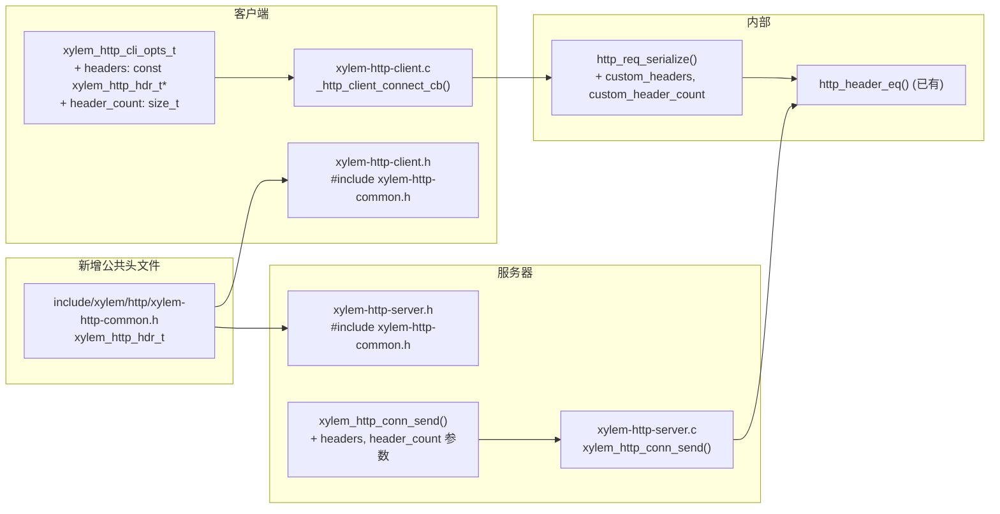

# Design Document: HTTP 模块

## Overview

本设计为 Xylem 库添加 HTTP/1.1 模块，包含同步客户端和异步服务器两部分。

客户端提供无状态的自由函数（`xylem_http_get`、`xylem_http_post` 等），内部创建临时 `xylem_loop_t` 完成 DNS 解析、TCP/TLS 连接、请求发送和响应接收，对调用者表现为同步阻塞。服务器运行在用户提供的 event loop 上，通过 `on_request` 回调分发请求。

HTTP 解析使用 llhttp（源码集成于 `src/http/llhttp/`，与 yyjson 集成模式一致）。URL 解析、请求序列化、响应解析、Header 管理、chunked transfer encoding、percent-encoding 均在模块内部实现。

### 设计决策

| 决策 | 选择 | 理由 |
|------|------|------|
| 客户端 API 风格 | 同步自由函数 | 简化调用方使用，无需管理客户端实例 |
| 客户端内部实现 | 临时 xylem_loop | 复用现有异步基础设施，避免重复实现阻塞 I/O |
| HTTP 解析器 | llhttp 源码集成 | Node.js 官方解析器，高性能，零外部依赖 |
| 服务器 loop 传递 | 独立参数 | 与 xylem_tcp_listen / xylem_tls_listen 风格一致 |
| TLS 检测 | URL scheme 自动判断 | 客户端无需额外配置；服务器通过 cfg 中 cert/key 控制 |
| 超时实现 | xylem_loop_timer | HTTP 层独立于 TCP/TLS 层超时，覆盖完整请求生命周期 |

## Architecture

```mermaid
graph TD
    subgraph "Public API (include/xylem/xylem-http.h)"
        GET["xylem_http_get()"]
        POST["xylem_http_post()"]
        POSTJSON["xylem_http_post_json()"]
        PUT["xylem_http_put()"]
        DELETE["xylem_http_delete()"]
        PATCH["xylem_http_patch()"]
        CFG["xylem_http_set_timeout()<br>xylem_http_set_follow_redirects()<br>xylem_http_set_max_body_size()"]
        SRV_CREATE["xylem_http_srv_create()"]
        SRV_START["xylem_http_srv_start()"]
        SRV_STOP["xylem_http_srv_stop()"]
        SRV_DESTROY["xylem_http_srv_destroy()"]
        RES_API["xylem_http_res_status()<br>xylem_http_res_header()<br>xylem_http_res_body()<br>xylem_http_res_body_len()<br>xylem_http_res_destroy()"]
        REQ_API["xylem_http_req_method()<br>xylem_http_req_url()<br>xylem_http_req_header()<br>xylem_http_req_body()<br>xylem_http_req_body_len()"]
        CONN_API["xylem_http_conn_send()<br>xylem_http_conn_close()"]
        URL_API["xylem_http_url_encode()<br>xylem_http_url_decode()"]
    end

    subgraph "Internal (src/xylem-http.c)"
        URL_PARSE["_http_url_parse()<br>_http_url_serialize()"]
        REQ_SER["_http_req_serialize()"]
        RES_PARSE["_http_res_parse (llhttp callbacks)"]
        REASON["_http_reason_phrase()"]
        CLIENT_EXEC["_http_client_exec()"]
        SRV_CONN["_http_srv_conn (per-connection state)"]
    end

    subgraph "Dependencies"
        LLHTTP["llhttp (src/http/llhttp/)"]
        TCP["xylem-tcp"]
        TLS["xylem-tls"]
        ADDR["xylem-addr"]
        LOOP["xylem-loop"]
        THRDPOOL["xylem-thrdpool"]
    end

    GET --> CLIENT_EXEC
    POST --> CLIENT_EXEC
    POSTJSON --> CLIENT_EXEC
    PUT --> CLIENT_EXEC
    DELETE --> CLIENT_EXEC
    PATCH --> CLIENT_EXEC

    CLIENT_EXEC --> URL_PARSE
    CLIENT_EXEC --> REQ_SER
    CLIENT_EXEC --> RES_PARSE
    CLIENT_EXEC --> LOOP
    CLIENT_EXEC --> ADDR
    CLIENT_EXEC --> TCP
    CLIENT_EXEC --> TLS

    SRV_CREATE --> LOOP
    SRV_START --> TCP
    SRV_START --> TLS
    SRV_CONN --> RES_PARSE
    SRV_CONN --> LLHTTP
    SRV_CONN --> REASON

    RES_PARSE --> LLHTTP
    REQ_SER --> URL_PARSE
```



## Components and Interfaces

### 公共类型

```c
/* 不透明类型 — 仅前向声明 */
typedef struct xylem_http_res_s  xylem_http_res_t;   /* 客户端响应 */
typedef struct xylem_http_req_s  xylem_http_req_t;   /* 服务器端请求 */
typedef struct xylem_http_conn_s xylem_http_conn_t;  /* 服务器端连接 */
typedef struct xylem_http_srv_s  xylem_http_srv_t;   /* HTTP 服务器 */

/* 服务器请求回调 */
typedef void (*xylem_http_on_request_fn_t)(xylem_http_conn_t* conn,
                                           xylem_http_req_t* req,
                                           void* userdata);

/* 服务器配置（非不透明，调用者栈上分配） */
typedef struct xylem_http_srv_cfg_s {
    const char*                  host;           /* 绑定地址，如 "0.0.0.0" */
    uint16_t                     port;           /* 绑定端口 */
    xylem_http_on_request_fn_t   on_request;     /* 请求回调 */
    void*                        userdata;       /* 传递给回调的用户数据 */
    const char*                  tls_cert;       /* PEM 证书路径，NULL 表示纯 HTTP */
    const char*                  tls_key;        /* PEM 私钥路径，NULL 表示纯 HTTP */
    size_t                       max_body_size;  /* 最大请求 body，0 使用默认 1 MiB */
    uint64_t                     idle_timeout_ms;/* 空闲超时，0 禁用，默认 60000 */
} xylem_http_srv_cfg_t;
```

### 客户端 API

```c
/* ---- 全局配置（线程局部存储） ---- */

/**
 * @brief 设置后续请求的超时时间。
 * @param timeout_ms  超时毫秒数，0 表示无限等待。默认 30000。
 */
extern void xylem_http_set_timeout(uint64_t timeout_ms);

/**
 * @brief 启用/禁用自动重定向跟随。
 * @param max_redirects  最大重定向次数，0 表示禁用（默认）。
 */
extern void xylem_http_set_follow_redirects(int max_redirects);

/**
 * @brief 设置客户端最大响应 body 大小。
 * @param max_bytes  最大字节数，0 使用默认 10 MiB。
 */
extern void xylem_http_set_max_body_size(size_t max_bytes);

/* ---- 请求函数 ---- */

extern xylem_http_res_t* xylem_http_get(const char* url);

extern xylem_http_res_t* xylem_http_post(const char* url,
                                          const void* body, size_t body_len,
                                          const char* content_type);

extern xylem_http_res_t* xylem_http_post_json(const char* url,
                                               const char* json);

extern xylem_http_res_t* xylem_http_put(const char* url,
                                         const void* body, size_t body_len,
                                         const char* content_type);

extern xylem_http_res_t* xylem_http_delete(const char* url);

extern xylem_http_res_t* xylem_http_patch(const char* url,
                                           const void* body, size_t body_len,
                                           const char* content_type);

/* ---- 响应访问器 ---- */

extern int         xylem_http_res_status(const xylem_http_res_t* res);
extern const char* xylem_http_res_header(const xylem_http_res_t* res,
                                          const char* name);
extern const void* xylem_http_res_body(const xylem_http_res_t* res);
extern size_t      xylem_http_res_body_len(const xylem_http_res_t* res);
extern void        xylem_http_res_destroy(xylem_http_res_t* res);

/* ---- URL percent-encoding ---- */

/**
 * @brief Percent-encode a string for use in URL path or query.
 * @param src      Source bytes.
 * @param src_len  Source length.
 * @param out_len  Output: encoded length (excluding NUL).
 * @return malloc'd encoded string, caller frees. NULL on failure.
 */
extern char* xylem_http_url_encode(const char* src, size_t src_len,
                                    size_t* out_len);

/**
 * @brief Decode a percent-encoded string.
 * @param src      Source string.
 * @param src_len  Source length.
 * @param out_len  Output: decoded length.
 * @return malloc'd decoded string, caller frees. NULL on failure.
 */
extern char* xylem_http_url_decode(const char* src, size_t src_len,
                                    size_t* out_len);
```

### 服务器 API

```c
/**
 * @brief 创建 HTTP 服务器。loop 作为独立参数传入。
 * @return 服务器句柄，失败返回 NULL。
 */
extern xylem_http_srv_t* xylem_http_srv_create(xylem_loop_t* loop,
                                                const xylem_http_srv_cfg_t* cfg);

extern int  xylem_http_srv_start(xylem_http_srv_t* srv);
extern void xylem_http_srv_stop(xylem_http_srv_t* srv);
extern void xylem_http_srv_destroy(xylem_http_srv_t* srv);

/* ---- 请求访问器（仅在 on_request 回调中有效） ---- */

extern const char* xylem_http_req_method(const xylem_http_req_t* req);
extern const char* xylem_http_req_url(const xylem_http_req_t* req);
extern const char* xylem_http_req_header(const xylem_http_req_t* req,
                                          const char* name);
extern const void* xylem_http_req_body(const xylem_http_req_t* req);
extern size_t      xylem_http_req_body_len(const xylem_http_req_t* req);

/* ---- 连接操作 ---- */

extern int  xylem_http_conn_send(xylem_http_conn_t* conn,
                                  int status_code,
                                  const char* content_type,
                                  const void* body, size_t body_len);
extern void xylem_http_conn_close(xylem_http_conn_t* conn);
```

## Data Models

### 内部结构体（定义在 `src/xylem-http.c` 中）

```c
/* URL 解析结果 */
typedef struct {
    char     scheme[8];    /* "http" 或 "https" */
    char     host[256];    /* 主机名 */
    uint16_t port;         /* 端口号 */
    char     path[2048];   /* 路径（含 percent-encoding） */
} _http_url_t;

/* HTTP Header 键值对 */
typedef struct {
    char* name;            /* Header 名称（原始大小写） */
    char* value;           /* Header 值 */
} _http_header_t;

/* 客户端响应（不透明类型内部） */
struct xylem_http_res_s {
    int             status_code;
    _http_header_t* headers;       /* 动态数组 */
    size_t          header_count;
    size_t          header_cap;
    uint8_t*        body;
    size_t          body_len;
};

/* 服务器端请求（不透明类型内部） */
struct xylem_http_req_s {
    char            method[16];    /* "GET", "POST" 等 */
    char*           url;           /* 请求路径 */
    _http_header_t* headers;
    size_t          header_count;
    size_t          header_cap;
    uint8_t*        body;
    size_t          body_len;
};

/* 服务器端连接（不透明类型内部） */
struct xylem_http_conn_s {
    xylem_http_srv_t*    srv;          /* 所属服务器 */
    union {
        xylem_tcp_conn_t* tcp;
        xylem_tls_t*      tls;
    } transport;
    bool                 is_tls;
    llhttp_t             parser;       /* llhttp 解析器实例 */
    llhttp_settings_t    settings;     /* llhttp 回调设置 */
    xylem_http_req_t     req;          /* 当前正在解析的请求 */
    xylem_loop_timer_t   idle_timer;   /* 空闲超时定时器 */
    bool                 keep_alive;   /* 当前连接是否 keep-alive */
    bool                 closed;       /* 连接是否已关闭 */
    /* llhttp 解析中间状态 */
    char*                cur_header_name;
    size_t               cur_header_name_len;
};

/* HTTP 服务器（不透明类型内部） */
struct xylem_http_srv_s {
    xylem_loop_t*          loop;
    xylem_http_srv_cfg_t   cfg;
    union {
        xylem_tcp_server_t* tcp;
        xylem_tls_server_t* tls;
    } listener;
    bool                   is_tls;
    xylem_tls_ctx_t*       tls_ctx;    /* 仅 HTTPS 时非 NULL */
    bool                   running;
};

/* 客户端内部执行上下文（栈上分配） */
typedef struct {
    xylem_loop_t          loop;
    xylem_thrdpool_t*     pool;        /* DNS 解析线程池 */
    xylem_loop_timer_t    timeout_timer;
    _http_url_t           url;
    const char*           method;
    const void*           body;
    size_t                body_len;
    const char*           content_type;
    xylem_http_res_t*     res;         /* 结果，成功时非 NULL */
    llhttp_t              parser;
    llhttp_settings_t     settings;
    /* llhttp 解析中间状态 */
    char*                 cur_header_name;
    size_t                cur_header_name_len;
    /* 传输层句柄 */
    union {
        xylem_tcp_conn_t* tcp;
        xylem_tls_t*      tls;
    } conn;
    bool                  is_tls;
    bool                  timed_out;
    bool                  done;
    /* 100-continue */
    bool                  expect_continue;
    bool                  continue_received;
    /* 重定向 */
    int                   redirects_remaining;
} _http_client_ctx_t;
```

### 客户端全局配置

```c
/* 线程局部存储，每个线程独立配置 */
static _Thread_local uint64_t _http_timeout_ms       = 30000;
static _Thread_local int      _http_max_redirects    = 0;
static _Thread_local size_t   _http_max_body_size    = 10485760; /* 10 MiB */
```

### 内部组件设计

#### URL 解析器 (`_http_url_parse` / `_http_url_serialize`)

手动解析 URL 字符串，不依赖外部库：

1. 查找 `://` 分隔符提取 scheme，仅接受 `http` 和 `https`
2. 提取 host（支持 IPv6 方括号 `[::1]`）
3. 查找 `:` 提取显式端口，否则根据 scheme 使用默认端口
4. 剩余部分为 path，缺省为 `"/"`
5. 保留 path 中的 percent-encoding 字符

`_http_url_serialize` 将 `_http_url_t` 重新拼接为 URL 字符串。

#### 请求序列化器 (`_http_req_serialize`)

将方法、URL、Headers、Body 组装为 HTTP/1.1 请求报文：

```
{METHOD} {path} HTTP/1.1\r\n
Host: {host}[:{port}]\r\n
Content-Length: {body_len}\r\n    (仅当 body 存在时)
Content-Type: {content_type}\r\n  (仅当指定时)
Connection: keep-alive\r\n
Expect: 100-continue\r\n          (仅当 body > 1024 字节时)
\r\n
{body}                             (100-continue 时延迟发送)
```

自动填充 Host、Content-Length、Connection。返回 `xylem_buf_t`（malloc 分配，调用者 free）。

#### 响应解析 (llhttp 回调)

客户端使用 `llhttp_init(&parser, HTTP_RESPONSE, &settings)` 初始化解析器。通过回调逐步构建 `xylem_http_res_t`：

| 回调 | 行为 |
|------|------|
| `on_header_field` | 累积当前 header name |
| `on_header_value` | 累积当前 header value |
| `on_header_value_complete` | 将 name/value 对追加到 headers 数组 |
| `on_headers_complete` | 记录 status_code，检查 chunked/content-length |
| `on_body` | 追加 body 数据到 buffer，检查 max_body_size |
| `on_message_complete` | 设置 done 标志 |

服务器端使用 `HTTP_REQUEST` 类型，回调结构类似，完成后调用 `on_request`。

#### 客户端执行流程 (`_http_client_exec`)

```mermaid
sequenceDiagram
    participant Caller as 调用者线程
    participant Ctx as _http_client_ctx_t
    participant Loop as 临时 xylem_loop
    participant DNS as xylem_addr_resolve
    participant TCP as xylem_tcp/tls

    Caller->>Ctx: 初始化上下文
    Ctx->>Loop: xylem_loop_init()
    Ctx->>Ctx: _http_url_parse(url)
    alt 超时 > 0
        Ctx->>Loop: xylem_loop_start_timer(timeout)
    end
    Ctx->>DNS: xylem_addr_resolve(host, port)
    DNS-->>Ctx: on_resolve callback
    alt scheme == "https"
        Ctx->>TCP: xylem_tls_dial()
    else scheme == "http"
        Ctx->>TCP: xylem_tcp_dial()
    end
    TCP-->>Ctx: on_connect callback
    Ctx->>TCP: send(serialized request)
    alt Expect: 100-continue
        TCP-->>Ctx: on_read (100 Continue)
        Ctx->>TCP: send(body)
    end
    TCP-->>Ctx: on_read (response data)
    Ctx->>Ctx: llhttp_execute(data)
    Ctx-->>Loop: xylem_loop_stop()
    Loop-->>Caller: xylem_loop_run() 返回
    Caller->>Caller: 返回 res
```

#### 服务器连接管理

每个新连接创建一个 `xylem_http_conn_t`：

1. `on_accept` 回调中分配 `xylem_http_conn_t`，初始化 llhttp（`HTTP_REQUEST`）
2. 启动空闲定时器（`idle_timeout_ms`）
3. `on_read` 中调用 `llhttp_execute`，解析完成后调用用户 `on_request`
4. `on_request` 中用户调用 `xylem_http_conn_send` 发送响应
5. 响应发送后检查 keep-alive：是则重置解析器和空闲定时器，否则关闭连接
6. 空闲定时器到期时关闭连接

#### Reason Phrase 映射 (`_http_reason_phrase`)

使用 switch-case 将状态码映射到标准 reason phrase（如 200->"OK"、404->"Not Found"）。未知状态码返回空字符串 `""`。

#### Header 大小写不敏感匹配

`xylem_http_res_header` 和 `xylem_http_req_header` 内部使用逐字符 ASCII tolower 比较，不依赖 locale。

#### 重定向处理

当 `_http_max_redirects > 0` 且响应状态码为 301/302/307/308 时：

1. 提取 `Location` header
2. 301/302：改用 GET 方法，丢弃 body
3. 307/308：保留原始方法和 body
4. 递减 `redirects_remaining`，重新执行 `_http_client_exec`
5. 超过最大次数时返回最后一个重定向响应

#### 100-Continue 处理

1. 客户端：body > 1024 字节时添加 `Expect: 100-continue`，先发送 headers，等待 100 响应或 1 秒超时后发送 body
2. 服务器：检测到 `Expect: 100-continue` 时自动发送 `HTTP/1.1 100 Continue\r\n\r\n`，然后继续读取 body

## Error Handling

### 错误传播策略

| 层级 | 错误信号 | 行为 |
|------|----------|------|
| URL 解析 | `_http_url_parse` 返回 -1 | 客户端函数返回 NULL |
| DNS 解析 | `xylem_addr_resolve` 回调 status == -1 | 停止 loop，返回 NULL |
| TCP/TLS 连接 | `on_close` 回调 err != 0 | 停止 loop，返回 NULL |
| 请求发送 | `xylem_tcp_send` / `xylem_tls_send` 返回 -1 | 关闭连接，停止 loop，返回 NULL |
| 响应解析 | `llhttp_execute` 返回非 HPE_OK | 关闭连接，停止 loop，返回 NULL |
| 超时 | `timeout_timer` 到期 | 关闭连接，停止 loop，返回 NULL |
| Body 超限 | body 累积超过 max_body_size | 客户端：关闭连接返回 NULL；服务器：发送 413 并关闭 |
| 内存分配 | malloc 返回 NULL | 关闭连接，返回 NULL 或 -1 |

### 客户端错误处理

所有客户端请求函数（`xylem_http_get` 等）在任何错误情况下返回 NULL。调用者通过检查返回值判断成功/失败。内部资源（临时 loop、线程池、TCP/TLS 连接、定时器）在返回前全部清理。

错误场景：
- 无效 URL（scheme 不是 http/https、缺少 host）
- DNS 解析失败
- TCP/TLS 连接失败
- 超时（覆盖 DNS + 连接 + 发送 + 接收全流程）
- HTTP 响应解析错误（malformed response）
- 响应 body 超过 max_body_size

### 服务器错误处理

- `xylem_http_srv_create`：参数无效（NULL loop 或 NULL cfg）返回 NULL
- `xylem_http_srv_start`：绑定失败返回 -1
- 请求解析错误：关闭该连接，不影响其他连接
- Body 超限：发送 413 Payload Too Large，关闭连接
- `xylem_http_conn_send` 在连接已关闭后调用：返回 -1

### 资源清理保证

- `xylem_http_res_destroy(NULL)` 为 no-op
- 客户端函数内部使用 goto cleanup 模式，确保所有路径都释放资源
- 服务器连接在 `on_close` 回调中释放 `xylem_http_conn_t` 及其关联的解析器状态

## Correctness Properties

*A property is a characteristic or behavior that should hold true across all valid executions of a system — essentially, a formal statement about what the system should do. Properties serve as the bridge between human-readable specifications and machine-verifiable correctness guarantees.*

### Property 1: URL parse-serialize round-trip

*For any* valid HTTP/HTTPS URL string containing a scheme, host, optional port, and optional path, parsing the URL into components and then serializing back to a string and parsing again SHALL produce an equivalent parsed result (same scheme, host, port, path).

**Validates: Requirements 2.1, 2.2, 2.3, 2.4, 2.5, 2.7, 2.8**

### Property 2: Invalid URL rejection

*For any* string that is not a valid HTTP URL (missing scheme, unsupported scheme, empty host, malformed structure), `_http_url_parse` SHALL return -1.

**Validates: Requirements 2.6**

### Property 3: HTTP request serialize-parse round-trip

*For any* valid combination of HTTP method, host, port, path, headers, and body, serializing into an HTTP/1.1 request message and then parsing via llhttp SHALL recover equivalent method, URL path, and body content. The serialized message SHALL also contain a Host header matching the URL and a Content-Length header matching the body length when a body is present.

**Validates: Requirements 3.1, 3.2, 3.3, 3.4, 3.5, 3.6**

### Property 4: Duplicate header preservation

*For any* HTTP response containing multiple headers with the same name, parsing the response SHALL preserve all header values such that iterating the headers array yields every original value for that name.

**Validates: Requirements 4.4**

### Property 5: Malformed response rejection

*For any* byte sequence that is not a valid HTTP/1.1 response (truncated status line, invalid header format, corrupted chunk encoding), feeding it to the response parser SHALL result in an error (llhttp returns non-HPE_OK), causing the client to yield NULL.

**Validates: Requirements 4.5**

### Property 6: Case-insensitive header lookup

*For any* HTTP header name stored in a request or response, and *for any* case variation of that name (e.g., "Content-Type" vs "content-type" vs "CONTENT-TYPE"), the header lookup function SHALL return the same value.

**Validates: Requirements 7.2, 9.4, 11.1, 11.2, 11.3**

### Property 7: Server response serialization validity

*For any* valid HTTP status code (1xx-5xx), content type string, and body byte sequence, `xylem_http_conn_send` SHALL produce a serialized response containing a valid HTTP/1.1 status line with correct reason phrase, a Content-Type header matching the input, a Content-Length header equal to the body length, and the body bytes verbatim after the header terminator.

**Validates: Requirements 10.1, 15.1, 15.2, 15.3**

### Property 8: 100-Continue header for large bodies

*For any* HTTP request with a body larger than 1024 bytes, the serialized request headers SHALL include `Expect: 100-continue`. *For any* request with a body of 1024 bytes or fewer, the serialized request headers SHALL NOT include the Expect header.

**Validates: Requirements 20.1**

### Property 9: URL percent-encoding round-trip

*For any* byte sequence, percent-encoding via `xylem_http_url_encode` and then decoding via `xylem_http_url_decode` SHALL produce the original byte sequence.

**Validates: Requirements 21.1, 21.2, 21.3, 21.5**

## Testing Strategy

### 测试框架

- 单元测试：使用项目自带的 `ASSERT` 宏（`tests/assert.h`），无外部框架
- 属性测试：使用 [theft](https://github.com/silentbicycle/theft)（C 语言属性测试库），通过 CMake FetchContent 集成
- 测试文件：`tests/test-http.c`，通过 `xylem_add_test(http)` 注册

### 单元测试（示例和边界情况）

单元测试覆盖具体示例和边界条件，与属性测试互补：

| 测试函数 | 覆盖内容 |
|----------|----------|
| `test_url_parse_http_default_port` | http scheme 默认端口 80 |
| `test_url_parse_https_default_port` | https scheme 默认端口 443 |
| `test_url_parse_explicit_port` | 显式端口覆盖默认值 |
| `test_url_parse_no_path` | 无路径默认为 "/" |
| `test_url_parse_invalid` | 无效 URL 返回 -1 |
| `test_res_destroy_null` | destroy(NULL) 为 no-op |
| `test_srv_create_null_loop` | NULL loop 返回 NULL |
| `test_srv_create_null_cfg` | NULL cfg 返回 NULL |
| `test_default_timeout` | 默认超时 30000ms |
| `test_default_max_body_client` | 客户端默认 max body 10 MiB |
| `test_default_max_body_server` | 服务器默认 max body 1 MiB |
| `test_reason_phrase_known` | 已知状态码返回正确 phrase |
| `test_reason_phrase_unknown` | 未知状态码返回空字符串 |
| `test_redirect_301_changes_method` | 301 重定向改用 GET |
| `test_redirect_307_preserves_method` | 307 重定向保留原方法 |
| `test_header_lookup_missing` | 查找不存在的 header 返回 NULL |
| `test_empty_body_post` | body=NULL, len=0 的 POST |
| `test_idle_timeout_default` | 服务器空闲超时默认 60000ms |

### 属性测试

每个属性测试对应设计文档中的一个 Correctness Property，最少运行 100 次迭代。

每个测试函数以注释标注对应的属性：

```c
/* Feature: http, Property 1: URL parse-serialize round-trip */
static void test_prop_url_round_trip(void) { ... }

/* Feature: http, Property 2: Invalid URL rejection */
static void test_prop_url_invalid_rejected(void) { ... }

/* Feature: http, Property 3: HTTP request serialize-parse round-trip */
static void test_prop_req_round_trip(void) { ... }

/* Feature: http, Property 4: Duplicate header preservation */
static void test_prop_duplicate_headers(void) { ... }

/* Feature: http, Property 5: Malformed response rejection */
static void test_prop_malformed_response(void) { ... }

/* Feature: http, Property 6: Case-insensitive header lookup */
static void test_prop_header_case_insensitive(void) { ... }

/* Feature: http, Property 7: Server response serialization validity */
static void test_prop_srv_response_valid(void) { ... }

/* Feature: http, Property 8: 100-Continue header for large bodies */
static void test_prop_expect_continue(void) { ... }

/* Feature: http, Property 9: URL percent-encoding round-trip */
static void test_prop_url_encode_round_trip(void) { ... }
```

### 集成测试

集成测试在同一进程中启动 HTTP 服务器和客户端，验证端到端行为：

- GET/POST/PUT/DELETE/PATCH 请求-响应周期
- HTTPS（需要 XYLEM_ENABLE_TLS）
- Keep-alive 多请求复用
- Connection: close 语义
- 超时行为
- 重定向跟随
- Body 大小限制（413 响应）
- 100-Continue 流程
- 空闲连接超时


---

## 自定义 HTTP 头部设计（Requirements 22-24）

### Overview

为客户端请求和服务器响应添加自定义 HTTP 头部支持。用户可在发起请求时通过 `xylem_http_cli_opts_t` 传入自定义请求头，也可在服务器回调中通过 `xylem_http_conn_send` 传入自定义响应头。自定义头部优先于自动生成的头部（Host、Content-Length、Content-Type、Connection、Expect），通过 `http_header_eq`（已有）进行大小写不敏感的覆盖检测。

### 设计决策

| 决策 | 选择 | 理由 |
|------|------|------|
| 公共头部类型 | `xylem_http_hdr_t`，定义在新建的 `xylem-http-common.h` | 客户端和服务器公共头文件都需要此类型，避免重复定义或循环依赖 |
| 指针语义 | `const char* name` / `const char* value`（非拥有） | 用户提供的字符串只需在请求调用期间有效，无需内部拷贝 |
| 序列化顺序 | 自定义头部先写，自动生成头部后写（跳过被覆盖的） | 保证自定义头部出现在前面，且覆盖逻辑简单 |
| 覆盖检测 | 复用已有 `http_header_eq` | 大小写不敏感 ASCII 比较，符合 RFC 7230 §3.2 |
| 向后兼容 | opts 为 NULL 或 header_count 为 0 时行为不变 | 零初始化的 opts 自动兼容 |

### Architecture



### Components and Interfaces

#### 新增公共头文件：`include/xylem/http/xylem-http-common.h`

```c
_Pragma("once")

/**
 * @brief HTTP header name-value pair for public API use.
 *
 * Non-owning pointers: the caller must ensure the strings remain
 * valid for the duration of the API call that receives them.
 */
typedef struct {
    const char* name;   /**< Header name (e.g. "Authorization"). */
    const char* value;  /**< Header value (e.g. "Bearer token"). */
} xylem_http_hdr_t;
```

#### 客户端 opts 扩展

`xylem_http_cli_opts_t` 新增两个字段：

```c
typedef struct {
    uint64_t                timeout_ms;
    int                     max_redirects;
    size_t                  max_body_size;
    const xylem_http_hdr_t* headers;       /* 自定义请求头数组，NULL 表示无 */
    size_t                  header_count;   /* 自定义请求头数量 */
} xylem_http_cli_opts_t;
```

零初始化时 `headers = NULL`、`header_count = 0`，行为与现有实现完全一致。

#### 服务器 `xylem_http_conn_send` 签名变更

```c
extern int xylem_http_conn_send(xylem_http_conn_t* conn,
                                int status_code,
                                const char* content_type,
                                const void* body, size_t body_len,
                                const xylem_http_hdr_t* headers,
                                size_t header_count);
```

新增 `headers` 和 `header_count` 参数。传 NULL/0 时行为与现有实现一致。

#### 内部 `http_req_serialize` 签名变更

```c
extern char* http_req_serialize(const char* method, const http_url_t* url,
                                const void* body, size_t body_len,
                                const char* content_type,
                                bool expect_continue, size_t* out_len,
                                const xylem_http_hdr_t* custom_headers,
                                size_t custom_header_count);
```

新增 `custom_headers` 和 `custom_header_count` 参数。

### 序列化逻辑

#### 客户端请求序列化（`http_req_serialize` 更新）

序列化顺序：

```
{METHOD} {path} HTTP/1.1\r\n
{custom_header_1}: {value_1}\r\n      ← 自定义头部先写
{custom_header_2}: {value_2}\r\n
Host: {host}[:{port}]\r\n             ← 仅当自定义头部未覆盖 Host 时
Content-Length: {body_len}\r\n         ← 仅当自定义头部未覆盖 Content-Length 时
Content-Type: {content_type}\r\n       ← 仅当自定义头部未覆盖 Content-Type 时
Connection: keep-alive\r\n             ← 仅当自定义头部未覆盖 Connection 时
Expect: 100-continue\r\n               ← 仅当自定义头部未覆盖 Expect 时
\r\n
{body}
```

覆盖检测伪代码：

```c
/* 对每个自动生成的 header，检查是否被自定义 header 覆盖 */
bool host_overridden = false;
bool content_length_overridden = false;
bool content_type_overridden = false;
bool connection_overridden = false;
bool expect_overridden = false;

for (size_t i = 0; i < custom_header_count; i++) {
    if (http_header_eq(custom_headers[i].name, "Host"))           host_overridden = true;
    if (http_header_eq(custom_headers[i].name, "Content-Length")) content_length_overridden = true;
    if (http_header_eq(custom_headers[i].name, "Content-Type"))   content_type_overridden = true;
    if (http_header_eq(custom_headers[i].name, "Connection"))     connection_overridden = true;
    if (http_header_eq(custom_headers[i].name, "Expect"))         expect_overridden = true;
}

/* 先写自定义头部 */
for (size_t i = 0; i < custom_header_count; i++) {
    write_header(custom_headers[i].name, custom_headers[i].value);
}

/* 再写未被覆盖的自动生成头部 */
if (!host_overridden)           write_header("Host", host_val);
if (!content_length_overridden) write_header("Content-Length", ...);
if (!content_type_overridden && content_type) write_header("Content-Type", content_type);
if (!connection_overridden)     write_header("Connection", "keep-alive");
if (!expect_overridden && expect_continue) write_header("Expect", "100-continue");
```

#### 服务器响应序列化（`xylem_http_conn_send` 更新）

序列化顺序：

```
HTTP/1.1 {status} {reason}\r\n
{custom_header_1}: {value_1}\r\n      ← 自定义头部先写
{custom_header_2}: {value_2}\r\n
Content-Type: {content_type}\r\n       ← 仅当未被覆盖时
Content-Length: {body_len}\r\n         ← 仅当未被覆盖时
\r\n
{body}
```

覆盖检测逻辑与客户端相同，使用 `http_header_eq` 检查 Content-Type 和 Content-Length。

### 客户端调用链路

`_http_client_exec` 从 `opts` 中提取 `headers` 和 `header_count`，存入 `_http_client_ctx_t`。在 `_http_client_connect_cb` 中传递给 `http_req_serialize`：

```c
/* _http_client_exec 中 */
const xylem_http_hdr_t* custom_headers = (opts) ? opts->headers      : NULL;
size_t custom_header_count             = (opts) ? opts->header_count  : 0;

/* _http_client_connect_cb 中 */
char* req_buf = http_req_serialize(ctx->method, &ctx->url,
                                   ctx->body, ctx->body_len,
                                   ctx->content_type,
                                   use_continue, &req_len,
                                   ctx->custom_headers,
                                   ctx->custom_header_count);
```

所有请求方法（GET、POST、PUT、DELETE、PATCH）共享 `_http_client_exec`，因此自动支持自定义头部。

### Data Models 更新

`_http_client_ctx_t` 新增字段：

```c
typedef struct {
    /* ... 现有字段 ... */
    const xylem_http_hdr_t* custom_headers;      /* 来自 opts */
    size_t                  custom_header_count;
} _http_client_ctx_t;
```

### Error Handling 更新

- 自定义头部中的 NULL name 或 NULL value：`http_req_serialize` 跳过该条目（防御性编程）
- 自定义头部导致 buffer 估算不足：`http_req_serialize` 在估算 buffer 大小时累加所有自定义头部的 name + value 长度
- `xylem_http_conn_send` 中自定义头部导致 malloc 失败：返回 -1

### Correctness Properties 更新

### Property 10: 自定义请求头序列化正确性

*For any* set of custom headers and any valid HTTP request components (method, URL, body, content-type), serializing the request with custom headers SHALL produce a message where: (a) all custom headers appear in the output, (b) custom headers appear before auto-generated headers, (c) when a custom header name matches an auto-generated header name (case-insensitive), the auto-generated header is absent and only the custom value appears, (d) when no custom header overrides an auto-generated header, the auto-generated header appears as normal.

**Validates: Requirements 22.2, 22.3, 22.4, 22.5**

### Property 11: 自定义头部 round-trip

*For any* set of valid custom header name-value pairs, serializing an HTTP request (or response) with those custom headers and then parsing the result via llhttp SHALL recover all custom header names and values. When a custom header overrides an auto-generated header, the parsed result SHALL contain the custom value, not the auto-generated value.

**Validates: Requirements 24.1, 24.2, 24.3**

### Testing Strategy 更新

#### 新增单元测试

| 测试函数 | 覆盖内容 |
|----------|----------|
| `test_req_serialize_custom_headers` | 自定义头部出现在序列化结果中 |
| `test_req_serialize_override_host` | 自定义 Host 覆盖自动生成的 Host |
| `test_req_serialize_override_content_type` | 自定义 Content-Type 覆盖自动生成的 |
| `test_req_serialize_no_custom_headers` | header_count=0 时输出与原实现一致 |
| `test_conn_send_custom_headers` | 服务器响应包含自定义头部 |
| `test_conn_send_override_content_length` | 自定义 Content-Length 覆盖自动生成的 |
| `test_conn_send_no_custom_headers` | 无自定义头部时输出与原实现一致 |

#### 新增属性测试

```c
/* Feature: http, Property 10: Custom request header serialization correctness */
static void test_prop_custom_req_headers(void) { ... }

/* Feature: http, Property 11: Custom header round-trip */
static void test_prop_custom_header_round_trip(void) { ... }
```

每个属性测试最少运行 100 次迭代，使用 theft 库生成随机有效的 header name-value 对。

#### 集成测试更新

在现有集成测试中增加：
- 客户端带自定义 Authorization 头发送请求，服务器验证收到该头部
- 服务器带自定义 Set-Cookie 头发送响应，客户端验证收到该头部
- 客户端自定义 Connection: close 覆盖默认 keep-alive，验证连接关闭行为


---

## 服务器端 Chunked Transfer Encoding 响应设计（Requirements 25）

### Overview

为服务器端连接添加 chunked transfer encoding 写入能力。当响应体大小未知时（如流式生成内容），服务器可以逐块发送数据，无需预先计算 Content-Length。

### 设计决策

| 决策 | 选择 | 理由 |
|------|------|------|
| API 粒度 | start / send_chunk / end 三步式 | 与 HTTP chunked 协议语义一一对应，简洁明确 |
| 内部状态追踪 | conn 新增 `chunked_active` 标志 | 防止在非 chunked 模式下误调用 send_chunk |
| keep-alive 处理 | end_chunked 中处理 | 与 conn_send 的 keep-alive 逻辑一致 |

### Components and Interfaces

#### 新增公共 API（`include/xylem/http/xylem-http-server.h`）

```c
/**
 * @brief Begin a chunked HTTP response.
 *
 * Sends the status line and headers with Transfer-Encoding: chunked.
 * No Content-Length header is included. After this call, use
 * xylem_http_conn_send_chunk() to send data and
 * xylem_http_conn_end_chunked() to finish.
 *
 * @param conn          Connection handle.
 * @param status_code   HTTP status code (e.g. 200).
 * @param content_type  Content-Type header value, or NULL.
 * @param headers       Custom response headers, or NULL.
 * @param header_count  Number of custom response headers.
 *
 * @return 0 on success, -1 on failure.
 */
extern int xylem_http_conn_start_chunked(xylem_http_conn_t* conn,
                                          int status_code,
                                          const char* content_type,
                                          const xylem_http_hdr_t* headers,
                                          size_t header_count);

/**
 * @brief Send a single chunk of data.
 *
 * Formats and sends one HTTP chunk: {hex_size}\r\n{data}\r\n.
 * If len is 0 this is a no-op and returns 0.
 *
 * @param conn  Connection handle.
 * @param data  Chunk payload.
 * @param len   Payload length in bytes.
 *
 * @return 0 on success, -1 on failure.
 */
extern int xylem_http_conn_send_chunk(xylem_http_conn_t* conn,
                                       const void* data, size_t len);

/**
 * @brief End a chunked response.
 *
 * Sends the terminating chunk (0\r\n\r\n). Handles keep-alive:
 * resets the parser for the next request or closes the connection.
 *
 * @param conn  Connection handle.
 *
 * @return 0 on success, -1 on failure.
 */
extern int xylem_http_conn_end_chunked(xylem_http_conn_t* conn);
```

#### 内部状态变更

`xylem_http_conn_s` 新增字段：

```c
struct xylem_http_conn_s {
    /* ... 现有字段 ... */
    bool chunked_active;  /* chunked 响应进行中 */
};
```

#### 实现逻辑

`xylem_http_conn_start_chunked`：
1. 检查 conn 非 NULL 且未关闭
2. 构建响应头：status line + Transfer-Encoding: chunked + 自定义 headers + Content-Type（如有）
3. 不写 Content-Length
4. 发送 headers，设置 `chunked_active = true`

`xylem_http_conn_send_chunk`：
1. 检查 conn 非 NULL、未关闭、`chunked_active == true`
2. len == 0 时直接返回 0
3. 格式化 `{hex(len)}\r\n{data}\r\n` 并发送

`xylem_http_conn_end_chunked`：
1. 检查 conn 非 NULL、未关闭、`chunked_active == true`
2. 发送 `0\r\n\r\n`
3. 设置 `chunked_active = false`
4. 处理 keep-alive（与 conn_send 后的逻辑一致）


---

## 客户端 Cookie 管理设计（Requirements 26）

### Overview

为客户端添加可选的 cookie jar 机制。用户创建 `xylem_http_cookie_jar_t` 并通过 opts 传入，客户端自动解析 Set-Cookie 响应头存入 jar，并在后续请求中自动附加匹配的 Cookie 头。

### 设计决策

| 决策 | 选择 | 理由 |
|------|------|------|
| Cookie 存储 | 不透明类型 + create/destroy | 符合项目 opaque 类型规范 |
| 线程安全 | 不保证 | 与客户端 TLS 配置一致，单线程使用 |
| Cookie 匹配 | domain + path + secure | RFC 6265 最小子集，满足常见场景 |
| 过期处理 | 发送时惰性检查 | 避免后台定时器，简化实现 |

### Components and Interfaces

#### 新增公共类型和 API（`include/xylem/http/xylem-http-client.h`）

```c
/* 不透明类型 */
typedef struct xylem_http_cookie_jar_s xylem_http_cookie_jar_t;

/**
 * @brief Create an empty cookie jar.
 * @return Cookie jar handle, or NULL on allocation failure.
 */
extern xylem_http_cookie_jar_t* xylem_http_cookie_jar_create(void);

/**
 * @brief Destroy a cookie jar and free all stored cookies.
 * @param jar  Cookie jar handle, or NULL (no-op).
 */
extern void xylem_http_cookie_jar_destroy(xylem_http_cookie_jar_t* jar);
```

#### opts 扩展

```c
typedef struct {
    uint64_t                     timeout_ms;
    int                          max_redirects;
    size_t                       max_body_size;
    const xylem_http_hdr_t*      headers;
    size_t                       header_count;
    xylem_http_cookie_jar_t*     cookie_jar;  /* 可选，NULL 禁用 */
} xylem_http_cli_opts_t;
```

#### 内部数据结构

```c
/* 单个 cookie */
typedef struct {
    char*    name;
    char*    value;
    char*    domain;
    char*    path;
    uint64_t expires_ms;   /* 绝对过期时间（毫秒），0 = 会话 cookie */
    bool     secure;
    bool     http_only;
} _http_cookie_t;

/* Cookie jar 内部 */
struct xylem_http_cookie_jar_s {
    _http_cookie_t* cookies;
    size_t          count;
    size_t          cap;
};
```

#### 实现逻辑

Set-Cookie 解析（`_http_cookie_parse`）：
1. 从 `Set-Cookie` header value 中提取 `name=value`（第一个 `=` 分割）
2. 解析 `;` 分隔的属性：Domain、Path、Expires、Max-Age、Secure、HttpOnly
3. Domain 缺省为请求 host，Path 缺省为请求路径的目录部分
4. Max-Age 优先于 Expires（RFC 6265 §5.3）
5. 同 domain+path+name 的 cookie 覆盖旧值

Cookie 匹配（`_http_cookie_match`）：
1. 检查 domain 是否匹配（尾部匹配，如 `.example.com` 匹配 `api.example.com`）
2. 检查 path 是否为请求路径的前缀
3. 检查 secure 属性（仅 HTTPS 时匹配）
4. 检查过期时间（惰性移除过期 cookie）

请求发送时（`_http_client_exec` 中）：
1. 如果 opts->cookie_jar 非 NULL，遍历 jar 匹配当前 URL
2. 拼接 `Cookie: name1=value1; name2=value2` 作为自定义 header 传入序列化器

响应接收后（`_http_client_exec` 中）：
1. 如果 opts->cookie_jar 非 NULL，遍历响应 headers 查找所有 `Set-Cookie`
2. 解析并存入 jar

---

## Range 请求支持设计（Requirements 27）

### Overview

客户端通过 opts 中的 range 字段发送 Range 请求头。服务器端提供 `xylem_http_conn_send_partial` 便捷函数发送 206 Partial Content 响应。

### 设计决策

| 决策 | 选择 | 理由 |
|------|------|------|
| 客户端 Range | opts 字符串字段 | 灵活，用户可传任意 Range 格式 |
| 服务器 Range | 专用函数 | 自动生成 Content-Range header，减少出错 |
| 416 处理 | send_partial 内部判断 | 统一错误处理 |

### Components and Interfaces

#### 客户端 opts 扩展

```c
typedef struct {
    /* ... 现有字段 ... */
    const char* range;  /* Range header value, e.g. "bytes=0-1023", NULL 禁用 */
} xylem_http_cli_opts_t;
```

#### 服务器新增 API（`include/xylem/http/xylem-http-server.h`）

```c
/**
 * @brief Send a 206 Partial Content response.
 *
 * Includes Content-Range header. If range_start > range_end or
 * range_end >= total_size, sends 416 Range Not Satisfiable instead.
 *
 * @param conn          Connection handle.
 * @param content_type  Content-Type header value.
 * @param body          Partial body data.
 * @param body_len      Partial body length.
 * @param range_start   First byte position (inclusive).
 * @param range_end     Last byte position (inclusive).
 * @param total_size    Total resource size in bytes.
 *
 * @return 0 on success, -1 on failure.
 */
extern int xylem_http_conn_send_partial(xylem_http_conn_t* conn,
                                         const char* content_type,
                                         const void* body, size_t body_len,
                                         size_t range_start,
                                         size_t range_end,
                                         size_t total_size);
```

#### 实现逻辑

`xylem_http_conn_send_partial`：
1. 检查 range_start <= range_end 且 range_end < total_size
2. 不满足时发送 416 响应：`Content-Range: bytes */{total_size}`
3. 满足时构建响应：status 206、`Content-Range: bytes {start}-{end}/{total}`、Content-Type、body
4. 内部复用 `xylem_http_conn_send` 并通过自定义 headers 传入 Content-Range

客户端 Range 处理：
1. `_http_client_exec` 中检查 opts->range
2. 非 NULL 时将 `Range: {value}` 作为额外自定义 header 追加到序列化器

---

## 服务器端 CORS 支持设计（Requirements 28）

### Overview

提供 CORS 辅助函数，根据配置和请求 Origin 生成 CORS 响应头数组。用户在 on_request 回调中调用此函数，将输出的 headers 传给 `xylem_http_conn_send`。这是纯工具函数，不修改服务器核心逻辑。

### 设计决策

| 决策 | 选择 | 理由 |
|------|------|------|
| API 风格 | 纯函数输出 header 数组 | 不侵入服务器核心，用户完全控制何时使用 |
| 配置类型 | 非不透明结构体 | 字段少且固定，栈上分配即可 |
| Origin 匹配 | `"*"` 通配符 + 精确列表 | 覆盖最常见场景 |
| 输出方式 | 调用者提供 buffer | 避免内部 malloc，零分配 |

### Components and Interfaces

#### 新增公共类型和 API（`include/xylem/http/xylem-http-utils.h`）

```c
/**
 * @brief CORS configuration.
 *
 * All string fields are non-owning pointers. The caller must ensure
 * they remain valid for the duration of the xylem_http_cors_headers call.
 */
typedef struct {
    const char*  allowed_origins;    /* 逗号分隔的 origin 列表，或 "*" */
    const char*  allowed_methods;    /* 逗号分隔，如 "GET, POST, PUT" */
    const char*  allowed_headers;    /* 逗号分隔，如 "Content-Type, Authorization" */
    const char*  expose_headers;     /* 逗号分隔，可选，NULL 省略 */
    int          max_age;            /* preflight 缓存秒数，0 省略 */
    bool         allow_credentials;  /* true 时输出 Allow-Credentials: true */
} xylem_http_cors_t;

/**
 * @brief Generate CORS response headers.
 *
 * Writes CORS headers into the caller-provided buffer based on the
 * configuration and the request Origin value. For preflight requests
 * (is_preflight = true), additional headers are included.
 *
 * @param cors           CORS configuration, or NULL (returns 0).
 * @param origin         Request Origin header value, or NULL.
 * @param is_preflight   true if this is an OPTIONS preflight request.
 * @param out            Output header array (caller-provided buffer).
 * @param out_cap        Capacity of the output array.
 *
 * @return Number of headers written, or -1 if out_cap is insufficient.
 */
extern int xylem_http_cors_headers(const xylem_http_cors_t* cors,
                                    const char* origin,
                                    bool is_preflight,
                                    xylem_http_hdr_t* out,
                                    size_t out_cap);
```

#### 实现逻辑

`xylem_http_cors_headers`：
1. cors 为 NULL 或 origin 为 NULL 时返回 0
2. 检查 origin 是否匹配 allowed_origins：
   - `"*"` 匹配所有
   - 否则逗号分割 allowed_origins，逐个 trim 后精确比较
3. 不匹配时返回 0（不输出任何 header）
4. 匹配时输出 `Access-Control-Allow-Origin`：
   - allow_credentials 为 true 时使用实际 origin 值（不能用 `"*"`）
   - 否则使用配置值（`"*"` 或实际 origin）
5. allow_credentials 为 true 时输出 `Access-Control-Allow-Credentials: true`
6. expose_headers 非 NULL 时输出 `Access-Control-Expose-Headers`
7. is_preflight 为 true 时额外输出：
   - `Access-Control-Allow-Methods`
   - `Access-Control-Allow-Headers`
   - max_age > 0 时输出 `Access-Control-Max-Age`

注意：输出的 header value 字符串指向 cors 配置中的原始字符串（非拥有指针），因此 cors 配置必须在 headers 使用期间保持有效。max_age 值需要格式化为字符串，使用调用者栈上的 buffer（函数文档中说明）。

#### 使用示例

```c
static void on_request(xylem_http_conn_t* conn, xylem_http_req_t* req,
                        void* userdata) {
    xylem_http_cors_t cors = {
        .allowed_origins   = "https://example.com, https://app.example.com",
        .allowed_methods   = "GET, POST, PUT, DELETE",
        .allowed_headers   = "Content-Type, Authorization",
        .allow_credentials = true,
    };

    const char* origin = xylem_http_req_header(req, "Origin");
    bool is_preflight = (strcmp(xylem_http_req_method(req), "OPTIONS") == 0)
                     && xylem_http_req_header(req, "Access-Control-Request-Method");

    xylem_http_hdr_t cors_hdrs[8];
    char max_age_buf[16];
    int n = xylem_http_cors_headers(&cors, origin, is_preflight,
                                     cors_hdrs, 8);

    if (is_preflight) {
        xylem_http_conn_send(conn, 204, NULL, NULL, 0, cors_hdrs, n);
        return;
    }

    /* 正常请求处理... */
    xylem_http_conn_send(conn, 200, "application/json",
                          body, body_len, cors_hdrs, n);
}
```

---

## 服务器端 SSE (Server-Sent Events) 设计（Requirements 29）

### Overview

基于 chunked transfer encoding 实现 SSE 协议。SSE 本质上是 `Content-Type: text/event-stream` 的 chunked 响应，每个事件按 SSE 格式（`event:` / `data:` / 空行分隔）作为一个 chunk 发送。

### 设计决策

| 决策 | 选择 | 理由 |
|------|------|------|
| 实现方式 | 基于 chunked API | SSE 就是特定格式的 chunked 流，复用已有能力 |
| API 粒度 | start_sse / send_event / send_sse_data / end_sse | 覆盖常见 SSE 使用模式 |
| 多行 data | 自动分割 | RFC 规范要求每行一个 `data:` 前缀 |

### Components and Interfaces

#### 新增公共 API（`include/xylem/http/xylem-http-server.h`）

```c
/**
 * @brief Begin an SSE (Server-Sent Events) stream.
 *
 * Sends status 200 with Content-Type: text/event-stream,
 * Cache-Control: no-cache, and Connection: keep-alive headers
 * using chunked transfer encoding internally.
 *
 * @param conn          Connection handle.
 * @param headers       Additional custom headers, or NULL.
 * @param header_count  Number of custom headers.
 *
 * @return 0 on success, -1 on failure.
 */
extern int xylem_http_conn_start_sse(xylem_http_conn_t* conn,
                                      const xylem_http_hdr_t* headers,
                                      size_t header_count);

/**
 * @brief Send an SSE event with optional event type.
 *
 * Formats: "event: {event}\ndata: {data}\n\n" when event is non-NULL,
 * or "data: {data}\n\n" when event is NULL. Multi-line data is split
 * into separate "data:" lines.
 *
 * @param conn   Connection handle.
 * @param event  Event type string, or NULL for data-only.
 * @param data   Event data string.
 *
 * @return 0 on success, -1 on failure.
 */
extern int xylem_http_conn_send_event(xylem_http_conn_t* conn,
                                       const char* event,
                                       const char* data);

/**
 * @brief Send a data-only SSE message.
 *
 * Shorthand for xylem_http_conn_send_event(conn, NULL, data).
 *
 * @param conn  Connection handle.
 * @param data  Event data string.
 *
 * @return 0 on success, -1 on failure.
 */
extern int xylem_http_conn_send_sse_data(xylem_http_conn_t* conn,
                                          const char* data);

/**
 * @brief End an SSE stream.
 *
 * Sends the terminating chunk and handles keep-alive/close.
 *
 * @param conn  Connection handle.
 *
 * @return 0 on success, -1 on failure.
 */
extern int xylem_http_conn_end_sse(xylem_http_conn_t* conn);
```

#### 实现逻辑

`xylem_http_conn_start_sse`：
1. 构建固定 headers：`Content-Type: text/event-stream`、`Cache-Control: no-cache`、`Connection: keep-alive`
2. 将用户自定义 headers 与固定 headers 合并
3. 调用 `xylem_http_conn_start_chunked(conn, 200, "text/event-stream", merged_headers, count)`

`xylem_http_conn_send_event`：
1. 构建 SSE 格式字符串到临时 buffer
2. 如果 event 非 NULL，写入 `event: {event}\n`
3. 按 `\n` 分割 data，每行写入 `data: {line}\n`
4. 写入空行 `\n` 作为事件结束
5. 调用 `xylem_http_conn_send_chunk` 发送整个事件

`xylem_http_conn_send_sse_data`：
- 直接调用 `xylem_http_conn_send_event(conn, NULL, data)`

`xylem_http_conn_end_sse`：
- 直接调用 `xylem_http_conn_end_chunked(conn)`

---

## 服务器端 Multipart/Form-Data 解析设计（Requirements 30）

### Overview

提供独立的 multipart/form-data 解析函数，用户在 on_request 回调中调用，传入 Content-Type（含 boundary）和 body 数据，返回解析后的 part 列表。这是纯解析工具，不修改服务器核心逻辑。

### 设计决策

| 决策 | 选择 | 理由 |
|------|------|------|
| 解析方式 | 一次性全量解析 | body 已在内存中（受 max_body_size 限制），无需流式 |
| 类型 | 不透明类型 + create/destroy | 符合项目规范 |
| boundary 提取 | 从 Content-Type 中自动提取 | 用户无需手动解析 |
| 内存管理 | 解析结果拥有所有数据的拷贝 | 解析结果独立于原始 body 生命周期 |

### Components and Interfaces

#### 新增公共类型和 API（`include/xylem/http/xylem-http-utils.h`）

```c
/* 不透明类型 */
typedef struct xylem_http_multipart_s xylem_http_multipart_t;

/**
 * @brief Parse a multipart/form-data request body.
 *
 * Extracts the boundary from content_type and splits the body
 * into individual parts.
 *
 * @param content_type  Content-Type header value (must contain boundary).
 * @param body          Request body data.
 * @param body_len      Request body length.
 *
 * @return Parsed multipart handle, or NULL on error.
 */
extern xylem_http_multipart_t* xylem_http_multipart_parse(
    const char* content_type, const void* body, size_t body_len);

/**
 * @brief Get the number of parts.
 * @param mp  Multipart handle.
 * @return Number of parts.
 */
extern size_t xylem_http_multipart_count(const xylem_http_multipart_t* mp);

/**
 * @brief Get the name field of a part (from Content-Disposition).
 * @param mp     Multipart handle.
 * @param index  Part index (0-based).
 * @return Name string, or NULL if not present.
 */
extern const char* xylem_http_multipart_name(
    const xylem_http_multipart_t* mp, size_t index);

/**
 * @brief Get the filename field of a part (from Content-Disposition).
 * @param mp     Multipart handle.
 * @param index  Part index (0-based).
 * @return Filename string, or NULL if not present.
 */
extern const char* xylem_http_multipart_filename(
    const xylem_http_multipart_t* mp, size_t index);

/**
 * @brief Get the Content-Type of a part.
 * @param mp     Multipart handle.
 * @param index  Part index (0-based).
 * @return Content-Type string, or NULL if not present.
 */
extern const char* xylem_http_multipart_content_type(
    const xylem_http_multipart_t* mp, size_t index);

/**
 * @brief Get the body data of a part.
 * @param mp     Multipart handle.
 * @param index  Part index (0-based).
 * @return Pointer to part body data.
 */
extern const void* xylem_http_multipart_data(
    const xylem_http_multipart_t* mp, size_t index);

/**
 * @brief Get the body data length of a part.
 * @param mp     Multipart handle.
 * @param index  Part index (0-based).
 * @return Part body length in bytes.
 */
extern size_t xylem_http_multipart_data_len(
    const xylem_http_multipart_t* mp, size_t index);

/**
 * @brief Destroy a multipart result and free all memory.
 * @param mp  Multipart handle, or NULL (no-op).
 */
extern void xylem_http_multipart_destroy(xylem_http_multipart_t* mp);
```

#### 内部数据结构

```c
typedef struct {
    char*    name;           /* Content-Disposition name */
    char*    filename;       /* Content-Disposition filename, 可为 NULL */
    char*    content_type;   /* part 的 Content-Type, 可为 NULL */
    uint8_t* data;           /* part body 数据（拷贝） */
    size_t   data_len;
} _http_multipart_part_t;

struct xylem_http_multipart_s {
    _http_multipart_part_t* parts;
    size_t                  count;
    size_t                  cap;
};
```

#### 解析算法

`xylem_http_multipart_parse`：
1. 从 Content-Type 中提取 boundary（查找 `boundary=`，支持带引号和不带引号）
2. 构造分隔符 `--{boundary}` 和终止符 `--{boundary}--`
3. 在 body 中查找第一个分隔符，跳过 preamble
4. 循环处理每个 part：
   a. 查找下一个分隔符确定 part 范围
   b. 在 part 中查找 `\r\n\r\n` 分隔 headers 和 body
   c. 解析 part headers：Content-Disposition（提取 name、filename）、Content-Type
   d. 拷贝 part body 数据
5. 遇到终止符时停止
6. 任何解析错误返回 NULL

Content-Disposition 解析：
- 格式：`form-data; name="field1"; filename="file.txt"`
- 提取 `name=` 和 `filename=` 的值，支持带引号和不带引号

---

## 服务器端路由系统设计（Requirements 31）

### Overview

提供轻量级路由表，用户注册 method + path pattern -> handler 映射，在 on_request 回调中调用 dispatch 函数自动匹配并调用对应 handler。路由表独立于服务器实例，可复用。

### 设计决策

| 决策 | 选择 | 理由 |
|------|------|------|
| 类型 | 不透明类型 + create/destroy | 符合项目规范 |
| 匹配策略 | 精确匹配优先，前缀匹配次之（最长前缀） | 简单直观，覆盖常见场景 |
| 存储 | 动态数组线性扫描 | 路由数量通常很少（<100），线性扫描足够 |
| handler 签名 | 复用 `xylem_http_on_request_fn_t` | 用户无需学习新回调类型 |
| 404 处理 | dispatch 内部发送 | 减少用户样板代码 |

### Components and Interfaces

#### 新增公共类型和 API（`include/xylem/http/xylem-http-server.h`）

```c
/* 不透明类型 */
typedef struct xylem_http_router_s xylem_http_router_t;

/**
 * @brief Create an empty router.
 * @return Router handle, or NULL on allocation failure.
 */
extern xylem_http_router_t* xylem_http_router_create(void);

/**
 * @brief Destroy a router and free all registered routes.
 * @param router  Router handle, or NULL (no-op).
 */
extern void xylem_http_router_destroy(xylem_http_router_t* router);

/**
 * @brief Register a route.
 *
 * @param router    Router handle.
 * @param method    HTTP method (e.g. "GET"), or NULL to match all methods.
 * @param pattern   Path pattern: exact (e.g. "/api/users") or prefix
 *                  with trailing "*" (e.g. "/static/*").
 * @param handler   Request handler callback.
 * @param userdata  User data passed to the handler.
 *
 * @return 0 on success, -1 on failure.
 */
extern int xylem_http_router_add(xylem_http_router_t* router,
                                  const char* method,
                                  const char* pattern,
                                  xylem_http_on_request_fn_t handler,
                                  void* userdata);

/**
 * @brief Dispatch a request to the matching route handler.
 *
 * Looks up the best matching route by method and URL path.
 * Exact matches take priority over prefix matches; among prefix
 * matches the longest prefix wins. Sends 404 if no route matches.
 *
 * @param router  Router handle.
 * @param conn    Connection handle.
 * @param req     Request handle.
 *
 * @return 0 if a handler was called, -1 if 404 was sent.
 */
extern int xylem_http_router_dispatch(xylem_http_router_t* router,
                                       xylem_http_conn_t* conn,
                                       xylem_http_req_t* req);
```

#### 内部数据结构

```c
typedef struct {
    char*                        method;    /* NULL = 匹配所有方法 */
    char*                        pattern;   /* 路径模式 */
    bool                         is_prefix; /* pattern 以 "*" 结尾 */
    size_t                       prefix_len;/* 前缀长度（不含 "*"） */
    xylem_http_on_request_fn_t   handler;
    void*                        userdata;
} _http_route_t;

struct xylem_http_router_s {
    _http_route_t* routes;
    size_t         count;
    size_t         cap;
};
```

#### 匹配算法

`xylem_http_router_dispatch`：
1. 获取请求的 method 和 url
2. 遍历所有路由，收集匹配项：
   a. method 匹配：route.method 为 NULL 或与请求 method 大小写不敏感相等
   b. path 匹配：
      - 精确匹配：`strcmp(url, pattern) == 0`
      - 前缀匹配：`strncmp(url, pattern, prefix_len) == 0`
3. 选择最佳匹配：
   - 精确匹配优先于前缀匹配
   - 多个前缀匹配时选择 prefix_len 最大的
   - method 精确匹配优先于 method 为 NULL 的通配路由
4. 找到匹配时调用 `handler(conn, req, route.userdata)`，返回 0
5. 无匹配时发送 404 Not Found，返回 -1

#### 使用示例

```c
static void handle_users(xylem_http_conn_t* conn, xylem_http_req_t* req,
                          void* ud) {
    xylem_http_conn_send(conn, 200, "application/json",
                          "{\"users\":[]}", 12, NULL, 0);
}

static void handle_static(xylem_http_conn_t* conn, xylem_http_req_t* req,
                            void* ud) {
    /* 根据 xylem_http_req_url(req) 提供静态文件 */
}

static void on_request(xylem_http_conn_t* conn, xylem_http_req_t* req,
                        void* userdata) {
    xylem_http_router_t* router = userdata;
    xylem_http_router_dispatch(router, conn, req);
}

int main(void) {
    xylem_http_router_t* router = xylem_http_router_create();
    xylem_http_router_add(router, "GET", "/api/users", handle_users, NULL);
    xylem_http_router_add(router, NULL, "/static/*", handle_static, NULL);

    xylem_http_srv_cfg_t cfg = { .host = "0.0.0.0", .port = 8080,
                                  .on_request = on_request,
                                  .userdata = router };
    /* ... create and start server ... */
}
```


---

## 新增功能 Correctness Properties

### Property 12: Chunked response 格式正确性

*For any* valid status code, content type, and sequence of chunk data payloads, the output produced by `start_chunked` + N × `send_chunk` + `end_chunked` SHALL be a valid HTTP/1.1 chunked response that llhttp can parse, recovering the concatenation of all chunk payloads as the response body.

**Validates: Requirements 25.1, 25.2, 25.3, 25.4**

### Property 13: Cookie Set-Cookie parse round-trip

*For any* valid Set-Cookie header string containing name, value, and optional attributes (Domain, Path, Secure, HttpOnly, Max-Age), parsing the header into a cookie struct and then matching against the original URL SHALL correctly determine whether the cookie should be sent.

**Validates: Requirements 26.4, 26.5, 26.6, 26.7**

### Property 14: Multipart boundary extraction and part splitting

*For any* valid multipart/form-data body constructed with a known boundary and N parts (each with name, optional filename, optional content-type, and body data), `xylem_http_multipart_parse` SHALL return exactly N parts with matching name, filename, content-type, and body data.

**Validates: Requirements 30.2, 30.3, 30.4, 30.5, 30.6, 30.7**

### Property 15: Router dispatch 精确匹配优先

*For any* router containing both an exact route and a prefix route that both match a given URL, `xylem_http_router_dispatch` SHALL always invoke the exact match handler, never the prefix match handler.

**Validates: Requirements 31.5, 31.7**

### Property 16: CORS header 生成正确性

*For any* valid CORS configuration and request Origin that matches allowed_origins, `xylem_http_cors_headers` SHALL output an `Access-Control-Allow-Origin` header. When `allow_credentials` is true, the Allow-Origin value SHALL NOT be `"*"`.

**Validates: Requirements 28.3, 28.4**

### Property 17: Range 响应 Content-Range 正确性

*For any* valid range_start, range_end, total_size where start <= end < total, `xylem_http_conn_send_partial` SHALL produce a 206 response with `Content-Range: bytes {start}-{end}/{total}`. For invalid ranges, it SHALL produce a 416 response.

**Validates: Requirements 27.5, 27.6**

---

## 新增功能 Testing Strategy

### 新增单元测试

| 测试函数 | 覆盖内容 |
|----------|----------|
| `test_chunked_start_end` | start_chunked + end_chunked 基本流程 |
| `test_chunked_send_empty` | send_chunk len=0 为 no-op |
| `test_chunked_on_closed` | 关闭连接后调用返回 -1 |
| `test_cookie_jar_create_destroy` | cookie jar 生命周期 |
| `test_cookie_parse_basic` | 基本 Set-Cookie 解析 |
| `test_cookie_match_domain` | domain 匹配逻辑 |
| `test_cookie_match_path` | path 前缀匹配 |
| `test_cookie_secure_flag` | Secure cookie 仅 HTTPS |
| `test_cookie_expired` | 过期 cookie 不发送 |
| `test_range_206_response` | 正常 206 响应格式 |
| `test_range_416_invalid` | 无效 range 返回 416 |
| `test_cors_wildcard_origin` | `"*"` 匹配所有 origin |
| `test_cors_specific_origin` | 精确 origin 匹配 |
| `test_cors_credentials_no_wildcard` | credentials 时不用 `"*"` |
| `test_cors_preflight_headers` | preflight 额外 headers |
| `test_cors_null_config` | NULL config 返回 0 |
| `test_sse_start_end` | SSE 流基本流程 |
| `test_sse_event_format` | event + data 格式正确 |
| `test_sse_multiline_data` | 多行 data 分割 |
| `test_multipart_parse_basic` | 基本 multipart 解析 |
| `test_multipart_with_filename` | 含 filename 的 part |
| `test_multipart_invalid_boundary` | 无效 boundary 返回 NULL |
| `test_multipart_destroy_null` | destroy(NULL) 为 no-op |
| `test_router_exact_match` | 精确路由匹配 |
| `test_router_prefix_match` | 前缀路由匹配 |
| `test_router_exact_over_prefix` | 精确优先于前缀 |
| `test_router_longest_prefix` | 最长前缀优先 |
| `test_router_404` | 无匹配返回 404 |
| `test_router_method_null` | method=NULL 匹配所有 |
| `test_router_destroy_null` | destroy(NULL) 为 no-op |

### 新增属性测试

```c
/* Feature: http, Property 12: Chunked response format correctness */
static void test_prop_chunked_round_trip(void) { ... }

/* Feature: http, Property 13: Cookie Set-Cookie parse round-trip */
static void test_prop_cookie_parse_match(void) { ... }

/* Feature: http, Property 14: Multipart boundary extraction and part splitting */
static void test_prop_multipart_round_trip(void) { ... }

/* Feature: http, Property 15: Router dispatch exact match priority */
static void test_prop_router_exact_priority(void) { ... }

/* Feature: http, Property 16: CORS header generation correctness */
static void test_prop_cors_headers(void) { ... }

/* Feature: http, Property 17: Range response Content-Range correctness */
static void test_prop_range_content_range(void) { ... }
```
