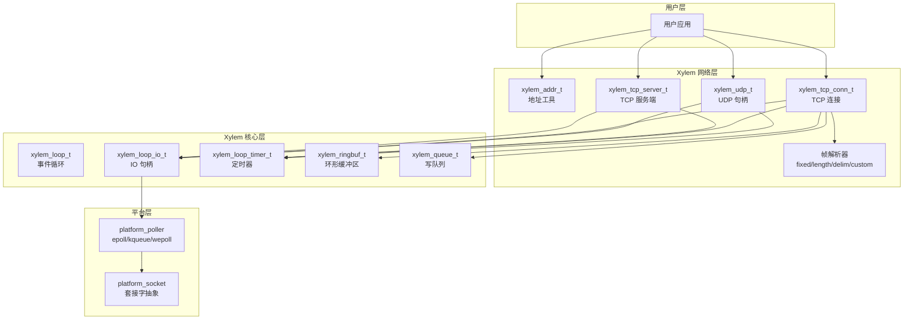
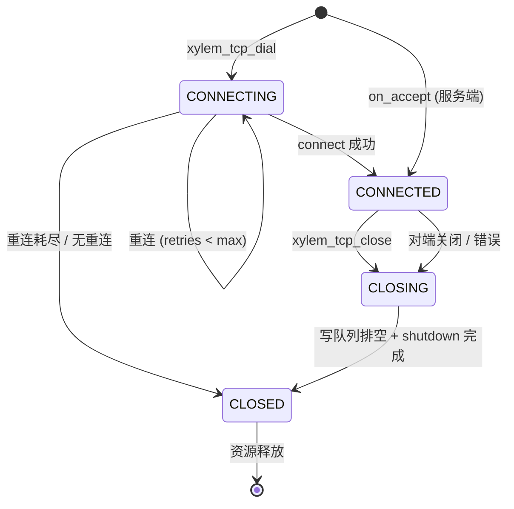

# 设计文档: network-tcp-udp

## 概述

本模块为 Xylem C 工具库新增基于事件循环的非阻塞 TCP 和 UDP 网络能力。TCP 模块提供服务端监听/接受、客户端异步连接、库内部读取与帧解析（支持四种帧策略）、缓冲写入、读写超时、心跳检测和客户端自动重连。UDP 模块提供绑定、sendto/recvfrom 和组播加入/离开。

所有网络操作均运行在 `xylem_loop_t` 事件循环上，采用 handler 聚合回调模式（而非细粒度单回调）。库在内部完成 `recv` 并通过 `xylem_ringbuf_t` 缓冲和帧解析，用户只需处理完整帧的 `on_read` 回调。不包含 TLS/DTLS 和异步 DNS，保持零外部依赖。

设计遵循 Xylem 现有约定：`xylem_<module>_<action>` 命名、Doxygen 公共 API 注释、`_` 前缀静态辅助函数、4 空格缩进、固定宽度整数类型。

## 架构



## 时序图

### TCP 服务端接受连接并读取数据

```mermaid
sequenceDiagram
    participant App as 用户应用
    participant Srv as xylem_tcp_server_t
    participant Loop as xylem_loop_t
    participant Poller as platform_poller
    participant Sock as platform_socket
    participant Conn as xylem_tcp_conn_t
    participant Ring as xylem_ringbuf_t
    participant Frame as 帧解析器

    App->>Srv: xylem_tcp_listen(loop, addr, handler, opts)
    Srv->>Sock: socket + bind + listen (nonblocking)
    Srv->>Loop: xylem_loop_io_init + io_start(RD)

    Note over Poller: 客户端连接到达
    Poller-->>Loop: RD 事件 (listen fd)
    Loop-->>Srv: _tcp_server_io_cb
    Srv->>Sock: platform_socket_accept(nonblocking)
    Srv->>Conn: 分配 + 初始化 conn
    Conn->>Ring: xylem_ringbuf_create(read_buf_size)
    Conn->>Loop: xylem_loop_io_init(conn_fd) + io_start(RD)
    Srv->>App: handler->on_accept(conn)

    Note over Poller: 数据到达
    Poller-->>Loop: RD 事件 (conn fd)
    Loop-->>Conn: _tcp_conn_io_cb
    Conn->>Sock: platform_socket_recv -> ringbuf
    Conn->>Ring: xylem_ringbuf_write(data)
    Conn->>Frame: 尝试解析帧
    Frame-->>Conn: 帧完整 (data, len)
    Conn->>Ring: xylem_ringbuf_read(consume)
    Conn->>App: handler->on_read(conn, data, len)
```

### TCP 客户端连接与自动重连

```mermaid
sequenceDiagram
    participant App as 用户应用
    participant Conn as xylem_tcp_conn_t
    participant Loop as xylem_loop_t
    participant Sock as platform_socket
    participant Timer as xylem_loop_timer_t

    App->>Conn: xylem_tcp_dial(loop, addr, handler, opts)
    Conn->>Sock: platform_socket_dial(nonblocking)
    Conn->>Loop: xylem_loop_io_start(WR) 等待连接完成

    alt connect_timeout_ms > 0
        Conn->>Timer: 启动连接超时定时器
    end

    alt 连接成功
        Loop-->>Conn: WR 事件
        Conn->>Conn: getsockopt(SO_ERROR) == 0
        Conn->>Timer: 停止连接超时定时器
        Conn->>Loop: io_start(RD)
        Conn->>App: handler->on_connect(conn)
    else 连接超时
        Timer-->>Conn: 连接超时定时器到期
        Conn->>App: handler->on_timeout(conn, CONNECT)
        Note over App: 用户决定是否关闭
    else 连接失败 且 reconnect_max > 0
        Conn->>Timer: 停止连接超时定时器
        Conn->>Timer: 启动重连定时器 (指数退避)
        Timer-->>Conn: 定时器到期
        Conn->>Sock: 关闭旧 fd, 重新 dial
        Note over Conn: 重复直到成功或达到 max retries
    end
```

### TCP 写入流程

```mermaid
sequenceDiagram
    participant App as 用户应用
    participant Conn as xylem_tcp_conn_t
    participant Queue as xylem_queue_t
    participant Loop as xylem_loop_t
    participant Sock as platform_socket

    App->>Conn: xylem_tcp_send(conn, data, len)
    Conn->>Conn: 分配 write_req, 复制数据
    Conn->>Queue: xylem_queue_enqueue(write_req)

    alt 写队列之前为空
        Conn->>Loop: xylem_loop_io_start(RW)
    end

    Loop-->>Conn: WR 事件
    Conn->>Queue: dequeue write_req
    Conn->>Sock: platform_socket_send(data, len)

    alt 部分写入
        Conn->>Conn: 更新 write_req offset, 保留在队列头
    else 写入完成
        Conn->>App: handler->on_write_done(conn, data, len, 0)
        Conn->>Conn: 释放 write_req
    end

    alt 写队列已空
        Conn->>Loop: xylem_loop_io_start(RD) 取消 WR 兴趣
    end
```

### UDP 收发流程

```mermaid
sequenceDiagram
    participant App as 用户应用
    participant UDP as xylem_udp_t
    participant Loop as xylem_loop_t
    participant Sock as platform_socket

    App->>UDP: xylem_udp_bind(loop, addr, handler)
    UDP->>Sock: socket + bind (nonblocking)
    UDP->>Loop: xylem_loop_io_init + io_start(RD)

    Note over Sock: 数据报到达
    Loop-->>UDP: RD 事件
    UDP->>Sock: platform_socket_recvfrom(buf, &sender_addr)
    UDP->>App: handler->on_read(udp, data, len, &sender_addr)

    App->>UDP: xylem_udp_send(udp, dest, data, len)
    UDP->>Sock: platform_socket_sendto(data, len, dest)
```

## 组件与接口

### 组件 1: 地址工具 (xylem_addr)

用途: 统一的 IPv4/IPv6 地址表示，封装 `sockaddr_storage`，提供字符串与二进制地址互转。

```c
typedef struct xylem_addr_s {
    struct sockaddr_storage storage;
} xylem_addr_t;
```

接口:

```c
/**
 * @brief 将主机名和端口转换为 xylem_addr_t。
 *
 * 支持 IPv4 和 IPv6 地址字符串。
 *
 * @param host  主机地址字符串 (如 "127.0.0.1", "::1")。
 * @param port  端口号。
 * @param addr  输出地址结构。
 *
 * @return 0 成功, -1 失败。
 */
int xylem_addr_pton(const char* host, uint16_t port, xylem_addr_t* addr);

/**
 * @brief 将 xylem_addr_t 转换为主机名和端口。
 *
 * @param addr     输入地址结构。
 * @param host     输出主机字符串缓冲区。
 * @param hostlen  缓冲区长度。
 * @param port     输出端口号。
 *
 * @return 0 成功, -1 失败。
 */
int xylem_addr_ntop(const xylem_addr_t* addr,
                    char* host, size_t hostlen, uint16_t* port);
```

职责:
- 封装 `sockaddr_in` / `sockaddr_in6` 差异
- 提供 `inet_pton` / `inet_ntop` 的跨平台包装
- 被 TCP 和 UDP 模块共同使用

### 组件 2: 缓冲区类型 (xylem_buf)

用途: 轻量级 `{base, len}` 缓冲区描述符，用于零拷贝模式。

```c
typedef struct xylem_buf_s {
    char*  base;
    size_t len;
} xylem_buf_t;
```

### 组件 3: TCP 帧解析 (xylem_tcp_framing)

用途: 定义 TCP 流的帧边界策略，库内部使用该配置从 ringbuf 中提取完整帧。

```c
typedef enum xylem_tcp_framing_type_e {
    XYLEM_TCP_FRAME_NONE,     /* 原始字节，不分帧 */
    XYLEM_TCP_FRAME_FIXED,    /* 固定长度帧 */
    XYLEM_TCP_FRAME_LENGTH,   /* 长度前缀帧 */
    XYLEM_TCP_FRAME_DELIM,    /* 分隔符帧 */
    XYLEM_TCP_FRAME_CUSTOM,   /* 用户自定义解析器 */
} xylem_tcp_framing_type_t;

typedef struct xylem_tcp_framing_s {
    xylem_tcp_framing_type_t type;
    union {
        struct { size_t frame_size; }                          fixed;
        struct { uint8_t header_bytes; bool big_endian; }      length;
        struct { const char* delim; size_t delim_len; }        delim;
        struct { ssize_t (*parse)(const void* data, size_t len); } custom;
    };
} xylem_tcp_framing_t;
```

帧策略说明:

| 策略 | 描述 | 配置 |
|------|------|------|
| `FRAME_NONE` | 有多少数据就回调多少 | 无 |
| `FRAME_FIXED` | 每帧固定 N 字节 | `frame_size` |
| `FRAME_LENGTH` | 头部 1/2/4 字节表示载荷长度 | `header_bytes`, `big_endian` |
| `FRAME_DELIM` | 遇到分隔符序列时切帧 | `delim`, `delim_len` |
| `FRAME_CUSTOM` | 用户回调返回帧长度 | `parse` 函数指针 |

自定义解析器约定:
- `parse(data, len)` 返回值 > 0: 帧完整，返回值为帧总长度（含头部）
- 返回值 == 0: 数据不足，等待更多数据
- 返回值 < 0: 解析错误，连接将被关闭

### 组件 4: TCP Handler (xylem_tcp_handler)

用途: 聚合所有 TCP 事件回调的结构体。用户填充需要的回调，不需要的设为 NULL。

```c
/* 超时类型 */
typedef enum xylem_tcp_timeout_type_e {
    XYLEM_TCP_TIMEOUT_READ,
    XYLEM_TCP_TIMEOUT_WRITE,
    XYLEM_TCP_TIMEOUT_CONNECT,
} xylem_tcp_timeout_type_t;

typedef struct xylem_tcp_handler_s {
    void (*on_connect)(xylem_tcp_conn_t* conn);
    void (*on_accept)(xylem_tcp_conn_t* conn);
    void (*on_read)(xylem_tcp_conn_t* conn, void* data, size_t len);
    void (*on_write_done)(xylem_tcp_conn_t* conn,
                          void* data, size_t len, int status);
    void (*on_timeout)(xylem_tcp_conn_t* conn,
                       xylem_tcp_timeout_type_t type);
    void (*on_close)(xylem_tcp_conn_t* conn, int err);
    void (*on_heartbeat_miss)(xylem_tcp_conn_t* conn);
} xylem_tcp_handler_t;
```

回调语义:
- `on_connect`: 客户端异步连接成功后触发
- `on_accept`: 服务端接受新连接后触发，conn 已就绪可读写
- `on_read`: 帧解析完成后触发，data 指向完整帧数据
- `on_write_done`: 单次 `xylem_tcp_send` 的数据发送完成后触发，data/len 对应该次 send 的原始数据，status 为 0 表示成功
- `on_timeout`: 读/写/连接超时触发，type 指示超时类型。库不自动关闭连接，用户在回调中决定是否调用 `xylem_tcp_close`
- `on_close`: 连接关闭时触发，err 为 0 表示正常关闭
- `on_heartbeat_miss`: 心跳超时（在 heartbeat_ms 内未收到任何数据）

### 组件 5: TCP 选项 (xylem_tcp_opts)

```c
typedef struct xylem_tcp_opts_s {
    xylem_tcp_framing_t framing;
    uint64_t connect_timeout_ms;  /* 0 = 无连接超时 */
    uint64_t read_timeout_ms;     /* 0 = 无超时 */
    uint64_t write_timeout_ms;    /* 0 = 无超时 */
    uint64_t heartbeat_ms;        /* 0 = 无心跳 */
    uint32_t reconnect_max;       /* 0 = 不重连 */
    size_t   read_buf_size;       /* ringbuf 大小, 0 = 默认 (4096) */
} xylem_tcp_opts_t;
```

### 组件 6: TCP 服务端 (xylem_tcp_server)

用途: 管理监听套接字，接受新连接并为每个连接创建 `xylem_tcp_conn_t`。

```c
/* 内部结构 (不透明) */
struct xylem_tcp_server_s {
    xylem_loop_t*        loop;
    xylem_loop_io_t      io;           /* 监听 fd 的 IO 句柄 */
    platform_sock_t      fd;           /* 监听套接字 */
    xylem_tcp_handler_t* handler;      /* 用户 handler (传递给新连接) */
    xylem_tcp_opts_t     opts;         /* 选项 (传递给新连接) */
    xylem_list_t         connections;  /* 活跃连接链表 */
    bool                 closing;
};
```

接口:

```c
/**
 * @brief 创建 TCP 服务端并开始监听。
 *
 * 绑定到指定地址，设置非阻塞模式，注册到事件循环。
 * 新连接到达时调用 handler->on_accept。
 *
 * @param loop     事件循环。
 * @param addr     绑定地址。
 * @param handler  事件回调集合。
 * @param opts     TCP 选项，NULL 使用默认值。
 *
 * @return 服务端句柄，失败返回 NULL。
 */
xylem_tcp_server_t* xylem_tcp_listen(xylem_loop_t* loop,
                                     xylem_addr_t* addr,
                                     xylem_tcp_handler_t* handler,
                                     xylem_tcp_opts_t* opts);

/**
 * @brief 关闭 TCP 服务端。
 *
 * 停止接受新连接。已有连接不受影响，需单独关闭。
 *
 * @param server  服务端句柄。
 */
void xylem_tcp_server_close(xylem_tcp_server_t* server);
```

### 组件 7: TCP 连接 (xylem_tcp_conn)

用途: 表示一条 TCP 连接（客户端发起或服务端接受），管理读缓冲、写队列、定时器。

```c
/* 写请求节点 */
typedef struct xylem_tcp_write_req_s {
    xylem_queue_node_t node;
    void*              data;       /* 已复制的数据 */
    size_t             len;        /* 总长度 */
    size_t             offset;     /* 已发送偏移 */
} xylem_tcp_write_req_t;
```

```c
/* 连接状态 */
typedef enum xylem_tcp_state_e {
    XYLEM_TCP_STATE_CONNECTING,
    XYLEM_TCP_STATE_CONNECTED,
    XYLEM_TCP_STATE_CLOSING,
    XYLEM_TCP_STATE_CLOSED,
} xylem_tcp_state_t;
```

```c
/* 内部结构 (不透明) */
struct xylem_tcp_conn_s {
    xylem_loop_t*         loop;
    xylem_loop_io_t       io;              /* 连接 fd 的 IO 句柄 */
    platform_sock_t       fd;
    xylem_tcp_handler_t*  handler;
    xylem_tcp_opts_t      opts;
    xylem_tcp_state_t     state;

    /* 读 */
    xylem_ringbuf_t*      read_buf;        /* 接收环形缓冲区 */

    /* 写 */
    xylem_queue_t         write_queue;     /* xylem_tcp_write_req_t 队列 */

    /* 定时器 */
    xylem_loop_timer_t    connect_timer;   /* 连接超时 (仅客户端) */
    xylem_loop_timer_t    read_timer;      /* 读超时 */
    xylem_loop_timer_t    write_timer;     /* 写超时 */
    xylem_loop_timer_t    heartbeat_timer; /* 心跳检测 */

    /* 重连 (仅客户端) */
    xylem_loop_timer_t    reconnect_timer;
    xylem_addr_t          peer_addr;       /* 重连目标地址 */
    uint32_t              reconnect_count; /* 已重连次数 */

    /* 服务端连接链表节点 */
    xylem_list_node_t     server_node;

    /* 用户数据 */
    void*                 userdata;
};
```

接口:

```c
/**
 * @brief 发起异步 TCP 连接。
 *
 * 创建非阻塞套接字并开始连接。连接完成后调用
 * handler->on_connect，失败时根据 opts 决定是否重连。
 *
 * @param loop     事件循环。
 * @param addr     目标地址 (已解析)。
 * @param handler  事件回调集合。
 * @param opts     TCP 选项，NULL 使用默认值。
 *
 * @return 连接句柄，失败返回 NULL。
 */
xylem_tcp_conn_t* xylem_tcp_dial(xylem_loop_t* loop,
                                 xylem_addr_t* addr,
                                 xylem_tcp_handler_t* handler,
                                 xylem_tcp_opts_t* opts);

/**
 * @brief 发送数据到 TCP 连接。
 *
 * 数据被复制到内部写队列，非阻塞返回。每个写请求发送完成后
 * 调用 handler->on_write_done(conn, data, len, 0)。
 *
 * @param conn  连接句柄。
 * @param data  要发送的数据。
 * @param len   数据长度。
 *
 * @return 0 成功入队, -1 失败 (连接已关闭等)。
 */
int xylem_tcp_send(xylem_tcp_conn_t* conn, const void* data, size_t len);

/**
 * @brief 关闭 TCP 连接。
 *
 * 执行优雅关闭: 刷新写队列后 shutdown + close。
 * 完成后调用 handler->on_close。
 *
 * @param conn  连接句柄。
 */
void xylem_tcp_close(xylem_tcp_conn_t* conn);

/**
 * @brief 获取连接上的用户数据。
 *
 * @param conn  连接句柄。
 *
 * @return 用户数据指针。
 */
void* xylem_tcp_conn_get_userdata(xylem_tcp_conn_t* conn);

/**
 * @brief 设置连接上的用户数据。
 *
 * @param conn  连接句柄。
 * @param ud    用户数据指针。
 */
void xylem_tcp_conn_set_userdata(xylem_tcp_conn_t* conn, void* ud);
```

### 组件 8: UDP 句柄 (xylem_udp)

用途: 管理 UDP 套接字，提供非阻塞 sendto/recvfrom 和组播支持。

```c
/* UDP handler */
typedef struct xylem_udp_handler_s {
    void (*on_read)(xylem_udp_t* udp, void* data, size_t len,
                    xylem_addr_t* addr);
    void (*on_close)(xylem_udp_t* udp, int err);
} xylem_udp_handler_t;
```

```c
/* 内部结构 (不透明) */
struct xylem_udp_s {
    xylem_loop_t*         loop;
    xylem_loop_io_t       io;
    platform_sock_t       fd;
    xylem_udp_handler_t*  handler;
    xylem_loop_timer_t    read_timer;    /* 读超时 */
    char                  recv_buf[65536]; /* UDP 最大数据报 */
    bool                  closing;
    void*                 userdata;
};
```

接口:

```c
/**
 * @brief 绑定 UDP 套接字并开始接收。
 *
 * @param loop     事件循环。
 * @param addr     绑定地址。
 * @param handler  事件回调集合。
 *
 * @return UDP 句柄，失败返回 NULL。
 */
xylem_udp_t* xylem_udp_bind(xylem_loop_t* loop,
                             xylem_addr_t* addr,
                             xylem_udp_handler_t* handler);

/**
 * @brief 发送 UDP 数据报。
 *
 * @param udp   UDP 句柄。
 * @param dest  目标地址。
 * @param data  数据。
 * @param len   数据长度。
 *
 * @return 发送字节数, -1 失败。
 */
int xylem_udp_send(xylem_udp_t* udp, xylem_addr_t* dest,
                   const void* data, size_t len);

/**
 * @brief 加入组播组。
 *
 * @param udp    UDP 句柄。
 * @param group  组播地址字符串。
 *
 * @return 0 成功, -1 失败。
 */
int xylem_udp_mcast_join(xylem_udp_t* udp, const char* group);

/**
 * @brief 离开组播组。
 *
 * @param udp    UDP 句柄。
 * @param group  组播地址字符串。
 *
 * @return 0 成功, -1 失败。
 */
int xylem_udp_mcast_leave(xylem_udp_t* udp, const char* group);

/**
 * @brief 关闭 UDP 句柄。
 *
 * @param udp  UDP 句柄。
 */
void xylem_udp_close(xylem_udp_t* udp);
```

## 数据模型

### 连接状态机



### 写请求生命周期

```
xylem_tcp_send(data, len) -> malloc write_req -> memcpy data -> enqueue
    -> WR 事件 -> send 部分/全部 -> offset 前进
    -> 全部发送完 -> on_write_done(conn, data, len, 0) -> free write_req -> dequeue
    -> 队列空 -> 切回 RD 兴趣
```

### 重连退避策略

```
delay = min(base_ms * 2^retry_count, max_delay_ms)
base_ms = 500
max_delay_ms = 30000
```

## 关键函数与形式化规约

### 函数 1: _tcp_frame_extract

从 ringbuf 中尝试提取一个完整帧。

```c
static ssize_t _tcp_frame_extract(xylem_tcp_conn_t* conn,
                                  void** frame_out,
                                  size_t* frame_len_out);
```

前置条件:
- `conn != NULL && conn->read_buf != NULL`
- `conn->opts.framing.type` 为有效枚举值
- `frame_out != NULL && frame_len_out != NULL`

后置条件:
- 返回 > 0: `*frame_out` 指向帧数据，`*frame_len_out` 为帧长度，ringbuf 已消费对应字节
- 返回 == 0: 数据不足，ringbuf 未修改
- 返回 < 0: 解析错误

循环不变量:
- ringbuf 中已消费的字节数 == 所有已提取帧的总长度

### 函数 2: _tcp_conn_io_cb

连接 IO 回调，处理读写事件。

```c
static void _tcp_conn_io_cb(xylem_loop_t* loop,
                            xylem_loop_io_t* io,
                            platform_poller_op_t revents);
```

前置条件:
- `io` 属于一个有效的 `xylem_tcp_conn_t`
- `conn->state == XYLEM_TCP_STATE_CONNECTED`

后置条件:
- 若 `revents & RD`: 数据已读入 ringbuf，所有可用帧已通过 `on_read` 回调
- 若 `revents & WR`: 写队列头部请求已尝试发送
- 若 recv 返回 0 (对端关闭): 连接进入 CLOSING 状态
- 若 recv 返回 -1 且非 EAGAIN: 连接进入 CLOSING 状态并报告错误

### 函数 3: _tcp_server_io_cb

服务端监听 IO 回调，接受新连接。

```c
static void _tcp_server_io_cb(xylem_loop_t* loop,
                              xylem_loop_io_t* io,
                              platform_poller_op_t revents);
```

前置条件:
- `io` 属于一个有效的 `xylem_tcp_server_t`
- `revents & PLATFORM_POLLER_RD_OP`

后置条件:
- 所有待接受的连接已通过 `platform_socket_accept` 接受
- 每个新连接: 分配 `xylem_tcp_conn_t`，初始化 ringbuf 和 IO 句柄，调用 `on_accept`
- 若 accept 返回 EAGAIN: 正常退出循环
- 若 accept 返回其他错误: 记录日志并继续

### 函数 4: _tcp_try_connect

处理异步连接完成。

```c
static void _tcp_try_connect(xylem_loop_t* loop,
                             xylem_loop_io_t* io,
                             platform_poller_op_t revents);
```

前置条件:
- `conn->state == XYLEM_TCP_STATE_CONNECTING`
- `revents & PLATFORM_POLLER_WR_OP`

后置条件:
- 若 `getsockopt(SO_ERROR) == 0`: state -> CONNECTED, 停止连接超时定时器, 启动 RD 轮询, 调用 `on_connect`
- 若连接失败且 `reconnect_count < reconnect_max`: 停止连接超时定时器, 启动重连定时器
- 若连接失败且无重连: state -> CLOSED, 调用 `on_close(err)`

连接超时处理:
- 若 `connect_timeout_ms > 0`: `xylem_tcp_dial` 时启动 `connect_timer`
- 定时器到期时: 调用 `handler->on_timeout(conn, XYLEM_TCP_TIMEOUT_CONNECT)`
- 用户在 `on_timeout` 中决定是否关闭连接 (调用 `xylem_tcp_close`)

### 函数 5: _tcp_flush_writes

尝试发送写队列中的数据。

```c
static void _tcp_flush_writes(xylem_tcp_conn_t* conn);
```

前置条件:
- `conn->state == XYLEM_TCP_STATE_CONNECTED`
- 写队列非空

后置条件:
- 写队列头部的 write_req 已尝试 `platform_socket_send`
- 若完全发送: 调用 `handler->on_write_done(conn, data, len, 0)` (若回调非 NULL), 然后释放并出队
- 若部分发送: write_req.offset 已更新
- 若 EAGAIN: 保持当前状态，等待下次 WR 事件
- 若写队列变空: IO 兴趣切回 RD_OP

循环不变量:
- 写队列中所有 write_req 的 offset < len
- 已出队的 write_req 已被 free

## 算法伪代码

### TCP 读取与帧解析算法

```c
/*
 * ALGORITHM: _tcp_conn_on_readable
 * INPUT:  conn (已连接的 TCP 连接)
 * OUTPUT: 通过 on_read 回调传递完整帧
 *
 * PRECONDITION:  conn->state == CONNECTED, conn->read_buf 已初始化
 * POSTCONDITION: ringbuf 中所有可解析的帧已回调, 剩余不完整数据保留
 */

/* Step 1: 从 socket 读取到临时缓冲区 */
char tmp[4096];
ssize_t nread = platform_socket_recv(conn->fd, tmp, sizeof(tmp));

if (nread == 0) {
    /* 对端关闭 */
    _tcp_conn_start_close(conn, 0);
    return;
}
if (nread < 0) {
    int err = platform_socket_get_lasterror();
    if (err == PLATFORM_SO_ERROR_EAGAIN) return;
    _tcp_conn_start_close(conn, err);
    return;
}

/* Step 2: 写入 ringbuf */
size_t written = xylem_ringbuf_write(conn->read_buf, tmp, (size_t)nread);
/* 若 ringbuf 满, written < nread, 丢弃溢出部分 (可考虑扩容) */

/* Step 3: 重置心跳定时器 (收到数据 = 对端存活) */
if (conn->opts.heartbeat_ms > 0) {
    xylem_loop_timer_reset(&conn->heartbeat_timer,
                           conn->opts.heartbeat_ms);
}

/* Step 4: 重置读超时定时器 */
if (conn->opts.read_timeout_ms > 0) {
    xylem_loop_timer_reset(&conn->read_timer,
                           conn->opts.read_timeout_ms);
}

/* Step 5: 帧提取循环 */
/* LOOP INVARIANT: ringbuf 中已消费字节 == 已回调帧总长度 */
for (;;) {
    void*  frame_data;
    size_t frame_len;
    ssize_t rc = _tcp_frame_extract(conn, &frame_data, &frame_len);

    if (rc > 0) {
        conn->handler->on_read(conn, frame_data, frame_len);
        /* on_read 返回后, frame_data 指向的 ringbuf 区域可被覆盖 */
    } else if (rc == 0) {
        break;  /* 数据不足, 等待更多数据 */
    } else {
        /* 帧解析错误 */
        _tcp_conn_start_close(conn, -1);
        return;
    }
}
```

### 帧提取算法 (四种策略)

```c
/*
 * ALGORITHM: _tcp_frame_extract
 * INPUT:  conn, frame_out, frame_len_out
 * OUTPUT: 帧数据指针和长度
 *
 * PRECONDITION:  ringbuf 包含 >= 0 字节未消费数据
 * POSTCONDITION: 成功时 ringbuf 消费 frame_len 字节
 */

static ssize_t _tcp_frame_extract(xylem_tcp_conn_t* conn,
                                  void** frame_out,
                                  size_t* frame_len_out) {
    size_t avail = xylem_ringbuf_len(conn->read_buf);
    if (avail == 0) return 0;

    /* 将 ringbuf 数据 peek 到线性缓冲区 (不消费) */
    /* 注: 实际实现需要 ringbuf peek API 或线性化 */

    switch (conn->opts.framing.type) {

    case XYLEM_TCP_FRAME_NONE:
        /* 有多少给多少 */
        *frame_len_out = avail;
        xylem_ringbuf_read(conn->read_buf, linear_buf, avail);
        *frame_out = linear_buf;
        return (ssize_t)avail;

    case XYLEM_TCP_FRAME_FIXED: {
        size_t fsz = conn->opts.framing.fixed.frame_size;
        if (avail < fsz) return 0;
        xylem_ringbuf_read(conn->read_buf, linear_buf, fsz);
        *frame_out     = linear_buf;
        *frame_len_out = fsz;
        return (ssize_t)fsz;
    }

    case XYLEM_TCP_FRAME_LENGTH: {
        uint8_t hdr_sz = conn->opts.framing.length.header_bytes;
        if (avail < hdr_sz) return 0;

        /* peek header bytes */
        uint8_t hdr[4];
        /* peek 不消费 */
        _ringbuf_peek(conn->read_buf, hdr, hdr_sz);

        /* 解码载荷长度 */
        size_t payload_len = 0;
        if (hdr_sz == 1) {
            payload_len = hdr[0];
        } else if (hdr_sz == 2) {
            uint16_t v;
            memcpy(&v, hdr, 2);
            if (conn->opts.framing.length.big_endian)
                v = xylem_bswap_u16(v);  /* 网络序 -> 主机序 */
            payload_len = v;
        } else if (hdr_sz == 4) {
            uint32_t v;
            memcpy(&v, hdr, 4);
            if (conn->opts.framing.length.big_endian)
                v = xylem_bswap_u32(v);
            payload_len = v;
        }

        size_t total = hdr_sz + payload_len;
        if (avail < total) return 0;

        xylem_ringbuf_read(conn->read_buf, linear_buf, total);
        /* 跳过头部, 只传递载荷 */
        *frame_out     = linear_buf + hdr_sz;
        *frame_len_out = payload_len;
        return (ssize_t)total;
    }

    case XYLEM_TCP_FRAME_DELIM: {
        const char* delim     = conn->opts.framing.delim.delim;
        size_t      delim_len = conn->opts.framing.delim.delim_len;

        /* 在 ringbuf 数据中搜索分隔符 */
        /* peek 全部数据到线性缓冲区 */
        _ringbuf_peek(conn->read_buf, linear_buf, avail);

        /* 搜索分隔符 */
        for (size_t i = 0; i + delim_len <= avail; i++) {
            if (memcmp(linear_buf + i, delim, delim_len) == 0) {
                size_t frame_total = i + delim_len;
                xylem_ringbuf_read(conn->read_buf, linear_buf,
                                   frame_total);
                *frame_out     = linear_buf;
                *frame_len_out = i;  /* 不含分隔符 */
                return (ssize_t)frame_total;
            }
        }
        return 0;  /* 未找到分隔符 */
    }

    case XYLEM_TCP_FRAME_CUSTOM: {
        _ringbuf_peek(conn->read_buf, linear_buf, avail);
        ssize_t rc = conn->opts.framing.custom.parse(
            linear_buf, avail);

        if (rc > 0) {
            if ((size_t)rc > avail) return -1;  /* 解析器错误 */
            xylem_ringbuf_read(conn->read_buf, linear_buf,
                               (size_t)rc);
            *frame_out     = linear_buf;
            *frame_len_out = (size_t)rc;
            return rc;
        }
        return rc;  /* 0 = 不足, < 0 = 错误 */
    }

    default:
        return -1;
    }
}
```

### TCP 写入刷新算法

```c
/*
 * ALGORITHM: _tcp_flush_writes
 * INPUT:  conn (写队列非空)
 * OUTPUT: 尽可能多地发送数据
 *
 * PRECONDITION:  conn->state == CONNECTED, write_queue 非空
 * POSTCONDITION: 已发送的 write_req 被释放, 队列空时切回 RD
 *
 * LOOP INVARIANT: 队列中所有 req 满足 req->offset < req->len
 */

static void _tcp_flush_writes(xylem_tcp_conn_t* conn) {
    while (!xylem_queue_empty(&conn->write_queue)) {
        xylem_queue_node_t* front =
            xylem_queue_front(&conn->write_queue);
        xylem_tcp_write_req_t* req =
            xylem_queue_entry(front, xylem_tcp_write_req_t, node);

        char*  ptr = (char*)req->data + req->offset;
        size_t rem = req->len - req->offset;

        ssize_t n = platform_socket_send(conn->fd, ptr, (int)rem);

        if (n < 0) {
            int err = platform_socket_get_lasterror();
            if (err == PLATFORM_SO_ERROR_EAGAIN) return;
            /* 发送失败: 通知所有未完成的 write_req */
            while (!xylem_queue_empty(&conn->write_queue)) {
                xylem_queue_node_t* node =
                    xylem_queue_dequeue(&conn->write_queue);
                xylem_tcp_write_req_t* r =
                    xylem_queue_entry(node, xylem_tcp_write_req_t, node);
                if (conn->handler->on_write_done) {
                    conn->handler->on_write_done(conn,
                        r->data, r->len, err);
                }
                free(r->data);
                free(r);
            }
            _tcp_conn_start_close(conn, err);
            return;
        }

        req->offset += (size_t)n;

        if (req->offset == req->len) {
            xylem_queue_dequeue(&conn->write_queue);
            if (conn->handler->on_write_done) {
                conn->handler->on_write_done(conn,
                    req->data, req->len, 0);
            }
            free(req->data);
            free(req);
        } else {
            /* 部分写入, 等待下次 WR 事件 */
            return;
        }
    }

    /* 写队列已空 */
    if (conn->opts.write_timeout_ms > 0) {
        xylem_loop_timer_stop(&conn->write_timer);
    }
    xylem_loop_io_start(&conn->io, PLATFORM_POLLER_RD_OP,
                        _tcp_conn_io_cb);
}
```

### 自动重连算法

```c
/*
 * ALGORITHM: _tcp_reconnect
 * INPUT:  conn (连接失败, reconnect_max > 0)
 * OUTPUT: 重新发起连接或放弃
 *
 * PRECONDITION:  conn->reconnect_count <= conn->opts.reconnect_max
 * POSTCONDITION: 定时器启动 (延迟重连) 或 on_close 被调用
 */

static void _tcp_reconnect_timer_cb(xylem_loop_t* loop,
                                    xylem_loop_timer_t* timer) {
    xylem_tcp_conn_t* conn =
        xylem_list_entry(timer, xylem_tcp_conn_t, reconnect_timer);

    /* 关闭旧 fd */
    xylem_loop_io_close(&conn->io);
    platform_socket_close(conn->fd);

    /* 创建新 socket 并发起连接 */
    struct sockaddr* sa = (struct sockaddr*)&conn->peer_addr.storage;
    /* ... 创建 socket, connect, 注册 IO ... */

    conn->state = XYLEM_TCP_STATE_CONNECTING;
    conn->reconnect_count++;
}

static void _tcp_schedule_reconnect(xylem_tcp_conn_t* conn) {
    if (conn->reconnect_count >= conn->opts.reconnect_max) {
        _tcp_conn_start_close(conn, PLATFORM_SO_ERROR_ETIMEDOUT);
        return;
    }

    /* 指数退避: min(500 * 2^count, 30000) ms */
    uint64_t delay = 500;
    for (uint32_t i = 0; i < conn->reconnect_count; i++) {
        delay *= 2;
        if (delay > 30000) { delay = 30000; break; }
    }

    xylem_loop_timer_start(&conn->reconnect_timer,
                           _tcp_reconnect_timer_cb,
                           delay, 0);
}
```

## 示例用法

### TCP Echo 服务端

```c
#include "xylem/xylem-tcp.h"

static void on_accept(xylem_tcp_conn_t* conn) {
    printf("new connection accepted\n");
}

static void on_read(xylem_tcp_conn_t* conn, void* data, size_t len) {
    /* echo: 将收到的帧原样发回 */
    xylem_tcp_send(conn, data, len);
}

static void on_close(xylem_tcp_conn_t* conn, int err) {
    printf("connection closed: %d\n", err);
}

int main(void) {
    xylem_loop_t loop;
    xylem_loop_init(&loop);

    xylem_addr_t addr;
    xylem_addr_pton("0.0.0.0", 8080, &addr);

    xylem_tcp_handler_t handler = {
        .on_accept = on_accept,
        .on_read   = on_read,
        .on_close  = on_close,
    };

    xylem_tcp_opts_t opts = {
        .framing = {
            .type = XYLEM_TCP_FRAME_DELIM,
            .delim = { .delim = "\r\n", .delim_len = 2 },
        },
        .read_buf_size = 8192,
    };

    xylem_tcp_server_t* server =
        xylem_tcp_listen(&loop, &addr, &handler, &opts);

    xylem_loop_run(&loop);

    xylem_tcp_server_close(server);
    xylem_loop_destroy(&loop);
    return 0;
}
```

### TCP 客户端 (带自动重连)

```c
#include "xylem/xylem-tcp.h"

static void on_connect(xylem_tcp_conn_t* conn) {
    printf("connected to server\n");
    xylem_tcp_send(conn, "hello\r\n", 7);
}

static void on_read(xylem_tcp_conn_t* conn, void* data, size_t len) {
    printf("received: %.*s\n", (int)len, (char*)data);
}

static void on_close(xylem_tcp_conn_t* conn, int err) {
    printf("disconnected: %d\n", err);
}

int main(void) {
    xylem_loop_t loop;
    xylem_loop_init(&loop);

    xylem_addr_t addr;
    xylem_addr_pton("127.0.0.1", 8080, &addr);

    xylem_tcp_handler_t handler = {
        .on_connect = on_connect,
        .on_read    = on_read,
        .on_close   = on_close,
    };

    xylem_tcp_opts_t opts = {
        .framing = {
            .type = XYLEM_TCP_FRAME_DELIM,
            .delim = { .delim = "\r\n", .delim_len = 2 },
        },
        .connect_timeout_ms = 5000,
        .reconnect_max      = 5,
        .heartbeat_ms       = 10000,
        .read_timeout_ms    = 30000,
    };

    xylem_tcp_conn_t* conn =
        xylem_tcp_dial(&loop, &addr, &handler, &opts);

    xylem_loop_run(&loop);

    xylem_tcp_close(conn);
    xylem_loop_destroy(&loop);
    return 0;
}
```

### UDP 组播接收

```c
#include "xylem/xylem-udp.h"

static void on_read(xylem_udp_t* udp, void* data, size_t len,
                    xylem_addr_t* addr) {
    char host[64];
    uint16_t port;
    xylem_addr_ntop(addr, host, sizeof(host), &port);
    printf("from %s:%u: %.*s\n", host, port, (int)len, (char*)data);
}

int main(void) {
    xylem_loop_t loop;
    xylem_loop_init(&loop);

    xylem_addr_t addr;
    xylem_addr_pton("0.0.0.0", 5000, &addr);

    xylem_udp_handler_t handler = { .on_read = on_read };

    xylem_udp_t* udp = xylem_udp_bind(&loop, &addr, &handler);
    xylem_udp_mcast_join(udp, "239.0.0.1");

    xylem_loop_run(&loop);

    xylem_udp_mcast_leave(udp, "239.0.0.1");
    xylem_udp_close(udp);
    xylem_loop_destroy(&loop);
    return 0;
}
```

## 正确性属性

以下属性以全称量化形式描述，可作为属性测试的基础:

### P1: 地址往返一致性
对于所有合法的 IPv4/IPv6 地址字符串 `host` 和端口 `port`:
```
xylem_addr_pton(host, port, &addr) == 0
  ==> xylem_addr_ntop(&addr, buf, buflen, &out_port) == 0
      AND strcmp(normalized(host), buf) == 0
      AND out_port == port
```

### P2: 帧完整性 (固定长度)
对于所有字节序列 `data` 和帧大小 `fsz`:
```
将 data 写入 ringbuf, 使用 FRAME_FIXED(fsz) 提取
  ==> 每次 on_read 回调的 len == fsz
      AND 所有回调数据拼接 == data[0 .. (len(data)/fsz)*fsz - 1]
      AND 剩余 len(data) % fsz 字节保留在 ringbuf
```

### P3: 帧完整性 (长度前缀)
对于所有合法的长度前缀帧序列:
```
header_bytes in {1, 2, 4}
  ==> 每次 on_read 回调的 len == 头部编码的载荷长度
      AND data 内容 == 原始载荷
```

### P4: 帧完整性 (分隔符)
对于所有字节序列 `data` 和分隔符 `delim`:
```
on_read 回调的 data 不包含 delim
  AND 所有回调数据 + delim 拼接 == 原始数据 (直到最后一个 delim)
```

### P5: 写入完整性
对于所有通过 `xylem_tcp_send` 发送的数据:
```
对端按序收到的字节流 == 所有 send 调用的 data 按调用顺序拼接
AND 每个 write_req 完成时, on_write_done(conn, data, len, 0) 被调用恰好一次 (若回调非 NULL)
AND 若发送失败, on_write_done(conn, data, len, err) 被调用恰好一次 (若回调非 NULL)
```

### P6: 状态机合法转换
```
对于所有 xylem_tcp_conn_t 实例:
  state 只能按以下路径转换:
    CONNECTING -> CONNECTED
    CONNECTING -> CLOSED (无重连)
    CONNECTING -> CONNECTING (重连)
    CONNECTED  -> CLOSING
    CLOSING    -> CLOSED
  不存在其他转换路径
```

### P7: 心跳检测
```
若 heartbeat_ms > 0 且在 heartbeat_ms 内未收到任何数据:
  ==> on_heartbeat_miss 被调用恰好一次
若在 heartbeat_ms 内收到数据:
  ==> on_heartbeat_miss 不被调用
```

### P8: 重连退避
```
对于 reconnect_count = n (0 <= n < reconnect_max):
  重连延迟 == min(500 * 2^n, 30000) ms
总重连次数 <= reconnect_max
```

### P9: 优雅关闭
```
xylem_tcp_close(conn) 被调用后:
  ==> 写队列中所有数据被发送完毕
      THEN shutdown(fd, SHUT_WR)
      THEN on_close(conn, 0) 被调用
      THEN 所有资源 (ringbuf, timers, write_reqs) 被释放
```

### P10: UDP 数据报边界
```
对于所有通过 xylem_udp_send 发送的数据报:
  on_read 回调的 (data, len) == 原始数据报
  不存在数据报合并或拆分
```

### P11: 超时回调语义
```
对于所有配置了 read_timeout_ms / write_timeout_ms / connect_timeout_ms 的连接:
  超时到期时 on_timeout(conn, type) 被调用恰好一次
  AND 库不自动关闭连接
  AND 用户可在 on_timeout 中调用 xylem_tcp_close 或忽略
```

## 错误处理

### 场景 1: 连接被对端重置 (ECONNRESET)

条件: `recv` 或 `send` 返回 `ECONNRESET`
响应: 立即进入 CLOSING 状态，清空写队列（释放未发送的 write_req）
恢复: 调用 `on_close(conn, ECONNRESET)`。若为客户端且配置了重连，启动重连流程

### 场景 2: 读超时

条件: `read_timeout_ms > 0` 且定时器到期前未收到任何数据
响应: 调用 `handler->on_timeout(conn, XYLEM_TCP_TIMEOUT_READ)`
恢复: 用户在回调中决定处理方式 — 可调用 `xylem_tcp_close` 关闭连接，或忽略继续等待

### 场景 3: 写超时

条件: `write_timeout_ms > 0` 且写队列在超时内未排空
响应: 调用 `handler->on_timeout(conn, XYLEM_TCP_TIMEOUT_WRITE)`
恢复: 用户在回调中决定处理方式 — 可调用 `xylem_tcp_close` 关闭连接，或忽略继续等待

### 场景 3.5: 连接超时

条件: `connect_timeout_ms > 0` 且异步连接在超时内未完成
响应: 调用 `handler->on_timeout(conn, XYLEM_TCP_TIMEOUT_CONNECT)`
恢复: 用户在回调中决定处理方式 — 可调用 `xylem_tcp_close` 关闭连接，或忽略继续等待连接完成

### 场景 4: Ringbuf 满

条件: `recv` 返回的数据超过 ringbuf 剩余空间
响应: 写入尽可能多的数据，溢出部分被丢弃。可选: 在 debug 模式下记录警告日志
恢复: 用户应配置足够大的 `read_buf_size` 或使用更小的帧

### 场景 5: Accept 失败

条件: `platform_socket_accept` 返回错误 (非 EAGAIN)
响应: 记录日志，继续监听 (不关闭服务端)
恢复: 下次 RD 事件时重试

### 场景 6: 自定义帧解析器返回负值

条件: `framing.custom.parse()` 返回 < 0
响应: 关闭连接
恢复: 调用 `on_close(conn, -1)`

### 场景 7: 内存分配失败

条件: `malloc` 返回 NULL (分配 conn, write_req, ringbuf 等)
响应: 对于 `xylem_tcp_listen` / `xylem_tcp_dial`: 返回 NULL
       对于 `xylem_tcp_send`: 返回 -1
       对于 accept 时分配失败: 关闭已接受的 fd，记录日志

### 场景 8: 组播加入失败

条件: `setsockopt(IP_ADD_MEMBERSHIP)` 返回错误
响应: `xylem_udp_mcast_join` 返回 -1
恢复: 用户检查返回值并处理 (地址无效、接口不支持等)

## 测试策略

### 单元测试

| 测试目标 | 描述 |
|----------|------|
| `xylem_addr_pton` / `xylem_addr_ntop` | IPv4/IPv6 地址往返转换 |
| 帧解析器 (FIXED) | 固定长度帧提取，边界条件 |
| 帧解析器 (LENGTH) | 1/2/4 字节头，大小端 |
| 帧解析器 (DELIM) | 单字节/多字节分隔符，分隔符在帧中间 |
| 帧解析器 (CUSTOM) | 自定义解析器返回值处理 |
| 写队列管理 | enqueue/dequeue/partial write |
| 重连退避计算 | 指数退避值正确性 |

### 属性测试

属性测试库: 手写 fuzzing 辅助 (Xylem 为纯 C 库，无外部依赖)

| 属性 | 生成策略 |
|------|----------|
| P1 地址往返 | 随机 IPv4/IPv6 字符串 + 端口 |
| P2 固定帧完整性 | 随机字节流 + 随机帧大小 |
| P3 长度前缀完整性 | 随机载荷 + 随机头部大小/端序 |
| P4 分隔符完整性 | 随机字节流 + 随机分隔符 (确保不在载荷中) |

### 集成测试

| 测试场景 | 描述 |
|----------|------|
| TCP echo | 服务端 + 客户端在同一 loop，发送/接收验证 |
| TCP 多客户端 | 多个客户端并发连接，验证隔离性 |
| TCP 大数据 | 发送超过 ringbuf 大小的数据，验证帧完整性 |
| TCP 优雅关闭 | 验证写队列排空后才关闭 |
| TCP 重连 | 模拟服务端断开，验证客户端重连行为 |
| UDP 收发 | 基本 sendto/recvfrom 验证 |
| UDP 组播 | join/leave + 收发验证 |
| 超时 | 读/写超时触发验证 |
| 心跳 | 心跳超时回调验证 |

## 性能考量

- ringbuf 使用 2 的幂大小，读写操作为 O(1) 位运算
- 写队列使用侵入式链表，enqueue/dequeue 为 O(1)，无额外分配
- 帧解析在 ringbuf 上原地操作，避免不必要的内存拷贝
- 分隔符搜索最坏情况 O(n*m)，但典型分隔符很短 (如 "\r\n")，实际接近 O(n)
- 定时器使用最小堆，start/stop/reset 为 O(log n)
- 服务端 accept 循环: 单次 IO 回调中接受所有待处理连接，减少 epoll_wait 调用
- UDP 使用栈上 64KB 缓冲区接收，避免堆分配

## 安全考量

- 长度前缀帧: 验证解码后的载荷长度不超过 ringbuf 容量，防止整数溢出
- 自定义解析器: 验证返回值不超过 ringbuf 中可用数据量
- 分隔符搜索: 设置最大搜索长度，防止恶意客户端发送无分隔符的超长数据
- 写队列: 可考虑设置最大队列深度或总字节数上限，防止内存耗尽
- 地址解析: `xylem_addr_pton` 使用 `inet_pton`，不执行 DNS 查询，避免 DNS 注入
- 组播: 验证组播地址范围 (224.0.0.0/4 for IPv4)

## 依赖

本模块依赖 Xylem 内部组件，无外部依赖:

| 依赖 | 用途 |
|------|------|
| `xylem_loop_t` | 事件循环 (IO + 定时器) |
| `xylem_loop_io_t` | 套接字 IO 事件监听 |
| `xylem_loop_timer_t` | 超时、心跳、重连定时器 |
| `xylem_ringbuf_t` | TCP 读缓冲区 |
| `xylem_queue_t` | TCP 写请求队列 |
| `xylem_list_t` | 服务端活跃连接链表 |
| `xylem_bswap_*` | 长度前缀帧的字节序转换 |
| `platform_socket_*` | 跨平台套接字操作 |
| `platform_poller_*` | 跨平台 IO 多路复用 (通过 loop 间接使用) |

## 文件规划

| 文件 | 内容 |
|------|------|
| `include/xylem/xylem-addr.h` | `xylem_addr_t`, `xylem_buf_t`, 地址工具函数 |
| `include/xylem/xylem-tcp.h` | TCP 公共 API (framing, handler, opts, server, conn) |
| `include/xylem/xylem-udp.h` | UDP 公共 API (handler, udp) |
| `src/xylem-addr.c` | 地址工具实现 |
| `src/xylem-tcp.c` | TCP 服务端、连接、帧解析、写队列实现 |
| `src/xylem-udp.c` | UDP 实现 |
| `tests/test-addr.c` | 地址工具测试 |
| `tests/test-tcp.c` | TCP 集成测试 |
| `tests/test-udp.c` | UDP 集成测试 |
