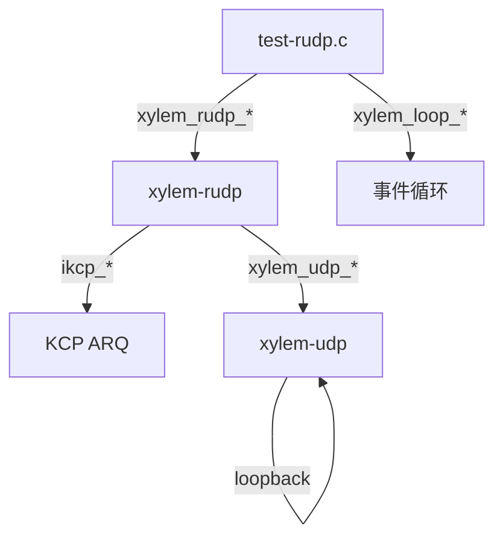
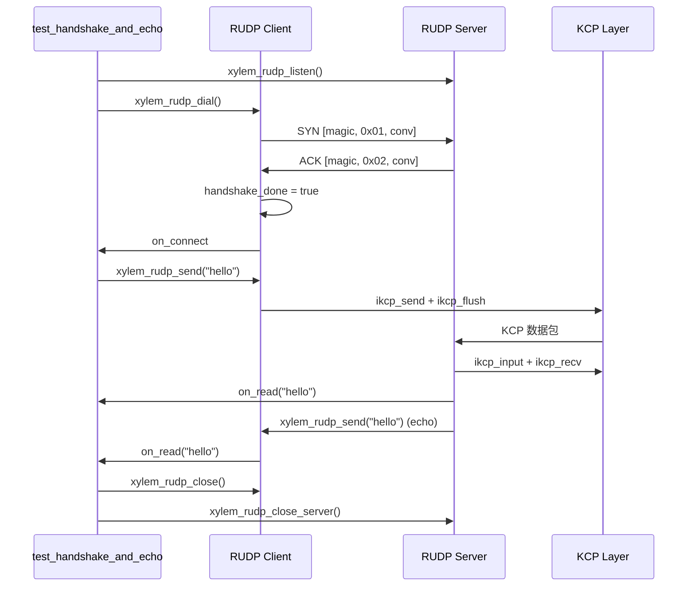

# RUDP 模块测试设计文档

## 概述

`tests/test-rudp.c` 包含 13 个测试函数，覆盖 `src/rudp/xylem-rudp.c` 的所有公共 API 和 RUDP 特有的内部分支。

RUDP 模块构建在 UDP 之上，通过 KCP 提供可靠传输。以下 UDP 层功能已由 `test-udp.c` 覆盖，不在本测试中重复：
- UDP listen/dial 基本收发
- UDP 数据报边界保持

设计风格与 `test-dtls.c` 对称：统一 `_test_ctx_t` 上下文结构体、Safety Timer 防挂起。与 DTLS 测试的关键差异：
- 无 TLS/SSL 相关测试（RUDP 无加密层）
- 无证书/CA/ALPN/Keylog 测试
- 新增 RUDP 特有测试：ctx create/destroy、FAST 模式回显、server userdata、peer_addr、get_loop
- 握手协议不同：RUDP 使用轻量级 SYN/ACK（9 字节），非 DTLS 握手

## 架构



每个异步测试的执行流程：

```mermaid
sequenceDiagram
    participant Test as test_xxx()
    participant Loop as Event Loop
    participant Safety as Safety Timer

    Test->>Loop: 创建 loop + safety timer (10s)
    Test->>Loop: 创建 server + client
    Test->>Loop: xylem_loop_run()
    Loop->>Loop: SYN/ACK 握手 + KCP 数据交换 + 关闭
    alt 正常完成
        Loop->>Test: xylem_loop_stop()
    else 超时
        Safety->>Loop: xylem_loop_stop()
    end
    Test->>Test: ASSERT 验证 + 资源清理
```

## 组件与接口

### 测试基础设施

- 统一上下文结构 `_test_ctx_t`，所有测试共用，按需使用字段
- 共享回调：`_rudp_srv_accept_cb`（保存会话句柄 + 设置 userdata）、`_rudp_srv_read_echo_cb`（回显）
- 每个测试独立创建 Loop + 10 秒 Safety Timer，测试间无共享状态
- 单一端口 `RUDP_PORT 16433`，测试顺序执行不冲突
- 无文件作用域可变变量，所有状态通过 `_test_ctx_t` 和 userdata 传递

### 被测公共 API

| API 函数 | 类别 |
|---------|------|
| `xylem_rudp_ctx_create` | 上下文管理 |
| `xylem_rudp_ctx_destroy` | 上下文管理 |
| `xylem_rudp_dial` | 会话 |
| `xylem_rudp_send` | 会话 |
| `xylem_rudp_close` | 会话 |
| `xylem_rudp_get_peer_addr` | 会话 |
| `xylem_rudp_get_loop` | 会话 |
| `xylem_rudp_get_userdata` | 会话 |
| `xylem_rudp_set_userdata` | 会话 |
| `xylem_rudp_listen` | 服务器 |
| `xylem_rudp_close_server` | 服务器 |
| `xylem_rudp_server_get_userdata` | 服务器 |
| `xylem_rudp_server_set_userdata` | 服务器 |

## 数据模型

### 统一上下文结构体

```c
typedef struct {
    xylem_loop_t*          loop;
    xylem_rudp_server_t*   rudp_server;
    xylem_rudp_t*          srv_session;    /* 服务端接受的会话 */
    xylem_rudp_t*          cli_session;    /* 客户端会话 */
    xylem_rudp_ctx_t*      ctx;
    int                    accept_called;
    int                    connect_called;
    int                    close_called;
    int                    read_count;
    int                    verified;
    int                    value;
    int                    send_result;
    char                   received[256];
    size_t                 received_len;
} _test_ctx_t;
```

字段说明：
- `loop`：当前测试的事件循环
- `rudp_server`：RUDP 服务器句柄
- `srv_session` / `cli_session`：服务端/客户端 RUDP 会话句柄
- `ctx`：RUDP 上下文（管理 conv ID 生成）
- `accept_called` / `connect_called` / `close_called`：回调触发计数
- `read_count`：on_read 触发次数
- `verified`：通用验证标志
- `value`：userdata 测试用整数值
- `send_result`：send 返回值记录
- `received` / `received_len`：接收数据缓冲区

## 主要算法/工作流

### 握手 + 回显测试流程



## 关键函数形式化规约

### xylem_rudp_ctx_create / xylem_rudp_ctx_destroy

```c
xylem_rudp_ctx_t* xylem_rudp_ctx_create(void);
void xylem_rudp_ctx_destroy(xylem_rudp_ctx_t* ctx);
```

**前置条件：** 无
**后置条件：**
- `create` 返回非 NULL 指针，内部 `next_conv` 已通过 PRNG 初始化
- `destroy` 释放内存，不崩溃

### xylem_rudp_dial

```c
xylem_rudp_t* xylem_rudp_dial(xylem_loop_t* loop, xylem_addr_t* addr,
                               xylem_rudp_ctx_t* ctx,
                               xylem_rudp_handler_t* handler,
                               xylem_rudp_opts_t* opts);
```

**前置条件：**
- `loop` 非 NULL 且有效
- `addr` 非 NULL 且已初始化
- `ctx` 非 NULL
- `handler` 非 NULL

**后置条件：**
- 成功时返回非 NULL 的 RUDP 会话句柄
- 已发送 SYN 握手包
- 握手超时定时器已启动（5s）
- KCP 会话已创建

### xylem_rudp_send

```c
int xylem_rudp_send(xylem_rudp_t* rudp, const void* data, size_t len);
```

**前置条件：**
- `rudp` 非 NULL
- `data` 非 NULL 且 `len > 0`

**后置条件：**
- 握手完成且未关闭时返回 0，数据已入队 KCP 发送缓冲区并立即 flush
- 未握手或已关闭时返回 -1
- 不修改输入数据

**循环不变量：** 无（单次操作）

### xylem_rudp_close

```c
void xylem_rudp_close(xylem_rudp_t* rudp);
```

**前置条件：** `rudp` 非 NULL
**后置条件：**
- `closing` 标志设为 true（幂等，重复调用不崩溃）
- 客户端路径：停止定时器 → 关闭 UDP → `_rudp_client_close_cb` → 释放 KCP → `on_close` → 延迟释放
- 服务端路径：停止定时器 → 从红黑树移除 → 释放 KCP → `on_close` → 延迟释放

### xylem_rudp_listen

```c
xylem_rudp_server_t* xylem_rudp_listen(xylem_loop_t* loop, xylem_addr_t* addr,
                                        xylem_rudp_ctx_t* ctx,
                                        xylem_rudp_handler_t* handler,
                                        xylem_rudp_opts_t* opts);
```

**前置条件：**
- `loop` 非 NULL 且有效
- `addr` 非 NULL 且已初始化

**后置条件：**
- 成功时返回非 NULL 的服务器句柄
- 底层 UDP socket 已绑定并监听
- sessions 红黑树已初始化

### xylem_rudp_close_server

```c
void xylem_rudp_close_server(xylem_rudp_server_t* server);
```

**前置条件：** `server` 非 NULL
**后置条件：**
- `closing` 标志设为 true（幂等）
- 所有活跃会话已关闭（逐个从红黑树取出并 close）
- 底层 UDP socket 已关闭
- server 内存延迟释放

## 算法伪代码

### 服务端数据包分发算法

```c
ALGORITHM server_dispatch(data, len, addr)
INPUT: data 原始 UDP 数据报, len 长度, addr 发送方地址
OUTPUT: 无（通过回调通知）

BEGIN
    ASSERT server.closing == false

    /* 尝试解码为握手包 */
    IF decode_handshake(data, len, &type, &conv) THEN
        IF type == SYN THEN
            existing ← find_session(server, addr, conv)
            /* 无论是否已存在都回复 ACK（客户端可能丢失了第一个 ACK） */
            send_ack(server.udp, addr, conv)
            IF existing != NULL THEN
                RETURN  /* 已有会话，不重复创建 */
            END IF
            /* 创建新会话 */
            session ← create_session(server, addr, conv)
            insert_rbtree(server.sessions, session)
            handler->on_accept(server, session)
        END IF
        RETURN
    END IF

    /* 非握手包：提取 conv，查找会话 */
    IF len < 4 THEN
        RETURN  /* 丢弃 */
    END IF
    conv ← extract_conv(data)
    session ← find_session(server, addr, conv)
    IF session == NULL THEN
        RETURN  /* 丢弃 */
    END IF
    ikcp_input(session.kcp, data, len)
    input_complete(session)
END
```

**前置条件：** server 未关闭，data 非 NULL
**后置条件：** 握手包触发 ACK 回复和可能的新会话创建；数据包路由到对应 KCP 会话
**循环不变量：** 红黑树中所有会话的 (addr, conv) 键唯一

## 测试列表

### 上下文管理 API（1 个）

| 测试函数 | 覆盖的功能 | 验证点 |
|---------|-----------|--------|
| `test_ctx_create_destroy` | ctx_create + ctx_destroy | 返回非 NULL，销毁不崩溃 |

### 握手与数据传输（2 个）

| 测试函数 | 覆盖的功能 | 验证点 |
|---------|-----------|--------|
| `test_handshake_and_echo` | 完整 SYN/ACK 握手 + KCP echo | accept/connect/read/close 全触发，数据 "hello" 往返一致 |
| `test_fast_mode_echo` | FAST 模式握手 + echo | 与 DEFAULT 模式相同的回显验证，opts.mode=FAST |

### 会话访问器（4 个）

| 测试函数 | 覆盖的功能 | 验证点 |
|---------|-----------|--------|
| `test_session_userdata` | set/get_userdata | set/get 往返一致（value=42）|
| `test_server_userdata` | server set/get_userdata | set/get 往返一致（value=99）|
| `test_peer_addr` | get_peer_addr | 返回非 NULL，IP=="127.0.0.1"，端口==RUDP_PORT |
| `test_get_loop` | get_loop | 与创建时的 loop 相同 |

### 关闭行为（3 个）

| 测试函数 | 覆盖的功能 | 验证点 |
|---------|-----------|--------|
| `test_send_after_close` | close 后 send | `xylem_rudp_send` 返回 -1（closing 标志检查）|
| `test_close_idempotent` | close 重复调用 | 第二次调用不崩溃 |
| `test_close_server_with_active_session` | close_server 带活跃会话 | 定时器触发关闭，活跃会话的 on_close 被触发 |

### 发送前置条件（1 个）

| 测试函数 | 覆盖的功能 | 验证点 |
|---------|-----------|--------|
| `test_send_before_handshake` | 握手完成前 send | `xylem_rudp_send` 返回 -1（handshake_done==false）|

### 多会话（1 个）

| 测试函数 | 覆盖的功能 | 验证点 |
|---------|-----------|--------|
| `test_multi_session` | 同一服务器上多个客户端会话 | 两个客户端各自独立回显，数据不串扰，accept_called==2 |

### 握手超时（1 个）

| 测试函数 | 覆盖的功能 | 验证点 |
|---------|-----------|--------|
| `test_handshake_timeout` | 客户端握手超时 | 无服务端监听，on_close 触发，errmsg=="handshake timeout" |

## 示例用法

```c
/* 基本回显测试模式 */
_test_ctx_t ctx = {0};
ctx.loop = xylem_loop_create();
ctx.ctx  = xylem_rudp_ctx_create();

xylem_addr_t addr;
xylem_addr_pton("127.0.0.1", RUDP_PORT, &addr);

xylem_rudp_handler_t srv_handler = {
    .on_accept = _rudp_srv_accept_cb,
    .on_read   = _rudp_srv_read_echo_cb,
};
ctx.rudp_server = xylem_rudp_listen(ctx.loop, &addr, ctx.ctx,
                                     &srv_handler, NULL);

xylem_rudp_handler_t cli_handler = {
    .on_connect = _echo_cli_connect_cb,
    .on_read    = _echo_cli_read_cb,
    .on_close   = _echo_cli_close_cb,
};
ctx.cli_session = xylem_rudp_dial(ctx.loop, &addr, ctx.ctx,
                                   &cli_handler, NULL);
xylem_rudp_set_userdata(ctx.cli_session, &ctx);

xylem_loop_run(ctx.loop);

ASSERT(ctx.connect_called == 1);
ASSERT(memcmp(ctx.received, "hello", 5) == 0);

/* 清理 */
xylem_rudp_ctx_destroy(ctx.ctx);
xylem_loop_destroy(ctx.loop);
```

## 覆盖的公共 API 映射

| API 函数 | 覆盖的测试 |
|---------|-----------|
| `xylem_rudp_ctx_create` | 全部 13 个 |
| `xylem_rudp_ctx_destroy` | 全部 13 个 |
| `xylem_rudp_dial` | 所有异步测试（11 个） |
| `xylem_rudp_send` | test_handshake_and_echo, test_fast_mode_echo, test_send_after_close, test_send_before_handshake, test_multi_session |
| `xylem_rudp_close` | 所有异步测试 + test_close_idempotent |
| `xylem_rudp_get_peer_addr` | test_peer_addr |
| `xylem_rudp_get_loop` | test_get_loop |
| `xylem_rudp_get_userdata` | test_session_userdata + 所有回调中通过 userdata 获取 ctx |
| `xylem_rudp_set_userdata` | test_session_userdata + 所有异步测试的 setup |
| `xylem_rudp_listen` | 所有异步测试（除 test_handshake_timeout 外的 10 个） |
| `xylem_rudp_close_server` | test_close_server_with_active_session + 所有异步测试的清理路径 |
| `xylem_rudp_server_get_userdata` | test_server_userdata |
| `xylem_rudp_server_set_userdata` | test_server_userdata |

## 覆盖的内部分支

| 内部函数/路径 | 覆盖的分支 | 触发测试 |
|-------------|-----------|---------|
| `_rudp_client_read_cb` | 握手阶段：解码 ACK + conv 匹配 → handshake_done | `test_handshake_and_echo` |
| `_rudp_client_read_cb` | 数据阶段：ikcp_input + _rudp_input_complete | `test_handshake_and_echo` |
| `_rudp_client_read_cb` | closing 检查：rudp->closing 提前返回 | `test_send_after_close` |
| `_rudp_server_read_cb` | SYN 新会话：创建 KCP + 插入红黑树 + on_accept | `test_handshake_and_echo` |
| `_rudp_server_read_cb` | SYN 已有会话：仅回复 ACK，不重复创建 | `test_multi_session`（隐式：SYN 重传场景）|
| `_rudp_server_read_cb` | KCP 数据：find_session + ikcp_input | `test_handshake_and_echo`（数据阶段）|
| `_rudp_server_read_cb` | closing 检查：server.closing 提前返回 | `test_close_server_with_active_session` |
| `_rudp_server_read_cb` | len < 4 丢弃 | （隐式：不会在正常测试中触发）|
| `_rudp_server_read_cb` | find_session 未命中丢弃 | （隐式：不会在正常测试中触发）|
| `_rudp_encode_handshake` | 编码 SYN/ACK | 所有异步测试 |
| `_rudp_decode_handshake` | 解码成功 | 所有异步测试 |
| `_rudp_decode_handshake` | 长度不匹配返回 false | 所有异步测试（KCP 数据包不是 9 字节）|
| `_rudp_decode_handshake` | magic 不匹配返回 false | 所有异步测试（KCP 数据包 magic 不匹配）|
| `_rudp_kcp_output_cb` | 正常路径：xylem_udp_send | 所有异步测试 |
| `_rudp_kcp_output_cb` | closing 路径：返回 -1 | `test_send_after_close`（隐式）|
| `_rudp_apply_opts` | NULL opts：默认参数 | `test_handshake_and_echo` |
| `_rudp_apply_opts` | FAST 模式：nodelay + 10ms interval | `test_fast_mode_echo` |
| `_rudp_create_kcp` | 正常路径：创建 KCP + 设置输出回调 + 应用选项 | 所有异步测试 |
| `_rudp_drain_recv` | 正常路径：循环 ikcp_recv + on_read | `test_handshake_and_echo` |
| `_rudp_drain_recv` | closing 路径：on_read 中触发 close 后返回 false | `test_handshake_and_echo` |
| `_rudp_input_complete` | ikcp_flush + drain_recv + schedule_update | 所有异步测试 |
| `_rudp_update_timeout_cb` | 正常路径：ikcp_update + drain_recv + schedule_update | 所有异步测试 |
| `_rudp_update_timeout_cb` | dead link 检测：kcp->state == -1 → close | （难以在回环测试中触发）|
| `_rudp_schedule_update` | 查询 ikcp_check + 设置定时器 | 所有异步测试 |
| `_rudp_handshake_timeout_cb` | 超时触发 close | `test_handshake_timeout` |
| `_rudp_client_close_cb` | ikcp_release + on_close + loop_post | 所有客户端异步测试 |
| `_rudp_free_cb` | 延迟释放 rudp + destroy timers | 所有异步测试 |
| `_rudp_server_close_cb` | 释放 server 内存 | 所有异步测试 |
| `_rudp_find_session` | 红黑树查找命中 | 所有异步测试（数据阶段）|
| `_rudp_find_session` | 红黑树查找未命中 | `test_handshake_and_echo`（首次 SYN）|
| `_rudp_addr_cmp` | IPv4 地址比较 | 所有异步测试 |
| `_rudp_session_cmp` | 地址 + conv 复合比较 | 所有异步测试 |
| `_rudp_session_cmp_nn` | 节点-节点比较（插入） | 所有异步测试 |
| `_rudp_session_cmp_kn` | 键-节点比较（查找） | 所有异步测试 |
| `xylem_rudp_send` | 正常路径：ikcp_send + ikcp_flush + schedule_update | `test_handshake_and_echo`, `test_fast_mode_echo`, `test_multi_session` |
| `xylem_rudp_send` | 失败路径：closing==true 返回 -1 | `test_send_after_close` |
| `xylem_rudp_send` | 失败路径：handshake_done==false 返回 -1 | `test_send_before_handshake` |
| `xylem_rudp_close` | 客户端路径：stop timers + udp_close | 所有客户端异步测试 |
| `xylem_rudp_close` | 服务端路径：erase from rbtree + ikcp_release + on_close + loop_post | `test_close_server_with_active_session` |
| `xylem_rudp_close` | 幂等：closing==true 提前返回 | `test_close_idempotent` |
| `xylem_rudp_close_server` | 遍历红黑树 + 逐个 close + udp_close | `test_close_server_with_active_session` |
| `xylem_rudp_close_server` | 幂等：closing==true 提前返回 | （隐式：close_server 在清理路径中可能被重复调用）|

## 未覆盖的路径

| 路径 | 原因 |
|------|------|
| `_rudp_update_timeout_cb` dead link 检测 | 回环网络无丢包，KCP 不会触发 dead link |
| `_rudp_create_kcp` 失败路径（ikcp_create 返回 NULL）| 需要 mock KCP 内存分配，不实际 |
| `xylem_rudp_dial` 失败路径（udp_dial 失败）| 需要端口耗尽等极端条件 |
| `xylem_rudp_listen` 失败路径（udp_listen 失败）| 需要端口占用等极端条件 |
| `_rudp_server_read_cb` len < 4 丢弃 | 需要构造小于 4 字节的 UDP 数据报，回环测试中不会自然产生 |
| `_rudp_server_read_cb` find_session 未命中（非 SYN 数据包）| 需要伪造 conv 不匹配的 KCP 数据包 |
| IPv6 地址 | 所有测试使用 127.0.0.1 回环地址 |
| `_rudp_kcp_output_cb` closing 路径 | 需要在 KCP 输出回调期间精确触发 closing 状态 |

## 正确性属性

*属性是在系统所有有效执行中都应成立的特征或行为——本质上是关于系统应该做什么的形式化陈述。属性是人类可读规范与机器可验证正确性保证之间的桥梁。*

### Property 1: RUDP 数据回显往返一致

*对于任意*非空数据，通过 RUDP 会话发送到回显服务端后，客户端收到的数据应与发送的数据完全一致（内容相同、长度相同）。KCP 保证有序交付和可靠传输。

**Validates: Requirement 3.2**

### Property 2: Userdata 指针往返一致

*对于任意*指针值，通过 `xylem_rudp_set_userdata` 设置后，`xylem_rudp_get_userdata` 应返回相同的指针。同理适用于 `xylem_rudp_server_set_userdata` / `xylem_rudp_server_get_userdata`。

**Validates: Requirements 4.1, 4.2**

### Property 3: Close 幂等性

*对于任意* RUDP 会话，调用 `xylem_rudp_close` 两次不应崩溃，第二次调用应为空操作（`closing` 标志防止重入）。

**Validates: Requirement 5.2**

## 错误处理

### 测试级错误处理

| 错误场景 | 处理方式 |
|---------|---------|
| Safety Timer 超时（10s） | `xylem_loop_stop` 强制退出事件循环，后续 ASSERT 失败 |
| `xylem_rudp_ctx_create` 返回 NULL | ASSERT 立即终止测试 |
| `xylem_rudp_listen` 返回 NULL | ASSERT 立即终止测试 |
| `xylem_rudp_dial` 返回 NULL | ASSERT 立即终止测试 |

### 被测代码错误路径

| 错误路径 | 覆盖测试 | 预期行为 |
|---------|---------|---------|
| `rudp_send` 在 closing 状态 | `test_send_after_close` | 返回 -1 |
| `rudp_send` 在握手完成前 | `test_send_before_handshake` | 返回 -1 |
| 握手超时（无服务端） | `test_handshake_timeout` | `on_close` 触发，errmsg=="handshake timeout" |

## 测试策略

### 双重测试方法

本测试文件采用单元测试为主的策略：

- **单元测试**：验证每个公共 API 的具体行为、边界条件和错误路径
- **属性测试**：验证数据回显往返一致性和 userdata 指针往返一致性

由于 RUDP 测试涉及异步事件循环、KCP 握手和网络 I/O，属性测试的输入生成受限于需要完整的握手流程。因此单元测试承担主要覆盖职责，属性测试聚焦于可参数化的数据路径。

### 属性测试配置

- 属性测试库：由于项目使用纯 C 且无外部测试框架，属性测试通过循环随机输入实现（参考项目 `ASSERT` 宏风格）
- 每个属性测试最少 100 次迭代
- 每个属性测试必须以注释引用设计文档中的属性编号
- 标签格式：`/* Feature: rudp-test, Property 1: RUDP echo round trip */`

### 单元测试覆盖

| 类别 | 测试数量 | 覆盖范围 |
|------|---------|---------|
| 上下文管理 API | 1 | create/destroy |
| 握手与数据传输 | 2 | DEFAULT 模式回显、FAST 模式回显 |
| 会话访问器 | 4 | session userdata、server userdata、peer_addr、get_loop |
| 关闭行为 | 3 | close 后 send、close 幂等、close_server 带活跃会话 |
| 发送前置条件 | 1 | 握手前 send |
| 多会话 | 1 | 同一服务器多客户端独立回显 |
| 握手超时 | 1 | 无服务端时客户端超时 |

### 与 DTLS 测试的差异

| DTLS 测试有但 RUDP 测试无 | 原因 |
|-------------------------|------|
| `test_load_cert_valid/invalid` | RUDP 无 TLS 证书 |
| `test_set_ca` | RUDP 无 CA 验证 |
| `test_set_verify` | RUDP 无对端验证 |
| `test_set_alpn` | RUDP 无 ALPN 协商 |
| `test_alpn_negotiation` | RUDP 无 ALPN |
| `test_handshake_failure_wrong_ca` | RUDP 无证书验证失败场景 |
| `test_keylog_write` | RUDP 无 keylog |

| RUDP 测试有但 DTLS 测试无 | 原因 |
|-------------------------|------|
| `test_fast_mode_echo` | RUDP 特有的 FAST 模式（KCP nodelay + 快速重传） |
| `test_close_idempotent` | 显式测试 close 幂等性 |
| `test_send_before_handshake` | RUDP 握手是显式的 SYN/ACK，可在握手前尝试 send |
| `test_multi_session` | RUDP 使用 (addr, conv) 复合键多路复用，需验证多会话隔离 |
| `test_server_userdata` | RUDP 公共 API 包含 server userdata 访问器 |
| `test_peer_addr` | 验证 get_peer_addr 返回正确地址 |
| `test_get_loop` | 验证 get_loop 返回正确 loop |
| `test_handshake_timeout` | RUDP 有显式的 5s 握手超时定时器 |

## 性能考虑

- 所有测试使用 127.0.0.1 回环接口，网络延迟可忽略
- FAST 模式测试使用 10ms 更新间隔，测试执行时间略长于 DEFAULT 模式
- 握手超时测试需要等待 5 秒（`RUDP_HANDSHAKE_TIMEOUT_MS`），是最慢的测试
- Safety Timer 设为 10 秒，足够覆盖握手超时场景

## 依赖

| 依赖 | 用途 |
|------|------|
| `xylem-rudp` | 被测模块 |
| `xylem-udp` | RUDP 底层传输 |
| `xylem-loop` | 事件循环 |
| `xylem-addr` | 地址解析 |
| `xylem-rbtree` | 会话管理（内部） |
| KCP (`ikcp.c`) | 可靠传输协议（内部） |
| `tests/assert.h` | 测试断言宏 |
