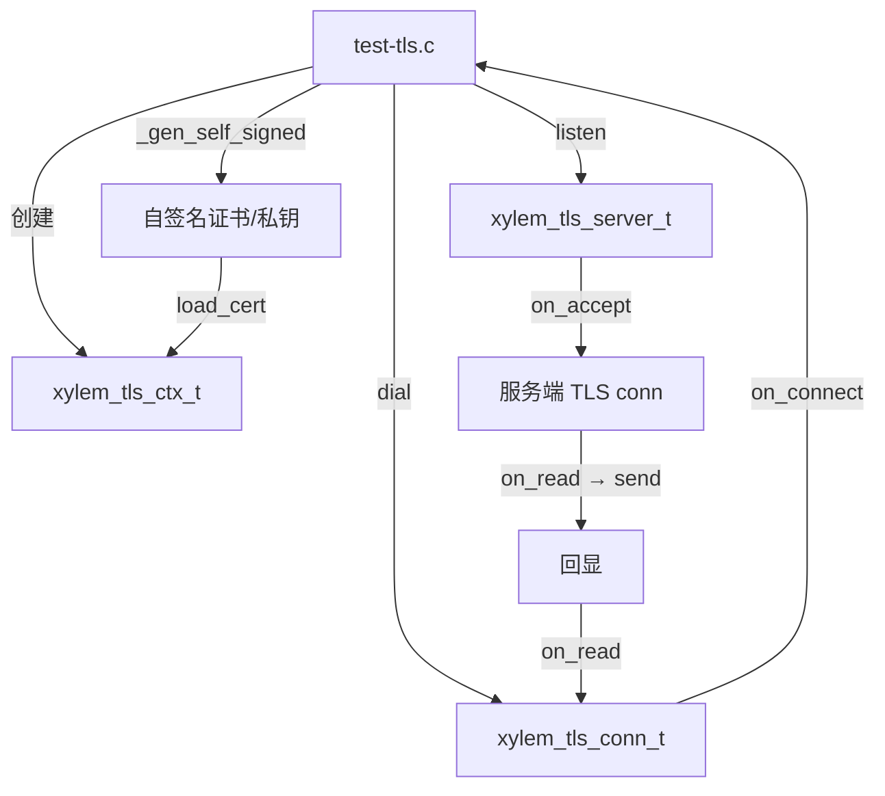
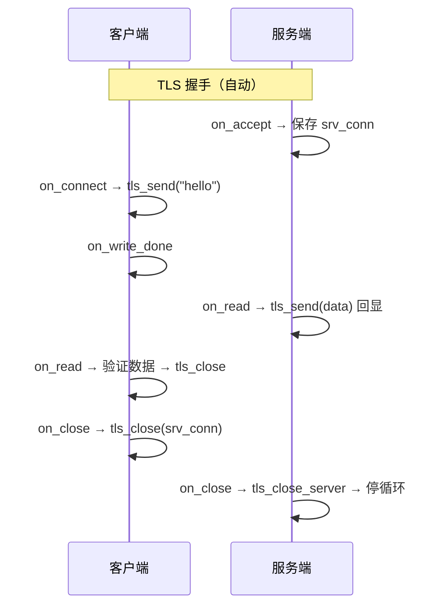

# TLS 模块测试设计文档

## 概述

`tests/test-tls.c` 覆盖 `src/xylem-tls.c` 的所有公共 API 和 TLS 特有的内部分支。测试模式参考 `tests/test-tcp.c`，但适配 TLS 层的特殊需求：证书生成、握手流程、加密数据传输。

TLS 模块构建在 TCP 之上，以下 TCP 层功能已由 `test-tcp.c` 覆盖，不在本测试中重复：
- 所有分帧策略（NONE/FIXED/LENGTH/DELIM/CUSTOM）
- TCP 层重连机制
- TCP 层写队列 drain
- TCP 层读缓冲区满

## 架构



## 组件与接口

### 测试上下文结构 `_test_ctx_t`

统一上下文结构，所有测试共用，按需使用字段：

```c
typedef struct {
    xylem_loop_t*          loop;
    xylem_tls_server_t*    tls_server;
    xylem_tls_conn_t*      srv_conn;      /* 服务端接受的 TLS 连接 */
    xylem_tls_conn_t*      cli_conn;      /* 客户端 TLS 连接 */
    xylem_tls_ctx_t*       srv_ctx;       /* 服务端 TLS 上下文 */
    xylem_tls_ctx_t*       cli_ctx;       /* 客户端 TLS 上下文 */
    int                    accept_called;
    int                    connect_called;
    int                    close_called;
    int                    read_count;
    int                    wd_called;     /* on_write_done 触发次数 */
    int                    wd_status;
    int                    timeout_called;
    int                    heartbeat_called;
    int                    verified;      /* 通用验证标志 */
    int                    value;         /* userdata 测试用 */
    int                    send_result;   /* send 返回值 */
    char                   received[256];
    size_t                 received_len;
} _test_ctx_t;
```

与 TCP 测试的 `_test_ctx_t` 对比，TLS 版本增加了：
- `tls_server` / `srv_conn` / `cli_conn`：TLS 层句柄（TCP 测试使用 TCP 层句柄）
- `srv_ctx` / `cli_ctx`：TLS 上下文（TCP 无此概念）
- `accept_called`：区分 TLS 握手成功的 accept
- `timeout_called` / `heartbeat_called`：超时/心跳透传验证

### 证书生成辅助函数

```c
static int _gen_self_signed(const char* cert_path, const char* key_path);
```

使用 OpenSSL API 生成 RSA 2048 自签名证书：
1. `EVP_PKEY_keygen` 生成 RSA 密钥对
2. `X509_new` 创建 X.509 证书，CN=localhost，有效期 1 年
3. `PEM_write_X509` / `PEM_write_PrivateKey` 写入文件
4. 测试结束后 `remove()` 清理临时文件

每个需要证书的测试独立调用此函数，使用不同的文件名避免冲突。

### 共享回调

TLS 版本的共享回调，签名适配 `xylem_tls_handler_t`：

| 回调 | 功能 |
|------|------|
| `_tls_srv_accept_cb` | 保存 `srv_conn`，设置 `accept_called` |
| `_tls_srv_close_cb` | 递增 `close_called`，停循环 |
| `_tls_srv_read_echo_cb` | 收到数据后 `xylem_tls_send` 回显 |
| `_tls_cli_connect_cb` | 设置 `connect_called` |
| `_tls_cli_close_cb` | 设置 `close_called`，关闭服务端连接 |

### 测试模板

每个测试遵循统一模式：

```c
static void test_xxx(void) {
    /* 1. 生成证书（如需要） */
    _gen_self_signed(cert, key);

    /* 2. 初始化 _test_ctx_t（栈上，零初始化） */
    _test_ctx_t ctx = {0};
    ctx.loop = xylem_loop_create();

    /* 3. 创建 Safety Timer（2 秒） */
    xylem_loop_timer_t* safety = xylem_loop_create_timer(ctx.loop, NULL);
    xylem_loop_start_timer(safety, _safety_timeout_cb, 2000, 0);

    /* 4. 创建 TLS 上下文 + 加载证书 */
    ctx.srv_ctx = xylem_tls_ctx_create();
    xylem_tls_ctx_load_cert(ctx.srv_ctx, cert, key);
    xylem_tls_ctx_set_verify(ctx.srv_ctx, false);

    ctx.cli_ctx = xylem_tls_ctx_create();
    xylem_tls_ctx_set_verify(ctx.cli_ctx, false);

    /* 5. listen + dial */
    /* 6. xylem_loop_run */
    /* 7. ASSERT 验证 */
    /* 8. 清理：destroy ctx, destroy timer, destroy loop, remove cert */
}
```

端口使用 `TLS_PORT 14433`，测试顺序执行不冲突。

## 数据模型

### 证书文件命名

每个测试使用独立的证书文件名，避免并发冲突：

| 测试 | 证书文件 | 私钥文件 |
|------|---------|---------|
| `test_handshake_and_echo` | `test_tls_hs_cert.pem` | `test_tls_hs_key.pem` |
| `test_handshake_failure_wrong_ca` | `test_tls_fail_cert.pem` + `test_tls_fail_cert2.pem` | 对应 key |
| `test_load_cert_valid` | `test_tls_cert.pem` | `test_tls_key.pem` |
| 其他需要证书的测试 | `test_tls_<name>_cert.pem` | `test_tls_<name>_key.pem` |

### 回调链设计

典型的 echo 测试回调链：




## 测试列表

### 上下文管理 API（6 个）

| 测试函数 | 覆盖的 API | 验证点 |
|---------|-----------|--------|
| `test_ctx_create_destroy` | `ctx_create` + `ctx_destroy` | 返回非 NULL，销毁不崩溃 |
| `test_load_cert_valid` | `ctx_load_cert` 成功路径 | 自签名证书加载返回 0 |
| `test_load_cert_invalid` | `ctx_load_cert` 失败路径 | 不存在的文件返回 -1 |
| `test_set_ca` | `ctx_set_ca` | 有效 CA 文件返回 0 |
| `test_set_verify` | `ctx_set_verify` | 启用/禁用均不崩溃 |
| `test_set_alpn` | `ctx_set_alpn` | 设置协议列表返回 0 |

### 握手与数据传输（3 个）

| 测试函数 | 覆盖的功能 | 验证点 |
|---------|-----------|--------|
| `test_handshake_and_echo` | 完整握手 + echo | accept/connect/write_done/read/close 全触发，数据 "hello" 往返一致 |
| `test_handshake_failure_wrong_ca` | 证书验证失败 | 客户端启用验证 + 错误 CA → on_close 触发 |
| `test_alpn_negotiation` | ALPN 端到端协商 | 双方设置 ALPN，握手后 `xylem_tls_get_alpn` 返回协商结果 |

### 连接辅助 API（5 个）

| 测试函数 | 覆盖的 API | 验证点 |
|---------|-----------|--------|
| `test_sni_hostname` | `tls_set_hostname` | 返回 0，不崩溃 |
| `test_conn_userdata` | `tls_set/get_userdata` | set/get 往返一致 |
| `test_server_userdata` | `tls_server_set/get_userdata` | set/get 往返一致 |
| `test_peer_addr` | `tls_get_peer_addr` | 返回非 NULL，AF_INET |
| `test_get_loop` | `tls_get_loop` | 与创建时的 loop 相同 |

### 关闭行为（3 个）

| 测试函数 | 覆盖的功能 | 验证点 |
|---------|-----------|--------|
| `test_close_server_with_active_conn` | `tls_close_server` 带活跃连接 | 活跃连接的 on_close 被触发 |
| `test_close_server_idempotent` | `tls_close_server` 重复调用 | 第二次调用不崩溃 |
| `test_send_after_close` | close 后 send | `xylem_tls_send` 返回 -1 |

### Keylog（2 个）

| 测试函数 | 覆盖的功能 | 验证点 |
|---------|-----------|--------|
| `test_keylog_write` | `ctx_set_keylog` + 握手 | keylog 文件非空，包含 "CLIENT_RANDOM" 或密钥材料 |
| `test_keylog_disable` | `ctx_set_keylog(ctx, NULL)` | 返回 0，禁用后不写入 |

### 超时与心跳透传（2 个）

| 测试函数 | 覆盖的功能 | 验证点 |
|---------|-----------|--------|
| `test_read_timeout` | TCP read_timeout → TLS on_timeout | `on_timeout(READ)` 触发 |
| `test_heartbeat_miss` | TCP heartbeat → TLS on_heartbeat_miss | `on_heartbeat_miss` 触发 |

### 总计：21 个测试函数

## 每个测试的详细设计

### test_ctx_create_destroy

- 调用 `xylem_tls_ctx_create()`，ASSERT 返回非 NULL
- 调用 `xylem_tls_ctx_destroy()`，验证不崩溃
- 无需事件循环

### test_load_cert_valid

- `_gen_self_signed` 生成证书
- `xylem_tls_ctx_create()` → `xylem_tls_ctx_load_cert(ctx, cert, key)` → ASSERT 返回 0
- 清理：destroy ctx，remove 证书文件

### test_load_cert_invalid

- `xylem_tls_ctx_create()` → `xylem_tls_ctx_load_cert(ctx, "nonexistent.pem", "nonexistent.pem")` → ASSERT 返回 -1
- 清理：destroy ctx

### test_set_ca

- `_gen_self_signed` 生成 CA 证书
- `xylem_tls_ctx_set_ca(ctx, ca_cert)` → ASSERT 返回 0
- 清理：destroy ctx，remove 文件

### test_set_verify

- `xylem_tls_ctx_create()` → `set_verify(true)` → `set_verify(false)` → 不崩溃
- 清理：destroy ctx

### test_set_alpn

- `xylem_tls_ctx_create()` → `set_alpn(ctx, {"h2", "http/1.1"}, 2)` → ASSERT 返回 0
- 清理：destroy ctx

### test_handshake_and_echo

回调链：
1. 服务端 `on_accept`：保存 `srv_conn`，设置 `accept_called`
2. 客户端 `on_connect`：`tls_send("hello", 5)`，设置 `connect_called`
3. 客户端 `on_write_done`：设置 `wd_called`
4. 服务端 `on_read`：`tls_send(data, len)` 回显
5. 客户端 `on_read`：memcpy 到 `received`，`tls_close(cli)`
6. 客户端 `on_close`：`tls_close(srv_conn)`
7. 服务端 `on_close`：`tls_close_server` → 停循环

验证：accept_called, connect_called, wd_called, received == "hello", close 触发

### test_handshake_failure_wrong_ca

- 生成两套独立证书（cert1 用于服务端，cert2 用于客户端 CA）
- 服务端：加载 cert1，禁用验证
- 客户端：启用验证，设置 cert2 为 CA（与服务端证书不匹配）
- 客户端 `on_close`：设置 `handshake_failed`
- 服务端 `on_close`：设置 `handshake_failed`，关闭 server
- 验证：`handshake_failed == true`

### test_alpn_negotiation

- 服务端和客户端均设置 ALPN `{"h2", "http/1.1"}`
- 握手完成后，在 `on_connect` 回调中调用 `xylem_tls_get_alpn()`
- ASSERT 返回 "h2"（双方首选协议）
- 关闭连接和服务器

### test_sni_hostname

- 创建客户端 TLS 连接（不需要服务端）
- `xylem_tls_set_hostname(tls, "example.com")` → ASSERT 返回 0
- 立即关闭连接
- 清理资源

### test_conn_userdata

- 在 `on_connect` 回调中：
  - `xylem_tls_set_userdata(tls, &ctx.value)`
  - `xylem_tls_get_userdata(tls)` → ASSERT 返回 `&ctx.value`
- 验证 `ctx.verified == 1`

### test_server_userdata

- `xylem_tls_server_set_userdata(server, &ctx)`
- `xylem_tls_server_get_userdata(server)` → ASSERT 返回 `&ctx`
- 在 `on_accept` 回调中再次验证

### test_peer_addr

- 在服务端 `on_accept` 回调中：
  - `xylem_tls_get_peer_addr(tls)` → ASSERT 非 NULL
  - 验证 `sa_family == AF_INET`

### test_get_loop

- 在客户端 `on_connect` 回调中：
  - `xylem_tls_get_loop(tls)` → ASSERT 与 `ctx.loop` 相同

### test_close_server_with_active_conn

- 服务端接受连接后，定时器触发 `xylem_tls_close_server`
- 验证活跃连接的 `on_close` 被触发

### test_close_server_idempotent

- `xylem_tls_close_server(server)` 调用两次
- 第二次不崩溃

### test_send_after_close

- 在 `on_connect` 中先 `tls_close`，再 `tls_send`
- ASSERT `tls_send` 返回 -1

### test_keylog_write

- `xylem_tls_ctx_set_keylog(ctx, "test_keylog.txt")` → ASSERT 返回 0
- 完成一次完整握手
- 读取 keylog 文件，ASSERT 文件大小 > 0
- 清理：remove keylog 文件

### test_keylog_disable

- `xylem_tls_ctx_set_keylog(ctx, "test_keylog2.txt")` → 返回 0
- `xylem_tls_ctx_set_keylog(ctx, NULL)` → 返回 0
- 清理

### test_read_timeout

- 使用 `xylem_tcp_opts_t` 设置 `read_timeout_ms = 100`
- 客户端连接后不发送数据
- TLS `on_timeout` 回调触发，type == `XYLEM_TCP_TIMEOUT_READ`
- 验证 `timeout_called == 1`

### test_heartbeat_miss

- 使用 `xylem_tcp_opts_t` 设置 `heartbeat_ms = 100`
- 客户端连接后不发送数据
- TLS `on_heartbeat_miss` 回调触发
- 验证 `heartbeat_called == 1`


## 覆盖的内部分支

| 内部函数/路径 | 覆盖的分支 | 触发测试 |
|-------------|-----------|---------|
| `_tls_tcp_connect_cb` | 正常路径：init SSL + set_connect_state + do_handshake | `test_handshake_and_echo` |
| `_tls_tcp_connect_cb` | SNI 路径：hostname 非 NULL 时设置 SNI | `test_sni_hostname` |
| `_tls_tcp_accept_cb` | 正常路径：创建 TLS conn + set_accept_state + do_handshake | `test_handshake_and_echo` |
| `_tls_do_handshake` | 成功路径：rc==1，触发 on_accept/on_connect | `test_handshake_and_echo` |
| `_tls_do_handshake` | WANT_READ/WANT_WRITE：flush 后返回 | `test_handshake_and_echo`（多轮握手） |
| `_tls_do_handshake` | 失败路径：flush alert + tcp_close | `test_handshake_failure_wrong_ca` |
| `_tls_tcp_read_cb` | 握手未完成时：调用 do_handshake | `test_handshake_and_echo`（握手阶段） |
| `_tls_tcp_read_cb` | 握手完成后：SSL_read 循环 + on_read | `test_handshake_and_echo`（数据阶段） |
| `_tls_tcp_read_cb` | SSL_ERROR_ZERO_RETURN：对端关闭 | `test_handshake_and_echo`（close_notify） |
| `_tls_tcp_read_cb` | closing 检查：on_read 中触发 close | `test_handshake_and_echo` |
| `_tls_tcp_close_cb` | 正常路径：SSL_free + on_close + loop_post | `test_handshake_and_echo` |
| `_tls_tcp_close_cb` | server 连接：从链表移除 | `test_handshake_and_echo` |
| `_tls_tcp_close_cb` | tls==NULL 提前返回 | 内部保护路径 |
| `_tls_tcp_timeout_cb` | 透传 on_timeout | `test_read_timeout` |
| `_tls_tcp_heartbeat_cb` | 透传 on_heartbeat_miss | `test_heartbeat_miss` |
| `xylem_tls_send` | 正常路径：SSL_write + flush + on_write_done | `test_handshake_and_echo` |
| `xylem_tls_send` | 失败路径：handshake 未完成或 closing | `test_send_after_close` |
| `xylem_tls_close` | 正常路径：SSL_shutdown + flush + tcp_close | `test_handshake_and_echo` |
| `xylem_tls_close` | 幂等：closing==true 提前返回 | `test_send_after_close` |
| `xylem_tls_close_server` | 正常路径：遍历连接 + 置 NULL + close | `test_close_server_with_active_conn` |
| `xylem_tls_close_server` | 幂等：closing==true 提前返回 | `test_close_server_idempotent` |
| `_tls_alpn_select_cb` | 协商成功 | `test_alpn_negotiation` |
| `_tls_keylog_cb` | keylog 写入 | `test_keylog_write` |
| `xylem_tls_ctx_set_keylog` | 启用/禁用/替换 | `test_keylog_write`, `test_keylog_disable` |


## Correctness Properties

*A property is a characteristic or behavior that should hold true across all valid executions of a system — essentially, a formal statement about what the system should do. Properties serve as the bridge between human-readable specifications and machine-verifiable correctness guarantees.*

### Property 1: TLS echo 数据往返完整性

*For any* 字节序列（长度 1-16384），通过 TLS 加密连接发送到服务端并回显后，客户端收到的数据 SHALL 与发送的数据完全一致，且整个生命周期中 on_accept、on_connect、on_write_done、on_read、on_close 回调均被触发。

**Validates: Requirements 5.1, 5.2, 5.3, 5.4**

### Property 2: TLS 连接不变量

*For any* 已建立的 TLS 连接，`xylem_tls_get_peer_addr()` SHALL 返回非 NULL 的地址且地址族为 AF_INET，`xylem_tls_get_loop()` SHALL 返回与创建时相同的 loop 句柄。

**Validates: Requirements 8.2, 8.3**

### Property 3: 关闭后发送拒绝

*For any* 已关闭的 TLS 连接，调用 `xylem_tls_send()` SHALL 返回 -1。

**Validates: Requirements 10.1**

### Property 4: Keylog 握手记录

*For any* 启用了 keylog 的 TLS 上下文，完成握手后 keylog 文件 SHALL 包含非空的密钥材料。

**Validates: Requirements 11.1, 11.2**

### Property 5: TCP 事件透传

*For any* 配置了超时或心跳的 TLS 连接，TCP 层触发的 timeout 和 heartbeat_miss 事件 SHALL 被透传到 TLS 层对应的回调。

**Validates: Requirements 12.1, 12.2**

## 错误处理

| 错误场景 | 处理方式 | 覆盖测试 |
|---------|---------|---------|
| 证书文件不存在 | `ctx_load_cert` 返回 -1 | `test_load_cert_invalid` |
| CA 证书不匹配 | 握手失败，触发 on_close | `test_handshake_failure_wrong_ca` |
| 握手未完成时发送 | `tls_send` 返回 -1 | 内部保护（`handshake_done` 检查） |
| 连接关闭后发送 | `tls_send` 返回 -1（`closing` 检查） | `test_send_after_close` |
| SSL_read 返回 ZERO_RETURN | 对端发送 close_notify，触发 tls_close | `test_handshake_and_echo`（关闭阶段） |
| SSL_read 返回其他错误 | 关闭底层 TCP 连接 | `test_handshake_failure_wrong_ca` |
| close_server 重复调用 | 幂等处理（`closing` 标志） | `test_close_server_idempotent` |
| _tls_tcp_close_cb 中 tls==NULL | 提前返回 | 内部保护路径 |

## 测试策略

### 双重测试方法

- **单元测试**：验证具体示例、边界条件和错误路径（本测试文件的主要方法）
- **属性测试**：验证跨所有输入的通用属性

由于 TLS 测试涉及真实的 OpenSSL 握手和事件循环，属性测试的重点在于数据完整性（Property 1）和连接不变量（Property 2）。

### 单元测试重点

- 上下文 API 的成功/失败路径
- 握手成功和失败场景
- 连接生命周期完整性
- 辅助 API（userdata、peer_addr、get_loop）
- 关闭行为（幂等、带活跃连接）
- Keylog 功能
- 超时/心跳透传

### 属性测试配置

- 测试库：由于项目使用纯 C + 自定义 ASSERT 宏，属性测试通过循环生成随机长度数据实现
- 每个属性测试最少 100 次迭代
- 每个属性测试必须引用设计文档中的属性编号
- 标签格式：**Feature: tls-test, Property {number}: {property_text}**

### 测试基础设施

- 每个测试独立创建 Loop + 2 秒 Safety Timer
- 测试间无共享状态（`_test_ctx_t` 在栈上零初始化）
- 单一端口 `TLS_PORT 14433`，测试顺序执行不冲突
- 证书文件在测试结束后 `remove()` 清理
- 所有资源（ctx、timer、loop）在每个测试中完整清理，确保 ASAN 不报泄漏
