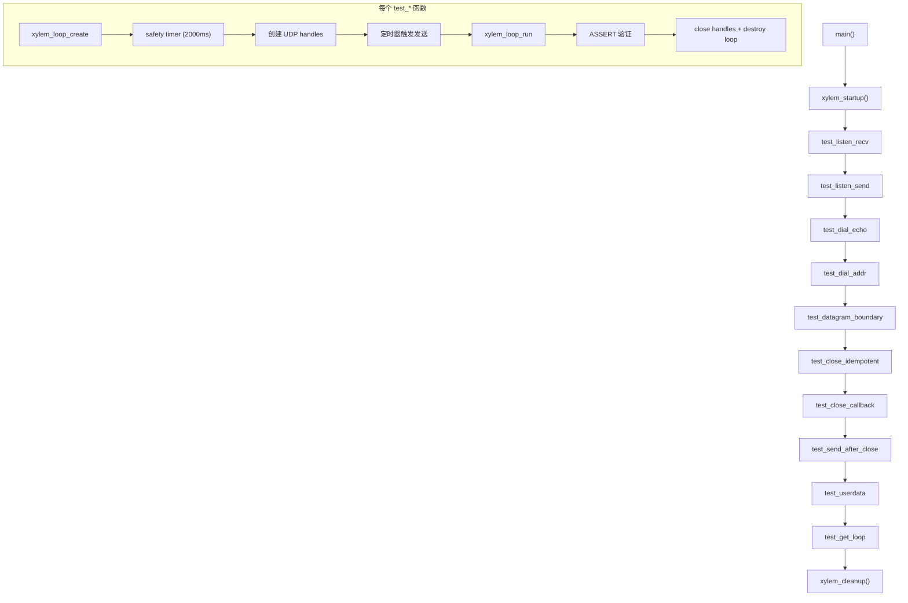

# 设计文档：UDP 模块测试

## 概述

本设计描述 `tests/test-udp.c` 的完整重写方案，为 `xylem-udp` 模块的所有公共 API 提供测试覆盖。测试文件遵循 `docs/style.md` 中定义的项目测试规范，参考 `tests/test-tcp.c` 的成熟模式。

测试覆盖两种 UDP 工作模式：
- **Listen 模式**（未连接）：`xylem_udp_listen` 创建，使用 `recvfrom`/`sendto`
- **Dial 模式**（已连接）：`xylem_udp_dial` 创建，使用 `recv`/`send`

共 10 个测试函数，每个测试一个关注点，加上共享的基础设施（安全定时器、端口分配）。

## 架构



### 测试模式

每个异步测试函数遵循统一模式（源自 test-tcp.c）：

1. `xylem_loop_create()` 创建独立事件循环
2. 创建 2000ms 安全定时器防止永久阻塞
3. 创建 UDP handles 并绑定到唯一端口
4. 通过短延迟定时器（10ms）触发发送操作，确保接收端已注册到事件循环
5. `xylem_loop_run()` 驱动事件循环
6. 在 on_read 回调中将数据复制到文件作用域变量，然后 `xylem_loop_stop()`
7. 循环退出后用 `ASSERT` 验证结果
8. 销毁所有定时器、关闭 UDP handles、销毁事件循环

### 端口分配策略

每个测试函数使用唯一的端口范围，避免测试间冲突。所有地址使用 `127.0.0.1` 回环地址。

| 测试函数 | 端口范围 |
|---------|---------|
| `test_listen_recv` | 19001–19002 |
| `test_listen_send` | 19011–19012 |
| `test_dial_echo` | 19021–19022 |
| `test_dial_addr` | 19031–19032 |
| `test_datagram_boundary` | 19041–19042 |
| `test_close_idempotent` | 19051 |
| `test_close_callback` | 19061 |
| `test_send_after_close` | 19071–19072 |
| `test_userdata` | 19081 |
| `test_get_loop` | 19091 |

端口从 19001 开始，每个测试间隔 10，远离 test-tcp.c 使用的 18080 范围。

## 组件与接口

### 文件结构

单一测试文件 `tests/test-udp.c`，结构如下：

```
license header
#include "xylem.h"
#include "assert.h"
#include <string.h>

// 安全定时器回调（共享）
static void _safety_timeout_cb(...)

// test_listen_recv 的回调和状态变量
static void _listen_recv_on_read(...)
static void _listen_recv_send_timer_cb(...)
static void test_listen_recv(void)

// test_listen_send 的回调和状态变量
...
static void test_listen_send(void)

// ... 其余 8 个测试函数，每个带自己的回调和状态 ...

int main(void) {
    xylem_startup();
    test_listen_recv();
    test_listen_send();
    test_dial_echo();
    test_dial_addr();
    test_datagram_boundary();
    test_close_idempotent();
    test_close_callback();
    test_send_after_close();
    test_userdata();
    test_get_loop();
    xylem_cleanup();
    return 0;
}
```

### 被测 API

| API 函数 | 测试覆盖 |
|---------|---------|
| `xylem_udp_listen` | test_listen_recv, test_listen_send, test_datagram_boundary, test_close_*, test_send_after_close, test_userdata, test_get_loop |
| `xylem_udp_dial` | test_dial_echo, test_dial_addr |
| `xylem_udp_send` | test_listen_recv, test_listen_send, test_dial_echo, test_datagram_boundary, test_send_after_close |
| `xylem_udp_close` | test_close_idempotent, test_close_callback, test_send_after_close |
| `xylem_udp_get_userdata` | test_userdata |
| `xylem_udp_set_userdata` | test_userdata |
| `xylem_udp_get_loop` | test_get_loop |

### 各测试函数设计

#### test_listen_recv（需求 1）

验证 listen 模式接收数据报：on_read 回调交付正确的 data/len 和发送方 addr。

- 接收端：`xylem_udp_listen` 绑定 19001
- 发送端：`xylem_udp_listen` 绑定 19002
- 定时器触发 `xylem_udp_send(sender, &dest, "hello", 5)`
- on_read 回调中：复制 data/len，提取 addr 的 IP 和端口，`xylem_loop_stop`
- 断言：data == "hello"，len == 5，addr 的端口 == 19002，addr 的 IP == 127.0.0.1

#### test_listen_send（需求 2）

验证 listen 模式发送数据报到指定目标。

- A 端：`xylem_udp_listen` 绑定 19011（发送端）
- B 端：`xylem_udp_listen` 绑定 19012（接收端）
- 定时器触发 A 端 `xylem_udp_send(a, &dest_b, "reply", 5)`
- B 端 on_read 回调中验证收到的数据
- 断言：B 端收到 "reply"，len == 5

#### test_dial_echo（需求 3）

验证 dial 模式双向收发。

- 服务端：`xylem_udp_listen` 绑定 19021，on_read 中回送数据到发送方地址
- 客户端：`xylem_udp_dial` 连接到 19021
- 定时器触发客户端 `xylem_udp_send(client, NULL, "ping", 4)`
- 服务端 on_read 收到后通过 `xylem_udp_send(server, addr, "pong", 4)` 回复
- 客户端 on_read 收到回复后 stop
- 断言：服务端收到 "ping"，客户端收到 "pong"

#### test_dial_addr（需求 4）

验证 dial 模式 on_read 中 addr 参数与 dial 目标一致。

- 服务端：`xylem_udp_listen` 绑定 19031
- 客户端：`xylem_udp_dial` 连接到 127.0.0.1:19031
- 服务端收到数据后回复
- 客户端 on_read 中提取 addr 的 IP 和端口
- 断言：addr 的 IP == 127.0.0.1，端口 == 19031

#### test_datagram_boundary（需求 5）

验证连续发送的多个不同大小数据报在接收端被独立交付。

- 接收端：`xylem_udp_listen` 绑定 19041
- 发送端：`xylem_udp_listen` 绑定 19042
- 定时器触发连续发送 "A"(1B)、"BB"(2B)、"CCC"(3B)
- on_read 回调计数并记录每次的 len 和 data
- 收到 3 次后 stop
- 断言：read_count == 3，sizes == {1, 2, 3}，data 内容匹配

#### test_close_idempotent（需求 6）

验证 `xylem_udp_close` 连续调用两次不崩溃。

- `xylem_udp_listen` 绑定 19051
- 连续调用 `xylem_udp_close` 两次
- 运行事件循环让 deferred free 完成
- 断言：程序正常继续（不崩溃即通过）

#### test_close_callback（需求 7）

验证 `xylem_udp_close` 触发 on_close 回调且 err == 0。

- `xylem_udp_listen` 绑定 19061，handler 设置 on_close
- on_close 回调中记录 err 值和调用标志
- 调用 `xylem_udp_close`，然后运行事件循环
- 断言：on_close 被调用，err == 0

#### test_send_after_close（需求 8）

验证关闭后 `xylem_udp_send` 返回 -1。

- 发送端：`xylem_udp_listen` 绑定 19071
- 调用 `xylem_udp_close`
- 调用 `xylem_udp_send` 并记录返回值
- 运行事件循环让 deferred free 完成
- 断言：send 返回值 == -1

#### test_userdata（需求 9）

验证 userdata 存取往返。

- `xylem_udp_listen` 绑定 19081
- `xylem_udp_set_userdata(udp, &value)`
- `xylem_udp_get_userdata(udp)` 获取指针
- 断言：返回指针 == &value，解引用值正确

#### test_get_loop（需求 10）

验证 `xylem_udp_get_loop` 返回创建时传入的 loop。

- 创建 loop
- `xylem_udp_listen` 绑定 19091
- 调用 `xylem_udp_get_loop(udp)`
- 断言：返回值 == loop

## 数据模型

### 文件作用域状态变量

每个异步测试使用独立的文件作用域变量组（遵循现有 test-udp.c 和 test-tcp.c 的模式）。变量按测试函数分组，命名前缀标识所属测试：

```c
/* test_listen_recv 状态 */
static xylem_loop_t* _lr_loop;
static xylem_udp_t*  _lr_receiver;
static xylem_udp_t*  _lr_sender;
static int           _lr_read_called;
static char          _lr_data[64];
static size_t        _lr_data_len;
static uint16_t      _lr_sender_port;
static char          _lr_sender_ip[INET6_ADDRSTRLEN];
```

同步测试（test_close_idempotent、test_userdata、test_get_loop）使用局部变量，无需文件作用域状态。

### 回调签名

所有 on_read 回调遵循 `xylem_udp_handler_t` 定义：

```c
void (*on_read)(xylem_udp_t* udp, void* data, size_t len, xylem_addr_t* addr);
void (*on_close)(xylem_udp_t* udp, int err);
```

定时器回调遵循 `xylem_loop_timer_fn_t`：

```c
void (*cb)(xylem_loop_t* loop, xylem_loop_timer_t* timer, void* ud);
```


## Correctness Properties

*A property is a characteristic or behavior that should hold true across all valid executions of a system — essentially, a formal statement about what the system should do. Properties serve as the bridge between human-readable specifications and machine-verifiable correctness guarantees.*

### Property 1: Listen 模式接收数据完整性与发送方地址

*For any* UDP 数据报通过 listen 模式的 socket 发送到另一个 listen 模式的 socket，on_read 回调交付的 data 和 len 应与发送的内容完全一致，且 addr 参数应包含发送方的正确 IP 地址和端口。

**Validates: Requirements 1.1, 1.2**

### Property 2: Listen 模式发送数据完整性

*For any* 通过 listen 模式 UDP_Handle 的 `xylem_udp_send(udp, dest, data, len)` 发送的数据报，目标端的 on_read 回调应被触发且收到的 data 和 len 与发送的内容一致。

**Validates: Requirements 2.1**

### Property 3: Dial 模式回声往返

*For any* 通过 dial 模式 UDP_Handle 发送的数据报（dest=NULL），listen 模式对端应收到正确数据；当对端回复时，dial 模式端的 on_read 应收到正确的回复数据。

**Validates: Requirements 3.1, 3.2**

### Property 4: 数据报边界保持

*For any* 连续发送的 N 个不同大小的数据报序列，接收端的 on_read 回调应被触发恰好 N 次，每次的 len 和 data 与对应发送的数据报一致。

**Validates: Requirements 5.1, 5.2**

### Property 5: Close 触发 on_close 回调且 err 为 0

*For any* 设置了 on_close 回调的 UDP_Handle，调用 `xylem_udp_close` 应触发 on_close 回调且 err 参数为 0。

**Validates: Requirements 7.1**

### Property 6: Close 后 Send 返回 -1

*For any* 已关闭的 UDP_Handle，调用 `xylem_udp_send` 应返回 -1，无论 data 和 len 的值如何。

**Validates: Requirements 8.1**

### Property 7: Userdata 存取往返

*For any* 指针值，在 UDP_Handle 上调用 `xylem_udp_set_userdata` 后再调用 `xylem_udp_get_userdata`，应返回相同的指针。

**Validates: Requirements 9.1**

### Property 8: Get Loop 返回创建时的 Loop

*For any* 通过 `xylem_udp_listen` 或 `xylem_udp_dial` 创建的 UDP_Handle，`xylem_udp_get_loop` 应返回创建时传入的 loop 句柄。

**Validates: Requirements 10.1**

## 错误处理

### 测试级错误处理

| 场景 | 处理方式 |
|------|---------|
| `xylem_loop_create` 返回 NULL | `ASSERT` 立即终止 |
| `xylem_udp_listen`/`xylem_udp_dial` 返回 NULL | `ASSERT` 立即终止 |
| 安全定时器超时（2000ms） | `xylem_loop_stop` 强制退出，后续 `ASSERT` 检测到未完成的测试条件会失败 |
| `xylem_udp_close` 重复调用 | 依赖实现的 `closing` 幂等标志，第二次调用直接返回 |
| `xylem_udp_send` 在 closing 状态 | 返回 -1，测试验证此返回值 |

### 不测试的错误路径

根据需求文档，不包含 `on_error` 回调的测试。网络错误（如 EAGAIN、EWOULDBLOCK）由实现内部处理，不在测试范围内。

## 测试策略

### 单元测试

本测试文件本身就是单元测试，使用项目自定义 `ASSERT` 宏。10 个测试函数覆盖：

- **数据路径**：listen recv、listen send、dial echo（需求 1–3）
- **地址验证**：listen recv addr、dial addr（需求 1.2、4）
- **协议特性**：datagram boundary（需求 5）
- **生命周期**：close idempotent、close callback、send after close（需求 6–8）
- **访问器**：userdata、get_loop（需求 9–10）

每个测试函数测试一个关注点，遵循 setup → action → assert → cleanup 模式。

### 属性测试

由于本项目是 C 语言项目且使用自定义 ASSERT 框架（无外部测试库），属性测试通过以下方式体现：

- 每个测试函数验证的属性对应上述 Correctness Properties
- 数据报边界测试（Property 4）通过发送多个不同大小的数据报验证边界保持的通用性
- Dial 回声测试（Property 3）验证发送-接收往返的正确性
- Userdata 测试（Property 7）验证 set/get 往返

由于 C 语言生态中缺乏与项目测试框架兼容的属性测试库，且项目规范禁止使用外部测试框架，属性测试的覆盖通过精心选择的具体示例实现。每个测试函数的注释应标注其验证的属性：

```c
/* Feature: udp-test, Property 1: listen recv data integrity and sender addr */
static void test_listen_recv(void) { ... }
```

### 测试配置

- 安全定时器：每个异步测试 2000ms
- 发送延迟定时器：10ms（确保接收端已注册到事件循环）
- 端口范围：19001–19099（每个测试间隔 10）
- 地址：仅使用 127.0.0.1 回环地址
- 构建：通过 `tests/CMakeLists.txt` 中已有的 `xylem_add_test(udp)` 注册
