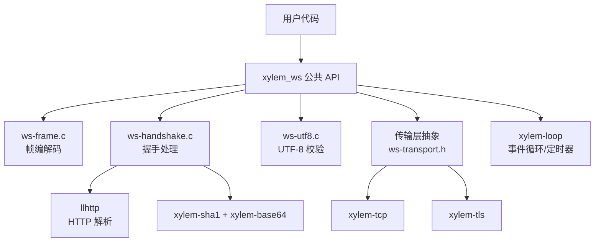
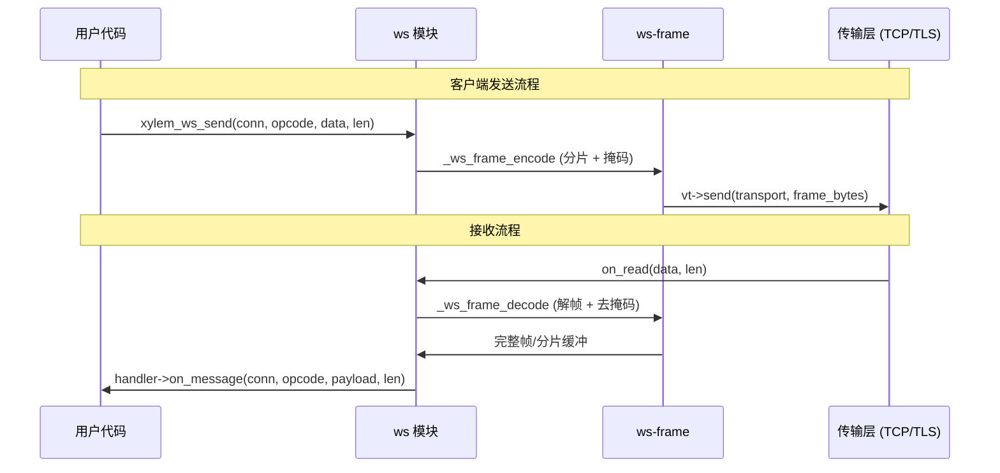
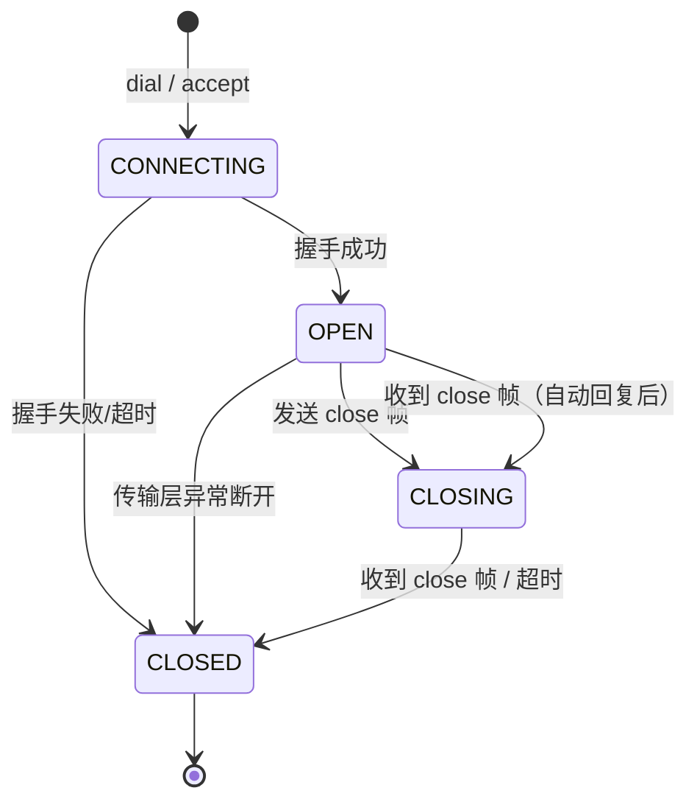
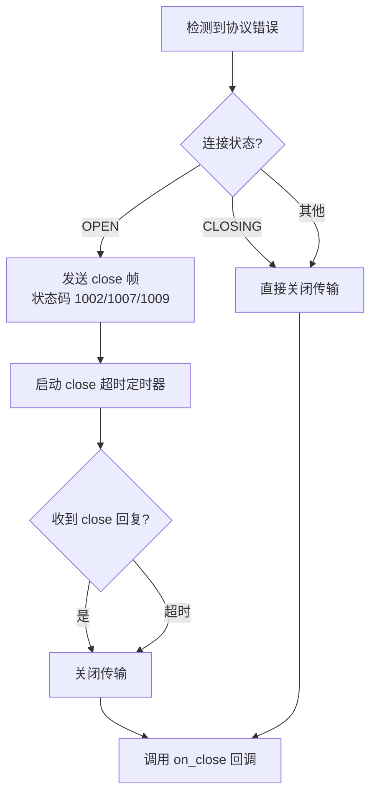

# 设计文档：WebSocket 模块

## 概述

本设计为 Xylem C 库实现 RFC 6455 WebSocket 协议支持。模块提供客户端（`xylem_ws_dial`）和服务端（`xylem_ws_listen`）两种角色，支持 `ws://`（TCP）和 `wss://`（TLS）传输。

WebSocket 模块遵循 Xylem 现有的异步回调驱动架构，复用已有的 TCP、TLS、HTTP（握手解析）、SHA-1、Base64 和事件循环模块。不引入任何外部依赖。

### 关键设计决策

1. **分片透明化**：`xylem_ws_send` 在 payload 超过内部阈值时自动分片，接收端自动重组，用户只看到完整消息。不暴露公共 `send_fragment` API。
2. **无 WS 层背压机制**：TCP 写队列天然排队发送，WS 层不额外提供背压通知。
3. **传输抽象**：复用 HTTP 模块的 `http_transport_vt_t` 虚函数表模式，ws:// 走 TCP，wss:// 走 TLS，公共 API 完全统一。
4. **服务端握手**：WS 服务端不依赖 HTTP 服务端模块，而是内部使用轻量级 HTTP 请求解析器（复用 llhttp）直接处理 Upgrade 请求。

## 架构

### 模块层次



### 数据流



### 文件结构

遵循多文件模块规范（`src/ws/`、`include/xylem/ws/`）：

| 类别 | 文件 | 职责 |
|------|------|------|
| 公共头文件 | `include/xylem/ws/xylem-ws-client.h` | 客户端 API（dial、send、ping、close） |
| 公共头文件 | `include/xylem/ws/xylem-ws-server.h` | 服务端 API（listen、close_server） |
| 公共头文件 | `include/xylem/ws/xylem-ws-common.h` | 共享类型（handler、opts、opcode 枚举） |
| 内部头文件 | `src/ws/ws-frame.h` | 帧编解码函数声明 |
| 内部头文件 | `src/ws/ws-handshake.h` | 握手处理函数声明 |
| 内部头文件 | `src/ws/ws-transport.h` | 传输层虚函数表（复用 HTTP 模式） |
| 内部头文件 | `src/ws/ws-utf8.h` | UTF-8 校验函数声明 |
| 实现文件 | `src/ws/xylem-ws-client.c` | 客户端连接生命周期 |
| 实现文件 | `src/ws/xylem-ws-server.c` | 服务端监听与连接管理 |
| 实现文件 | `src/ws/xylem-ws-common.c` | 共享逻辑（状态码校验等） |
| 实现文件 | `src/ws/ws-frame.c` | 帧编码、解码、掩码 |
| 实现文件 | `src/ws/ws-handshake.c` | 握手请求/响应构建与校验 |
| 实现文件 | `src/ws/ws-transport-tcp.c` | TCP 传输适配 |
| 实现文件 | `src/ws/ws-transport-tls-stub.c` | TLS 禁用时的桩实现 |
| 实现文件 | `src/ws/ws-transport-tls.c` | TLS 传输适配 |
| 实现文件 | `src/ws/ws-utf8.c` | UTF-8 校验实现 |
| 测试文件 | `tests/test-ws.c` | 单元测试 |

## 组件与接口

### 公共 API

#### 共享类型 (`xylem-ws-common.h`)

```c
/* WebSocket opcode 枚举 */
typedef enum xylem_ws_opcode_e {
    XYLEM_WS_OPCODE_TEXT   = 0x1,
    XYLEM_WS_OPCODE_BINARY = 0x2,
    XYLEM_WS_OPCODE_CLOSE  = 0x8,
    XYLEM_WS_OPCODE_PING   = 0x9,
    XYLEM_WS_OPCODE_PONG   = 0xA,
} xylem_ws_opcode_t;

/* WebSocket 连接状态 */
typedef enum xylem_ws_state_e {
    XYLEM_WS_STATE_CONNECTING,
    XYLEM_WS_STATE_OPEN,
    XYLEM_WS_STATE_CLOSING,
    XYLEM_WS_STATE_CLOSED,
} xylem_ws_state_t;

/* 不透明句柄前向声明 */
typedef struct xylem_ws_conn_s   xylem_ws_conn_t;   /* 客户端连接 / 服务端接受的连接 */
typedef struct xylem_ws_server_s xylem_ws_server_t;

/* 回调处理器 */
typedef struct xylem_ws_handler_s {
    void (*on_open)(xylem_ws_conn_t* conn);
    void (*on_accept)(xylem_ws_conn_t* conn);
    void (*on_message)(xylem_ws_conn_t* conn,
                       xylem_ws_opcode_t opcode,
                       const void* data, size_t len);
    void (*on_ping)(xylem_ws_conn_t* conn,
                    const void* data, size_t len);
    void (*on_pong)(xylem_ws_conn_t* conn,
                    const void* data, size_t len);
    void (*on_close)(xylem_ws_conn_t* conn,
                     uint16_t code, const char* reason, size_t reason_len);
} xylem_ws_handler_t;

/* 连接选项 */
typedef struct xylem_ws_opts_s {
    size_t   max_message_size;      /* 最大接收消息大小，0 = 无限制，默认 16 MiB */
    size_t   fragment_threshold;    /* 发送分片阈值，0 = 默认 16 KiB */
    uint64_t handshake_timeout_ms;  /* 握手超时，0 = 默认 10000 ms */
    uint64_t close_timeout_ms;      /* 关闭握手超时，0 = 默认 5000 ms */
} xylem_ws_opts_t;
```

#### 客户端 API (`xylem-ws-client.h`)

```c
extern xylem_ws_conn_t* xylem_ws_dial(xylem_loop_t* loop,
                                      const char* url,
                                      xylem_ws_handler_t* handler,
                                      xylem_ws_opts_t* opts);

extern int xylem_ws_send(xylem_ws_conn_t* conn,
                         xylem_ws_opcode_t opcode,
                         const void* data, size_t len);

extern int xylem_ws_ping(xylem_ws_conn_t* conn,
                         const void* data, size_t len);

extern int xylem_ws_close(xylem_ws_conn_t* conn,
                          uint16_t code, const char* reason, size_t reason_len);

extern void* xylem_ws_get_userdata(xylem_ws_conn_t* conn);
extern void  xylem_ws_set_userdata(xylem_ws_conn_t* conn, void* ud);
```

#### 服务端 API (`xylem-ws-server.h`)

```c
/* 服务端配置 */
typedef struct xylem_ws_srv_cfg_s {
    const char*         host;
    uint16_t            port;
    xylem_ws_handler_t* handler;
    xylem_ws_opts_t*    opts;       /* NULL = 默认值 */
    const char*         tls_cert;   /* PEM 证书路径，NULL = 纯 ws:// */
    const char*         tls_key;    /* PEM 私钥路径，NULL = 纯 ws:// */
} xylem_ws_srv_cfg_t;

extern xylem_ws_server_t* xylem_ws_listen(xylem_loop_t* loop,
                                          const xylem_ws_srv_cfg_t* cfg);

extern void xylem_ws_close_server(xylem_ws_server_t* server);
```

### 内部组件

#### 传输层抽象 (`ws-transport.h`)

复用 HTTP 模块的虚函数表模式，提供统一的 TCP/TLS 操作接口：

```c
typedef struct {
    void (*on_connect)(void* handle, void* ctx);
    void (*on_accept)(void* handle, void* ctx);
    void (*on_read)(void* handle, void* ctx, void* data, size_t len);
    void (*on_write_done)(void* handle, void* ctx,
                          void* data, size_t len, int status);
    void (*on_close)(void* handle, void* ctx, int err);
} ws_transport_cb_t;

typedef struct {
    void* (*dial)(xylem_loop_t* loop, xylem_addr_t* addr,
                  ws_transport_cb_t* cb, void* ctx,
                  xylem_tcp_opts_t* opts);
    void* (*listen)(xylem_loop_t* loop, xylem_addr_t* addr,
                    ws_transport_cb_t* cb, void* ctx,
                    xylem_tcp_opts_t* opts,
                    const char* tls_cert, const char* tls_key);
    int   (*send)(void* handle, const void* data, size_t len);
    void  (*close_conn)(void* handle);
    void  (*close_server)(void* handle);
    void  (*set_userdata)(void* handle, void* ud);
    void* (*get_userdata)(void* handle);
} ws_transport_vt_t;

extern const ws_transport_vt_t* ws_transport_tcp(void);
extern const ws_transport_vt_t* ws_transport_tls(void);
```

#### 帧编解码 (`ws-frame.h`)

```c
/* 帧头解析结果 */
typedef struct {
    bool     fin;
    uint8_t  opcode;
    bool     masked;
    uint64_t payload_len;
    uint8_t  mask_key[4];
    size_t   header_size;   /* 帧头总字节数（2-14） */
} ws_frame_header_t;

/* 解析帧头，返回 0 成功，-1 数据不足，-2 协议错误 */
extern int ws_frame_decode_header(const uint8_t* data, size_t len,
                                  ws_frame_header_t* out);

/* 编码帧头到 buf，返回写入字节数 */
extern size_t ws_frame_encode_header(uint8_t* buf, bool fin,
                                     uint8_t opcode, bool masked,
                                     const uint8_t mask_key[4],
                                     uint64_t payload_len);

/* 原地掩码/去掩码 */
extern void ws_frame_apply_mask(uint8_t* data, size_t len,
                                const uint8_t mask_key[4], size_t offset);
```

#### 握手处理 (`ws-handshake.h`)

```c
/* 生成 16 字节随机 Sec-WebSocket-Key 并 Base64 编码 */
extern int ws_handshake_gen_key(char* out, size_t out_size);

/* 根据 key 计算 Sec-WebSocket-Accept 值 */
extern int ws_handshake_compute_accept(const char* key,
                                       char* out, size_t out_size);

/* 构建客户端 HTTP Upgrade 请求 */
extern char* ws_handshake_build_request(const char* host, uint16_t port,
                                        const char* path, const char* key,
                                        size_t* out_len);

/* 校验服务端 101 响应中的 Accept 值 */
extern int ws_handshake_validate_accept(const char* expected_key,
                                        const char* accept_value);

/* 构建服务端 101 响应 */
extern char* ws_handshake_build_response(const char* accept_value,
                                         size_t* out_len);
```

#### UTF-8 校验 (`ws-utf8.h`)

```c
/* 校验 data 是否为合法 UTF-8，返回 0 合法，-1 非法 */
extern int ws_utf8_validate(const uint8_t* data, size_t len);
```

## 数据模型

### 连接结构 (`xylem_ws_conn_t`)

```c
struct xylem_ws_conn_s {
    /* 传输层 */
    const ws_transport_vt_t* vt;
    void*                    transport;      /* TCP conn 或 TLS handle */
    xylem_loop_t*            loop;

    /* 用户接口 */
    xylem_ws_handler_t*      handler;
    void*                    userdata;

    /* 连接状态 */
    xylem_ws_state_t         state;
    bool                     is_client;      /* true = 客户端, false = 服务端 */

    /* 配置 */
    size_t                   max_message_size;
    size_t                   fragment_threshold;

    /* 接收缓冲 */
    uint8_t*                 recv_buf;       /* 原始字节接收缓冲 */
    size_t                   recv_len;
    size_t                   recv_cap;

    /* 分片重组 */
    uint8_t*                 frag_buf;       /* 分片 payload 累积缓冲 */
    size_t                   frag_len;
    size_t                   frag_cap;
    uint8_t                  frag_opcode;    /* 首帧 opcode */
    bool                     frag_active;    /* 是否正在接收分片消息 */

    /* 握手状态（客户端） */
    char                     handshake_key[32]; /* Base64 编码的 Sec-WebSocket-Key */

    /* 定时器 */
    xylem_loop_timer_t       handshake_timer;
    xylem_loop_timer_t       close_timer;

    /* 关闭状态 */
    uint16_t                 close_code;     /* 发送的 close 状态码 */
    bool                     close_sent;
    bool                     close_received;

    /* 服务端引用（仅服务端接受的连接） */
    xylem_ws_server_t*       server;
};
```

### 服务端结构 (`xylem_ws_server_t`)

```c
struct xylem_ws_server_s {
    xylem_loop_t*            loop;
    const ws_transport_vt_t* vt;
    void*                    listener;       /* TCP/TLS server handle */
    ws_transport_cb_t        transport_cb;
    xylem_ws_handler_t*      handler;
    xylem_ws_opts_t          opts;
    bool                     running;

    /* 握手解析（每个新连接使用独立的 llhttp 实例，存储在连接上） */
};
```

### 帧格式（RFC 6455 §5.2）

```
 0                   1                   2                   3
 0 1 2 3 4 5 6 7 8 9 0 1 2 3 4 5 6 7 8 9 0 1 2 3 4 5 6 7 8 9 0 1
+-+-+-+-+-------+-+-------------+-------------------------------+
|F|R|R|R| opcode|M| Payload len |    Extended payload length    |
|I|S|S|S|  (4)  |A|     (7)     |             (16/64)           |
|N|V|V|V|       |S|             |   (if payload len==126/127)   |
| |1|2|3|       |K|             |                               |
+-+-+-+-+-------+-+-------------+ - - - - - - - - - - - - - - - +
|     Extended payload length continued, if payload len == 127  |
+ - - - - - - - - - - - - - - - +-------------------------------+
|                               |Masking-key, if MASK set to 1  |
+-------------------------------+-------------------------------+
| Masking-key (continued)       |          Payload Data         |
+-------------------------------- - - - - - - - - - - - - - - - +
:                     Payload Data continued ...                :
+ - - - - - - - - - - - - - - - - - - - - - - - - - - - - - - - +
|                     Payload Data (continued)                  |
+---------------------------------------------------------------+
```

帧头大小范围：2-14 字节
- 基础：2 字节（FIN + opcode + MASK + 7-bit length）
- 扩展长度：+2 字节（16-bit）或 +8 字节（64-bit）
- 掩码键：+4 字节（仅客户端发送时）

### 状态机




## 正确性属性（Correctness Properties）

*属性（property）是在系统所有合法执行路径上都应成立的特征或行为——本质上是对系统应做什么的形式化陈述。属性是人类可读规格说明与机器可验证正确性保证之间的桥梁。*

### Property 1: 握手 Accept 值计算往返

*For any* 随机生成的 16 字节 Sec-WebSocket-Key（Base64 编码后），计算 `SHA-1(key + "258EAFA5-E914-47DA-95CA-5AB9DC63B5E0")` 再 Base64 编码得到 accept 值，然后用同一个 key 调用校验函数，校验应通过。

**Validates: Requirements 1.3**

### Property 2: 帧编码/解码往返

*For any* 合法的 opcode（0x1, 0x2）、任意 payload 字节序列（0 到 65536+ 字节，覆盖三种长度编码）、以及任意 mask 标志和 mask key，将其编码为 WebSocket 帧字节流后再解码，应恢复出与原始输入完全相同的 FIN、opcode、mask 标志、payload 长度和 payload 内容。

**Validates: Requirements 3.1, 3.2, 3.5, 3.6, 3.7, 11.1, 11.3**

### Property 3: 掩码对合性（Involution）

*For any* 字节序列和任意 4 字节 mask key，对 payload 执行掩码操作后再以相同 key 执行一次掩码操作，应得到与原始 payload 完全相同的字节。即 `mask(mask(data, key), key) == data`。

**Validates: Requirements 3.3, 4.2, 11.2**

### Property 4: 服务端帧不含掩码

*For any* payload 和 opcode，当连接角色为服务端时，编码产生的帧头中 MASK 位应为 0，且帧头不包含 masking key 字段。

**Validates: Requirements 3.4**

### Property 5: 保留 opcode 拒绝

*For any* opcode 值在保留范围内（3-7 或 0xB-0xF），帧解析器应将其识别为协议错误并返回错误码。

**Validates: Requirements 4.5**

### Property 6: 分片往返

*For any* payload 字节序列和分片阈值 T，将 payload 通过发送端分片逻辑拆分为帧序列后，再通过接收端重组逻辑还原，应得到与原始 payload 完全相同的字节序列和原始 opcode。当 payload 长度 <= T 时应产生单帧（FIN=1），当 payload 长度 > T 时应产生多帧（首帧 FIN=0 + 续帧 + 末帧 FIN=1）。

**Validates: Requirements 5.1, 5.2, 5.3**

### Property 7: Pong 回显 Ping payload

*For any* 长度在 0-125 字节范围内的 ping payload，自动生成的 pong 帧应包含与 ping 完全相同的 payload 字节。

**Validates: Requirements 6.2**

### Property 8: Close 帧编码

*For any* 合法的 close 状态码（1000-1003, 1007-1011, 3000-4999）和长度在 0-123 字节范围内的 reason 字符串，编码产生的 close 帧 payload 应以 2 字节网络字节序状态码开头，后跟 reason 字符串原始字节。

**Validates: Requirements 7.1**

### Property 9: Userdata 往返

*For any* 指针值，对连接句柄调用 `xylem_ws_set_userdata` 后立即调用 `xylem_ws_get_userdata`，应返回相同的指针值。

**Validates: Requirements 10.2**

### Property 10: UTF-8 校验正确性

*For any* 字节序列，UTF-8 校验函数的结果应与参考实现一致：合法的 UTF-8 序列返回通过，包含非法字节、截断的多字节序列、overlong 编码或超出 U+10FFFF 的码点的序列返回失败。

**Validates: Requirements 13.1**

### Property 11: 超大消息拒绝

*For any* 配置的 max_message_size M（M > 0），当接收到的单帧 payload 长度或分片累积长度超过 M 时，模块应拒绝该消息（不分配完整 payload 缓冲区）。

**Validates: Requirements 14.2, 14.3**

### Property 12: 保留 Close 状态码拒绝（接收端）

*For any* close 帧中的状态码落在保留范围（0-999, 1004-1006, 1015, 1016-2999）内，模块应将其视为协议错误。

**Validates: Requirements 15.2**

### Property 13: 非法 Close 状态码拒绝（发送端）

*For any* 状态码不在合法应用范围（1000-1003, 1007-1011, 3000-4999）内，`xylem_ws_close` 应返回错误码而不发送 close 帧。

**Validates: Requirements 15.3**

### Property 14: 握手请求包含必需头部

*For any* 合法的 host、port 和 path 组合，客户端生成的 HTTP Upgrade 请求应包含以下头部：`Upgrade: websocket`、`Connection: Upgrade`、`Sec-WebSocket-Version: 13`，以及一个 Base64 编码的 `Sec-WebSocket-Key`（解码后恰好 16 字节）。

**Validates: Requirements 1.1**

## 错误处理

### 错误分类

| 类别 | 处理方式 | 示例 |
|------|----------|------|
| 协议错误 | 发送 close 帧（状态码 1002）后关闭传输 | 保留 opcode、未掩码的客户端帧、分片中插入数据帧 |
| 数据错误 | 发送 close 帧（状态码 1007）后关闭传输 | text 帧 UTF-8 校验失败、close reason UTF-8 校验失败 |
| 消息过大 | 发送 close 帧（状态码 1009）后关闭传输 | 单帧或累积分片超过 max_message_size |
| 握手失败 | 关闭底层传输，调用 on_close | 非 101 响应、Accept 值不匹配、缺少必需头部 |
| 超时 | 关闭底层传输，调用 on_close | 握手超时、关闭握手超时 |
| 异常断开 | 调用 on_close（状态码 1006） | 传输层 EOF 或错误，无 close 帧 |
| 参数错误 | 返回错误码（-1），不改变连接状态 | ping payload > 125 字节、非法 close 状态码 |

### 错误码约定

- 公共 API 函数返回 `int`：0 = 成功，-1 = 错误
- `xylem_ws_send` 返回 0 = 成功，-1 = 错误
- `xylem_ws_dial` 和 `xylem_ws_listen` 返回句柄指针或 NULL

### Close 状态码校验规则

```
合法发送范围：1000-1003, 1007-1011, 3000-4999
保留范围（接收时拒绝）：0-999, 1004-1006, 1015, 1016-2999
特殊处理：
  - close payload = 0 字节 → 合法，on_close 报告 1005
  - close payload = 1 字节 → 协议错误 1002
  - close payload >= 2 字节 → 解析状态码 + reason
```

### 协议错误处理流程



## 测试策略

### 双轨测试方法

本模块采用单元测试与属性测试相结合的策略：

- **单元测试**：验证具体示例、边界条件和错误路径
- **属性测试**：验证在所有合法输入上成立的通用属性

两者互补：单元测试捕获具体 bug，属性测试通过随机化输入验证通用正确性。

### 属性测试库

使用 [theft](https://github.com/silentbicycle/theft)（C 语言属性测试库），无外部依赖，纯 C 实现，适合 Xylem 的零依赖约束。

每个属性测试配置最少 100 次迭代。

每个属性测试必须以注释标注对应的设计属性：
```c
/* Feature: websocket, Property 2: 帧编码/解码往返 */
```

每个正确性属性由一个属性测试实现。

### 单元测试覆盖

| 测试类别 | 覆盖内容 |
|----------|----------|
| 握手构建 | 请求/响应格式、Accept 计算、缺少头部的 400 响应、版本错误的 426 响应 |
| 帧编码 | 三种长度编码边界（125/126/65535/65536）、掩码/无掩码 |
| 帧解码 | 不完整帧头、保留 opcode、控制帧 payload > 125、控制帧 FIN=0 |
| 分片 | 阈值边界、分片重组、分片中插入控制帧、分片中插入数据帧（错误） |
| Ping/Pong | 正常 ping、payload > 125 拒绝、自动 pong 回复 |
| Close | 合法/非法状态码、空 payload、1 字节 payload、reason UTF-8 校验 |
| UTF-8 | 合法序列、非法首字节、截断序列、overlong、代理对、BOM |
| 传输选择 | ws:// → TCP、wss:// → TLS、wss:// 无 TLS → NULL |
| 资源管理 | close 后释放、close_server 不影响现有连接 |

### 测试文件

所有测试位于 `tests/test-ws.c`，遵循项目测试规范：
- 使用 `tests/assert.h` 中的 `ASSERT` 宏
- 每个 `test_*` 函数测试一个关注点
- `main()` 顺序调用所有测试函数
- 通过 `xylem_add_test(ws)` 注册到 CMake
