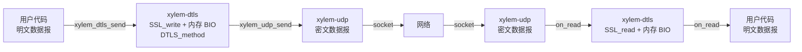
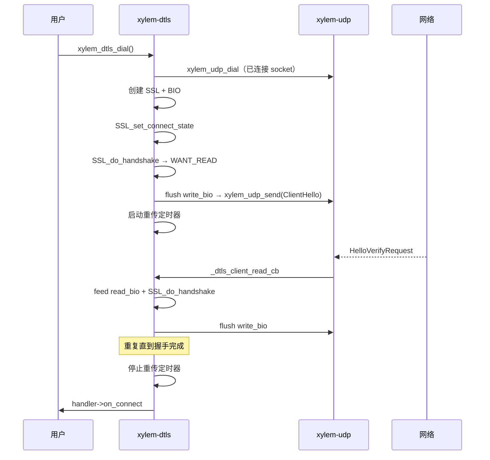
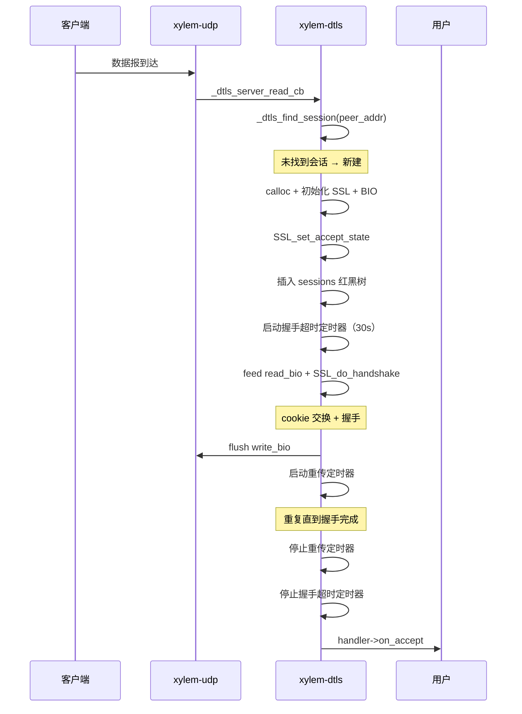
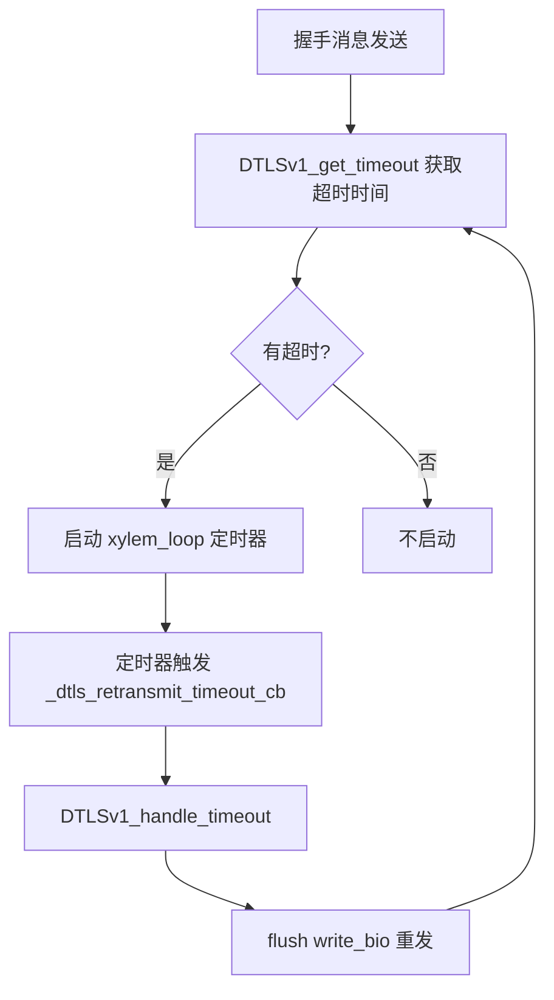
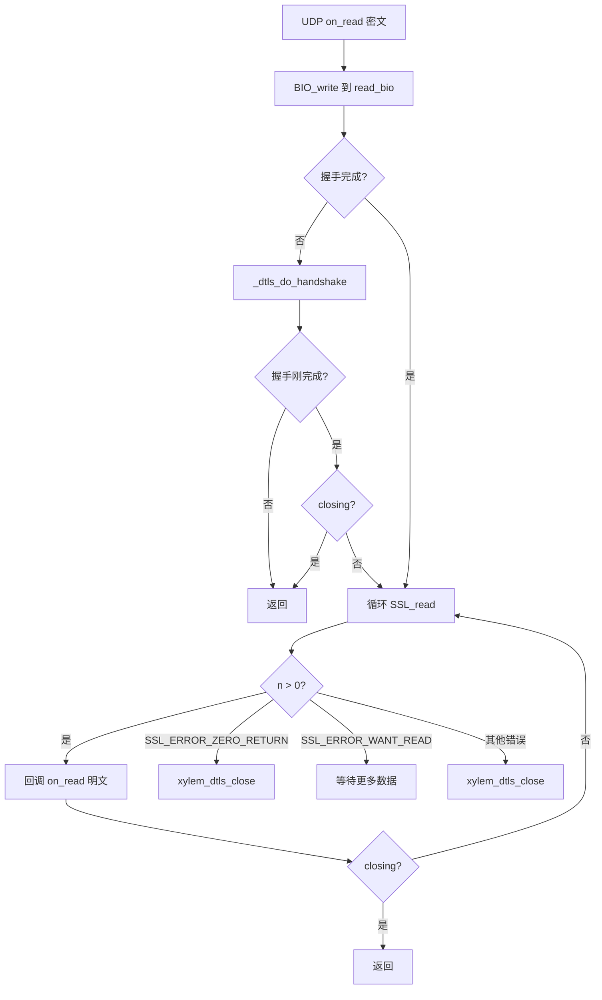

# DTLS 模块设计文档

## 概述

`xylem-dtls` 在 UDP 模块之上提供 DTLS 加密数据报传输。与 TLS 模块设计对称：OpenSSL 通过内存 BIO 与传输层解耦，使用 `DTLS_method()`。服务端在单个 UDP socket 上通过对端地址多路复用多个 DTLS 会话。

## 架构



分层数据流：

```
发送: 用户 → xylem_dtls_send(明文) → SSL_write → write_bio → BIO_read → xylem_udp_send(密文) → 网络
接收: 网络 → UDP on_read(密文) → BIO_write(read_bio) → SSL_read → DTLS on_read(明文) → 用户
```

## 公开类型

### 回调处理器

```c
typedef struct xylem_dtls_handler_s {
    void (*on_connect)(xylem_dtls_t* dtls);
    void (*on_accept)(xylem_dtls_server_t* server, xylem_dtls_t* dtls);
    void (*on_read)(xylem_dtls_t* dtls, void* data, size_t len);
    void (*on_close)(xylem_dtls_t* dtls, int err, const char* errmsg);
} xylem_dtls_handler_t;
```

- `on_accept`：服务端握手完成时触发，`server` 为接受该会话的 DTLS 服务器句柄，`dtls` 为新建的会话句柄。签名与 TLS handler 的 `on_accept` 对称
- `on_close`：会话关闭时触发。正常关闭（用户调用 `xylem_dtls_close` 或对端 close_notify）时 `err=0`、`errmsg=NULL`。当关闭由 SSL 错误触发时，`err` 为 OpenSSL 错误码，`errmsg` 为可读错误描述字符串。当客户端会话因 UDP 层传输错误关闭（如 `ECONNREFUSED`）且 DTLS 层未设置自身错误时，`err` 和 `errmsg` 从 UDP 层传播

与 TLS handler 的区别：
- 无 `on_timeout` 和 `on_heartbeat_miss`（DTLS 自行管理重传定时器）
- 无 `on_write_done`（`xylem_dtls_send` 是同步的，`SSL_write` + flush 在调用中完成，无需异步通知）

### 不透明类型

```c
typedef struct xylem_dtls_s        xylem_dtls_t;
typedef struct xylem_dtls_ctx_s    xylem_dtls_ctx_t;
typedef struct xylem_dtls_server_s xylem_dtls_server_t;
```

## 内部结构

### DTLS 上下文

```c
struct xylem_dtls_ctx_s {
    SSL_CTX* ssl_ctx;        /* 使用 DTLS_method() */
    uint8_t* alpn_wire;      /* ALPN 协议列表（wire 格式） */
    size_t   alpn_wire_len;
    FILE*    keylog_file;
    uint8_t  cookie_secret[32]; /* HMAC-SHA256 密钥，CSPRNG 生成 */
};
```

创建时自动配置：
- `SSL_VERIFY_PEER` 默认启用
- 使用 `RAND_bytes` 生成 32 字节 HMAC 密钥（`cookie_secret`），若 CSPRNG 失败则 `ctx_create` 返回 NULL
- Cookie 生成回调（`_dtls_cookie_generate_cb`）：以 `cookie_secret` 为密钥，对端地址（`sockaddr_in` 或 `sockaddr_in6`）为消息，计算 HMAC-SHA256，生成 32 字节 cookie
- Cookie 验证回调（`_dtls_cookie_verify_cb`）：重新计算 HMAC-SHA256 并与收到的 cookie 进行常量时间比较（`CRYPTO_memcmp`），验证 cookie 确实由本服务端为该对端地址签发

### DTLS 会话

```c
struct xylem_dtls_s {
    SSL*                   ssl;
    BIO*                   read_bio;
    BIO*                   write_bio;
    xylem_udp_t*           udp;            /* 底层 UDP 句柄 */
    xylem_dtls_ctx_t*      ctx;
    xylem_dtls_handler_t*  handler;
    xylem_dtls_server_t*   server;         /* 服务端会话非 NULL */
    xylem_addr_t           peer_addr;      /* 对端地址 */
    void*                  userdata;
    bool                   handshake_done;
    bool                   closing;
    int                    close_err;
    const char*            close_errmsg;
    xylem_loop_t*          loop;
    xylem_loop_timer_t*    retransmit_timer;  /* DTLS 重传定时器 */
    xylem_loop_timer_t*    handshake_timer;   /* 服务端握手超时定时器 */
    xylem_rbtree_node_t    server_node;       /* 服务器会话红黑树节点 */
};
```

### DTLS 服务器

```c
struct xylem_dtls_server_s {
    xylem_udp_t*           udp;       /* 共享的 UDP socket */
    xylem_dtls_ctx_t*      ctx;
    xylem_dtls_handler_t*  handler;
    xylem_loop_t*          loop;
    xylem_rbtree_t         sessions;  /* 活跃会话红黑树，按对端地址排序 */
    void*                  userdata;
    bool                   closing;
};
```

## 上下文管理

与 TLS 上下文 API 对称：

| API | 功能 |
|-----|------|
| `xylem_dtls_ctx_create()` | 创建上下文，使用 `DTLS_method()`，生成 HMAC 密钥（CSPRNG），配置 cookie 回调 |
| `xylem_dtls_ctx_destroy()` | 释放 SSL_CTX、关闭 keylog 文件、释放 ALPN 数据 |
| `xylem_dtls_ctx_load_cert()` | 加载 PEM 证书链和私钥 |
| `xylem_dtls_ctx_set_ca()` | 设置 CA 证书 |
| `xylem_dtls_ctx_set_verify()` | 启用/禁用对端验证 |
| `xylem_dtls_ctx_set_alpn()` | 设置 ALPN 协议列表 |
| `xylem_dtls_ctx_set_keylog()` | 启用 NSS Key Log 输出 |

## Cookie 机制

DTLS 使用 cookie 交换防止地址伪造的 DoS 攻击。cookie 基于 HMAC-SHA256 绑定到对端地址，确保只有能在声称地址上接收数据的客户端才能完成握手：

- `cookie_secret`：32 字节密钥，在 `xylem_dtls_ctx_create` 中通过 `RAND_bytes`（CSPRNG）生成，若生成失败则 `ctx_create` 返回 NULL
- `_dtls_cookie_generate_cb`：以 `cookie_secret` 为密钥，对端 `sockaddr`（通过 `SSL_get_ex_data` 恢复的 `xylem_addr_t`）为消息，调用 `xylem_hmac256_compute` 生成 32 字节 HMAC-SHA256 cookie
- `_dtls_cookie_verify_cb`：重新计算 HMAC-SHA256，使用 `CRYPTO_memcmp` 常量时间比较，验证 cookie 长度为 32 且内容匹配

对端地址通过 `SSL_set_ex_data` / `SSL_get_ex_data`（`_dtls_peer_addr_idx`）在 SSL 对象上传递给回调。

## 握手流程

### 客户端握手



### 服务端握手



服务端收到数据报时，先通过 `_dtls_find_session` 按对端地址查找已有会话。若找到则直接处理；若未找到则创建新会话并开始握手。

## 对端地址匹配

`_dtls_addr_cmp` 比较两个 `xylem_addr_t`，返回负/零/正（类似 `memcmp`）：

1. 比较地址族（`ss_family`）
2. IPv4：比较 `sin_port`（网络序转主机序），再比较 4 字节 `sin_addr`
3. IPv6：比较 `sin6_port`（网络序转主机序），再比较 16 字节 `sin6_addr`

会话存储在红黑树中，使用两个比较器：
- `_dtls_session_cmp_nn`：节点-节点比较器，用于插入
- `_dtls_session_cmp_kn`：键（`xylem_addr_t*`）-节点比较器，用于查找

`_dtls_find_session` 调用 `xylem_rbtree_find` 按对端地址在红黑树中 O(log n) 查找。

## 重传定时器

DTLS 在不可靠传输上需要自行处理丢包重传：



- `_dtls_arm_retransmit`：查询 `DTLSv1_get_timeout`，将 `timeval` 转为毫秒，启动事件循环定时器
- `_dtls_retransmit_timeout_cb`：调用 `DTLSv1_handle_timeout` 触发 OpenSSL 内部重传，然后 flush write BIO
- `_dtls_stop_retransmit`：握手完成或关闭时停止定时器

超时值最小为 1ms（防止 0ms 导致的忙循环）。

## 握手超时

服务端为每个新建会话启动一个 30 秒（`DTLS_HANDSHAKE_TIMEOUT_MS`）的一次性定时器。若会话在此窗口内未完成握手，`_dtls_handshake_timeout_cb` 自动调用 `xylem_dtls_close` 关闭会话，防止废弃或恶意 ClientHello 导致的资源耗尽。

握手成功后（`_dtls_do_handshake` 中 `rc == 1`），定时器被停止。关闭路径（`xylem_dtls_close`）和延迟释放（`_dtls_free_cb`）中也会停止并销毁该定时器。

客户端不使用握手超时定时器（`handshake_timer` 为 NULL）。

## 数据路径

### 读取路径

客户端（`_dtls_client_read_cb`）在握手完成后、进入 SSL_read 循环前检查 `closing` 标志。服务端（`_dtls_server_read_cb`）在已有会话的握手刚完成后同样检查 `closing`，防止 `on_accept` 回调中触发关闭后继续读取已释放的 SSL 状态。两条路径的 SSL_read 循环逻辑相同：



### 握手失败错误传播

`_dtls_do_handshake` 在握手失败时（既非成功也非 WANT_READ/WANT_WRITE）将 SSL 错误码和错误描述保存到 `close_err` 和 `close_errmsg`，然后 flush 待发送的 alert 并调用 `xylem_dtls_close`。这确保用户在 `on_close` 回调中能看到具体的握手失败原因（如证书验证失败、协议不匹配等），而非默认的零值。SSL_read 路径中的错误同样遵循此模式，将错误码和描述保存后再关闭会话。

### 写入路径

```c
int xylem_dtls_send(xylem_dtls_t* dtls, const void* data, size_t len);
```

1. 检查握手已完成且未关闭
2. `SSL_write` 加密数据到 write BIO
3. `_dtls_flush_write_bio`：循环 `BIO_read` → `xylem_udp_send`

与 TLS 相同，内存 BIO 保证 `SSL_write` 一次完成。发送是同步的，无 `on_write_done` 回调。

## 关闭流程

### 客户端关闭

```mermaid
sequenceDiagram
    participant User as 用户
    participant DTLS as xylem-dtls
    participant UDP as xylem-udp
    participant Loop as 事件循环

    User->>DTLS: xylem_dtls_close()
    Note over DTLS: closing = true（幂等）
    DTLS->>DTLS: 停止重传定时器
    DTLS->>DTLS: SSL_shutdown + flush write_bio
    DTLS->>UDP: xylem_udp_close()
    UDP->>DTLS: _dtls_client_close_cb
    DTLS->>DTLS: closing = true + 停止定时器（防御性）
    DTLS->>DTLS: 传播 UDP 层错误（若 DTLS 未设置自身错误）
    DTLS->>DTLS: SSL_free
    DTLS->>User: handler->on_close(close_err, close_errmsg)
    DTLS->>Loop: xylem_loop_post(_dtls_free_cb)
    Loop->>DTLS: 下一轮迭代释放内存
```

客户端拥有独立的 UDP socket，关闭时一并关闭。`_dtls_client_close_cb` 在 UDP `on_close` 中触发，首先设置 `closing = true` 并停止 `retransmit_timer` 和 `handshake_timer`（防止定时器在 SSL 已释放后触发）。接着检查 UDP 层是否携带了非零错误码：若 DTLS 层尚未设置自身的 `close_err`（即 `close_err == 0`），则将 UDP 层的 `err` 和 `errmsg` 传播到 DTLS 会话的 `close_err`/`close_errmsg`，确保用户在 `on_close` 回调中能看到底层传输错误（如 `ECONNREFUSED`）。然后释放 SSL 会话并通知用户。在 Linux/macOS 上，已连接 UDP socket 可能因 ICMP port unreachable 收到 `ECONNREFUSED`，导致 `_dtls_client_close_cb` 在任何定时器触发之前被调用，因此需要在此处主动停止定时器。

### 服务端会话关闭

服务端会话共享同一个 UDP socket，关闭时：
1. 停止重传定时器和握手超时定时器
2. `SSL_shutdown` + flush
3. 从 server 的 sessions 红黑树移除
4. `SSL_free`
5. 回调 `on_close`
6. `xylem_loop_post` 延迟释放内存

UDP socket 不关闭（由 server 管理）。

### 服务器关闭

```c
void xylem_dtls_close_server(xylem_dtls_server_t* server);
```

1. 设置 `closing = true`（幂等）
2. 循环取红黑树首节点（`xylem_rbtree_first`），逐个调用 `xylem_dtls_close`（每次 close 会从树中移除节点）
3. 关闭共享的 UDP socket（`_dtls_server_close_cb` 释放 server 内存）

## 与 TLS 模块的关键差异

| 特性 | TLS | DTLS |
|------|-----|------|
| 传输层 | TCP（字节流） | UDP（数据报） |
| OpenSSL 方法 | `TLS_method()` | `DTLS_method()` |
| 帧处理 | TCP 层帧解析 | 不需要（数据报保留边界） |
| 重传 | TCP 保证可靠传输 | DTLS 自行管理重传定时器 |
| Cookie 验证 | 无 | `cookie_generate_cb` + `cookie_verify_cb` |
| 会话管理 | 侵入式链表 | 红黑树（按对端地址排序，O(log n) 查找） |
| 服务端多路复用 | 每连接独立 TCP socket | 单 UDP socket 按对端地址分发 |
| 连接超时/心跳 | TCP 层定时器透传 | 握手超时定时器（30s）+ 重传定时器 |
| SNI | 支持 | 不支持 |
| server userdata | `xylem_tls_server_get/set_userdata` | `xylem_dtls_server_get/set_userdata` |

## 公开 API

### 上下文

```c
xylem_dtls_ctx_t* xylem_dtls_ctx_create(void);
void              xylem_dtls_ctx_destroy(xylem_dtls_ctx_t* ctx);
int               xylem_dtls_ctx_load_cert(xylem_dtls_ctx_t* ctx,
                                            const char* cert, const char* key);
int               xylem_dtls_ctx_set_ca(xylem_dtls_ctx_t* ctx,
                                         const char* ca_file);
void              xylem_dtls_ctx_set_verify(xylem_dtls_ctx_t* ctx, bool enable);
int               xylem_dtls_ctx_set_alpn(xylem_dtls_ctx_t* ctx,
                                           const char** protocols, size_t count);
int               xylem_dtls_ctx_set_keylog(xylem_dtls_ctx_t* ctx,
                                             const char* path);
```

### 会话

```c
xylem_dtls_t*       xylem_dtls_dial(xylem_loop_t* loop, xylem_addr_t* addr,
                                     xylem_dtls_ctx_t* ctx,
                                     xylem_dtls_handler_t* handler);
int                 xylem_dtls_send(xylem_dtls_t* dtls,
                                     const void* data, size_t len);
void                xylem_dtls_close(xylem_dtls_t* dtls);
const char*         xylem_dtls_get_alpn(xylem_dtls_t* dtls);
const xylem_addr_t* xylem_dtls_get_peer_addr(xylem_dtls_t* dtls);
xylem_loop_t*       xylem_dtls_get_loop(xylem_dtls_t* dtls);
void*               xylem_dtls_get_userdata(xylem_dtls_t* dtls);
void                xylem_dtls_set_userdata(xylem_dtls_t* dtls, void* ud);
```

### 服务器

```c
xylem_dtls_server_t* xylem_dtls_listen(xylem_loop_t* loop, xylem_addr_t* addr,
                                        xylem_dtls_ctx_t* ctx,
                                        xylem_dtls_handler_t* handler);
void                 xylem_dtls_close_server(xylem_dtls_server_t* server);
void*                xylem_dtls_server_get_userdata(xylem_dtls_server_t* server);
void                 xylem_dtls_server_set_userdata(xylem_dtls_server_t* server,
                                                     void* ud);
```
