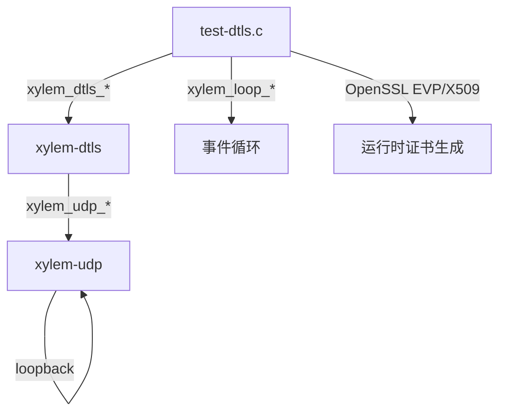

# DTLS 模块测试设计文档

## 概述

`tests/test-dtls.c` 包含 16 个测试函数，覆盖 `src/xylem-dtls.c` 的所有公共 API 和 DTLS 特有的内部分支。

DTLS 模块构建在 UDP 之上，以下 UDP 层功能已由 `test-udp.c` 覆盖，不在本测试中重复：
- UDP listen/dial 基本收发
- UDP 数据报边界保持

设计风格与 `test-tls.c` 对称：统一 `_test_ctx_t` 上下文结构体、`_gen_self_signed` 辅助函数、Safety Timer 防挂起。与 TLS 测试的关键差异：
- 无 `on_write_done` 测试（DTLS send 是同步的）
- 无 SNI 测试（DTLS 不支持 SNI）
- 无超时/心跳透传测试（DTLS 自行管理重传定时器，无 TCP 层定时器）
- 无 `server_userdata` 测试（DTLS server userdata 访问器已存在，但当前测试未覆盖）

## 架构



每个异步测试的执行流程：

```mermaid
sequenceDiagram
    participant Test as test_xxx()
    participant Loop as Event Loop
    participant Safety as Safety Timer

    Test->>Loop: 创建 loop + safety timer (10s)
    Test->>Loop: 创建 server + client
    Test->>Loop: xylem_loop_run()
    Loop->>Loop: 握手 + 数据交换 + 关闭
    alt 正常完成
        Loop->>Test: xylem_loop_stop()
    else 超时
        Safety->>Loop: xylem_loop_stop()
    end
    Test->>Test: ASSERT 验证 + 资源清理
```

## 组件与接口

### 测试基础设施

- 统一上下文结构 `_test_ctx_t`，所有测试共用，按需使用字段
- 共享回调：`_dtls_srv_accept_cb`（保存会话句柄 + 设置 userdata）、`_dtls_srv_read_echo_cb`（回显）
- 每个测试独立创建 Loop + 10 秒 Safety Timer，测试间无共享状态
- 单一端口 `DTLS_PORT 15433`，测试顺序执行不冲突
- `_gen_self_signed` 辅助函数：运行时生成 RSA 2048 自签名证书，测试结束后 `remove` 清理
- 无文件作用域可变变量，所有状态通过 `_test_ctx_t` 和 userdata 传递
- `main` 函数首尾调用 `xylem_startup` 和 `xylem_cleanup`

### 被测公共 API

| API 函数 | 类别 |
|---------|------|
| `xylem_dtls_ctx_create` | 上下文管理 |
| `xylem_dtls_ctx_destroy` | 上下文管理 |
| `xylem_dtls_ctx_load_cert` | 上下文管理 |
| `xylem_dtls_ctx_set_ca` | 上下文管理 |
| `xylem_dtls_ctx_set_verify` | 上下文管理 |
| `xylem_dtls_ctx_set_alpn` | 上下文管理 |
| `xylem_dtls_ctx_set_keylog` | 上下文管理 |
| `xylem_dtls_dial` | 会话 |
| `xylem_dtls_send` | 会话 |
| `xylem_dtls_close` | 会话 |
| `xylem_dtls_get_alpn` | 会话 |
| `xylem_dtls_get_peer_addr` | 会话 |
| `xylem_dtls_get_loop` | 会话 |
| `xylem_dtls_get_userdata` | 会话 |
| `xylem_dtls_set_userdata` | 会话 |
| `xylem_dtls_listen` | 服务器 |
| `xylem_dtls_close_server` | 服务器 |


## 数据模型

### 统一上下文结构体

```c
typedef struct {
    xylem_loop_t*          loop;
    xylem_dtls_server_t*   dtls_server;
    xylem_dtls_conn_t*          srv_session;    /* 服务端接受的会话 */
    xylem_dtls_conn_t*          cli_session;    /* 客户端会话 */
    xylem_dtls_ctx_t*      srv_ctx;
    xylem_dtls_ctx_t*      cli_ctx;
    int                    accept_called;
    int                    connect_called;
    int                    close_called;
    int                    read_count;
    int                    verified;
    int                    value;
    int                    send_result;
    char                   received[256];
    size_t                 received_len;
    xylem_thrdpool_t*      pool;           /* 跨线程测试用线程池 */
    xylem_loop_timer_t*    close_timer;    /* 跨线程测试用关闭定时器 */
    xylem_loop_timer_t*    check_timer;    /* 跨线程测试用检查定时器 */
    _Atomic bool           closed;         /* 跨线程测试用关闭标志 */
    _Atomic bool           worker_done;    /* 跨线程测试用工作线程完成标志 */
} _test_ctx_t;
```

字段说明：
- `loop`：当前测试的事件循环
- `dtls_server`：DTLS 服务器句柄
- `srv_session` / `cli_session`：服务端/客户端 DTLS 会话句柄
- `srv_ctx` / `cli_ctx`：服务端/客户端 DTLS 上下文
- `accept_called` / `connect_called` / `close_called`：回调触发计数
- `read_count`：on_read 触发次数
- `verified`：通用验证标志
- `value`：userdata 测试用整数值
- `send_result`：send 返回值记录
- `received` / `received_len`：接收数据缓冲区
- `pool`：跨线程测试用线程池
- `close_timer` / `check_timer`：跨线程测试用定时器
- `closed` / `worker_done`：跨线程测试用原子标志（协调工作线程与事件循环线程）

### 测试列表

#### 上下文管理 API（6 个）

| 测试函数 | 覆盖的功能 | 验证点 |
|---------|-----------|--------|
| `test_ctx_create_destroy` | ctx_create + ctx_destroy | 返回非 NULL，销毁不崩溃 |
| `test_load_cert_valid` | ctx_load_cert 成功路径 | 自签名证书加载返回 0 |
| `test_load_cert_invalid` | ctx_load_cert 失败路径 | 不存在的文件返回 -1 |
| `test_set_ca` | ctx_set_ca | 有效 CA 文件返回 0 |
| `test_set_verify` | ctx_set_verify | 启用/禁用均不崩溃 |
| `test_set_alpn` | ctx_set_alpn | 设置协议列表返回 0 |

#### 握手与数据传输（2 个）

| 测试函数 | 覆盖的功能 | 验证点 |
|---------|-----------|--------|
| `test_handshake_and_echo` | 完整握手 + echo | accept/connect/read/close 全触发，数据 "hello" 往返一致 |
| `test_handshake_failure_wrong_ca` | 证书验证失败 | 客户端启用验证 + 错误 CA → on_close 触发 |

#### ALPN 协商（1 个）

| 测试函数 | 覆盖的功能 | 验证点 |
|---------|-----------|--------|
| `test_alpn_negotiation` | ALPN 端到端协商 | 双方设置 ALPN，握手后 `xylem_dtls_get_alpn` 返回 "h2" |

#### 会话 Userdata（1 个）

| 测试函数 | 覆盖的功能 | 验证点 |
|---------|-----------|--------|
| `test_session_userdata` | set/get_userdata | set/get 往返一致（value=42）|

#### 关闭行为（2 个）

| 测试函数 | 覆盖的功能 | 验证点 |
|---------|-----------|--------|
| `test_send_after_close` | close 后 send | `xylem_dtls_send` 返回 -1（closing 标志检查）|
| `test_close_server_with_active_session` | close_server 带活跃会话 | 定时器触发关闭，活跃会话的 on_close 被触发 |

#### Keylog（1 个）

| 测试函数 | 覆盖的功能 | 验证点 |
|---------|-----------|--------|
| `test_keylog_write` | ctx_set_keylog + 握手 | keylog 文件非空（fseek/ftell 验证 sz > 0）|

#### 跨线程操作（3 个）

| 测试函数 | 覆盖的功能 | 验证点 |
|---------|-----------|--------|
| `test_cross_thread_send` | 跨线程 xylem_dtls_send + acquire/release | on_connect 中 acquire，工作线程发送 "hello" 后 release，客户端收到回显数据一致，received_len==5 |
| `test_cross_thread_close` | 跨线程 xylem_dtls_close + acquire/release | on_connect 中 acquire，工作线程调用 close 后 release，on_close 回调触发，close_called==1 |
| `test_cross_thread_send_stop_on_close` | 跨线程持续 send + 服务端关闭会话 + acquire/release | on_connect 中 acquire，工作线程循环 send（每次间隔 1ms），50ms 后服务端关闭会话，on_close 触发后 send 停止（atomic closed 标志），worker release，worker_done==true |

### 覆盖的公共 API 映射

| API 函数 | 覆盖的测试 |
|---------|-----------|
| `xylem_dtls_ctx_create` | 全部 16 个 |
| `xylem_dtls_ctx_destroy` | 全部 16 个 |
| `xylem_dtls_ctx_load_cert` | test_load_cert_valid, test_load_cert_invalid + 所有异步测试 |
| `xylem_dtls_ctx_set_ca` | test_set_ca, test_handshake_failure_wrong_ca |
| `xylem_dtls_ctx_set_verify` | test_set_verify + 所有异步测试 |
| `xylem_dtls_ctx_set_alpn` | test_set_alpn, test_alpn_negotiation |
| `xylem_dtls_ctx_set_keylog` | test_keylog_write |
| `xylem_dtls_dial` | 所有异步测试（10 个） |
| `xylem_dtls_send` | test_handshake_and_echo, test_send_after_close, test_cross_thread_send, test_cross_thread_send_stop_on_close |
| `xylem_dtls_close` | 所有异步测试 |
| `xylem_dtls_get_alpn` | test_alpn_negotiation |
| `xylem_dtls_get_userdata` | test_session_userdata + 所有回调中通过 userdata 获取 ctx |
| `xylem_dtls_set_userdata` | test_session_userdata + 所有异步测试的 setup |
| `xylem_dtls_listen` | 所有异步测试（10 个） |
| `xylem_dtls_close_server` | test_close_server_with_active_session + 所有异步测试的清理路径 |
| `xylem_dtls_conn_acquire` | test_cross_thread_send, test_cross_thread_close, test_cross_thread_send_stop_on_close |
| `xylem_dtls_conn_release` | test_cross_thread_send, test_cross_thread_close, test_cross_thread_send_stop_on_close |

### 覆盖的内部分支

| 内部函数/路径 | 覆盖的分支 | 触发测试 |
|-------------|-----------|---------|
| `_dtls_client_read_cb` | 握手阶段：feed read_bio + do_handshake | `test_handshake_and_echo` |
| `_dtls_client_read_cb` | 数据阶段：SSL_read 循环 + on_read | `test_handshake_and_echo` |
| `_dtls_client_read_cb` | SSL_ERROR_ZERO_RETURN：对端 close_notify | `test_handshake_and_echo` |
| `_dtls_client_read_cb` | closing 检查：on_read 中触发 close 后退出循环 | `test_handshake_and_echo` |
| `_dtls_server_read_cb` | 新会话：calloc + init SSL + set_accept_state + 插入红黑树 | `test_handshake_and_echo` |
| `_dtls_server_read_cb` | 已有会话：find_session + feed + SSL_read | `test_handshake_and_echo`（数据阶段）|
| `_dtls_server_read_cb` | 已有会话握手刚完成后 closing 检查：跳过 SSL_read | （未覆盖：需要 on_accept 中触发 close 后同一数据报仍有后续数据）|
| `_dtls_server_read_cb` | closing 检查：server.closing 提前返回 | `test_close_server_with_active_session` |
| `_dtls_do_handshake` | 成功路径：rc==1，触发 on_accept/on_connect | `test_handshake_and_echo` |
| `_dtls_do_handshake` | WANT_READ/WANT_WRITE：flush + arm retransmit | `test_handshake_and_echo`（多轮握手）|
| `_dtls_do_handshake` | 失败路径：flush alert + close | `test_handshake_failure_wrong_ca` |
| `_dtls_init_ssl` | 正常路径：创建 SSL + BIO | `test_handshake_and_echo` |
| `_dtls_flush_write_bio` | BIO_read → xylem_udp_send 循环 | `test_handshake_and_echo` |
| `_dtls_feed_read_bio` | BIO_write 到 read_bio | `test_handshake_and_echo` |
| `_dtls_arm_retransmit` | 启动重传定时器 | `test_handshake_and_echo`（握手阶段）|
| `_dtls_stop_retransmit` | 停止重传定时器 | `test_handshake_and_echo`（握手完成）|
| `_dtls_find_session` | 红黑树查找命中 | `test_handshake_and_echo`（数据阶段）|
| `_dtls_find_session` | 红黑树查找未命中 | `test_handshake_and_echo`（首次握手）|
| `_dtls_addr_cmp` | IPv4 地址比较 | 所有异步测试 |
| `_dtls_client_close_cb` | SSL_free + on_close + loop_post | `test_handshake_and_echo` |
| `_dtls_client_close_cb` | UDP 错误传播：close_err==0 且 err!=0 时传播 | （未覆盖：回环测试中 UDP 层通常不携带非零错误码）|
| `_dtls_free_cb` | 延迟释放 dtls + destroy retransmit_timer | 所有异步测试 |
| `_dtls_server_close_cb` | 释放 server 内存 | 所有异步测试 |
| `xylem_dtls_send` | 正常路径：SSL_write + flush | `test_handshake_and_echo` |
| `xylem_dtls_send` | 失败路径：closing==true 返回 -1 | `test_send_after_close` |
| `xylem_dtls_send` | 失败路径：handshake_done==false 返回 -1 | （隐式：send_after_close 中 closing 先于 handshake 检查）|
| `xylem_dtls_close` | 客户端路径：stop retransmit + SSL_shutdown + flush + udp_close | `test_handshake_and_echo` |
| `xylem_dtls_close` | 服务端路径：erase from rbtree + SSL_free + on_close + loop_post | `test_close_server_with_active_session` |
| `xylem_dtls_close` | 幂等：closing==true 提前返回 | `test_send_after_close` |
| `xylem_dtls_close_server` | 遍历红黑树 + 逐个 close + udp_close | `test_close_server_with_active_session` |
| `xylem_dtls_close_server` | 幂等：closing==true 提前返回 | （隐式：close_server 在清理路径中可能被重复调用）|
| `_dtls_alpn_select_cb` | 协商成功 | `test_alpn_negotiation` |
| `_dtls_keylog_cb` | keylog 写入 | `test_keylog_write` |
| `xylem_dtls_ctx_set_keylog` | 启用 | `test_keylog_write` |
| `_dtls_cookie_generate_cb` | 生成 16 字节随机 cookie | 所有异步测试（服务端握手）|
| `_dtls_cookie_verify_cb` | 接受所有 cookie | 所有异步测试（服务端握手）|
| `xylem_dtls_send`（跨线程） | 非事件循环线程调用 → `_dtls_deferred_send_cb` 转发到事件循环线程加密并发送 | `test_cross_thread_send` |
| `xylem_dtls_conn_acquire` / `xylem_dtls_conn_release` | on_connect 中 acquire 递增引用计数，工作线程完成后 release 递减引用计数 | `test_cross_thread_send`, `test_cross_thread_close`, `test_cross_thread_send_stop_on_close` |
| `xylem_dtls_close`（跨线程） | 非事件循环线程调用 → `_dtls_deferred_close_cb` 转发到事件循环线程执行 | `test_cross_thread_close` |
| `xylem_dtls_send`（跨线程 + 连接关闭） | 工作线程持续 send，连接关闭后 atomic closing 检查拒绝发送 | `test_cross_thread_send_stop_on_close` |

### 未覆盖的路径

| 路径 | 原因 |
|------|------|
| `_dtls_server_read_cb` 已有会话握手刚完成后 closing 检查 | 需要 on_accept 回调中触发 close，且同一数据报触发握手完成后仍有后续读取，在回环测试中难以可靠构造 |
| `on_close` 携带非零错误码路径 | 需要触发 SSL 操作错误或 UDP 传输错误（如 ECONNREFUSED），在回环测试中难以可靠复现 |
| `_dtls_retransmit_timeout_cb` 实际触发 | 回环网络无丢包，重传定时器在握手完成前不会触发 |
| `_dtls_init_ssl` 失败路径（BIO/SSL 分配失败）| 需要 mock OpenSSL 内存分配，不实际 |
| `xylem_dtls_dial` 失败路径（udp_dial 失败）| 需要端口耗尽等极端条件 |
| `xylem_dtls_listen` 失败路径（udp_listen 失败）| 需要端口占用等极端条件 |
| IPv6 地址 | 所有测试使用 127.0.0.1 回环地址 |


## 正确性属性

*属性是在系统所有有效执行中都应成立的特征或行为——本质上是关于系统应该做什么的形式化陈述。属性是人类可读规范与机器可验证正确性保证之间的桥梁。*

### Property 1: DTLS 数据回显往返一致

*对于任意*非空明文数据报，通过 DTLS 会话发送到回显服务端后，客户端收到的数据应与发送的数据完全一致（内容相同、长度相同）。

**Validates: Requirements 3.3**

### Property 2: Userdata 指针往返一致

*对于任意*指针值，通过 `xylem_dtls_set_userdata` 设置后，`xylem_dtls_get_userdata` 应返回相同的指针。

**Validates: Requirements 5.1**

## 错误处理

### 测试级错误处理

| 错误场景 | 处理方式 |
|---------|---------|
| Safety Timer 超时（10s） | `xylem_loop_stop` 强制退出事件循环，后续 ASSERT 失败 |
| `_gen_self_signed` 失败 | ASSERT 立即终止测试 |
| `xylem_dtls_ctx_create` 返回 NULL | ASSERT 立即终止测试 |
| `xylem_dtls_listen` 返回 NULL | ASSERT 立即终止测试 |
| `xylem_dtls_dial` 返回 NULL | ASSERT 立即终止测试 |

### 被测代码错误路径

| 错误路径 | 覆盖测试 | 预期行为 |
|---------|---------|---------|
| `ctx_load_cert` 文件不存在 | `test_load_cert_invalid` | 返回 -1 |
| `dtls_send` 在 closing 状态 | `test_send_after_close` | 返回 -1 |
| 握手失败（错误 CA） | `test_handshake_failure_wrong_ca` | `on_close` 触发 |

## 测试策略

### 双重测试方法

本测试文件采用单元测试为主的策略：

- **单元测试**：验证每个公共 API 的具体行为、边界条件和错误路径
- **属性测试**：验证数据回显往返一致性和 userdata 指针往返一致性

由于 DTLS 测试涉及异步事件循环、OpenSSL 握手和网络 I/O，属性测试的输入生成受限于需要完整的握手流程。因此单元测试承担主要覆盖职责，属性测试聚焦于可参数化的数据路径。

### 属性测试配置

- 属性测试库：由于项目使用纯 C 且无外部测试框架，属性测试通过循环随机输入实现（参考项目 `ASSERT` 宏风格）
- 每个属性测试最少 100 次迭代
- 每个属性测试必须以注释引用设计文档中的属性编号
- 标签格式：`/* Feature: dtls-test, Property 1: DTLS echo round trip */`

### 单元测试覆盖

单元测试覆盖以下类别：

| 类别 | 测试数量 | 覆盖范围 |
|------|---------|---------|
| 上下文管理 API | 6 | create/destroy、load_cert 成功/失败、set_ca、set_verify、set_alpn |
| 握手与数据传输 | 2 | 完整握手回显、握手失败（错误 CA） |
| ALPN 协商 | 1 | 端到端 ALPN 协商验证 |
| 会话 Userdata | 1 | set/get 往返一致 |
| 关闭行为 | 2 | close 后 send、close_server 带活跃会话 |
| Keylog | 1 | keylog 文件写入验证 |
| 跨线程操作 | 3 | 跨线程 send、跨线程 close、跨线程持续 send + 对端关闭 |

### 与 TLS 测试的差异

| TLS 测试有但 DTLS 测试无 | 原因 |
|-------------------------|------|
| `test_sni_hostname` | DTLS 不支持 SNI |
| `test_server_userdata` | DTLS server userdata 访问器已存在，但当前测试未覆盖 |
| `test_read_timeout` | DTLS 无 TCP 层超时透传 |
| `test_heartbeat_miss` | DTLS 无 TCP 层心跳透传 |
| `on_write_done` 验证 | DTLS send 是同步的，无 on_write_done 回调 |
