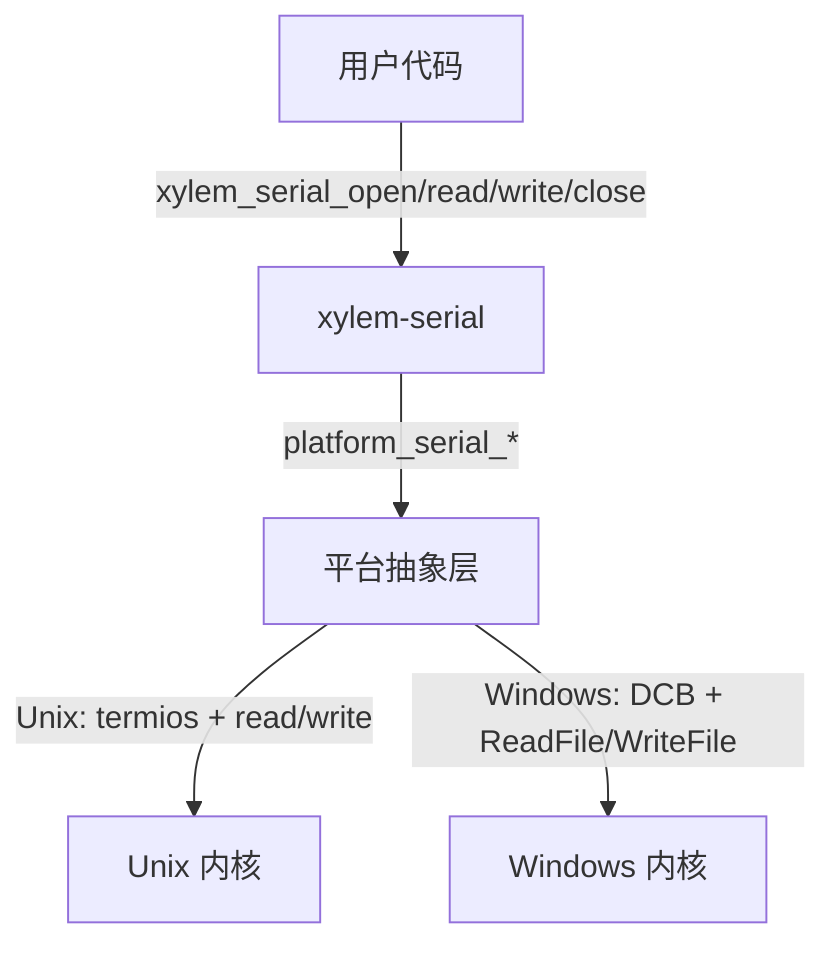

# Serial 模块设计文档

## 概述

`xylem-serial` 提供跨平台的同步串口通信接口，支持 Windows（`CreateFileA` + `DCB`）和 Unix（`termios`）。设计极简——无事件循环集成、无异步回调、无内部缓冲区，所有 I/O 均为阻塞式。适用于嵌入式设备调试、传感器数据采集等低吞吐量场景。

## 架构



核心设计原则：
- 所有操作均为同步阻塞
- 上层负责参数校验和枚举到原始值的映射，平台层只处理 OS 调用
- 关闭后立即释放内存，调用者负责不重复关闭（无幂等保护）
- NULL 安全（`close(NULL)` 不崩溃，`read/write(NULL, ...)` 返回 -1）

## 公开类型

### 枚举类型

```c
typedef enum xylem_serial_baudrate_e {
    XYLEM_SERIAL_BAUDRATE_9600,
    XYLEM_SERIAL_BAUDRATE_19200,
    XYLEM_SERIAL_BAUDRATE_38400,
    XYLEM_SERIAL_BAUDRATE_57600,
    XYLEM_SERIAL_BAUDRATE_115200,
} xylem_serial_baudrate_t;

typedef enum xylem_serial_parity_e {
    XYLEM_SERIAL_PARITY_NONE,
    XYLEM_SERIAL_PARITY_ODD,
    XYLEM_SERIAL_PARITY_EVEN,
} xylem_serial_parity_t;

typedef enum xylem_serial_databits_e {
    XYLEM_SERIAL_DATABITS_7,
    XYLEM_SERIAL_DATABITS_8,
} xylem_serial_databits_t;

typedef enum xylem_serial_stopbits_e {
    XYLEM_SERIAL_STOPBITS_1,
    XYLEM_SERIAL_STOPBITS_2,
} xylem_serial_stopbits_t;

typedef enum xylem_serial_flowcontrol_e {
    XYLEM_SERIAL_FLOW_NONE,
    XYLEM_SERIAL_FLOW_HARDWARE,
} xylem_serial_flowcontrol_t;
```

### 配置结构

```c
typedef struct xylem_serial_opts_s {
    const char*                  device;       /* 设备路径 ("COM3", "/dev/ttyUSB0") */
    xylem_serial_baudrate_t      baudrate;     /* 波特率 */
    xylem_serial_parity_t        parity;       /* 校验模式 */
    xylem_serial_databits_t      databits;     /* 数据位 */
    xylem_serial_stopbits_t      stopbits;     /* 停止位 */
    xylem_serial_flowcontrol_t   flowcontrol;  /* 流控，默认 NONE */
    uint32_t                     timeout_ms;   /* 读超时，0 = 阻塞 */
} xylem_serial_opts_t;
```

### 不透明类型

```c
typedef struct xylem_serial_s xylem_serial_t;
```

## 内部结构

```c
struct xylem_serial_s {
    platform_serial_t fd;      /* 平台句柄（Unix: int, Windows: HANDLE） */
};
```

## 参数校验

`xylem_serial_open` 在调用平台层之前执行完整的参数校验：

| 检查项 | 失败行为 |
|--------|---------|
| `opts == NULL` | 返回 NULL |
| `opts->device == NULL` | 返回 NULL |
| `baudrate > XYLEM_SERIAL_BAUDRATE_115200` | 返回 NULL |
| `parity > XYLEM_SERIAL_PARITY_EVEN` | 返回 NULL |
| `databits > XYLEM_SERIAL_DATABITS_8` | 返回 NULL |
| `stopbits > XYLEM_SERIAL_STOPBITS_2` | 返回 NULL |
| `flowcontrol > XYLEM_SERIAL_FLOW_HARDWARE` | 返回 NULL |

所有校验失败均通过 `xylem_loge` 记录日志。

## 枚举映射

上层使用类型安全的枚举，通过静态查找表映射到平台层的原始整数值：

```c
static const uint32_t _serial_baudrate_map[] = {
    [XYLEM_SERIAL_BAUDRATE_9600]   = 9600,
    [XYLEM_SERIAL_BAUDRATE_19200]  = 19200,
    [XYLEM_SERIAL_BAUDRATE_38400]  = 38400,
    [XYLEM_SERIAL_BAUDRATE_57600]  = 57600,
    [XYLEM_SERIAL_BAUDRATE_115200] = 115200,
};
```

数据位和停止位通过条件表达式映射到 `PLATFORM_SERIAL_DATABITS_*` / `PLATFORM_SERIAL_STOPBITS_*` 常量。校验模式和流控的枚举值与平台常量数值一致，直接强转。

## 平台抽象层

### 平台配置结构

```c
typedef struct platform_serial_config_s {
    const char* device;
    uint32_t    baudrate;     /* 原始波特率数值 */
    uint8_t     databits;     /* 7 或 8 */
    uint8_t     stopbits;     /* 1 或 2 */
    uint8_t     parity;       /* 0=NONE, 1=ODD, 2=EVEN */
    uint8_t     flowcontrol;  /* 0=NONE, 1=HARDWARE */
    uint32_t    timeout_ms;
} platform_serial_config_t;
```

### Unix 实现

- `open(device, O_RDWR | O_NOCTTY)` 打开设备
- 通过 `termios` 配置：
  - `cfsetispeed` / `cfsetospeed` 设置波特率（`B9600` ~ `B115200`）
  - `CSIZE` 掩码 + `CS7`/`CS8` 设置数据位
  - `CSTOPB` 标志设置停止位
  - `PARENB` + `PARODD` 组合设置校验
  - `CRTSCTS` 标志设置硬件流控
  - `CLOCAL | CREAD` 始终启用
- 超时配置：
  - `timeout_ms > 0`：`VMIN=0, VTIME=ceil(timeout_ms/100)`（最小 1，最大 255，单位 1/10 秒）
  - `timeout_ms == 0`：`VMIN=1, VTIME=0`（阻塞直到至少 1 字节到达）
- `tcflush(TCIOFLUSH)` 清空缓冲区后 `tcsetattr(TCSANOW)` 立即生效
- 读取循环处理 `EINTR`
- 写入循环处理 `EINTR` 和部分写入

### Windows 实现

- `CreateFileA(device, GENERIC_READ | GENERIC_WRITE, ...)` 打开设备
- 通过 `DCB` 结构配置：
  - `BaudRate` 直接使用原始数值
  - `ByteSize` 直接使用 7 或 8
  - `StopBits`：`ONESTOPBIT` / `TWOSTOPBITS`
  - `Parity`：`NOPARITY` / `ODDPARITY` / `EVENPARITY`（奇偶校验时 `fParity=TRUE`）
  - 硬件流控：`fOutxCtsFlow=TRUE` + `fRtsControl=RTS_CONTROL_HANDSHAKE`
  - 无流控：`fRtsControl=RTS_CONTROL_ENABLE`（断言 RTS 信号，许多设备需要 RTS 才能通信）
  - `fBinary=TRUE` 始终启用
  - `fDtrControl=DTR_CONTROL_ENABLE` 始终启用（断言 DTR 信号，许多设备需要 DTR 才能通信）
- 超时配置（`COMMTIMEOUTS`）：
  - `timeout_ms > 0`：`ReadIntervalTimeout=100`（字节间间隔 100ms，匹配 Unix VTIME 粒度），`ReadTotalTimeoutMultiplier=0, ReadTotalTimeoutConstant=timeout_ms`（总超时上限）
  - `timeout_ms == 0`：`ReadIntervalTimeout=MAXDWORD, ReadTotalTimeoutMultiplier=MAXDWORD, ReadTotalTimeoutConstant=MAXDWORD-1`（阻塞直到至少 1 字节到达）
- 写入循环处理部分写入

### 超时语义

两个平台的字节间间隔超时已对齐到 100ms（Unix `VTIME` 的最小粒度）：

| 场景 | Unix | Windows |
|------|------|---------|
| 有超时 | `VTIME = ceil(timeout_ms / 100)`，字节间间隔 100ms 粒度 | `ReadIntervalTimeout=100`（字节间间隔 100ms），`ReadTotalTimeoutConstant=timeout_ms`（总超时上限） |
| 最大超时 | `VTIME=255` → 25500ms | `ReadTotalTimeoutConstant` 无上限限制 |
| 无超时 | `VMIN=1` 阻塞等待 | `MAXDWORD` 组合阻塞等待 |
| 超时无数据 | `read` 返回 0 | `ReadFile` 返回 TRUE，`bytes_read=0` |

字节间间隔行为一致：收到首字节后，若 100ms 内无后续字节则立即返回已读数据。

## 公开 API

```c
/* 打开串口，返回句柄或 NULL */
xylem_serial_t* xylem_serial_open(xylem_serial_opts_t* opts);

/* 关闭串口，NULL 安全。关闭后句柄不可再使用。 */
void xylem_serial_close(xylem_serial_t* serial);

/* 阻塞读取，返回字节数、0（超时）或 -1（错误） */
int xylem_serial_read(xylem_serial_t* serial, void* buf, size_t len);

/* 阻塞写入全部数据，返回字节数或 -1（错误） */
int xylem_serial_write(xylem_serial_t* serial, const void* buf, size_t len);
```

### 返回值语义

| API | 成功 | 超时 | 错误 |
|-----|------|------|------|
| `open` | 非 NULL 句柄 | — | NULL |
| `close` | void | — | void |
| `read` | > 0（字节数） | 0 | -1 |
| `write` | len（全部写入） | — | -1 |

## 与其他模块的关系

Serial 模块是独立的，不依赖事件循环（`xylem-loop`）或网络模块。但仍需要 `xylem_startup()` / `xylem_cleanup()` 进行全局初始化（Windows 平台需要 Winsock 初始化）。
