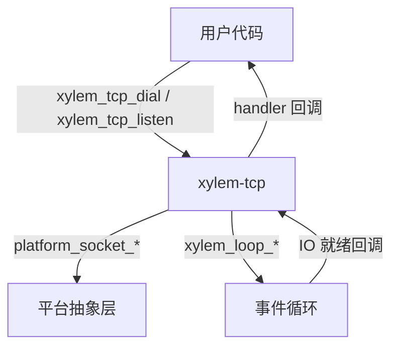
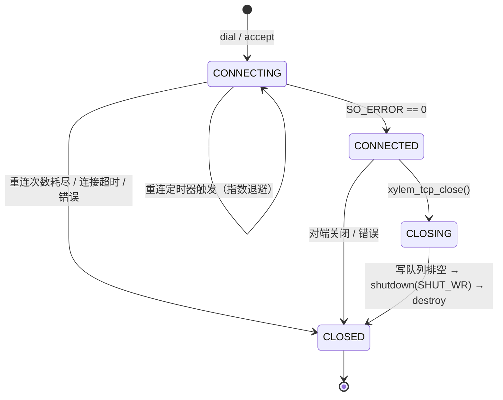
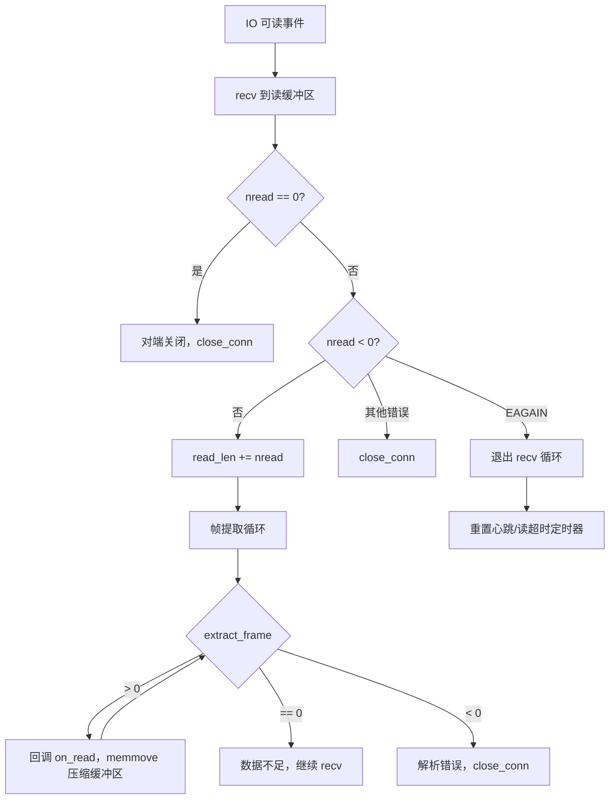
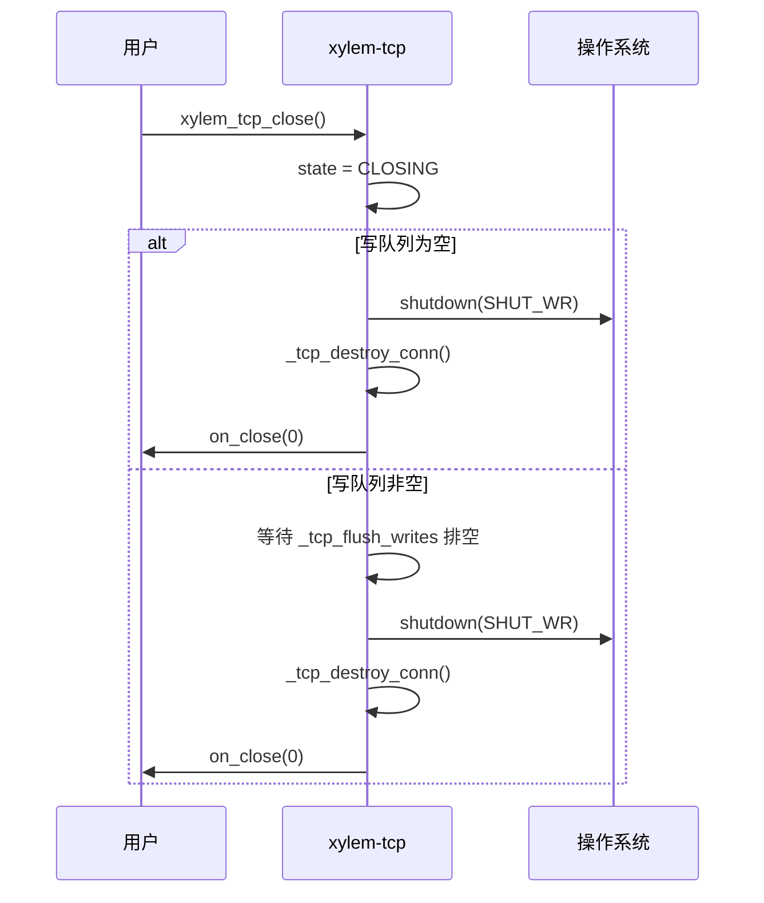

# TCP 模块设计文档

## 概述

`xylem-tcp` 是基于事件循环的非阻塞 TCP 模块，通过回调处理器（handler）驱动所有 I/O 事件。支持客户端拨号（dial）和服务端监听（listen）两种模式，内置帧解析、超时管理、心跳检测和自动重连机制。

## 架构



核心设计原则：
- 所有 socket 操作均为非阻塞
- 数据通过写队列异步发送，支持部分写入（partial write）
- 读取数据经帧解析器提取完整帧后才回调用户
- 连接生命周期通过状态机管理

## 公开类型

### 枚举类型

```c
typedef enum xylem_tcp_framing_type_e {
    XYLEM_TCP_FRAME_NONE,    /* 无帧，原始字节流 */
    XYLEM_TCP_FRAME_FIXED,   /* 固定长度帧 */
    XYLEM_TCP_FRAME_LENGTH,  /* 长度前缀帧 */
    XYLEM_TCP_FRAME_DELIM,   /* 分隔符帧 */
    XYLEM_TCP_FRAME_CUSTOM,  /* 自定义解析 */
} xylem_tcp_framing_type_t;

typedef enum xylem_tcp_timeout_type_e {
    XYLEM_TCP_TIMEOUT_READ,
    XYLEM_TCP_TIMEOUT_WRITE,
    XYLEM_TCP_TIMEOUT_CONNECT,
} xylem_tcp_timeout_type_t;

typedef enum xylem_tcp_length_coding_e {
    XYLEM_TCP_LENGTH_FIXEDINT,  /* 固定整数，支持大端/小端 */
    XYLEM_TCP_LENGTH_VARINT,    /* 变长整数编码 */
} xylem_tcp_length_coding_t;
```

### 帧配置

```c
typedef struct xylem_tcp_framing_s {
    xylem_tcp_framing_type_t type;
    union {
        struct { size_t frame_size; }                          fixed;
        struct {
            uint32_t                  header_size;
            uint32_t                  field_offset;
            uint32_t                  field_size;
            int32_t                   adjustment;
            xylem_tcp_length_coding_t coding;
            bool                      field_big_endian;
        } length;
        struct { const char* delim; size_t delim_len; }        delim;
        struct { int (*parse)(const void* data, size_t len); } custom;
    };
} xylem_tcp_framing_t;
```

### 回调处理器

```c
typedef struct xylem_tcp_handler_s {
    void (*on_connect)(xylem_tcp_conn_t* conn);
    void (*on_accept)(xylem_tcp_server_t* server, xylem_tcp_conn_t* conn);
    void (*on_read)(xylem_tcp_conn_t* conn, void* data, size_t len);
    void (*on_write_done)(xylem_tcp_conn_t* conn,
                          void* data, size_t len, int status);
    void (*on_timeout)(xylem_tcp_conn_t* conn,
                       xylem_tcp_timeout_type_t type);
    void (*on_close)(xylem_tcp_conn_t* conn, int err);
    void (*on_heartbeat_miss)(xylem_tcp_conn_t* conn);
} xylem_tcp_handler_t;
```

### 连接选项

```c
typedef struct xylem_tcp_opts_s {
    xylem_tcp_framing_t framing;
    uint64_t connect_timeout_ms;
    uint64_t read_timeout_ms;
    uint64_t write_timeout_ms;
    uint64_t heartbeat_ms;
    uint32_t reconnect_max;
    size_t   read_buf_size;       /* 默认 65536 */
} xylem_tcp_opts_t;
```

### 不透明类型

```c
typedef struct xylem_tcp_conn_s   xylem_tcp_conn_t;   /* 连接句柄 */
typedef struct xylem_tcp_server_s xylem_tcp_server_t;  /* 服务器句柄 */
```

## 内部结构

### 写请求节点

```c
typedef struct _tcp_write_req_s {
    xylem_queue_node_t node;    /* 队列节点，嵌入写队列 */
    void*              data;    /* 数据指针（紧跟结构体分配） */
    size_t             len;     /* 总长度 */
    size_t             offset;  /* 已发送偏移量（支持部分写入） */
} _tcp_write_req_t;
```

### 拨号私有状态

仅为出站连接（dial）分配，持有重连所需的全部状态：

```c
typedef struct _tcp_dial_priv_s {
    xylem_loop_timer_t*   connect_timer;     /* 连接超时定时器 */
    xylem_loop_timer_t*   reconnect_timer;   /* 重连定时器 */
    xylem_addr_t          peer_addr;         /* 目标地址 */
    uint32_t              reconnect_count;   /* 已重连次数 */
    xylem_tcp_conn_t*     conn;              /* 反向引用 */
    xylem_loop_timer_fn_t reconnect_cb;      /* 重连回调 */
    char                  host[INET6_ADDRSTRLEN];
    char                  port_str[8];
} _tcp_dial_priv_t;
```

### 连接结构

```c
struct xylem_tcp_conn_s {
    xylem_loop_t*         loop;
    xylem_loop_io_t*      io;
    platform_sock_t       fd;
    xylem_tcp_handler_t*  handler;
    xylem_tcp_opts_t      opts;
    tcp_state_t           state;           /* 状态机 */
    uint8_t*              read_buf;        /* 读缓冲区 */
    size_t                read_len;        /* 已读字节数 */
    size_t                read_cap;        /* 缓冲区容量 */
    xylem_queue_t         write_queue;     /* 写请求队列 */
    xylem_loop_timer_t*   read_timer;
    xylem_loop_timer_t*   write_timer;
    xylem_loop_timer_t*   heartbeat_timer;
    _tcp_dial_priv_t*     dial;            /* 仅 dial 连接有值 */
    xylem_list_node_t     server_node;     /* 服务器连接链表节点 */
    xylem_tcp_server_t*   server;          /* 所属服务器（accept 连接） */
    xylem_addr_t          peer_addr;
    void*                 userdata;
};
```

### 服务器结构

```c
struct xylem_tcp_server_s {
    xylem_loop_t*        loop;
    xylem_loop_io_t*     io;
    platform_sock_t      fd;
    xylem_tcp_handler_t* handler;
    xylem_tcp_opts_t     opts;
    xylem_list_t         connections;   /* 已接受连接的侵入式链表 */
    void*                userdata;
    bool                 closing;
};
```

## 连接状态机



状态定义：

| 状态 | 含义 |
|------|------|
| `TCP_STATE_CONNECTING` | 正在建立连接（非阻塞 connect 进行中） |
| `TCP_STATE_CONNECTED` | 连接已建立，可读写 |
| `TCP_STATE_CLOSING` | 优雅关闭中，等待写队列排空 |
| `TCP_STATE_CLOSED` | 连接已销毁 |

## 帧解析策略

`_tcp_extract_frame` 从读缓冲区提取一个完整帧，返回值含义：

| 返回值 | 含义 |
|--------|------|
| `> 0` | 成功，返回消耗的字节数 |
| `0` | 数据不足，等待更多数据 |
| `< 0` | 解析错误，关闭连接 |

### NONE — 无帧

将缓冲区中所有可用数据作为一帧返回。

### FIXED — 固定长度

当缓冲区数据 ≥ `frame_size` 时返回一帧。

### LENGTH — 长度前缀

支持两种编码：

- **FIXEDINT**：固定字节整数（1-8 字节），支持大端（BE）和小端（LE）
- **VARINT**：变长整数编码（`xylem_varint_decode`）

帧总长度计算：`effective_header + payload_len + adjustment`

`adjustment` 允许负值，用于处理长度字段包含/不包含头部本身的协议差异。

### DELIM — 分隔符

- 单字节分隔符：使用 `memchr` 快速查找
- 多字节分隔符：逐字节滑动窗口 `memcmp`

帧内容不包含分隔符本身。

### CUSTOM — 自定义

调用用户提供的 `parse(data, len)` 函数，返回值语义与 `_tcp_extract_frame` 一致。

## 关键算法

### 读取路径 — `_tcp_conn_readable_cb`



外层循环持续 `recv` 直到 `EAGAIN`，内层循环对每次 `recv` 的数据反复调用 `_tcp_extract_frame` 提取所有完整帧。每提取一帧后 `memmove` 压缩缓冲区，保证下次提取看到正确数据。

### 写入路径 — `_tcp_flush_writes`

从写队列头部取出请求，调用 `platform_socket_send`：

- 完整发送：出队，回调 `on_write_done`，处理下一个请求
- 部分发送：更新 `offset`，等待下次可写事件
- `EAGAIN`：直接返回，等待下次可写事件
- 错误：若处于 `CLOSING` 状态则排空队列并销毁；否则 `close_conn`

写队列为空时，将 IO 监听切回仅读模式，停止写超时定时器。

若处于 `CLOSING` 状态且写队列排空，执行 `shutdown(SHUT_WR)` 后销毁连接。

### 超时处理

三种超时各有独立定时器和回调：

| 超时类型 | 触发条件 | 回调后行为 |
|----------|----------|-----------|
| `READ` | 连接空闲超过 `read_timeout_ms` | 仅通知用户（`on_timeout`） |
| `WRITE` | 写操作未完成超过 `write_timeout_ms` | 仅通知用户（`on_timeout`） |
| `CONNECT` | 非阻塞 connect 超过 `connect_timeout_ms` | 通知用户后，停止 IO 监听，尝试重连或以 `ETIMEDOUT` 销毁连接 |

连接超时后的决策逻辑：若 `reconnect_max > 0` 且未达上限，启动重连定时器；否则调用 `_tcp_destroy_conn(ETIMEDOUT)`。

### 重连机制 — `_tcp_start_reconnect_timer`

指数退避算法：

```
delay = min(500 * 2^n, 30000) ms
```

其中 `n` 为当前重连次数（上限 16 防止溢出）。达到 `reconnect_max` 后以 `ETIMEDOUT` 关闭连接。

重连流程：关闭旧 fd → 创建新 socket → 重新 dial → 若仍失败则递增计数器继续退避。

重连可由两种情况触发：连接超时（`_tcp_connect_timeout_cb`）和连接失败（`SO_ERROR != 0`）。

### 优雅关闭



`_tcp_destroy_conn` 负责：销毁所有定时器、销毁 IO、关闭 fd、释放读缓冲区、释放 dial 私有状态、回调 `on_close`、通过 `xylem_loop_post` 延迟释放连接内存。

## 公开 API

### 服务端

```c
/* 绑定地址并开始监听，返回服务器句柄 */
xylem_tcp_server_t* xylem_tcp_listen(xylem_loop_t* loop,
                                     xylem_addr_t* addr,
                                     xylem_tcp_handler_t* handler,
                                     xylem_tcp_opts_t* opts);

/* 关闭服务器，关闭所有已接受的连接 */
void xylem_tcp_close_server(xylem_tcp_server_t* server);

void* xylem_tcp_server_get_userdata(xylem_tcp_server_t* server);
void  xylem_tcp_server_set_userdata(xylem_tcp_server_t* server, void* ud);
```

### 客户端 / 连接

```c
/* 发起异步 TCP 连接 */
xylem_tcp_conn_t* xylem_tcp_dial(xylem_loop_t* loop,
                                 xylem_addr_t* addr,
                                 xylem_tcp_handler_t* handler,
                                 xylem_tcp_opts_t* opts);

/* 发送数据（复制到内部写队列，立即返回） */
int xylem_tcp_send(xylem_tcp_conn_t* conn, const void* data, size_t len);

/* 优雅关闭连接 */
void xylem_tcp_close(xylem_tcp_conn_t* conn);

const xylem_addr_t* xylem_tcp_get_peer_addr(xylem_tcp_conn_t* conn);
xylem_loop_t*       xylem_tcp_get_loop(xylem_tcp_conn_t* conn);
void*               xylem_tcp_get_userdata(xylem_tcp_conn_t* conn);
void                xylem_tcp_set_userdata(xylem_tcp_conn_t* conn, void* ud);
```
