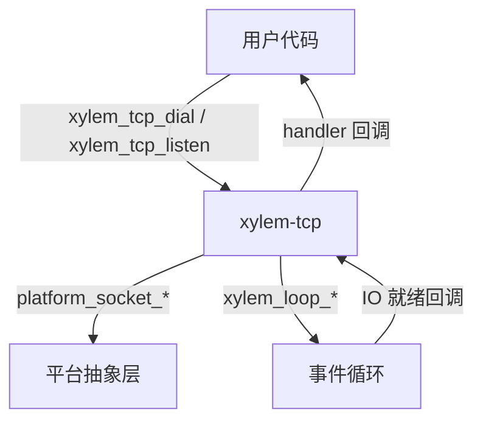

# TCP 模块设计文档

## 概述

`xylem-tcp` 是基于事件循环的非阻塞 TCP 模块，通过回调处理器（handler）驱动所有 I/O 事件。支持客户端拨号（dial）和服务端监听（listen）两种模式，内置帧解析、超时管理、心跳检测和自动重连机制。

## 架构



核心设计原则：
- 所有 socket 操作均为非阻塞
- 数据通过写队列异步发送，支持部分写入（partial write）
- 读取数据经帧解析器提取完整帧后才回调用户
- 连接生命周期通过状态机管理

## 公开类型

### 枚举类型

```c
typedef enum xylem_tcp_framing_type_e {
    XYLEM_TCP_FRAME_NONE,    /* 无帧，原始字节流 */
    XYLEM_TCP_FRAME_FIXED,   /* 固定长度帧 */
    XYLEM_TCP_FRAME_LENGTH,  /* 长度前缀帧 */
    XYLEM_TCP_FRAME_DELIM,   /* 分隔符帧 */
    XYLEM_TCP_FRAME_CUSTOM,  /* 自定义解析 */
} xylem_tcp_framing_type_t;

typedef enum xylem_tcp_timeout_type_e {
    XYLEM_TCP_TIMEOUT_READ,
    XYLEM_TCP_TIMEOUT_WRITE,
    XYLEM_TCP_TIMEOUT_CONNECT,
} xylem_tcp_timeout_type_t;

typedef enum xylem_tcp_length_coding_e {
    XYLEM_TCP_LENGTH_FIXEDINT,  /* 固定整数，支持大端/小端 */
    XYLEM_TCP_LENGTH_VARINT,    /* 变长整数编码 */
} xylem_tcp_length_coding_t;
```

### 帧配置

```c
typedef struct xylem_tcp_framing_s {
    xylem_tcp_framing_type_t type;
    union {
        struct { size_t frame_size; }                          fixed;
        struct {
            uint32_t                  header_size;
            uint32_t                  field_offset;
            uint32_t                  field_size;
            int32_t                   adjustment;
            xylem_tcp_length_coding_t coding;
            bool                      field_big_endian;
        } length;
        struct { const char* delim; size_t delim_len; }        delim;
        struct { int (*parse)(const void* data, size_t len); } custom;
    };
} xylem_tcp_framing_t;
```

### 回调处理器

```c
typedef struct xylem_tcp_handler_s {
    void (*on_connect)(xylem_tcp_conn_t* conn);
    void (*on_accept)(xylem_tcp_server_t* server, xylem_tcp_conn_t* conn);
    void (*on_read)(xylem_tcp_conn_t* conn, void* data, size_t len);
    void (*on_write_done)(xylem_tcp_conn_t* conn,
                          void* data, size_t len, int status);
    void (*on_timeout)(xylem_tcp_conn_t* conn,
                       xylem_tcp_timeout_type_t type);
    void (*on_close)(xylem_tcp_conn_t* conn, int err);
    void (*on_heartbeat_miss)(xylem_tcp_conn_t* conn);
} xylem_tcp_handler_t;
```

### 连接选项

```c
typedef struct xylem_tcp_opts_s {
    xylem_tcp_framing_t framing;
    uint64_t connect_timeout_ms;
    uint64_t read_timeout_ms;
    uint64_t write_timeout_ms;
    uint64_t heartbeat_ms;
    uint32_t reconnect_max;
    size_t   read_buf_size;       /* 默认 65536 */
} xylem_tcp_opts_t;
```

### 错误码

```c
#define XYLEM_TCP_ERR_OK       0      /* 正常关闭，无错误 */
#define XYLEM_TCP_ERR_INTERNAL (-1001) /* 内部错误（缓冲区满、帧解析失败等） */
```

`on_close` 和 `on_write_done` 回调的 `err`/`status` 参数语义：

| 值 | 含义 |
|----|------|
| `0` (`XYLEM_TCP_ERR_OK`) | 正常关闭（对端或本地 shutdown） |
| `< -1000` | 内部错误（`XYLEM_TCP_ERR_INTERNAL`：缓冲区满、帧解析失败等） |
| `> 0` | 平台 socket 错误码（Unix errno / Windows WSA 错误码） |

值低于 -1000 避免与平台 errno / WSA 错误码冲突。

### 不透明类型

```c
#define XYLEM_TCP_ERR_OK       0      /* 正常关闭，无错误 */
#define XYLEM_TCP_ERR_INTERNAL (-1001) /* 内部错误（缓冲区满、帧解析失败等） */
```

`on_close` 和 `on_write_done` 回调的 `err`/`status` 参数语义：

| 值 | 含义 |
|----|------|
| `0` (`XYLEM_TCP_ERR_OK`) | 正常关闭（对端或本地 shutdown） |
| `< -1000` | 内部错误（`XYLEM_TCP_ERR_INTERNAL`：缓冲区满、帧解析失败等） |
| `> 0` | 平台 socket 错误码（Unix errno / Windows WSA 错误码） |

值低于 -1000 避免与平台 errno / WSA 错误码冲突。

### 不透明类型

```c
typedef struct xylem_tcp_conn_s   xylem_tcp_conn_t;   /* 连接句柄 */
_tcp_server_t;  /* 服务器句柄 */
```
### 工具函数

```c
/* 将错误码转为可读字符串（跨平台：Unix errno / Windows WSA 错误码） */
const char* xylem_tcp_strerror(int err);
```

将 `on_close` 和 `on_write_done` 回调中的错误码转为可读字符串。错误码语义参见上方"错误码"一节。返回的指针是线程局部的，在同一线程上下次调用前有效。内部委托给 `platform_socket_tostring`。