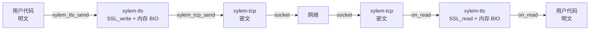
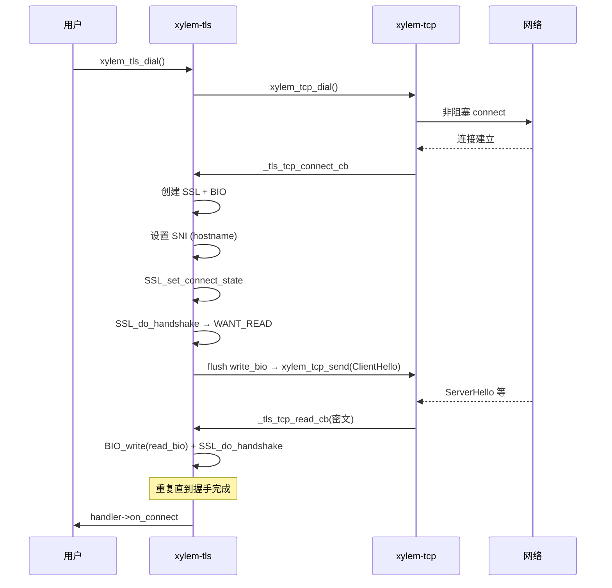
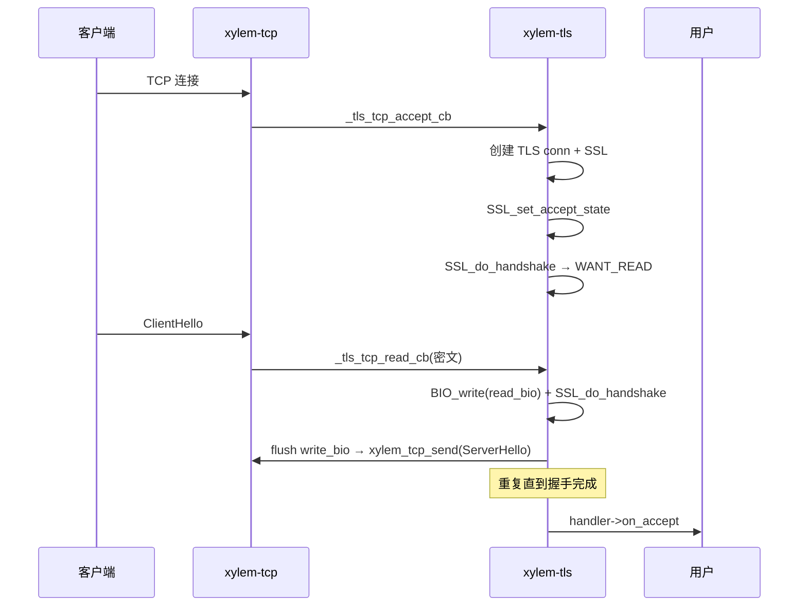
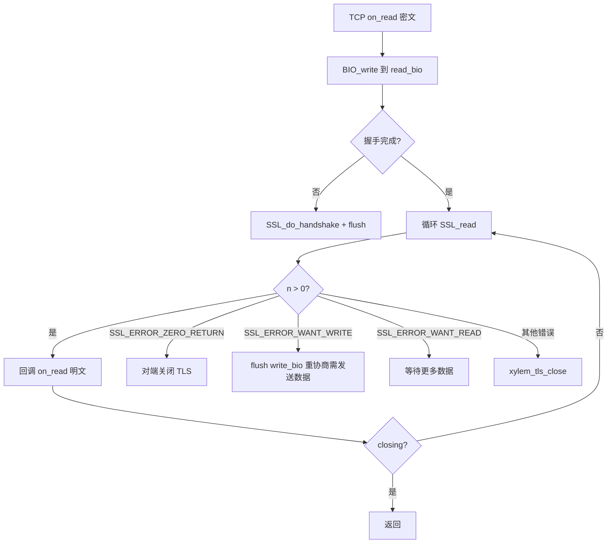
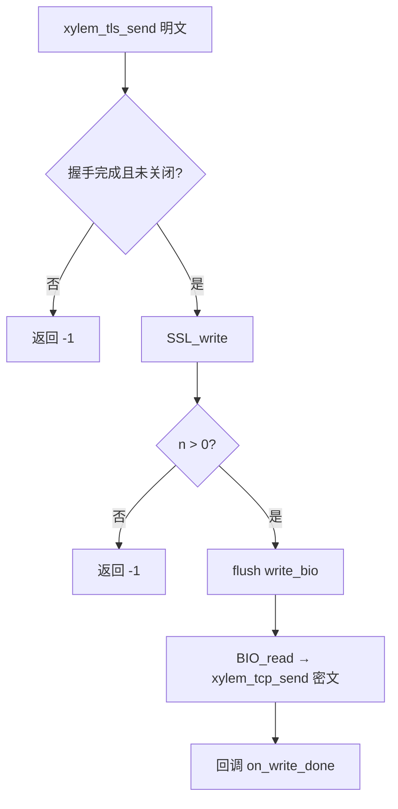
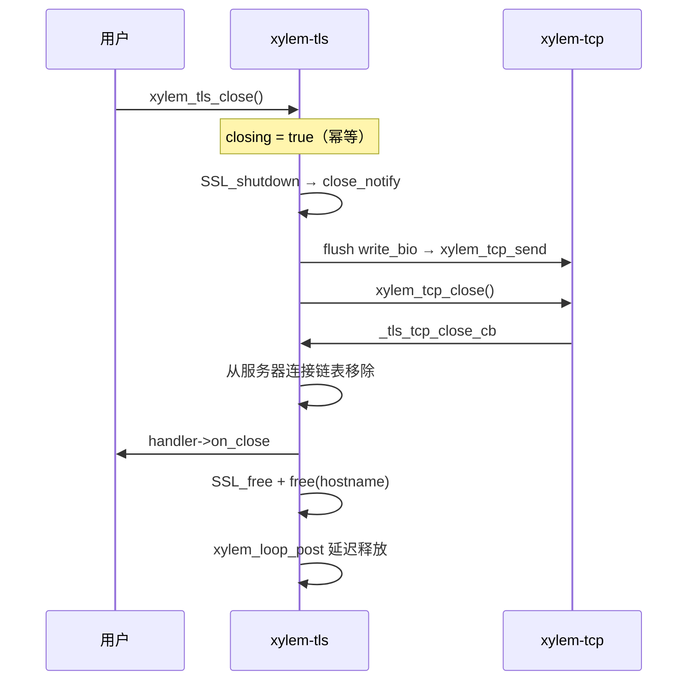

# TLS 模块设计文档

## 概述

`xylem-tls` 在 TCP 模块之上提供 TLS 加密传输。核心设计：OpenSSL 永远不直接接触 socket fd，所有数据通过内存 BIO（`BIO_s_mem`）中转，实现加密层与传输层的完全解耦。

## 架构



分层数据流：

```
发送: 用户 → xylem_tls_send(明文) → SSL_write → write_bio → BIO_read → xylem_tcp_send(密文) → 网络
接收: 网络 → TCP on_read(密文) → BIO_write(read_bio) → SSL_read → TLS on_read(明文) → 用户
```

## 公开类型

### 回调处理器

```c
typedef struct xylem_tls_handler_s {
    void (*on_connect)(xylem_tls_conn_t* tls);
    void (*on_accept)(xylem_tls_server_t* server, xylem_tls_conn_t* tls);
    void (*on_read)(xylem_tls_conn_t* tls, void* data, size_t len);
    void (*on_write_done)(xylem_tls_conn_t* tls,
                          const void* data, size_t len, int status);
    void (*on_timeout)(xylem_tls_conn_t* tls,
                       xylem_tcp_timeout_type_t type);
    void (*on_close)(xylem_tls_conn_t* tls, int err, const char* errmsg);
    void (*on_heartbeat_miss)(xylem_tls_conn_t* tls);
} xylem_tls_handler_t;
```

回调签名与 TCP handler 对称，额外增加 `on_heartbeat_miss`。超时类型复用 TCP 的 `xylem_tcp_timeout_type_t`。`on_close` 的 `errmsg` 参数直接透传自 TCP 层的 `on_close` 回调，提供可读的错误描述字符串。

### TLS 选项

```c
typedef struct xylem_tls_opts_s {
    xylem_tcp_opts_t tcp;        /**< Underlying TCP options. */
    const char*      hostname;   /**< SNI hostname for client connections. */
} xylem_tls_opts_t;
```

封装底层 TCP 选项和 TLS 层专属选项。`hostname` 用于客户端连接的 SNI 和主机名验证，`xylem_tls_dial` 内部会 `strdup` 保存。传 NULL 使用默认值。

### 不透明类型

```c
typedef struct xylem_tls_conn_s   xylem_tls_conn_t;
typedef struct xylem_tls_ctx_s    xylem_tls_ctx_t;
typedef struct xylem_tls_server_s xylem_tls_server_t;
```

## 内部结构

### TLS 上下文

```c
struct xylem_tls_ctx_s {
    SSL_CTX* ssl_ctx;        /* OpenSSL 上下文，使用 TLS_method() */
    uint8_t* alpn_wire;      /* ALPN 协议列表（wire 格式） */
    size_t   alpn_wire_len;
    FILE*    keylog_file;    /* NSS Key Log 文件句柄 */
};
```

通过 `SSL_CTX_get_ex_data` 机制在 keylog 回调中恢复 `xylem_tls_ctx_t` 指针（全局 `_tls_ex_data_idx`，首次使用时注册）。

### TLS 连接

```c
struct xylem_tls_conn_s {
    SSL*                  ssl;
    BIO*                  read_bio;       /* 密文输入 BIO */
    BIO*                  write_bio;      /* 密文输出 BIO */
    xylem_tcp_conn_t*     tcp;            /* 底层 TCP 连接 */
    xylem_tls_ctx_t*      ctx;
    xylem_tls_handler_t*  handler;
    xylem_tls_server_t*   server;         /* 服务端连接非 NULL */
    void*                 userdata;
    bool                  handshake_done;
    bool                  closing;
    int                   close_err;      /* 关闭错误码，正常关闭为 0 */
    const char*           close_errmsg;   /* 关闭错误描述，正常关闭为 NULL */
    char*                 hostname;       /* SNI 主机名 */
    char                  alpn[256];      /* 协商后的 ALPN 协议（null-terminated） */
    xylem_list_node_t     server_node;    /* 服务器连接链表节点 */
};
```

### TLS 服务器

```c
struct xylem_tls_server_s {
    xylem_tcp_server_t*   tcp_server;     /* 底层 TCP 服务器 */
    xylem_tls_ctx_t*      ctx;
    xylem_tls_handler_t*  handler;
    xylem_tcp_opts_t      opts;
    xylem_loop_t*         loop;
    xylem_list_t          connections;    /* TLS 连接链表 */
    void*                 userdata;
    bool                  closing;
};
```

## 上下文管理

`xylem_tls_ctx_t` 是可复用的，一个上下文可被多个连接和服务器共享。

| API | 功能 |
|-----|------|
| `xylem_tls_ctx_create()` | 创建上下文，使用 `TLS_method()`，默认启用对端验证 |
| `xylem_tls_ctx_destroy()` | 释放 SSL_CTX、关闭 keylog 文件、释放 ALPN 数据 |
| `xylem_tls_ctx_load_cert()` | 加载 PEM 证书链和私钥 |
| `xylem_tls_ctx_set_ca()` | 设置 CA 证书用于对端验证 |
| `xylem_tls_ctx_set_verify()` | 启用/禁用对端证书验证 |
| `xylem_tls_ctx_set_alpn()` | 设置 ALPN 协议列表（wire 格式编码） |
| `xylem_tls_ctx_set_keylog()` | 启用 NSS Key Log 输出（用于 Wireshark 解密） |

ALPN 编码：将协议字符串数组转为 wire 格式（每个协议前缀一个长度字节），同时设置客户端提议（`SSL_CTX_set_alpn_protos`）和服务端选择回调（`SSL_CTX_set_alpn_select_cb`）。

## 握手流程

### 客户端握手



### 服务端握手



## 数据路径

### 读取路径



SSL_read 错误（非 WANT_READ/WANT_WRITE/ZERO_RETURN）调用 `xylem_tls_close(tls)`，与其他关闭路径保持一致。`xylem_tls_close` 会尝试 `SSL_shutdown` 发送 close_notify（尽管 SSL 状态可能已损坏，`SSL_shutdown` 会安全地处理这种情况），然后关闭底层 TCP 连接。`_tls_tcp_close_cb` 随后触发，完成链表移除、`on_close` 回调和延迟释放。

### 写入路径



由于使用内存 BIO，`SSL_write` 总是一次完成（写入内存缓冲区），不会返回 `SSL_ERROR_WANT_WRITE`，因此无需 `SSL_MODE_ACCEPT_MOVING_WRITE_BUFFER`。

## 关闭流程



### 服务器关闭

`xylem_tls_close_server` 循环取链表头节点直到链表为空，对每个节点：先从链表中移除（因为将 `tls->server` 置 NULL 后，`_tls_tcp_close_cb` 无法再执行移除），再将 `server` 指针置 NULL（因为 `xylem_tls_close` 是异步的，`_tls_tcp_close_cb` 可能在 server 释放后才触发），最后调用 `xylem_tls_close`。所有连接处理完毕后关闭底层 TCP 服务器，通过 `xylem_loop_post` 延迟释放 server 内存。

## SNI 与 ALPN

### SNI（服务器名称指示）

SNI hostname 通过 `xylem_tls_opts_t.hostname` 在 `xylem_tls_dial` 时传入。`xylem_tls_dial` 内部 `strdup` 保存到 `tls->hostname`。在 TCP 连接建立后的 `_tls_tcp_connect_cb` 中，若 `hostname` 非 NULL：
- `SSL_set_tlsext_host_name` 设置 SNI 扩展
- `SSL_set1_host` 启用主机名验证

### ALPN（应用层协议协商）

- 客户端：通过 `SSL_CTX_set_alpn_protos` 提议协议列表
- 服务端：通过 `SSL_CTX_set_alpn_select_cb` 注册选择回调（`_tls_alpn_select_cb`），使用 `SSL_select_next_proto` 匹配
- 握手完成后：`_tls_do_handshake` 中调用 `SSL_get0_alpn_selected` 获取协商结果，`memcpy` + null terminate 到 `tls->alpn[256]` 缓冲区（`SSL_get0_alpn_selected` 返回的指针非 null-terminated，不能直接当 C 字符串使用）
- 查询结果：`xylem_tls_get_alpn` 返回 `tls->alpn`（若非空）或 NULL

## 超时与心跳

TCP 层的超时和心跳事件透明桥接到 TLS 层：

- `_tls_tcp_timeout_cb`：将 TCP 超时事件转发为 TLS `on_timeout`
- `_tls_tcp_heartbeat_cb`：将 TCP 心跳丢失事件转发为 TLS `on_heartbeat_miss`

TLS 层不引入额外的定时器，完全复用 TCP 层的定时器机制。

## 内部 TCP Handler

TLS 模块注册两组静态 TCP handler：

| Handler | 用途 | 包含的回调 |
|---------|------|-----------|
| `_tls_tcp_client_handler` | 客户端连接 | on_connect, on_read, on_close, on_timeout, on_heartbeat_miss |
| `_tls_tcp_server_handler` | 服务端接受的连接 | on_accept, on_read, on_close, on_timeout, on_heartbeat_miss |

TLS conn 通过 `xylem_tcp_set_userdata` 存储在 TCP conn 的 userdata 中，在 TCP 回调中通过 `xylem_tcp_get_userdata` 恢复。

## 公开 API

### 上下文

```c
xylem_tls_ctx_t* xylem_tls_ctx_create(void);
void             xylem_tls_ctx_destroy(xylem_tls_ctx_t* ctx);
int              xylem_tls_ctx_load_cert(xylem_tls_ctx_t* ctx,
                                         const char* cert, const char* key);
int              xylem_tls_ctx_set_ca(xylem_tls_ctx_t* ctx, const char* ca_file);
void             xylem_tls_ctx_set_verify(xylem_tls_ctx_t* ctx, bool enable);
int              xylem_tls_ctx_set_alpn(xylem_tls_ctx_t* ctx,
                                        const char** protocols, size_t count);
int              xylem_tls_ctx_set_keylog(xylem_tls_ctx_t* ctx, const char* path);
```

### 连接

```c
xylem_tls_conn_t*   xylem_tls_dial(xylem_loop_t* loop, xylem_addr_t* addr,
                                    xylem_tls_ctx_t* ctx,
                                    xylem_tls_handler_t* handler,
                                    xylem_tls_opts_t* opts);
int                 xylem_tls_send(xylem_tls_conn_t* tls,
                                    const void* data, size_t len);
void                xylem_tls_close(xylem_tls_conn_t* tls);
const char*         xylem_tls_get_alpn(xylem_tls_conn_t* tls);
const xylem_addr_t* xylem_tls_get_peer_addr(xylem_tls_conn_t* tls);
xylem_loop_t*       xylem_tls_get_loop(xylem_tls_conn_t* tls);
void*               xylem_tls_get_userdata(xylem_tls_conn_t* tls);
void                xylem_tls_set_userdata(xylem_tls_conn_t* tls, void* ud);
```

### 服务器

```c
xylem_tls_server_t* xylem_tls_listen(xylem_loop_t* loop, xylem_addr_t* addr,
                                      xylem_tls_ctx_t* ctx,
                                      xylem_tls_handler_t* handler,
                                      xylem_tcp_opts_t* opts);
void                xylem_tls_close_server(xylem_tls_server_t* server);
void*               xylem_tls_server_get_userdata(xylem_tls_server_t* server);
void                xylem_tls_server_set_userdata(xylem_tls_server_t* server,
                                                   void* ud);
```
