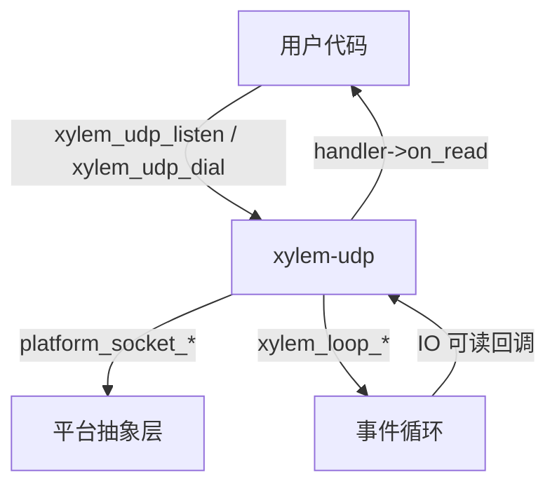
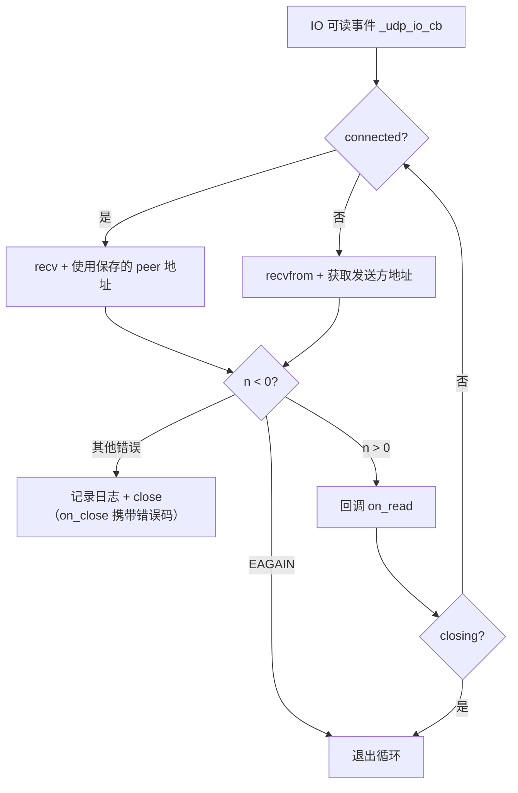

# UDP 模块设计文档

## 概述

`xylem-udp` 是基于事件循环的非阻塞 UDP 模块，提供监听（listen）和拨号（dial）两种模式。设计简洁，无帧解析、无写队列——UDP 数据报天然保留消息边界。

## 架构



## 公开类型

### 回调处理器

```c
typedef struct xylem_udp_handler_s {
    void (*on_read)(xylem_udp_t* udp, void* data, size_t len,
                    xylem_addr_t* addr);
    void (*on_close)(xylem_udp_t* udp, int err, const char* errmsg);
} xylem_udp_handler_t;
```

- `on_read`：收到数据报时触发，`addr` 为发送方地址
- `on_close`：句柄关闭时触发。正常关闭（用户调用 `xylem_udp_close`）时 `err=0`、`errmsg=NULL`。当关闭由内部 recv 错误触发时，`err` 为平台错误码，`errmsg` 为可读错误描述字符串

### 不透明类型

```c
typedef struct xylem_udp_s xylem_udp_t;
```

## 内部结构

```c
struct xylem_udp_s {
    xylem_loop_t*         loop;
    xylem_loop_io_t*      io;
    platform_sock_t       fd;
    xylem_udp_handler_t*  handler;
    void*                 userdata;
    xylem_addr_t          peer;          /* 仅 dial 模式有效 */
    char                  recv_buf[65536]; /* 接收缓冲区 */
    bool                  connected;     /* true = dial 模式 */
    _Atomic bool          closing;       /* 幂等关闭标志，原子类型支持跨线程安全读取 */
    _Atomic int32_t       refcount;      /* 引用计数，用于跨线程操作的生命周期管理 */
    int                   close_err;     /* recv 错误码，正常关闭为 0 */
    const char*           close_errmsg;  /* recv 错误描述，正常关闭为 NULL */
};
```

接收缓冲区固定 65536 字节，覆盖 UDP 数据报最大理论长度（65535 字节）。

### 延迟发送请求

跨线程调用 `xylem_udp_send` 时分配，通过 `xylem_loop_post` 转发到事件循环线程：

```c
typedef struct _udp_deferred_send_s {
    xylem_udp_t*  udp;
    xylem_addr_t  dest;
    bool          has_dest;
    size_t        len;
    char          data[];  /* 柔性数组成员，用户数据副本 */
} _udp_deferred_send_t;
```

## 两种工作模式

### listen 模式（未连接）

```c
xylem_udp_t* xylem_udp_listen(loop, addr, handler);
```

- 创建非阻塞 UDP socket 并 `bind` 到指定地址
- 注册到事件循环监听可读事件
- 收到数据报时使用 `recvfrom` 获取发送方地址
- 发送时必须通过 `xylem_udp_send(udp, dest, data, len)` 指定目标地址，内部使用 `sendto`

### dial 模式（已连接）

```c
xylem_udp_t* xylem_udp_dial(loop, addr, handler);
```

- 创建非阻塞 UDP socket 并 `connect` 到目标地址
- `connected` 标志设为 `true`，保存 `peer` 地址
- 收到数据报时使用 `recv`（而非 `recvfrom`），因为 macOS 上 `recvfrom` 对已连接 UDP socket 可能不填充发送方地址
- 发送时使用 `send`（而非 `sendto`），因为 macOS/BSD 上对已连接 socket 调用 `sendto` 会返回 `EISCONN`

## 数据流

### 读取路径



IO 回调内循环 `recv`/`recvfrom` 直到 `EAGAIN`，一次回调排空内核缓冲区，避免水平触发（LT）模式下重复唤醒。

### 发送路径

```c
int xylem_udp_send(xylem_udp_t* udp, xylem_addr_t* dest,
                   const void* data, size_t len);
```

- 已连接 socket 或 `dest == NULL`：使用 `platform_socket_send`
- 未连接 socket 且 `dest != NULL`：使用 `platform_socket_sendto`，根据地址族计算 `addrlen`

发送是同步的，直接调用系统调用，返回发送字节数或 -1。

## 关闭流程

```mermaid
sequenceDiagram
    participant User as 用户
    participant UDP as xylem-udp
    participant Loop as 事件循环

    User->>UDP: xylem_udp_close()
    UDP->>UDP: atomic_exchange(closing, true)
    alt 已为 true
        UDP-->>User: 立即返回（幂等）
    end
    alt 跨线程调用
        UDP->>UDP: xylem_loop_post(_udp_deferred_close_cb)
        Note over UDP: 下一轮事件循环迭代执行
        UDP->>UDP: _udp_do_close()（事件循环线程）
    end
    UDP->>UDP: _udp_do_close()
    UDP->>UDP: xylem_loop_destroy_io()
    UDP->>UDP: platform_socket_close(fd)
    UDP->>User: handler->on_close(udp, close_err, close_errmsg)
    UDP->>Loop: xylem_loop_post(_udp_free_cb)
    Loop->>UDP: 下一轮迭代释放内存
```

关闭是幂等的（`closing` 标志防止重入）。`xylem_udp_close` 入口处通过 `atomic_exchange(&udp->closing, true)` 原子地检查并设置 `closing` 标志——若旧值已为 `true` 则立即返回，保证恰好一个调用者通过。`atomic_exchange` 将检查和设置合并为单条原子操作，消除了 `atomic_load` + `atomic_store` 两步方案中的 TOCTOU 竞态窗口。此检查在线程判断之前执行，确保重复调用和 `xylem_loop_destroy` 排空延迟回调时不会无限递归 `xylem_loop_post`。`xylem_loop_destroy` 在排空前会将 `loop->tid` 设置为当前线程，使延迟回调走同线程路径。

通过幂等检查后，`closing` 标志已在调用线程上原子地设置为 `true`，确保并发的 `xylem_udp_send` 调用被立即拒绝。然后检查是否在事件循环线程上：若不在，递增引用计数后通过 `xylem_loop_post` 将 `_udp_deferred_close_cb` 转发到事件循环线程执行。若 `xylem_loop_post` 失败则立即递减引用计数，避免引用计数泄漏。

实际关闭逻辑封装在 `_udp_do_close` 中，`_udp_deferred_close_cb` 直接调用此函数而非重新进入 `xylem_udp_close`。这避免了 `xylem_loop_destroy` 排空延迟回调时（`loop->tid` 未设置）重复 `xylem_loop_post` 导致的无限递归。同线程路径直接调用 `_udp_do_close`，`closing` 标志已在入口处由 `atomic_exchange` 设置。

`_udp_deferred_close_cb` 完成后递减引用计数（`_udp_decref`），确保句柄内存在回调执行前不会被释放。

内存通过 `xylem_loop_post` 延迟到下一轮事件循环迭代释放，确保当前回调链中的指针仍然有效。当引用计数归零时释放句柄内存。

## 线程安全

`xylem_udp_send` 和 `xylem_udp_close` 可从任意线程调用。内部通过 `xylem_loop_is_loop_thread` 检测调用线程：

- **事件循环线程**：直接执行操作
- **其他线程**：递增引用计数后通过 `xylem_loop_post` 将操作转发到事件循环线程，回调完成后递减引用计数

`xylem_udp_close` 跨线程调用时，`closing` 标志通过 `atomic_exchange` 在调用线程上原子地检查并设置为 `true`，确保并发的 `xylem_udp_send` 调用被立即拒绝。然后递增引用计数并通过 `xylem_loop_post` 将 `_udp_deferred_close_cb` 转发到事件循环线程执行。`_udp_deferred_close_cb` 直接调用 `_udp_do_close`（而非重新进入 `xylem_udp_close`），避免 `xylem_loop_destroy` 排空延迟回调时因 `loop->tid` 未设置而重复 `xylem_loop_post` 导致的无限递归。回调完成后递减引用计数。若 `xylem_loop_post` 失败则立即递减引用计数（`_udp_decref`），避免引用计数泄漏。

`xylem_udp_close` 同线程调用时，`closing` 标志在入口处由 `atomic_exchange` 原子地设置后，直接调用 `_udp_do_close` 执行实际关闭操作。

`xylem_udp_send` 跨线程调用时，先通过 `atomic_load` 检查 `closing` 标志，已关闭则返回 -1。否则分配 `_udp_deferred_send_t`（包含 UDP 句柄指针和数据副本），递增引用计数后通过 `xylem_loop_post` 转发到事件循环线程。回调 `_udp_deferred_send_cb` 在发送前再次检查 `closing` 状态（句柄可能在 post 期间关闭），处理完毕后递减引用计数（`_udp_decref`）。

`udp->closing` 使用 `_Atomic bool` 类型，允许跨线程安全读取状态。`closing` 标志在 `xylem_udp_close` 入口处通过 `atomic_exchange` 由调用线程原子地检查并设置为 `true`，无论调用来自哪个线程。所有实际关闭操作（destroy IO、close fd、on_close 回调）仅在事件循环线程上执行。

其他 API（`xylem_udp_listen`、`xylem_udp_dial`、访问器等）仍需在事件循环线程上调用。

## 公开 API

```c
/* 绑定地址并开始接收（未连接模式） */
xylem_udp_t* xylem_udp_listen(xylem_loop_t* loop,
                              xylem_addr_t* addr,
                              xylem_udp_handler_t* handler);

/* 创建已连接 UDP socket */
xylem_udp_t* xylem_udp_dial(xylem_loop_t* loop,
                            xylem_addr_t* addr,
                            xylem_udp_handler_t* handler);

/* 发送数据报，dest 为 NULL 时使用已连接地址。线程安全。 */
int xylem_udp_send(xylem_udp_t* udp, xylem_addr_t* dest,
                   const void* data, size_t len);

/* 关闭 UDP 句柄。线程安全。 */
void xylem_udp_close(xylem_udp_t* udp);

/* 递增引用计数，需在事件循环线程上调用。 */
void xylem_udp_acquire(xylem_udp_t* udp);

/* 递减引用计数，归零时释放内存。可从任意线程调用。 */
void xylem_udp_release(xylem_udp_t* udp);

/* 获取关联的事件循环 */
xylem_loop_t* xylem_udp_get_loop(xylem_udp_t* udp);

void* xylem_udp_get_userdata(xylem_udp_t* udp);
void  xylem_udp_set_userdata(xylem_udp_t* udp, void* ud);
```
