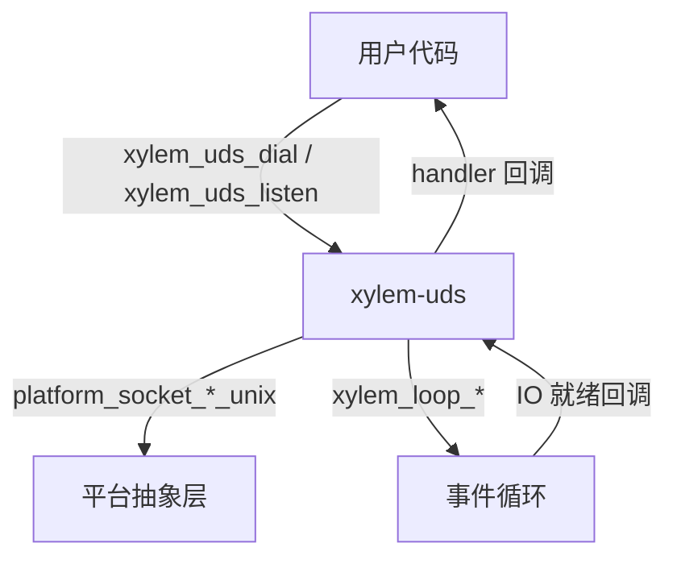
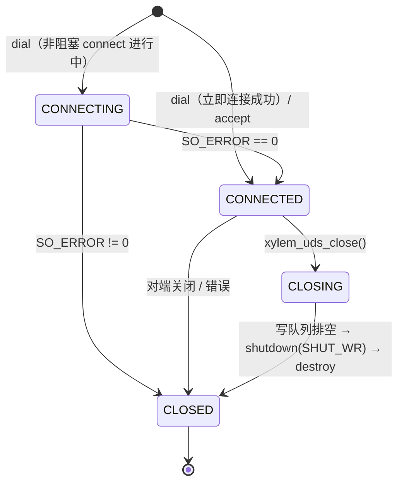
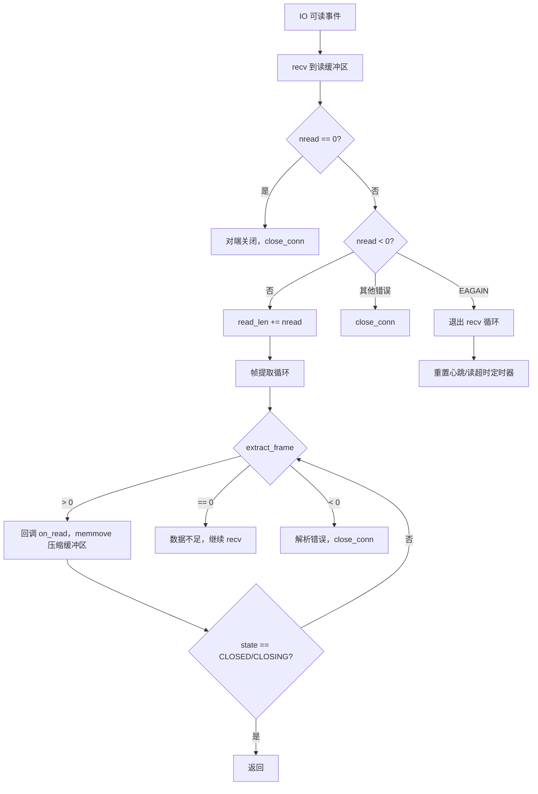
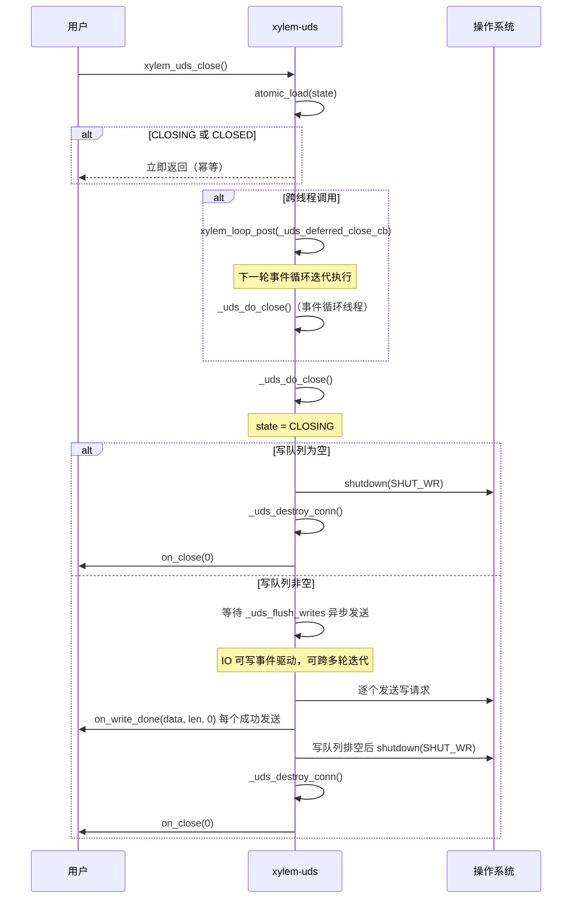
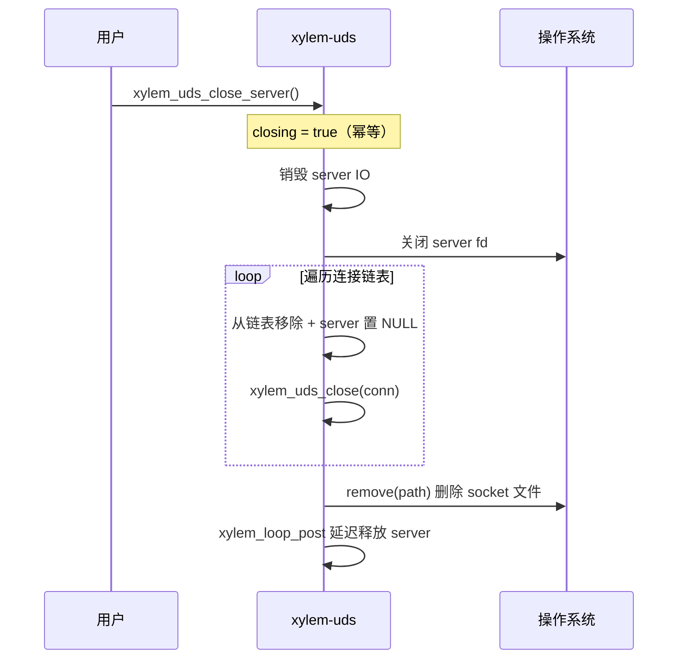
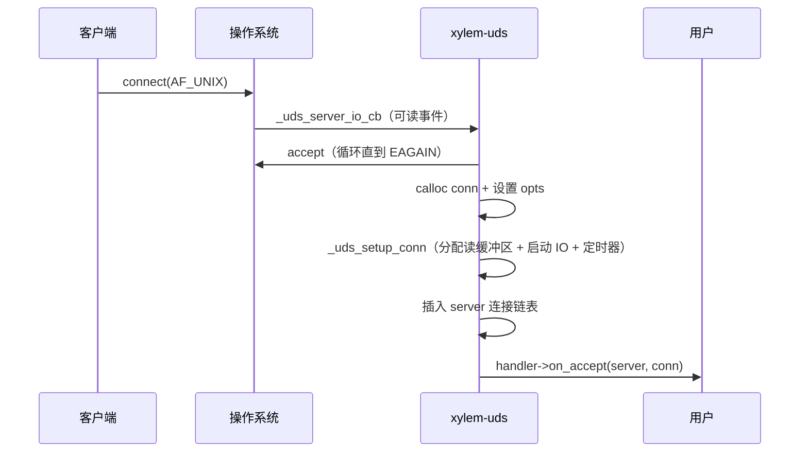

# UDS 模块设计文档

## 概述

`xylem-uds` 是基于事件循环的非阻塞 Unix Domain Socket（UDS）模块，通过回调处理器（handler）驱动所有 I/O 事件。支持客户端拨号（dial）和服务端监听（listen）两种模式，内置帧解析、超时管理和心跳检测。设计与 TCP 模块高度对称，但去除了网络相关特性（地址解析、MSS 钳制、重连机制），专注于本地进程间通信。

## 架构



核心设计原则：
- 所有 socket 操作均为非阻塞
- 数据通过写队列异步发送，支持部分写入（partial write）
- 读取数据经帧解析器提取完整帧后才回调用户
- 连接生命周期通过状态机管理
- 服务端关闭时自动 `remove` socket 文件

## 与 TCP 模块的关键差异

| 特性 | TCP | UDS |
|------|-----|-----|
| 地址类型 | `xylem_addr_t`（IP + 端口） | 文件系统路径（`const char*`） |
| socket 域 | `AF_INET` / `AF_INET6` | `AF_UNIX` |
| MSS 钳制 | 支持（`disable_mss_clamp`） | 不适用 |
| 重连机制 | 支持（指数退避） | 不支持 |
| 连接超时 | 支持（`connect_timeout_ms`） | 不支持 |
| 对端地址 | `xylem_tcp_get_peer_addr` | 不适用（UDS 无有意义的对端地址） |
| socket 文件清理 | 不适用 | listen 前 `remove`，close_server 后 `remove` |
| 路径长度限制 | 无 | `UDS_MAX_PATH`（104 字节，macOS 最小值） |

## 公开类型

### 枚举类型

```c
typedef enum xylem_uds_framing_type_e {
    XYLEM_UDS_FRAME_NONE,    /* 无帧，原始字节流 */
    XYLEM_UDS_FRAME_FIXED,   /* 固定长度帧 */
    XYLEM_UDS_FRAME_LENGTH,  /* 长度前缀帧 */
    XYLEM_UDS_FRAME_DELIM,   /* 分隔符帧 */
    XYLEM_UDS_FRAME_CUSTOM,  /* 自定义解析 */
} xylem_uds_framing_type_t;

typedef enum xylem_uds_timeout_type_e {
    XYLEM_UDS_TIMEOUT_READ,
    XYLEM_UDS_TIMEOUT_WRITE,
} xylem_uds_timeout_type_t;

typedef enum xylem_uds_length_coding_e {
    XYLEM_UDS_LENGTH_FIXEDINT,  /* 固定整数，支持大端/小端 */
    XYLEM_UDS_LENGTH_VARINT,    /* 变长整数编码 */
} xylem_uds_length_coding_t;
```

与 TCP 的 `xylem_tcp_timeout_type_t` 相比，UDS 没有 `TIMEOUT_CONNECT`（UDS 本地连接几乎瞬时完成，无需连接超时）。

### 帧配置

```c
typedef struct xylem_uds_framing_s {
    xylem_uds_framing_type_t type;
    union {
        struct { size_t frame_size; }                          fixed;
        struct {
            uint32_t                  header_size;
            uint32_t                  field_offset;
            uint32_t                  field_size;
            int32_t                   adjustment;
            xylem_uds_length_coding_t coding;
            bool                      field_big_endian;
        } length;
        struct { const char* delim; size_t delim_len; }        delim;
        struct { int (*parse)(const void* data, size_t len); } custom;
    };
} xylem_uds_framing_t;
```

### 回调处理器

```c
typedef struct xylem_uds_handler_s {
    void (*on_connect)(xylem_uds_conn_t* conn);
    void (*on_accept)(xylem_uds_server_t* server, xylem_uds_conn_t* conn);
    void (*on_read)(xylem_uds_conn_t* conn, void* data, size_t len);
    void (*on_write_done)(xylem_uds_conn_t* conn,
                          const void* data, size_t len, int status);
    void (*on_timeout)(xylem_uds_conn_t* conn,
                       xylem_uds_timeout_type_t type);
    void (*on_close)(xylem_uds_conn_t* conn, int err, const char* errmsg);
    void (*on_heartbeat_miss)(xylem_uds_conn_t* conn);
} xylem_uds_handler_t;
```

与 TCP handler 完全对称，包含 `on_heartbeat_miss` 回调。心跳超时通过独立的内部回调 `_uds_heartbeat_timeout_cb` 处理，在 `heartbeat_ms` 内无数据到达时触发。

### 连接选项

```c
typedef struct xylem_uds_opts_s {
    xylem_uds_framing_t framing;
    uint64_t            read_timeout_ms;
    uint64_t            write_timeout_ms;
    uint64_t            heartbeat_ms;
    size_t              read_buf_size;       /* 默认 65536 */
} xylem_uds_opts_t;
```

与 TCP 的 `xylem_tcp_opts_t` 相比，UDS 选项去除了：
- `connect_timeout_ms`：UDS 本地连接无需超时
- `reconnect_max`：UDS 不支持自动重连
- `disable_mss_clamp`：UDS 无 MSS 概念

### 错误码

`on_close` 和 `on_write_done` 回调的 `err`/`status` 参数语义：

| 值 | 含义 | `errmsg`（仅 `on_close`） |
|----|------|--------------------------|
| `0` | 正常关闭（对端或本地 shutdown） | `"closed normally"` |
| `-1` | 内部错误（缓冲区满、帧解析失败等） | `"internal error"` |
| `> 0` | 平台 socket 错误码（Unix errno / Windows WSA 错误码） | `platform_socket_tostring(err)` |

### 不透明类型

```c
typedef struct xylem_uds_conn_s   xylem_uds_conn_t;   /* 连接句柄 */
typedef struct xylem_uds_server_s xylem_uds_server_t;  /* 服务器句柄 */
```

## 内部结构

### 写请求节点

```c
typedef struct _uds_write_req_s {
    xylem_queue_node_t node;    /* 队列节点，嵌入写队列 */
    void*              data;    /* 数据指针（紧跟结构体之后） */
    size_t             len;     /* 总长度 */
    size_t             offset;  /* 已发送偏移量（支持部分写入） */
} _uds_write_req_t;
```

### 延迟发送请求

跨线程调用 `xylem_uds_send` 时分配，通过 `xylem_loop_post` 转发到事件循环线程：

```c
typedef struct _uds_deferred_send_s {
    xylem_uds_conn_t* conn;
    size_t            len;
    char              data[];  /* 柔性数组成员，用户数据副本 */
} _uds_deferred_send_t;
```

### 连接结构

```c
struct xylem_uds_conn_s {
    xylem_loop_t*         loop;
    xylem_loop_io_t*      io;
    platform_sock_t       fd;
    xylem_uds_handler_t*  handler;
    xylem_uds_opts_t      opts;
    _Atomic _uds_state_t  state;           /* 状态机（原子类型，支持跨线程安全读取） */
    _Atomic int32_t       refcount;        /* 引用计数，初始值 1 */
    uint8_t*              read_buf;        /* 读缓冲区 */
    size_t                read_len;        /* 已读字节数 */
    size_t                read_cap;        /* 缓冲区容量 */
    xylem_queue_t         write_queue;     /* 写请求队列 */
    xylem_loop_timer_t*   read_timer;
    xylem_loop_timer_t*   write_timer;
    xylem_loop_timer_t*   heartbeat_timer;
    xylem_list_node_t     server_node;     /* 服务器连接链表节点 */
    xylem_uds_server_t*   server;          /* 所属服务器（accept 连接） */
    void*                 userdata;
};
```

与 TCP 连接结构相比，UDS 连接没有 `dial` 私有状态（无重连）和 `peer_addr`（UDS 无有意义的对端地址）。`state` 和 `refcount` 使用原子类型，为跨线程 `xylem_uds_send` 和 `xylem_uds_close` 提供支持。

### 服务器结构

```c
struct xylem_uds_server_s {
    xylem_loop_t*         loop;
    xylem_loop_io_t*      io;
    platform_sock_t       fd;
    xylem_uds_handler_t*  handler;
    xylem_uds_opts_t      opts;
    xylem_list_t          connections;   /* 已接受连接的侵入式链表 */
    char                  path[UDS_MAX_PATH]; /* socket 文件路径 */
    void*                 userdata;
    bool                  closing;
};
```

服务器保存 `path` 用于关闭时 `remove` 清理 socket 文件。`UDS_MAX_PATH` 为 104 字节（macOS `sun_path` 最小值），确保跨平台安全。

## 连接状态机



状态定义：

| 状态 | 含义 |
|------|------|
| `UDS_STATE_CONNECTING` | 正在建立连接（非阻塞 connect 进行中） |
| `UDS_STATE_CONNECTED` | 连接已建立，可读写 |
| `UDS_STATE_CLOSING` | 优雅关闭中，等待写队列排空 |
| `UDS_STATE_CLOSED` | 连接已销毁 |

与 TCP 不同，UDS 的 `dial` 可能立即连接成功（本地 socket），此时跳过 `CONNECTING` 直接进入 `CONNECTED`。

## 帧解析策略

`_uds_extract_frame` 从读缓冲区提取一个完整帧，返回值含义与 TCP 的 `_tcp_extract_frame` 完全一致：

| 返回值 | 含义 |
|--------|------|
| `> 0` | 成功，返回消耗的字节数 |
| `0` | 数据不足，等待更多数据 |
| `< 0` | 解析错误，关闭连接 |

### NONE — 无帧

将缓冲区中所有可用数据作为一帧返回。

### FIXED — 固定长度

当缓冲区数据 ≥ `frame_size` 时返回一帧。`frame_size == 0` 为错误。

### LENGTH — 长度前缀

支持两种编码：

- **FIXEDINT**：固定字节整数（1-8 字节），支持大端（BE）和小端（LE）
- **VARINT**：变长整数编码（`xylem_varint_decode`）

帧总长度计算：`effective_header + payload_len + adjustment`

VARINT 路径中，若 `hdr_sz + varint_bytes < len_sz`，返回解析错误（-1），防止计算 `effective_hdr` 时发生无符号整数下溢。

在计算 `frame_size` 之前，若 `payload_len` 大于或等于 `INT64_MAX`，直接返回解析错误（-1），防止后续 `int64_t` 强转时发生有符号整数溢出。

`adjustment` 允许负值，用于处理长度字段包含/不包含头部本身的协议差异。

### DELIM — 分隔符

- 单字节分隔符：使用 `memchr` 快速查找
- 多字节分隔符：逐字节滑动窗口 `memcmp`

帧内容不包含分隔符本身。

### CUSTOM — 自定义

调用用户提供的 `parse(data, len)` 函数，返回值语义与 `_uds_extract_frame` 一致。

## 关键算法

### 读取路径 — `_uds_conn_readable_cb`



外层循环持续 `recv` 直到 `EAGAIN`，内层循环对每次 `recv` 的数据反复调用 `_uds_extract_frame` 提取所有完整帧。每提取一帧后 `memmove` 压缩缓冲区。当 `nread < space` 时提前退出外层循环（内核缓冲区已排空）。

### 写入路径 — `xylem_uds_send` + `_uds_flush_writes`

`xylem_uds_send` 分配 `sizeof(req) + len` 的内存块，将用户数据 `memcpy` 到结构体之后的空间。调用后用户可立即释放或复用原始缓冲区。

若写队列之前为空，切换 IO 为读写模式并启动写超时定时器。

`_uds_flush_writes` 从写队列头部取出请求，调用 `platform_socket_send`：

- 完整发送：出队，回调 `on_write_done`，检查连接状态——若用户在回调中关闭了连接（`CLOSED` 或 `CLOSING`）则立即返回；否则处理下一个请求
- 部分发送：更新 `offset`，等待下次可写事件
- `EAGAIN`：直接返回，等待下次可写事件
- 错误：若处于 `CLOSING` 状态则排空队列并销毁；否则 `close_conn`

写队列为空时，将 IO 监听切回仅读模式，停止写超时定时器。

若处于 `CLOSING` 状态且写队列排空，执行 `shutdown(SHUT_WR)` 后销毁连接。

### 超时处理

两种超时各有独立定时器和回调：

| 超时类型 | 触发条件 | 回调后行为 |
|----------|----------|-----------|
| `READ` | 连接空闲超过 `read_timeout_ms` | 仅通知用户（`on_timeout`） |
| `WRITE` | 写操作未完成超过 `write_timeout_ms` | 仅通知用户（`on_timeout`） |

心跳定时器在每次成功读取后重置。若在 `heartbeat_ms` 内无数据到达，触发 `on_heartbeat_miss`（若已注册）。

### 优雅关闭



`xylem_uds_close` 支持跨线程调用。入口处首先通过 `atomic_load` 检查状态实现幂等性——若已处于 `CLOSING` 或 `CLOSED` 状态则立即返回。

通过幂等检查后，若不在事件循环线程上，递增引用计数后通过 `xylem_loop_post` 将 `_uds_deferred_close_cb` 转发到事件循环线程执行，回调完成后递减引用计数（`_uds_conn_decref`），确保连接内存在回调执行前不会被释放。若 `xylem_loop_post` 失败则立即递减引用计数，避免引用计数泄漏。

实际关闭逻辑封装在 `_uds_do_close` 中，`_uds_deferred_close_cb` 直接调用此函数而非重新进入 `xylem_uds_close`。这避免了 `xylem_loop_destroy` 排空延迟回调时（`loop->tid` 未设置）重复 `xylem_loop_post` 导致的无限递归。`_uds_do_close` 内部再次检查状态（防止竞态），然后使用 `atomic_store` 设置 `CLOSING` 状态。

`_uds_destroy_conn` 负责：销毁所有定时器、销毁 IO、关闭 fd、释放读缓冲区、从服务器连接链表移除、回调 `on_close`、通过 `xylem_loop_post` 延迟递减引用计数（`_uds_conn_decref`），当引用计数归零时释放连接内存。

`_uds_close_conn` 在关闭前排空写队列，对每个未完成的写请求回调 `on_write_done`（携带错误码），然后调用 `_uds_destroy_conn`。

### 服务器关闭



## 连接建立

### 服务端 accept



服务端 accept 循环在 `server->closing` 时提前退出，防止关闭过程中继续接受新连接。

### 客户端 dial

```mermaid
sequenceDiagram
    participant User as 用户
    participant UDS as xylem-uds
    participant OS as 操作系统
    participant Loop as 事件循环

    User->>UDS: xylem_uds_dial(path)
    UDS->>OS: platform_socket_dial_unix(path, nonblocking)
    alt 立即连接成功
        UDS->>UDS: _uds_setup_conn
        UDS->>Loop: xylem_loop_post(_uds_deferred_connect_cb)
        UDS-->>User: 返回 conn（调用者可设置 userdata）
        Loop->>UDS: _uds_deferred_connect_cb（下一轮迭代）
        UDS->>User: handler->on_connect
    else EINPROGRESS
        UDS->>UDS: 注册 POLLER_WR_OP
        OS-->>UDS: _uds_try_connect（可写事件）
        UDS->>OS: getsockopt(SO_ERROR)
        alt SO_ERROR == 0
            UDS->>UDS: _uds_setup_conn
            UDS->>User: handler->on_connect
        else SO_ERROR != 0
            UDS->>UDS: _uds_destroy_conn(err)
        end
    end
```

UDS 本地连接通常立即成功，但非阻塞模式下仍可能返回 `EINPROGRESS`（如 macOS），因此保留异步连接路径。

立即连接成功时，`on_connect` 回调通过 `xylem_loop_post` 延迟到下一轮事件循环迭代触发，确保调用者在 `xylem_uds_dial` 返回后有机会设置 userdata。延迟回调 `_uds_deferred_connect_cb` 在触发前检查连接状态，若连接已进入 `CLOSING` 或 `CLOSED` 则跳过回调。

## 平台抽象层

UDS 模块在平台抽象层新增两个函数：

| 函数 | 功能 |
|------|------|
| `platform_socket_listen_unix(path, nonblocking)` | 创建 AF_UNIX SOCK_STREAM socket，`remove` 旧文件后 `bind` + `listen` |
| `platform_socket_dial_unix(path, connected, nonblocking)` | 创建 AF_UNIX SOCK_STREAM socket 并 `connect`，通过 `connected` 返回是否立即连接成功 |

### Unix 实现

- 使用 `<sys/un.h>` 的 `struct sockaddr_un`
- `listen_unix`：`remove(path)` → `socket` → `bind` → `listen` → 设置非阻塞
- `dial_unix`：`socket` → 设置非阻塞 → `connect`（循环处理 `EINTR`），`EINPROGRESS` 时返回 `connected=false`

### Windows 实现

- 使用 `<afunix.h>` 的 `struct sockaddr_un`（Windows 10 1803+ 支持）
- `listen_unix`：`remove(path)` → `socket` → `bind` → `listen` → 设置非阻塞
- `dial_unix`：`socket` → 设置非阻塞 → `connect`，`WSAEWOULDBLOCK` 时返回 `connected=false`

两个平台实现均在路径为 NULL、空字符串或超过 `sizeof(addr.sun_path)` 时返回 `PLATFORM_SO_ERROR_INVALID_SOCKET`。

## 线程安全

`xylem_uds_send` 和 `xylem_uds_close` 可从任意线程调用。内部通过 `xylem_loop_is_loop_thread` 检测调用线程：

- **事件循环线程**：直接执行操作
- **其他线程**：递增引用计数后通过 `xylem_loop_post` 将操作转发到事件循环线程，回调完成后递减引用计数。引用计数保证连接内存在 `xylem_loop_post` 和回调执行之间不会被释放

`xylem_uds_send` 跨线程调用时，先通过 `atomic_load` 检查连接状态，仅 `CONNECTED` 状态接受发送。然后分配 `_uds_deferred_send_t`（包含 conn 指针和数据副本），递增引用计数后通过 `xylem_loop_post` 转发到事件循环线程。回调 `_uds_deferred_send_cb` 在入队前再次检查连接状态（连接可能在 post 期间关闭），处理完毕后递减引用计数（`_uds_conn_decref`）。

`xylem_uds_close` 跨线程调用时，入口处先通过 `atomic_load` 检查状态实现幂等性。通过检查后递增引用计数，通过 `xylem_loop_post` 将 `_uds_deferred_close_cb` 转发到事件循环线程。`_uds_deferred_close_cb` 直接调用 `_uds_do_close`（而非重新进入 `xylem_uds_close`），避免 `xylem_loop_destroy` 排空延迟回调时因 `loop->tid` 未设置而重复 `xylem_loop_post` 导致的无限递归。回调完成后递减引用计数。

`conn->state` 使用 `_Atomic` 类型，允许跨线程安全读取状态（如 `xylem_uds_send` 中的 `CONNECTED` 检查和 `xylem_uds_close` 中的幂等检查）。所有状态变更（`atomic_store`）仅在事件循环线程上执行。

其他 API（`xylem_uds_dial`、`xylem_uds_listen`、访问器等）仍需在事件循环线程上调用。

## 公开 API

### 服务端

```c
/* 绑定路径并开始监听，返回服务器句柄 */
xylem_uds_server_t* xylem_uds_listen(xylem_loop_t* loop,
                                     const char* path,
                                     xylem_uds_handler_t* handler,
                                     xylem_uds_opts_t* opts);

/* 关闭服务器，关闭所有已接受的连接，删除 socket 文件 */
void xylem_uds_close_server(xylem_uds_server_t* server);

void* xylem_uds_server_get_userdata(xylem_uds_server_t* server);
void  xylem_uds_server_set_userdata(xylem_uds_server_t* server, void* ud);
```

### 客户端 / 连接

```c
/* 发起异步 UDS 连接 */
xylem_uds_conn_t* xylem_uds_dial(xylem_loop_t* loop,
                                 const char* path,
                                 xylem_uds_handler_t* handler,
                                 xylem_uds_opts_t* opts);

/* 发送数据（复制入队），立即返回 */
int xylem_uds_send(xylem_uds_conn_t* conn, const void* data, size_t len);

/* 优雅关闭连接 */
void xylem_uds_close(xylem_uds_conn_t* conn);

xylem_loop_t* xylem_uds_get_loop(xylem_uds_conn_t* conn);
void*         xylem_uds_get_userdata(xylem_uds_conn_t* conn);
void          xylem_uds_set_userdata(xylem_uds_conn_t* conn, void* ud);
```
