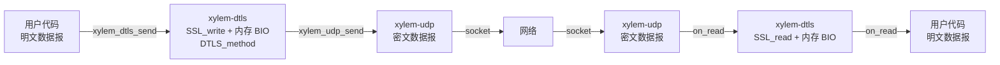
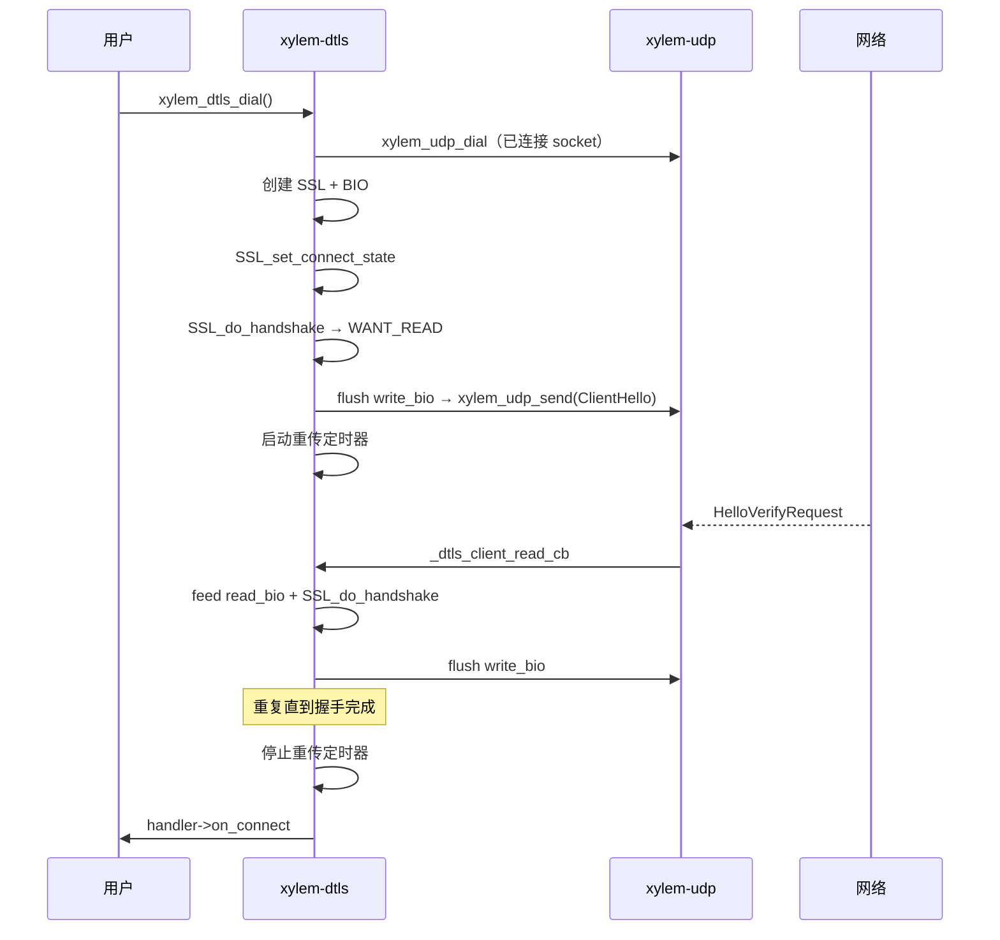
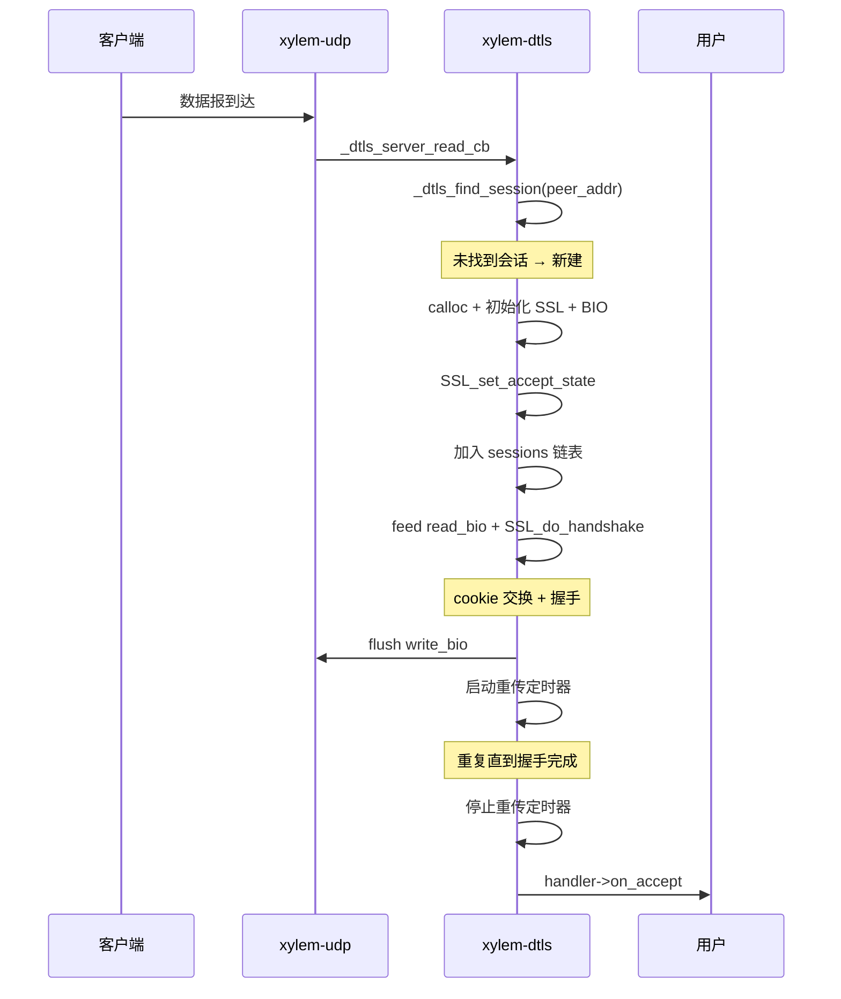
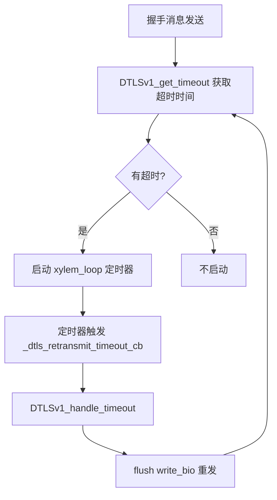
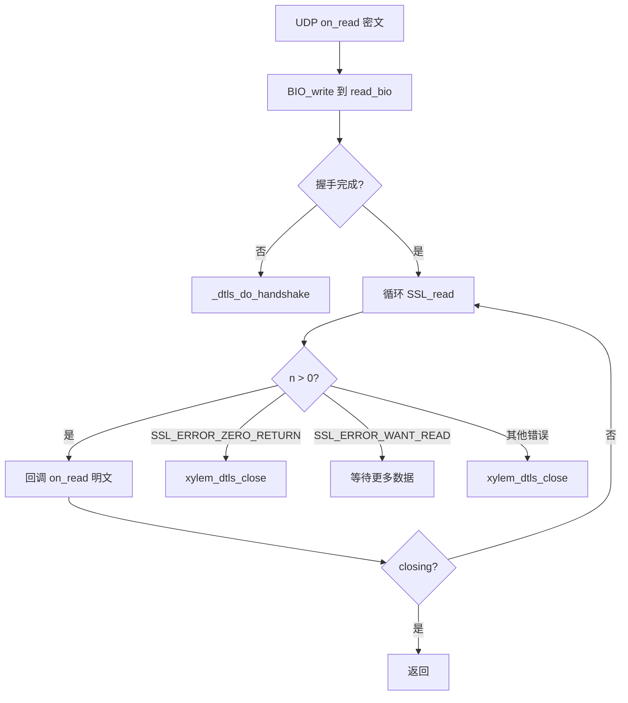

# DTLS 模块设计文档

## 概述

`xylem-dtls` 在 UDP 模块之上提供 DTLS 加密数据报传输。与 TLS 模块设计对称：OpenSSL 通过内存 BIO 与传输层解耦，使用 `DTLS_method()`。服务端在单个 UDP socket 上通过对端地址多路复用多个 DTLS 会话。

## 架构



分层数据流：

```
发送: 用户 → xylem_dtls_send(明文) → SSL_write → write_bio → BIO_read → xylem_udp_send(密文) → 网络
接收: 网络 → UDP on_read(密文) → BIO_write(read_bio) → SSL_read → DTLS on_read(明文) → 用户
```

## 公开类型

### 回调处理器

```c
typedef struct xylem_dtls_handler_s {
    void (*on_connect)(xylem_dtls_t* dtls);
    void (*on_accept)(xylem_dtls_t* dtls);
    void (*on_read)(xylem_dtls_t* dtls, void* data, size_t len);
    void (*on_write_done)(xylem_dtls_t* dtls,
                          void* data, size_t len, int status);
    void (*on_close)(xylem_dtls_t* dtls, int err);
} xylem_dtls_handler_t;
```

与 TLS handler 的区别：
- `on_accept` 参数不含 server 指针（DTLS 会话通过 `xylem_dtls_t` 自身关联 server）
- 无 `on_timeout` 和 `on_heartbeat_miss`（DTLS 自行管理重传定时器）

### 不透明类型

```c
typedef struct xylem_dtls_s        xylem_dtls_t;
typedef struct xylem_dtls_ctx_s    xylem_dtls_ctx_t;
typedef struct xylem_dtls_server_s xylem_dtls_server_t;
```

## 内部结构

### DTLS 上下文

```c
struct xylem_dtls_ctx_s {
    SSL_CTX* ssl_ctx;        /* 使用 DTLS_method() */
    uint8_t* alpn_wire;      /* ALPN 协议列表（wire 格式） */
    size_t   alpn_wire_len;
    FILE*    keylog_file;
};
```

创建时自动配置：
- `SSL_VERIFY_PEER` 默认启用
- Cookie 生成回调（`_dtls_cookie_generate_cb`）：生成 16 字节随机 cookie
- Cookie 验证回调（`_dtls_cookie_verify_cb`）：接受所有 cookie（cookie 交换本身已提供地址验证的 DoS 防护）

### DTLS 会话

```c
struct xylem_dtls_s {
    SSL*                   ssl;
    BIO*                   read_bio;
    BIO*                   write_bio;
    xylem_udp_t*           udp;            /* 底层 UDP 句柄 */
    xylem_dtls_ctx_t*      ctx;
    xylem_dtls_handler_t*  handler;
    xylem_dtls_server_t*   server;         /* 服务端会话非 NULL */
    xylem_addr_t           peer_addr;      /* 对端地址 */
    void*                  userdata;
    bool                   handshake_done;
    bool                   closing;
    xylem_loop_t*          loop;
    xylem_loop_timer_t*    retransmit_timer; /* DTLS 重传定时器 */
    xylem_list_node_t      server_node;      /* 服务器会话链表节点 */
};
```

### DTLS 服务器

```c
struct xylem_dtls_server_s {
    xylem_udp_t*           udp;       /* 共享的 UDP socket */
    xylem_dtls_ctx_t*      ctx;
    xylem_dtls_handler_t*  handler;
    xylem_loop_t*          loop;
    xylem_list_t           sessions;  /* 活跃会话链表 */
    bool                   closing;
};
```

## 上下文管理

与 TLS 上下文 API 对称：

| API | 功能 |
|-----|------|
| `xylem_dtls_ctx_create()` | 创建上下文，使用 `DTLS_method()`，配置 cookie 回调 |
| `xylem_dtls_ctx_destroy()` | 释放 SSL_CTX、关闭 keylog 文件、释放 ALPN 数据 |
| `xylem_dtls_ctx_load_cert()` | 加载 PEM 证书链和私钥 |
| `xylem_dtls_ctx_set_ca()` | 设置 CA 证书 |
| `xylem_dtls_ctx_set_verify()` | 启用/禁用对端验证 |
| `xylem_dtls_ctx_set_alpn()` | 设置 ALPN 协议列表 |
| `xylem_dtls_ctx_set_keylog()` | 启用 NSS Key Log 输出 |

## Cookie 机制

DTLS 使用 cookie 交换防止地址伪造的 DoS 攻击：

- `_dtls_cookie_generate_cb`：使用 `RAND_bytes` 生成 16 字节随机 cookie
- `_dtls_cookie_verify_cb`：接受所有 cookie（始终返回 1）

cookie 交换本身已验证客户端能在声称的地址上接收数据，因此验证回调无需额外检查。

## 握手流程

### 客户端握手



### 服务端握手



服务端收到数据报时，先通过 `_dtls_find_session` 按对端地址查找已有会话。若找到则直接处理；若未找到则创建新会话并开始握手。

## 对端地址匹配

`_dtls_addr_equal` 比较两个 `xylem_addr_t`：

1. 比较地址族（`ss_family`）
2. IPv4：比较 `sin_port` + `sin_addr.s_addr`
3. IPv6：比较 `sin6_port` + 16 字节 `sin6_addr`

`_dtls_find_session` 遍历服务器的 sessions 链表，逐个调用 `_dtls_addr_equal` 匹配。

## 重传定时器

DTLS 在不可靠传输上需要自行处理丢包重传：



- `_dtls_arm_retransmit`：查询 `DTLSv1_get_timeout`，将 `timeval` 转为毫秒，启动事件循环定时器
- `_dtls_retransmit_timeout_cb`：调用 `DTLSv1_handle_timeout` 触发 OpenSSL 内部重传，然后 flush write BIO
- `_dtls_stop_retransmit`：握手完成或关闭时停止定时器

超时值最小为 1ms（防止 0ms 导致的忙循环）。

## 数据路径

### 读取路径

客户端和服务端共享相同的读取逻辑：



### 写入路径

```c
int xylem_dtls_send(xylem_dtls_t* dtls, const void* data, size_t len);
```

1. 检查握手已完成且未关闭
2. `SSL_write` 加密数据到 write BIO
3. `_dtls_flush_write_bio`：循环 `BIO_read` → `xylem_udp_send`
4. 同步回调 `on_write_done`

与 TLS 相同，内存 BIO 保证 `SSL_write` 一次完成。

## 关闭流程

### 客户端关闭

```mermaid
sequenceDiagram
    participant User as 用户
    participant DTLS as xylem-dtls
    participant UDP as xylem-udp
    participant Loop as 事件循环

    User->>DTLS: xylem_dtls_close()
    Note over DTLS: closing = true（幂等）
    DTLS->>DTLS: 停止重传定时器
    DTLS->>DTLS: SSL_shutdown + flush write_bio
    DTLS->>UDP: xylem_udp_close()
    UDP->>DTLS: _dtls_client_close_cb
    DTLS->>DTLS: SSL_free
    DTLS->>User: handler->on_close
    DTLS->>Loop: xylem_loop_post(_dtls_free_cb)
    Loop->>DTLS: 下一轮迭代释放内存
```

客户端拥有独立的 UDP socket，关闭时一并关闭。

### 服务端会话关闭

服务端会话共享同一个 UDP socket，关闭时：
1. 停止重传定时器
2. `SSL_shutdown` + flush
3. 从 server 的 sessions 链表移除
4. `SSL_free`
5. 回调 `on_close`
6. `xylem_loop_post` 延迟释放内存

UDP socket 不关闭（由 server 管理）。

### 服务器关闭

```c
void xylem_dtls_close_server(xylem_dtls_server_t* server);
```

1. 设置 `closing = true`（幂等）
2. 遍历 sessions 链表，逐个调用 `xylem_dtls_close`
3. 关闭共享的 UDP socket（`_dtls_server_close_cb` 释放 server 内存）

## 与 TLS 模块的关键差异

| 特性 | TLS | DTLS |
|------|-----|------|
| 传输层 | TCP（字节流） | UDP（数据报） |
| OpenSSL 方法 | `TLS_method()` | `DTLS_method()` |
| 帧处理 | TCP 层帧解析 | 不需要（数据报保留边界） |
| 重传 | TCP 保证可靠传输 | DTLS 自行管理重传定时器 |
| Cookie 验证 | 无 | `cookie_generate_cb` + `cookie_verify_cb` |
| 服务端多路复用 | 每连接独立 TCP socket | 单 UDP socket 按对端地址分发 |
| 连接超时/心跳 | TCP 层定时器透传 | 无（仅重传定时器） |
| SNI | 支持 | 不支持 |

## 公开 API

### 上下文

```c
xylem_dtls_ctx_t* xylem_dtls_ctx_create(void);
void              xylem_dtls_ctx_destroy(xylem_dtls_ctx_t* ctx);
int               xylem_dtls_ctx_load_cert(xylem_dtls_ctx_t* ctx,
                                            const char* cert, const char* key);
int               xylem_dtls_ctx_set_ca(xylem_dtls_ctx_t* ctx,
                                         const char* ca_file);
void              xylem_dtls_ctx_set_verify(xylem_dtls_ctx_t* ctx, bool enable);
int               xylem_dtls_ctx_set_alpn(xylem_dtls_ctx_t* ctx,
                                           const char** protocols, size_t count);
int               xylem_dtls_ctx_set_keylog(xylem_dtls_ctx_t* ctx,
                                             const char* path);
```

### 会话

```c
xylem_dtls_t*   xylem_dtls_dial(xylem_loop_t* loop, xylem_addr_t* addr,
                                 xylem_dtls_ctx_t* ctx,
                                 xylem_dtls_handler_t* handler);
int             xylem_dtls_send(xylem_dtls_t* dtls,
                                 const void* data, size_t len);
void            xylem_dtls_close(xylem_dtls_t* dtls);
const char*     xylem_dtls_get_alpn(xylem_dtls_t* dtls);
void*           xylem_dtls_get_userdata(xylem_dtls_t* dtls);
void            xylem_dtls_set_userdata(xylem_dtls_t* dtls, void* ud);
```

### 服务器

```c
xylem_dtls_server_t* xylem_dtls_listen(xylem_loop_t* loop, xylem_addr_t* addr,
                                        xylem_dtls_ctx_t* ctx,
                                        xylem_dtls_handler_t* handler);
void                 xylem_dtls_close_server(xylem_dtls_server_t* server);
```
