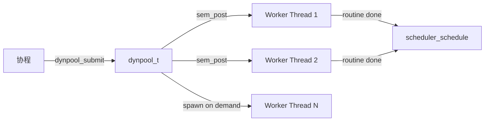
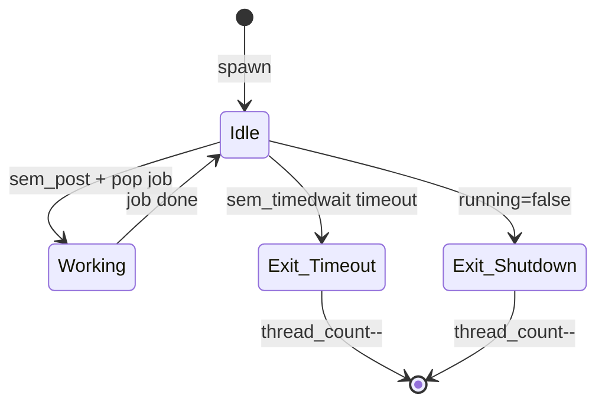

# DynPool 模块设计文档

## 概述

`dynpool` 是一个动态伸缩的阻塞线程池，用于将阻塞操作（DNS 解析、文件 I/O、CPU 密集计算等）从协程调度器的 worker 线程卸载到独立线程执行，避免阻塞协程调度。线程按需创建，空闲超时后自动退出。

## 架构



核心设计原则：
- 提交路径 lock-free（MPSC push）
- 线程按需创建，空闲自动回收
- 线程数有上限，防止资源耗尽
- Worker 使用 detach 模式，无需 join 管理

## 线程模型

| 操作 | 线程安全性 |
|------|-----------|
| `dynpool_submit` | 任意线程，lock-free push |
| `dynpool_destroy` | 调用者线程，等待所有 worker 退出 |

## 核心数据结构

### dynpool_t

```c
struct dynpool_s {
    mpsc_t           queue;         // 任务队列（MPSC lock-free push）
    mtx_t            pop_mtx;      // pop 端互斥（多 worker 竞争 pop）
    platform_sem_t*  sem;          // 通知 worker 有新任务
    _Atomic int32_t  thread_count; // 当前活跃线程数
    _Atomic int32_t  idle_count;   // 当前空闲线程数
    int32_t          max_threads;  // 线程数上限
    uint64_t         idle_timeout; // 空闲超时（ms）
    _Atomic bool     running;      // 运行标志
};
```

### _dynpool_job_t

```c
typedef struct _dynpool_job_s {
    void (*routine)(void*);  // 阻塞任务函数
    void*       arg;         // 任务参数
    mpsc_node_t node;        // MPSC 队列节点
} _dynpool_job_t;
```

## 工作流程

### 提交任务

```
dynpool_submit(pool, routine, arg)
  → alloc _dynpool_job_t
  → mpsc_push(&pool->queue, &job->node)   // lock-free
  → sem_post(pool->sem)                    // 唤醒一个 worker
  → if idle_count==0 && thread_count < max:
       _dynpool_spawn_worker(pool)          // 按需创建
  → return 0
```

### Worker 循环

```
_dynpool_worker_entry(pool)
  loop:
    idle_count++
    rc = sem_timedwait(pool->sem, idle_timeout)
    idle_count--

    if !running → break              // shutdown
    if rc != 0 → break              // 超时，退出

    lock(pop_mtx)
    node = mpsc_pop(&pool->queue)
    unlock(pop_mtx)

    if node:
      job->routine(job->arg)
      free(job)

  thread_count--
  return
```

### 线程生命周期



## 设计决策

### 为什么 pop 端需要 mutex？

MPSC 队列只保证单消费者安全。但 dynpool 有多个 worker 线程竞争 pop，所以需要 `pop_mtx` 将 pop 串行化。Push 端仍然是 lock-free 的。

### 为什么用 detach 而不是 join？

Worker 线程通过 `thrd_detach` 管理：
- 避免维护一个线程句柄数组（线程数量动态变化）
- 退出时自动回收资源
- `dynpool_destroy` 通过轮询 `thread_count` 等待所有 worker 退出

### 按需创建策略

```c
if (idle_count == 0 && thread_count < max_threads) {
    _dynpool_spawn_worker(pool);
}
```

只在没有空闲 worker 且未达上限时创建。新线程创建有成本（~10-50μs），但比阻塞一个协程 worker 线程要好得多。

### 为什么不用条件变量？

信号量比 condvar + mutex 组合更简洁：
- 一个 `sem_post` 精确唤醒一个 worker
- `sem_timedwait` 原生支持超时退出
- 不需要"虚假唤醒"处理

## 与 Scheduler 的协作

典型使用模式（协程中执行阻塞操作）：

```c
// 用户协程内部
void blocking_task_wrapper(void* arg) {
    context_t* ctx = (context_t*)arg;
    ctx->result = do_blocking_work(...);  // 阻塞操作
    scheduler_schedule(sched, ctx->co);   // 完成后唤醒协程
}

// 协程挂起，任务卸载到 dynpool
dynpool_submit(pool, blocking_task_wrapper, ctx);
scheduler_park(sched, park_cb, ctx);
// ... 协程被唤醒后继续
```

## 配置

| 参数 | 默认值 | 说明 |
|------|--------|------|
| max_threads | 256 | 最大线程数 |
| idle_timeout | 10000ms | 空闲超时退出时间 |

## Shutdown 流程

```
dynpool_destroy(pool)
  → running = false
  → sem_post × thread_count       // 唤醒所有 idle worker
  → while thread_count > 0:       // 等待全部退出
       thrd_yield()
  → drain remaining jobs (free)
  → destroy sem + mutex + pool
```

## 公开 API

| 函数 | 说明 |
|------|------|
| `dynpool_create(opts)` | 创建线程池 |
| `dynpool_submit(pool, routine, arg)` | 提交阻塞任务 |
| `dynpool_destroy(pool)` | 销毁线程池 |
