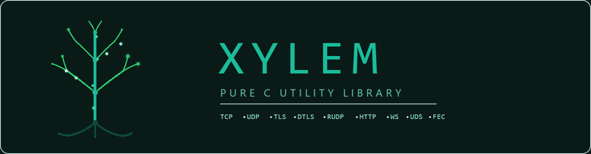

# Xylem SDK

<p align="center">
  
</p>

**Xylem** 是一个纯 C 语言的异步网络 SDK，提供从事件循环到应用层协议的完整网络编程框架。

[English](en/){ .md-button }

---

## 特性

| 类别 | 模块 |
|------|------|
| **核心** | 事件循环（epoll / kqueue / IOCP）、线程池、定时器 |
| **传输层** | TCP、UDP、UDS、TLS、DTLS、RUDP（KCP + FEC + AES） |
| **应用层** | HTTP/1.1 客户端/服务端、WebSocket 客户端/服务端 |
| **设备** | 跨平台串口通信 |
| **工具** | JSON、Gzip、Base64、SHA-1/256、HMAC-256、AES-256、Varint |
| **数据结构** | 链表、队列、栈、堆、红黑树、环形缓冲区 |

## 设计原则

- **零外部依赖**（核心模块）——TLS/DTLS 可选依赖 OpenSSL
- **纯 C11**——兼容所有主流编译器（GCC、Clang、MSVC）
- **跨平台**——Linux、macOS、Windows，可扩展到 Android / iOS
- **回调驱动**——所有 I/O 通过 handler 回调通知，无阻塞
- **线程安全**——`send` 和 `close` 可从任意线程调用
- **模块化**——按需编译，不用的协议不链接

## 快速示例

### TCP Echo 服务端

```c
#include <xylem.h>
#include <stdio.h>

static void on_accept(xylem_tcp_server_t* server, xylem_tcp_conn_t* conn) {
    printf("new connection\n");
}

static void on_read(xylem_tcp_conn_t* conn, void* data, size_t len) {
    xylem_tcp_send(conn, data, len);  // echo back
}

static void on_close(xylem_tcp_conn_t* conn, int err, const char* msg) {
    printf("closed: %s\n", msg ? msg : "normal");
}

int main(void) {
    xylem_startup();

    xylem_loop_t* loop = xylem_loop_create();
    xylem_addr_t addr;
    xylem_addr_resolve(&addr, "0.0.0.0", 8080);

    xylem_tcp_handler_t handler = {
        .on_accept = on_accept,
        .on_read   = on_read,
        .on_close  = on_close,
    };

    xylem_tcp_server_t* server = xylem_tcp_listen(loop, &addr, &handler, NULL);
    xylem_loop_run(loop);

    xylem_loop_destroy(loop);
    xylem_cleanup();
    return 0;
}
```

## 许可证

[MIT License](https://opensource.org/licenses/MIT) — 可自由用于商业和开源项目。
