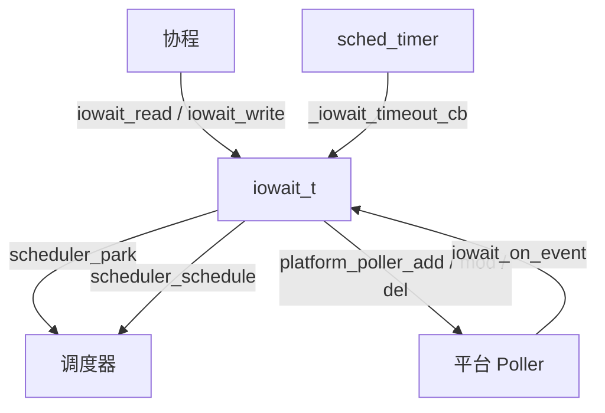

# IOWait 模块设计文档

## 概述

`iowait` 是协程运行时的 I/O 等待原语，将平台 poller 事件（epoll/kqueue/wepoll）转化为协程挂起/唤醒语义。每个 iowait handle 绑定一个非阻塞 fd，提供 read/write 两个方向的独立等待槽，支持超时和外部关闭唤醒。

## 架构



核心设计原则：
- 每个方向（read/write）最多一个协程挂起，互相独立；违反契约时通过 `atomic_exchange` 检测并 `abort`，不静默容忍
- 三种唤醒源（IO 就绪、超时、关闭）通过原子仲裁（`atomic_exchange`）保证恰好唤醒一次
- Handle 通过 pool 回收 + generation tag 解决 stale CQE 问题
- 引用计数保证 handle 在所有 in-flight 引用释放后才真正回收

## 线程模型

| 操作 | 线程安全性 |
|------|-----------|
| `iowait_read` | 单读者，必须从协程调用 |
| `iowait_write` | 单写者，必须从协程调用 |
| `iowait_close` | 任意线程，幂等 |
| `iowait_destroy` | 任意线程 |
| `iowait_set_rd_deadline` | 单方向单 owner |
| `iowait_set_wr_deadline` | 单方向单 owner |
| `iowait_on_event` | poller 线程 |

单 reader / 单 writer 契约由 `_iowait_park_fn` 内的 `atomic_exchange` 检测：如果发布 park 记录时槽里已经有前一个 parker，记录错误日志并 `abort()`，避免静默丢失前一个 parker 的唤醒路径。

## 核心数据结构

### iowait_t

```c
struct iowait_s {
    platform_poller_sq_t* poller;     // 所属 poller
    platform_poller_sqe_t sqe;        // 提交给 poller 的事件描述
    platform_sock_t       fd;         // 绑定的 fd

    _iowait_dir_t         rd;         // 读方向状态
    _iowait_dir_t         wr;         // 写方向状态

    mtx_t                 arm_lock;   // 序列化 poller 注册 / 与 close 互斥

    _Atomic int32_t       refcnt;     // 引用计数
    _Atomic uint16_t      gen;        // generation，retire 时递增
    bool                  registered; // fd 是否已注册到 poller（arm_lock 下访问）
    _Atomic bool          closed;     // 关闭标志

    iowait_pool_t*        pool;              // 所属 pool
    list_node_t           pool_freelist_node;// 空闲链表节点
    list_node_t           pool_registry_node;// 全量注册链表节点
};
```

### _iowait_dir_t（per-direction）

```c
struct _iowait_dir_s {
    iowait_t*                w;        // 所属 handle
    _Atomic(_iowait_park_t*) park;     // 挂起记录槽（原子，仲裁用）
    sched_timer_t*           timer;    // 超时定时器（惰性分配）
    _Atomic uint64_t         deadline; // 绝对超时时间
};
```

### _iowait_park_t（per-park，存在调用者栈上）

```c
struct _iowait_park_s {
    mco_coro*       co;      // 被挂起的协程
    iowait_t*       w;       // 所属 handle
    _iowait_dir_t*  dir;     // 所属方向
    iowait_result_t result;  // 唤醒原因
};
```

### iowait_pool_t

```c
struct iowait_pool_s {
    mtx_t  lock;
    list_t freelist;   // LIFO 空闲链表（pool_freelist_node）
    list_t registry;   // 全量链表，destroy 时遍历释放（pool_registry_node）
};
```

## 生命周期

### 创建

`iowait_create(fd)` 先通过 `scheduler_get_iowait_pool(runtime_get_scheduler())` 取到当前 scheduler 的 pool，然后：

```
iowait_create(fd)
  ├── pool 有空闲 → 从 freelist pop，重置 per-request 字段（保留 gen 单调）
  └── pool 无空闲 → calloc + 初始化 arm_lock，registry 注册
  最后：写 sqe.fd / sqe.ud（编码 gen），release 语义写 refcnt = 1
```

`refcnt` 用 release 存储，配对 `_iowait_tryref` 对 refcnt 的 acquire 加载，保证后续线程能看到已经重置好的 per-request 状态。

### 等待（read/write）

```
iowait_read(w) / iowait_write(w)
  ├── fast path: closed → return IOWAIT_CLOSED
  ├── fast path: deadline 已过 → return IOWAIT_TIMEOUT
  └── slow path:
       ref(w)
       scheduler_park(_iowait_park_fn)
         ├── atomic_exchange 发布 park 记录；若槽非空 → abort（契约违反）
         ├── _iowait_arm(w) 注册/重新 arm fd
         ├── close-race check: closed → 自唤醒 IOWAIT_CLOSED
         └── deadline-race check: 已过期 → 自唤醒 IOWAIT_TIMEOUT
       return park.result
       unref(w)
```

### 唤醒仲裁

三个唤醒源竞争同一个 `dir->park` 槽：

```c
_iowait_park_t* _iowait_claim(slot, result) {
    p = atomic_exchange(slot, NULL);  // 恰好一个 winner
    if (p) p->result = result;
    return p;
}
```

| 唤醒源 | 调用路径 |
|--------|---------|
| IO 就绪 | `iowait_on_event` → `_iowait_claim(&dir->park, IOWAIT_READY)` |
| 超时 | `_iowait_timeout_cb` → `_iowait_claim(&dir->park, IOWAIT_TIMEOUT)` |
| 关闭 | `iowait_close` → `_iowait_claim(&dir->park, IOWAIT_CLOSED)` |

Winner 调用 `scheduler_schedule(co)` 唤醒协程；Loser 得到 NULL，不做任何事。

### 关闭

```
iowait_close(w)
  ├── CAS closed: false→true（幂等，仅首次执行后续逻辑）
  ├── arm_lock 下：若 registered 则 platform_poller_del + 清 registered
  │   （保证返回后 fd 可安全 close，无延迟 EPOLL_CTL_DEL 打到回收的 fd 号）
  └── claim 并唤醒两个方向的 waiter
```

同步 `poller_del` 的语义保证：`iowait_close` 返回后调用者 `close(fd)` 不会被 "CQE 先投递再被 poller 看到" 的窗口影响。

### 销毁与回收

```
iowait_destroy(w)
  ├── 若未 close → iowait_close(w)
  └── unref(w)
       └── refcnt→0 时 _iowait_retire:
            ├── 销毁 per-direction timers
            ├── gen++ (release ordering)
            └── push 回 pool freelist
```

`arm_lock` 在 retire 时**不销毁**，仅在 `iowait_pool_destroy` 遍历 registry 时销毁。这是必要的：池化回收后，一个延迟到达的 stale CQE 仍然可能通过 `_iowait_tryref` 触达 `_iowait_arm` 并尝试加锁；锁必须保持可用直到整个 pool 销毁。

## Generation Tag 防 Stale CQE

**问题：** epoll_wait 返回的 CQE 批次中可能携带已被回收 handle 的 ud 指针。如果 handle 被 pool 重新分配给新调用者，stale CQE 会错误地唤醒新 generation。

**解决：** 64 位 ud 的高 16 位编码 generation：

```
 63        48 47                                    0
 ┌──────────┬─────────────────────────────────────────┐
 │  gen(16) │           iowait_t* (48 bits)           │
 └──────────┴─────────────────────────────────────────┘
```

所有 64 位目标平台（Linux x86-64/ARM64、macOS ARM64、Windows x64 wepoll）的用户态虚地址都在低 48 位内，高 16 位可以无损承载 tag。

`iowait_on_event` 流程：
1. 解码 ud → `(ptr, tag)`
2. `_iowait_tryref(ptr, tag)`：CAS 循环 bump refcnt（仅当 > 0），然后 acquire 加载 gen 比对 tag
3. gen 不匹配 → unref + return（stale CQE 被安全丢弃）
4. 匹配 → 正常 dispatch

16 位 = 65536 代，需要同一个 pool slot 在单个 CQE 批次未处理期间循环 65536 次才会 alias，不现实。

## Poller Arm 策略

根据平台 poller 触发模式分两条路径，由 `PLATFORM_POLLER_TRIGGER_MODE` 编译期决定：

### Edge-Triggered (ET)（Linux/macOS）

- 首次 park 时 `platform_poller_add(RD|WR)` 一次性注册
- 后续 park 不再触碰 poller（fd 常驻 epoll）
- `registered` 标志为单向 false→true，fast path 可无锁读（陈旧 false 会 fall-through 到加锁的 slow path）

### Level-Triggered + Oneshot (LT+oneshot)（Windows wepoll）

- 每次 event 后内核自动取消注册
- `iowait_on_event` 中 dispatch 完毕后按当前仍挂起的方向重新 `_iowait_arm`
- `_iowait_park_fn` 本身也会调用 `_iowait_arm` 补齐该方向
- `arm_lock` 序列化"观察 park slots → 构建 sqe op → 提交 add/mod"，防止并发 mod 互相覆盖方向位

### arm_lock 与 close 的协作

`_iowait_arm` 进入时 acquire 读 `closed` 快速路径返回；加锁后再次 acquire 读 `closed` 作为二次检查。`iowait_close` 先 CAS 写 `closed=true`，再获取 `arm_lock` 调 `poller_del`。这保证：

- close 的 CAS happens-before 后续 arm 的 acquire 读 `closed`（任意 arm 要么在 close 之前完成并已注册，要么看到 closed 提前退出）
- 不会出现 close `poller_del` 之后又被一个迟到的 arm 重新注册

## Handle Pool

- Pool 生命周期与 scheduler 绑定；`iowait_create` 通过 `scheduler_get_iowait_pool` 获取
- 不缩容：retired handle 留在 `registry` 中等待统一释放，保证 type-stable（stale CQE 可安全解引用结构体字段再通过 gen 拒绝）
- `iowait_pool_destroy` 在 scheduler 销毁后调用，此时无 worker 存活，无 in-flight CQE，可以安全销毁 `arm_lock` 并释放每个 handle 的内存

## 引用计数协议

| 事件 | ref 变化 |
|------|---------|
| `iowait_create` | refcnt = 1（release store） |
| `_iowait_wait` 进入 park | +1 |
| `_iowait_wait` park 返回 | -1 |
| `_iowait_set_deadline` arm timer | +1（仅当新 timer 实际 start 时） |
| `_iowait_timeout_cb` 执行完 | -1（必须在 claim 之后最后一步） |
| `_iowait_set_deadline` stop 成功取消 pending | -1（回补 arm 时 +1） |
| `iowait_on_event` tryref 成功 | +1 |
| `iowait_on_event` dispatch 完毕 | -1 |
| `iowait_destroy` | -1（可能触发 retire） |

refcnt 到 0 时触发 `_iowait_retire`，归还 pool。`_iowait_timeout_cb` 中 `_iowait_unref` 必须是最后一个动作：一旦这一步释放，迟到的 `iowait_destroy` 就可能把 handle 和 dir 的内存回收掉。

## 超时机制

- 每个方向独立拥有一个 `sched_timer_t`（惰性分配）
- deadline 为绝对单调毫秒时间戳（`XYLEM_TIME_PRECISION_MSEC`），0 表示无超时
- `_iowait_set_deadline` 先 release 存 deadline 字段，再 `sched_timer_stop` 旧 timer（若成功取消则回收其 ref），然后按需 lazy 创建 timer 并 `sched_timer_start`
- Timer 回调通过 `_iowait_claim` 竞争唤醒槽；若输给 IO 事件或 close 则无操作
- 已知 corner case：deadline 设为 0 时若 callback 已被 dispatch 但尚未执行（scheduler 已把它摘出等待锁），会产生一次额外 IOWAIT_TIMEOUT 唤醒。内存安全由 refcount 协议保证（scheduler 持有 timer 对象直到 fire 完成），但该额外 wake 无法被消除

## 竞态分析

### Park 与 Close 竞态

```
Thread A (park)              Thread B (close)
────────────────             ────────────────
                             CAS closed=true (acq_rel)
                             arm_lock:  poller_del + registered=false
publish park slot (release)
arm fd (acquire closed → true，提前返回)
check closed → true!
self-claim → wake
```

Park 在发布 slot 后重新检查 closed，若已关闭则自唤醒。Close 端 claim 看到 NULL（park 还没发布）不会遗漏，因为 parker 自己兜底。内存序链：close 的 acq_rel CAS → parker 的 acquire 加载。

### Park 与 Deadline 竞态

类似 close 竞态：park 发布 slot 后重新检查 deadline 是否已过，若已过则自 claim 为 `IOWAIT_TIMEOUT`。

### Arm 竞态（LT+oneshot）

Park 线程和 poller 线程都可能调用 `_iowait_arm`。`arm_lock` 序列化整个"读 park slots → 写 sqe.op → 提交 add/mod"流程，保证 mod 不会互相覆盖方向位。ET 的 fast path 绕过锁是安全的，因为 `registered` 只做一次单向翻转。

### 单方向重入 park 契约违反

`_iowait_park_fn` 用 `atomic_exchange` 发布 park 记录：返回值非 NULL 意味着前一个 parker 还没被唤醒，此时按设计契约不可能发生，立即 `xylem_loge` + `abort()`。这避免前一个 parker 被静默孤立、其 handle ref 永远泄漏。

## 公开 API

| 函数 | 说明 |
|------|------|
| `iowait_create(fd)` | 创建 handle，绑定 fd |
| `iowait_read(w)` | 协程等待 fd 可读 |
| `iowait_write(w)` | 协程等待 fd 可写 |
| `iowait_set_rd_deadline(w, ms)` | 设置读超时（绝对单调毫秒，0 清除） |
| `iowait_set_wr_deadline(w, ms)` | 设置写超时（绝对单调毫秒，0 清除） |
| `iowait_close(w)` | 关闭 handle，唤醒所有 waiter，同步 poller_del |
| `iowait_destroy(w)` | 销毁 handle（隐式 close） |
| `iowait_is_closed(w)` | 查询是否已关闭 |
| `iowait_on_event(revents, ud)` | Poller 事件回调入口 |
| `iowait_pool_create()` | 创建 handle pool |
| `iowait_pool_destroy(pool)` | 销毁 pool 及所有 handle |
