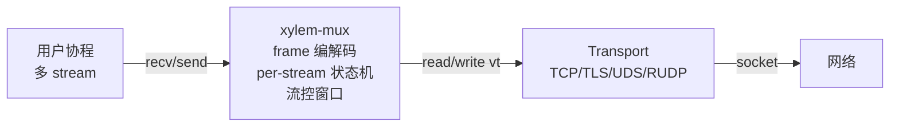

# MUX 模块设计文档

## 概述

`xylem-mux` 在**可靠有序字节流**之上提供轻量多流复用。语义对齐 yamux / HTTP/2 风格：单条底层连接承载 N 个独立的逻辑 stream，每个 stream 双向、字节流、带 per-stream 流控。

适用 transport：TCP / TLS / UDS / RUDP。**不适用 DTLS / UDP**（见"非目标"）。

## 非目标

- **DTLS / UDP 不接入**。yamux 风格 mux 的核心价值是"把可靠字节流切分成多个可靠子流"。底层不可靠时，"可靠"这个语义底子消失，mux 提供的功能（demux、流控、accept 队列）在 datagram 场景下都有更轻的解法（type byte / 多 socket / 协议自带的请求 ID），不应叠加 yamux 协议头。
- **不做拥塞控制**。底层 TCP/TLS/UDS 自身有 CC，RUDP 的 KCP 也有；mux 层只做应用级 per-stream window，不做 packet-level CC。
- **不做加密**。加密由底层 transport（TLS）或上层应用负责。
- **不做可靠化 / 重传**。底层已保证。
- **不做连接迁移、路径切换**。这是 QUIC 的领域。

## 架构



数据流：

```
发送：用户 stream.send(data) -> 拆分 frame -> _mux_write_frame(写互斥) -> transport.send
接收：transport.recv -> reader 协程读 frame header + payload -> 按 stream_id 路由到 stream recv buf -> 唤醒用户协程
```

## Transport 抽象

mux 不直接依赖任何具体 transport，而是通过 vtbl 接口对接：

```c
typedef struct xylem_mux_transport_vt_s {
    int64_t (*read)(void* ctx, void* buf, size_t len);
    int     (*write)(void* ctx, const void* data, size_t len);
} xylem_mux_transport_vt_t;
```

`read` / `write` 语义严格对齐项目里 tcp/tls/uds/rudp 的同步协程 API：阻塞、可被 deadline 唤醒、错误返回 -1、对端关闭 read 返回 0。

每个 transport 提供一个 ~10 行的 adapter 函数包装 vt，上层用户调用便利函数：

```c
xylem_mux_t* xylem_mux_attach_tcp (xylem_tcp_conn_t*  c, role, opts);
xylem_mux_t* xylem_mux_attach_tls (xylem_tls_conn_t*  c, role, opts);
xylem_mux_t* xylem_mux_attach_uds (xylem_uds_conn_t*  c, role, opts);
xylem_mux_t* xylem_mux_attach_rudp(xylem_rudp_conn_t* c, role, opts);
```

便利函数内部组装 vt 并转调底层 `xylem_mux_create`。用户不接触 vt。

## 公开类型

### 不透明句柄

```c
typedef struct xylem_mux_s        xylem_mux_t;
typedef struct xylem_mux_stream_s xylem_mux_stream_t;
```

### 角色

```c
typedef enum xylem_mux_role_e {
    XYLEM_MUX_CLIENT, /*< 主动开流使用奇数 ID（1, 3, 5...）*/
    XYLEM_MUX_SERVER  /*< 主动开流使用偶数 ID（2, 4, 6...）*/
} xylem_mux_role_t;
```

ID 奇偶分配避免双方同时开流时 ID 冲突。

### 选项

```c
typedef struct xylem_mux_opts_s {
    uint32_t max_stream_window; /*< per-stream 接收窗口，0 = 256KB */
    uint32_t max_streams;       /*< 最大并发 stream 数，0 = 无限 */
    uint64_t keepalive_ms;      /*< Ping 间隔，0 = 关闭 */
} xylem_mux_opts_t;
```

## 公开 API

```c
extern xylem_mux_t* xylem_mux_create(void*                  conn,
                                     xylem_mux_transport_t  transport,
                                     xylem_mux_role_t       role,
                                     xylem_mux_opts_t*      opts);

extern void                xylem_mux_destroy(xylem_mux_t* mux);

extern xylem_mux_stream_t* xylem_mux_open_stream  (xylem_mux_t* mux);
extern xylem_mux_stream_t* xylem_mux_accept_stream(xylem_mux_t* mux);

extern int64_t xylem_mux_read(xylem_mux_stream_t* s, void* buf, size_t len);
extern int     xylem_mux_write(xylem_mux_stream_t* s, const void* data, size_t len);
extern void    xylem_mux_close_stream(xylem_mux_stream_t* s);

extern void    xylem_mux_set_read_deadline (xylem_mux_stream_t* s, uint64_t deadline_ms);
extern void    xylem_mux_set_write_deadline(xylem_mux_stream_t* s, uint64_t deadline_ms);
```

## 协议帧格式

12 字节定长 header + 可变 payload：

```
 0                   1                   2                   3
 0 1 2 3 4 5 6 7 8 9 0 1 2 3 4 5 6 7 8 9 0 1 2 3 4 5 6 7 8 9 0 1
+-+-+-+-+-+-+-+-+-+-+-+-+-+-+-+-+-+-+-+-+-+-+-+-+-+-+-+-+-+-+-+-+
|    version    |     type      |             flags             |
+-+-+-+-+-+-+-+-+-+-+-+-+-+-+-+-+-+-+-+-+-+-+-+-+-+-+-+-+-+-+-+-+
|                          stream_id                            |
+-+-+-+-+-+-+-+-+-+-+-+-+-+-+-+-+-+-+-+-+-+-+-+-+-+-+-+-+-+-+-+-+
|                           length                              |
+-+-+-+-+-+-+-+-+-+-+-+-+-+-+-+-+-+-+-+-+-+-+-+-+-+-+-+-+-+-+-+-+
|                          payload (length bytes)               |
+-+-+-+-+-+-+-+-+-+-+-+-+-+-+-+-+-+-+-+-+-+-+-+-+-+-+-+-+-+-+-+-+
```

字节序：网络序（big-endian）。

### Type

| 值 | 名称 | 含义 |
|---|---|---|
| 0 | DATA | 应用数据，payload 为 stream 字节流 |
| 1 | WINDOW_UPDATE | 流控窗口扩展，length 字段为字节增量 |
| 2 | PING | keepalive，length 字段为对端回显的 nonce |
| 3 | GO_AWAY | 优雅关闭整个 mux 会话 |

### Flags

| 位 | 名称 | 含义 |
|---|---|---|
| 0x01 | SYN | 创建新 stream（DATA 或 WINDOW_UPDATE 首帧携带）|
| 0x02 | ACK | PING 响应 |
| 0x04 | FIN | 半关闭：发送方不再发数据，但仍可接收 |
| 0x08 | RST | 立即重置 stream，丢弃未发数据 |

### 单 frame 大小限制

`length` 字段 32 位允许最大 4GB payload，但内部限制单 frame ≤ `MUX_MAX_FRAME_PAYLOAD = 65535` 字节。`xylem_mux_write` 的大消息自动分片成多个 DATA frame。

理由：limit 单 frame 大小防止单 stream 长占写互斥。65535 是经验值（HTTP/2 默认 16384，yamux 默认 unlimited，取中间）。

## Stream 状态机

```
        open_stream(local)        SYN frame received
              │                          │
              ▼                          ▼
         SYN_SENT  ──────────►   ESTABLISHED   ◄────── server 端 SYN 收到
              │                  │         │
              │                  │         │
              │            send  │         │ recv FIN
              │             FIN  │         │
              │                  ▼         ▼
              │           LOCAL_CLOSE   REMOTE_CLOSE
              │                  │         │
              │           recv   │         │ send
              │            FIN   │         │  FIN
              │                  ▼         ▼
              └─────────────►   CLOSED
```

任意状态收到 RST flag 或本地调用 `xylem_mux_close_stream` → 直接到 CLOSED。

## 流控

每个 stream 维护两个独立窗口：

- `send_window`：本地能发多少字节才不会撑爆对端 recv buf。初值 = 对端 SYN 时通告的 window；收到对端 WINDOW_UPDATE 增加；每次 send 减少。归零则 send 协程 park。
- `recv_window`：本地承诺对端可发多少。初值 = `opts.max_stream_window`；收到 DATA 时减少；recv 消费 buf 后累计 ≥ 50% 时发 WINDOW_UPDATE 还回去。

会话级窗口：**当前不做**。per-stream 已能挡住单流恶意填充；进程级总内存控制由 `max_streams * max_stream_window` 上限决定。

## 写互斥

mux 内部一把 `xylem_mutex_t` 保护 transport.write。所有 frame 写出（DATA / WINDOW_UPDATE / PING / GO_AWAY）必须先拿锁。

理由：transport.write 不是原子的（TLS 一次 SSL_write 内部可能多次 write syscall），多协程并发写会撕裂 frame。

代价：单 stream 大块写会短暂阻塞其他流的 frame。mux 协议 frame ≤ 64KB 限制使阻塞窗口可控。

## 并发模型

每个 mux 会话一个 reader 协程（在 `xylem_mux_attach_*` 时 spawn），不断从 transport 读 frame、解析、按 stream_id 路由到对应 stream 的 recv buf。

用户协程：
- N 个用户协程通过 stream 读写，park / wake 由 reader 协程驱动
- 用户协程调 send → 直接 transport.write（拿写互斥），不走 reader

```
                    ┌─────────────────────────┐
                    │   xylem_mux_t           │
                    │   ┌─────────────┐       │
   transport ───────┼──►│ reader coro │       │
                    │   └──────┬──────┘       │
                    │          │ demux        │
                    │   ┌──────▼──────┐       │
                    │   │ streams[]   │       │
                    │   └──────┬──────┘       │
                    │          │ wake         │
                    │   ┌──────▼──────┐       │
   user coro ───────┼──►│ recv/send   │       │
                    │   └─────────────┘       │
                    └─────────────────────────┘
```

## 错误处理

| 场景 | 行为 |
|---|---|
| transport.read 返回 0 / -1 | reader 协程退出，所有 stream 标 RST，accept_ch 关闭 |
| 收到不支持 version | reader 退出，同上 |
| 用户调 `xylem_mux_destroy` | 发送 GO_AWAY，标所有 stream RST，等 reader 退出 |
| 用户调 `xylem_mux_close_stream` | 发送 FIN，转 LOCAL_CLOSE 或 CLOSED |
| 收到对端 FIN | recv 返回 0（半关闭，仍可 send） |
| 收到对端 RST | recv/send 返回 -1，stream 转 CLOSED |
| send 时 send_window=0 | 协程 park 在 send_park，对端 WINDOW_UPDATE 唤醒 |
| send 时 stream 已 closed | 立即返回 -1 |

## 测试范围（MVP）

- TCP echo（一个 stream，client send → server recv → echo back）
- TCP 多 stream 并发（3 个 stream 各发各的，互不干扰）
- TCP close 行为（stream FIN，session GO_AWAY）
- RUDP echo（验证 UDP 之上叠 mux 的特殊路径）
- TLS / UDS adapter：仅编译验证，运行测试后续单独 spec

## 已知限制 / 待办

第一版有意保留以下问题，后续单独 spec 修复：

1. `_mux_find_stream` O(N) 线性扫描；改 hashmap
2. `streams[]` 数组只增不减；close 后槽位不复用
3. recv buf 无限 realloc；应配合 recv_window 限制
4. RST 时 recv buf 残留数据未清理
5. `keepalive_ms` 选项未实现 driver
6. `set_read_deadline` 字段已存但 park 未挂超时
7. Reader 协程依赖 transport.read 阻塞唤醒；transport.close 必须能唤醒该协程，否则 mux_destroy 会泄漏 reader
8. mux session 不做 refcount over external API；所有 stream close 后 mux 自身仍存活到用户调 `xylem_mux_destroy`

第一版目标：协议格式定型 + 主路径跑通 + 4 个 transport adapter + 基本测试。
