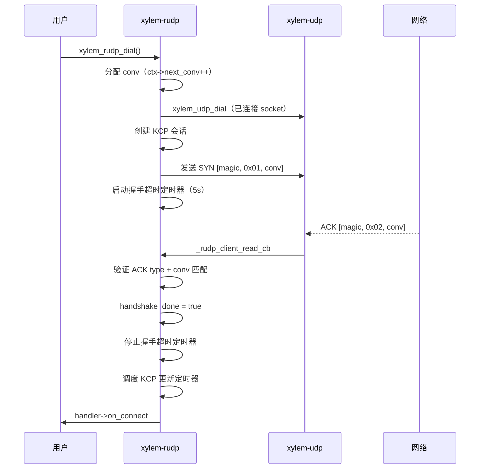
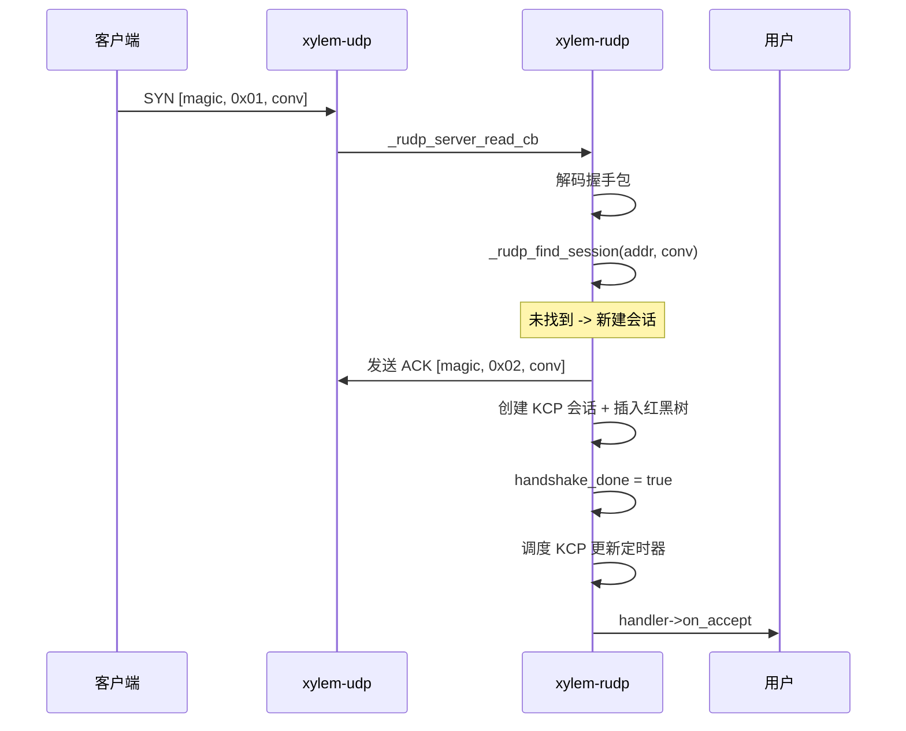
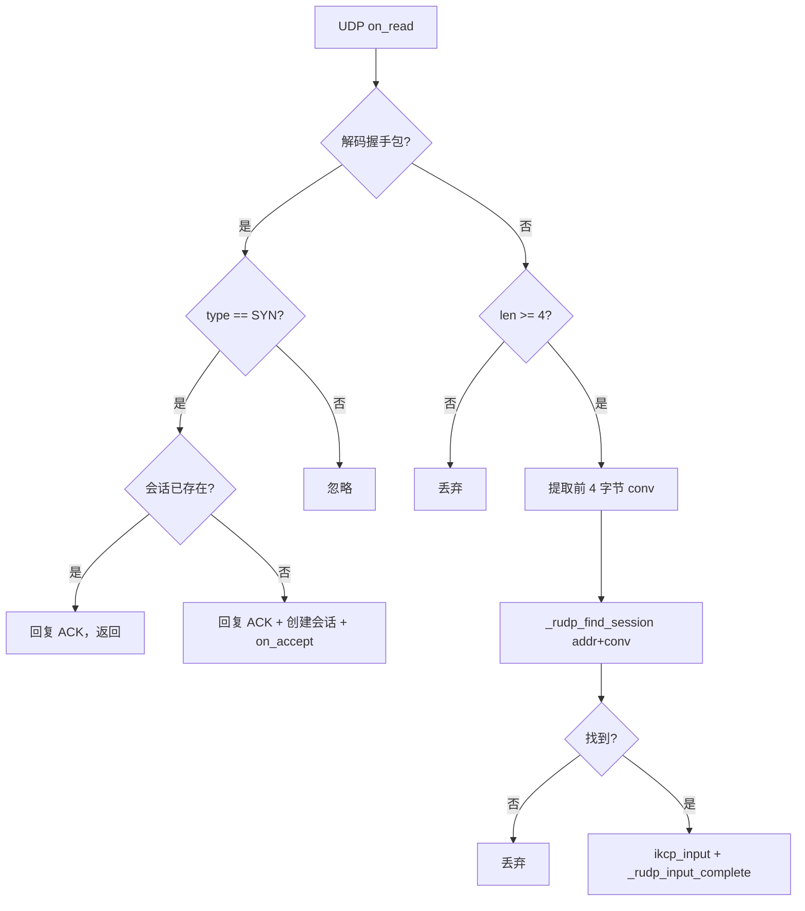
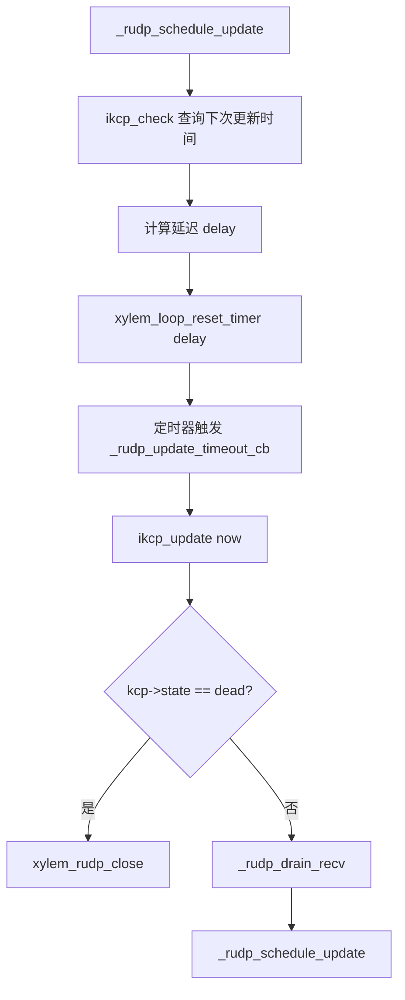
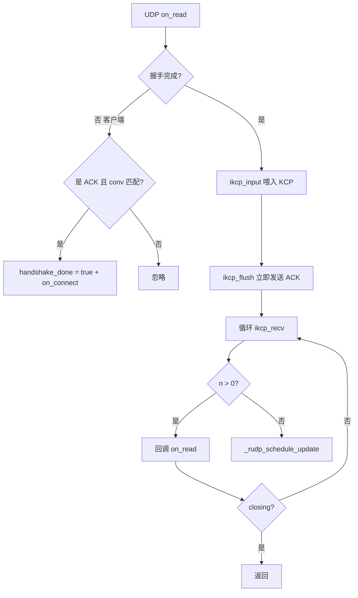

# RUDP 模块设计文档

## 概述

`xylem-rudp` 在 UDP 模块之上提供可靠数据传输，基于 KCP（ARQ 协议）实现自动重传、拥塞控制和有序交付。客户端使用已连接 UDP socket（dial 模式），服务端在单个 UDP socket 上通过（对端地址, conv）复合键多路复用多个 KCP 会话。

## 架构


分层数据流：

```
发送: 用户 -> xylem_rudp_send -> ikcp_send + ikcp_flush -> _rudp_kcp_output_cb -> xylem_udp_send -> 网络
接收: 网络 -> UDP on_read -> ikcp_input -> ikcp_flush(ACK) -> ikcp_recv -> on_read -> 用户
```

## 公开类型

### 回调处理器

```c
typedef struct xylem_rudp_handler_s {
    void (*on_connect)(xylem_rudp_t* rudp);
    void (*on_accept)(xylem_rudp_server_t* server, xylem_rudp_t* rudp);
    void (*on_read)(xylem_rudp_t* rudp, void* data, size_t len);
    void (*on_close)(xylem_rudp_t* rudp, int err, const char* errmsg);
} xylem_rudp_handler_t;
```

- `on_connect`：客户端握手完成后触发
- `on_accept`：服务端收到新会话的 SYN 握手并创建 KCP 会话后触发
- `on_read`：收到完整 KCP 消息后触发（KCP 保证有序交付）
- `on_close`：会话关闭时触发。正常关闭时 `err=0`、`errmsg=NULL`；dead link 超时时 `err=-1`、`errmsg="dead link"`；握手超时时 `err=-1`、`errmsg="handshake timeout"`

与 DTLS handler 的区别：
- 无 `on_write_done`（`xylem_rudp_send` 将数据入队 KCP 发送缓冲区后立即返回）

### 传输模式

```c
typedef enum xylem_rudp_mode_e {
    XYLEM_RUDP_MODE_DEFAULT,  /* 标准 ARQ，100ms 更新间隔 */
    XYLEM_RUDP_MODE_FAST,     /* nodelay + 快速重传 + 无拥塞控制 */
} xylem_rudp_mode_t;
```

### 连接选项

```c
typedef struct xylem_rudp_opts_s {
    xylem_rudp_mode_t mode;
    int      snd_wnd;       /* 发送窗口，默认 32 */
    int      rcv_wnd;       /* 接收窗口，默认 128 */
    int      mtu;           /* MTU，默认 1400 */
    bool     stream;        /* true: 字节流模式，false: 消息模式 */
    uint64_t timeout_ms;    /* dead link 超时，0 禁用 */
    uint64_t handshake_ms;  /* 握手超时，0 使用默认值（5000ms） */
} xylem_rudp_opts_t;
```

### 不透明类型

```c
typedef struct xylem_rudp_s        xylem_rudp_t;
typedef struct xylem_rudp_ctx_s    xylem_rudp_ctx_t;
typedef struct xylem_rudp_server_s xylem_rudp_server_t;
```

## 内部结构

### RUDP 上下文

```c
struct xylem_rudp_ctx_s {
    uint32_t next_conv;   /* 下一个 KCP 会话 ID，PRNG 种子初始化 */
};
```

`next_conv` 在 `xylem_rudp_ctx_create` 时通过 `xylem_utils_getprng` 随机初始化，每次 `xylem_rudp_dial` 递增分配。随机种子确保跨进程重启不会产生 conv 冲突。

### RUDP 会话

```c
struct xylem_rudp_s {
    ikcpcb*                kcp;
    xylem_udp_t*           udp;
    xylem_rudp_handler_t*  handler;
    xylem_rudp_server_t*   server;          /* 服务端会话非 NULL */
    xylem_addr_t           peer_addr;
    void*                  userdata;
    bool                   handshake_done;
    bool                   closing;
    int                    close_err;
    const char*            close_errmsg;
    uint32_t               conv;            /* KCP 会话 ID */
    xylem_loop_t*          loop;
    xylem_loop_timer_t*    update_timer;     /* KCP 更新定时器 */
    xylem_loop_timer_t*    handshake_timer;  /* 仅客户端 */
    xylem_rbtree_node_t    server_node;      /* 服务器会话红黑树节点 */
};
```

### RUDP 服务器

```c
struct xylem_rudp_server_s {
    xylem_udp_t*           udp;       /* 共享的 UDP socket（listen 模式） */
    xylem_rudp_ctx_t*      ctx;
    xylem_rudp_handler_t*  handler;
    xylem_rudp_opts_t      opts;
    xylem_loop_t*          loop;
    xylem_rbtree_t         sessions;  /* 活跃会话红黑树，按 (addr, conv) 排序 */
    void*                  userdata;
    bool                   closing;
};
```

## 握手协议

RUDP 使用轻量级 SYN/ACK 握手确认对端存在，然后才建立 KCP 会话。

### 握手包格式

```
[magic:4][type:1][conv:4] = 9 字节
```

| 字段 | 偏移 | 大小 | 说明 |
|------|------|------|------|
| magic | 0 | 4 | 固定值 `0x58594C4D`（"XYLM"），区分握手包与 KCP 数据包 |
| type | 4 | 1 | `0x01` = SYN，`0x02` = ACK |
| conv | 5 | 4 | KCP 会话 ID |

KCP 数据包的前 4 字节是 conv 字段（小端整数），与 magic 值不会冲突，因此可以通过前 4 字节区分握手包和数据包。

### 客户端握手



握手超时（默认 `RUDP_DEFAULT_HANDSHAKE_MS = 5000ms`，可通过 `opts->handshake_ms` 自定义）后自动关闭会话，`on_close` 携带 `err=-1, errmsg="handshake timeout"`。

### 服务端握手



服务端收到 SYN 时无论会话是否已存在都会回复 ACK（客户端可能丢失了第一个 ACK）。若会话已存在则仅回复 ACK，不重复创建。

## 会话多路复用

服务端在单个 UDP socket 上管理多个 KCP 会话。会话存储在红黑树中，使用复合键 `(peer_addr, conv)` 排序。

### 地址比较

`_rudp_addr_cmp` 比较两个 `xylem_addr_t`：

1. 比较地址族（`ss_family`）
2. IPv4：比较 `sin_port`（网络序转主机序），再比较 4 字节 `sin_addr`
3. IPv6：比较 `sin6_port`（网络序转主机序），再比较 16 字节 `sin6_addr`

### 会话查找

`_rudp_session_cmp` 先比较地址，地址相同再比较 conv。红黑树提供两个比较器：

- `_rudp_session_cmp_nn`：节点-节点比较器，用于插入
- `_rudp_session_cmp_kn`：键（`_rudp_session_key_t`）-节点比较器，用于查找

`_rudp_find_session` 调用 `xylem_rbtree_find` 在 O(log n) 时间内查找会话。

### 数据包分发

服务端收到 UDP 数据报时的分发逻辑：



## KCP 集成

### KCP 输出回调

```c
static int _rudp_kcp_output_cb(const char* buf, int len,
                               ikcpcb* kcp, void* user);
```

KCP 需要发送数据时调用此回调，内部通过 `xylem_udp_send` 将 KCP 包发送到对端。客户端使用已连接 socket（`dest=NULL`），服务端使用 `peer_addr` 作为目标地址。

### KCP 更新定时器

KCP 需要定期调用 `ikcp_update` 处理重传、窗口探测等内部逻辑。RUDP 使用事件循环的一次性定时器驱动：



`ikcp_check` 返回下次需要调用 `ikcp_update` 的时间戳，RUDP 据此设置精确的一次性定时器，避免固定间隔轮询的浪费。

### 时钟

`_rudp_clock_ms` 返回 32 位毫秒时间戳，截断自 `xylem_utils_getnow`。无符号 32 位减法在溢出时自动回绕，保证时间差计算正确。

### 模式配置

`_rudp_apply_opts` 根据 `xylem_rudp_opts_t` 配置 KCP 参数：

| 模式 | nodelay | interval | resend | nc | 说明 |
|------|---------|----------|--------|----|------|
| DEFAULT | 0 | 100ms | 0 | 0 | 标准 ARQ，适合一般场景 |
| FAST | 1 | 10ms | 2 | 1 | 无延迟 ACK + 快速重传（2 次跳过即重传）+ 关闭拥塞控制 |

Dead link 检测：`timeout_ms / interval` 计算 dead_link 阈值（最小为 1）。当 KCP 内部检测到连续重传次数超过阈值时，`kcp->state` 置为 `-1`，下次 `_rudp_update_timeout_cb` 触发时关闭会话。

## 数据路径

### 读取路径



收到 KCP 数据后立即 `ikcp_flush` 发送 ACK，不等待下次更新定时器，确保对端获得及时的 RTT 和窗口反馈。

### 写入路径

```c
int xylem_rudp_send(xylem_rudp_t* rudp, const void* data, size_t len);
```

1. 检查握手已完成且未关闭
2. `ikcp_send` 将数据入队 KCP 发送缓冲区
3. `ikcp_flush` 立即发送（不等待下次更新定时器）
4. `_rudp_schedule_update` 重新调度更新定时器

返回 0 成功，-1 失败（未握手、已关闭、KCP 入队失败）。

## 关闭流程

### 客户端关闭

```mermaid
sequenceDiagram
    participant User as 用户
    participant RUDP as xylem-rudp
    participant UDP as xylem-udp
    participant Loop as 事件循环

    User->>RUDP: xylem_rudp_close()
    Note over RUDP: closing = true（幂等）
    RUDP->>RUDP: 停止 update_timer
    RUDP->>RUDP: 停止 handshake_timer
    RUDP->>UDP: xylem_udp_close()
    UDP->>RUDP: _rudp_client_close_cb
    RUDP->>RUDP: closing = true + 停止定时器（防御性）
    RUDP->>RUDP: ikcp_release
    RUDP->>User: handler->on_close
    RUDP->>Loop: xylem_loop_post(_rudp_free_cb)
    Loop->>RUDP: 下一轮迭代释放内存
```

客户端拥有独立的 UDP socket（dial 模式），关闭时一并关闭。`_rudp_client_close_cb` 在 UDP `on_close` 中触发，首先设置 `closing = true` 并停止 `update_timer` 和 `handshake_timer`（防止定时器在 UDP socket 已关闭后触发）。接着检查 UDP 层是否携带了非零错误码：若 RUDP 层尚未设置自身的 `close_err`（即 `close_err == 0`），则将 UDP 层的 `err` 和 `errmsg` 传播到 RUDP 会话的 `close_err`/`close_errmsg`，确保用户在 `on_close` 回调中能看到底层传输错误（如 `ECONNREFUSED`）。然后释放 KCP 会话并通知用户。在 Linux/macOS 上，已连接 UDP socket 可能因 ICMP port unreachable 收到 `ECONNREFUSED`，导致 `_rudp_client_close_cb` 在握手超时定时器触发之前被调用，因此需要在此处主动停止定时器。

### 服务端会话关闭

服务端会话共享同一个 UDP socket，关闭时：

1. 设置 `closing = true`（幂等）
2. 停止 `update_timer`
3. 从 server 的 sessions 红黑树移除
4. `ikcp_release` 释放 KCP 会话
5. 回调 `on_close`
6. `xylem_loop_post` 延迟释放内存

UDP socket 不关闭（由 server 管理）。

### 服务器关闭

```c
void xylem_rudp_close_server(xylem_rudp_server_t* server);
```

1. 设置 `closing = true`（幂等）
2. 循环取红黑树首节点（`xylem_rbtree_first`），逐个调用 `xylem_rudp_close`（每次 close 会从树中移除节点）
3. 关闭共享的 UDP socket（`_rudp_server_close_cb` 释放 server 内存）

## 延迟释放

所有会话内存通过 `xylem_loop_post(_rudp_free_cb)` 延迟到下一轮事件循环迭代释放，确保当前回调链中的指针仍然有效。`_rudp_free_cb` 负责销毁 `update_timer`、`handshake_timer`（若存在）并释放会话结构体。

## 与 DTLS 模块的关键差异

| 特性 | DTLS | RUDP |
|------|------|------|
| 加密 | OpenSSL DTLS | 无（纯可靠传输） |
| 可靠性 | 无（UDP 语义） | KCP ARQ 自动重传 + 有序交付 |
| 会话标识 | 对端地址 | (对端地址, conv) 复合键 |
| 握手 | DTLS 握手（cookie 交换） | 轻量级 SYN/ACK（9 字节） |
| 重传 | OpenSSL DTLSv1_handle_timeout | KCP 内部 ARQ |
| 拥塞控制 | 无 | KCP 内置（可通过 FAST 模式关闭） |
| 流模式 | 数据报模式 | 可选消息模式或字节流模式 |
| 服务端 UDP | listen 模式（未连接） | listen 模式（未连接） |
| 客户端 UDP | dial 模式（已连接） | dial 模式（已连接） |

## 公开 API

### 上下文

```c
xylem_rudp_ctx_t* xylem_rudp_ctx_create(void);
void              xylem_rudp_ctx_destroy(xylem_rudp_ctx_t* ctx);
```

### 会话

```c
xylem_rudp_t*       xylem_rudp_dial(xylem_loop_t* loop, xylem_addr_t* addr,
                                     xylem_rudp_ctx_t* ctx,
                                     xylem_rudp_handler_t* handler,
                                     xylem_rudp_opts_t* opts);
int                 xylem_rudp_send(xylem_rudp_t* rudp,
                                     const void* data, size_t len);
void                xylem_rudp_close(xylem_rudp_t* rudp);
const xylem_addr_t* xylem_rudp_get_peer_addr(xylem_rudp_t* rudp);
xylem_loop_t*       xylem_rudp_get_loop(xylem_rudp_t* rudp);
void*               xylem_rudp_get_userdata(xylem_rudp_t* rudp);
void                xylem_rudp_set_userdata(xylem_rudp_t* rudp, void* ud);
```

### 服务器

```c
xylem_rudp_server_t* xylem_rudp_listen(xylem_loop_t* loop, xylem_addr_t* addr,
                                        xylem_rudp_ctx_t* ctx,
                                        xylem_rudp_handler_t* handler,
                                        xylem_rudp_opts_t* opts);
void                 xylem_rudp_close_server(xylem_rudp_server_t* server);
void*                xylem_rudp_server_get_userdata(xylem_rudp_server_t* server);
void                 xylem_rudp_server_set_userdata(xylem_rudp_server_t* server,
                                                     void* ud);
```
