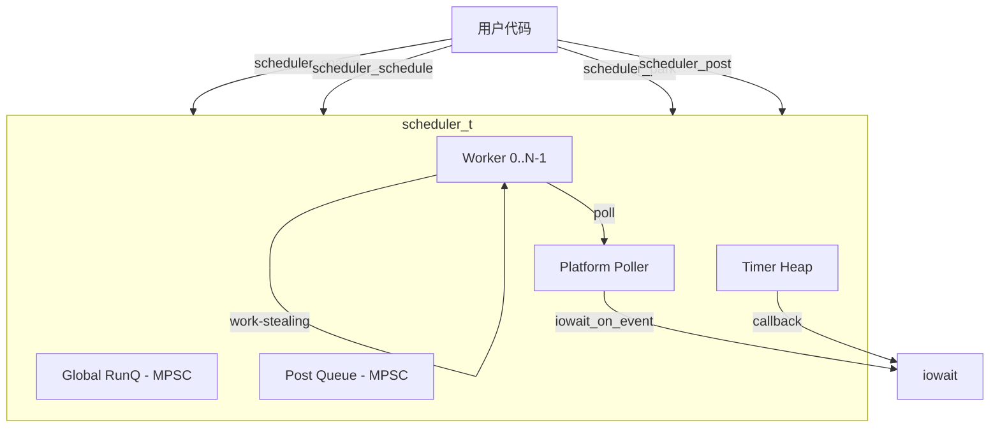
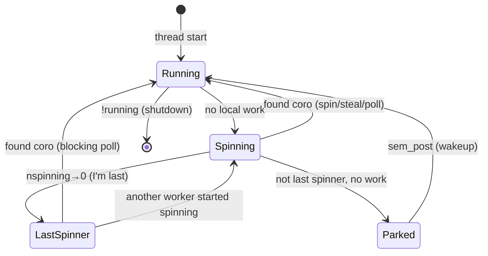

# Scheduler 模块设计文档

## 概述

`scheduler` 是 Xylem 协程运行时的核心调度器，管理 N 个 worker 线程上的协程执行、work-stealing、I/O polling、定时器和 deferred post。采用 Go runtime 风格的 M:N 调度模型。

## 架构



核心设计原则：
- 三级可运行队列：runnext → local deque → global runq
- Work-stealing 保证负载均衡
- Last-spinner 做 blocking poll，保证 IO/timer 不饿死
- Park 回调在 yield 后执行，消除 schedule-before-yield 竞态

## 调度模型

### 三级 Runnable Pool

```
优先级高 ──────────────────────────────────────── 优先级低

┌─────────────┐     ┌──────────────────┐     ┌───────────────┐
│  runnext    │     │  local deque     │     │  global runq  │
│  (1 slot)   │     │  (wsdeque, 1024) │     │  (MPSC)       │
│  LIFO 热路径 │     │  owner pop tail  │     │  跨线程注入点   │
│             │     │  thief steal head│     │               │
└─────────────┘     └──────────────────┘     └───────────────┘
     per-worker           per-worker              shared
```

| 层级 | 访问模式 | 用途 |
|------|---------|------|
| runnext | atomic exchange | 最热协程，刚被唤醒的 cache-hot coro |
| local deque | owner push/pop tail, thief steal head | 本 worker 产生的工作 |
| global runq | lock-free MPSC push, locked batch pop | 溢出 + 外部线程注入 |

### scheduler_schedule 路径

```
scheduler_schedule(sched, co)
  ├── 调用者是本 scheduler 的 worker？
  │     ├── exchange runnext（LIFO）
  │     │     └── 旧 runnext → push local deque
  │     │           └── deque 满 → pop_half 到 global runq + wake worker
  │     └── 还是满 → push global runq + wake worker
  └── 外部线程
        └── push global runq + wake worker
```

### Work-Stealing

```
_sched_try_get_coro(sched, w)
  1. exchange runnext → got it? return
  2. wsdeque_pop(local deque) → got it? return
  3. runq_pop_batch(global, max/nworkers+1) → got batch? push rest to local, return first
  4. for each other worker: wsdeque_steal_half → got batch? push rest to local, return first
  5. return NULL
```

## Worker 状态机



### Spinning Phase

- 最多 `SCHED_SPIN_ATTEMPTS`(4) 次非阻塞 poll + try_get_coro
- 减少 parking/wakeup 延迟

### Last Spinner

- `atomic_fetch_sub(&nspinning, 1)` 后检查 `prev == 1`
- 进入 blocking poll 循环，处理 IO + timers + posts
- 保证即使所有 worker 都忙，IO 事件也不会无限延迟
- `SCHED_MAX_POLL_MS`(5ms) 限制单次阻塞时长

### Cooperative Timer Tick

- 纯 CPU-bound 负载下所有 worker 持续忙碌，无人进入 last-spinner
- `_sched_timer_tick` 在每次循环首部检查：距上次 tick 超过 1ms 时 CAS 选举一个 worker 执行 timer pass
- 保证 timers 不被 CPU-bound 协程饿死

## Park 机制

```c
void scheduler_park(sched, fn, arg) {
    _tls_worker->park_fn  = fn;
    _tls_worker->park_arg = arg;
    mco_yield(mco_running());  // 协程挂起
}
// yield 返回后, _sched_handle_yield 检查 park_fn:
//   fn(co, arg) → true:  协程已 park，不再调度
//   fn(co, arg) → false: 拒绝 park，立即重新入队
```

关键保证：回调在 yield **之后**执行，所以回调中发布的 wakeup 指针一定指向已挂起的协程。iowait 和 mutex 依赖此不变量。

## 定时器

### 数据结构

- 最小堆（`heap_t`），按 timeout 排序
- `timer_lock` (mutex) 保护堆操作
- 每个 timer 独立引用计数（creator ref + in-flight-fire ref）

### 生命周期

```
sched_timer_create   → refcnt=1, inactive
sched_timer_start    → insert heap (or re-arm), active=true
sched_timer_stop     → remove from heap, active=false, return cancelled?
_sched_process_timers:
    dequeue → ref(timer) → unlock → cb(timer, ud) → unref(timer)
sched_timer_destroy  → stop + unref (last ref frees)
```

### 并发安全

- start/stop/destroy 都在 `timer_lock` 下操作堆
- Fire 路径：dequeue 后 unlock 再调 callback，中间持有额外 ref 防 destroy 踩空
- `_sched_wake_poller` 在 start 后触发，强制 blocking poll 提前返回重算 timeout

## Post 机制

```
scheduler_post(sched, cb, ud)
  → alloc _sched_post_t
  → mpsc_push(&sched->posts, node)
  → if nspinning==0: wake_worker
```

- MPSC 队列，任意线程 push
- Last-spinner 在 blocking poll 循环中 drain
- `processing` CAS 防止多个 worker 并发 drain（单消费者语义）

## Wakeup Pipe

- socketpair：`wakeup_rd` + `wakeup_wr`
- 非阻塞，注册到 poller
- `_sched_wake_poller`：向 wakeup_wr 写 1 byte，唤醒阻塞在 epoll_wait 的 worker
- 事件处理：drain pipe + LT 模式下 re-arm

## 协程生命周期

### Spawn

```
scheduler_spawn(sched, fn, arg)
  → alloc _coro_ctx_t + mco_create(co)
  → link to all_coros (spin_lock)
  → alive++
  → scheduler_schedule(sched, co)
```

### 执行与退出

```
_sched_run_coro(w, co)
  → mco_resume(co)        // 运行协程直到 yield/return
  → _sched_handle_yield:
      MCO_DEAD:
        unlink from all_coros
        free ctx + mco_destroy
        alive-- → if 0: idle_cb()
      park_fn set:
        call park_fn → true=parked, false=reschedule
```

### Shutdown 清理

```
scheduler_destroy(sched)
  → scheduler_stop: running=false, wake all, join all
  → walk all_coros: destroy every still-parked coro shell
  → _sched_cleanup: drain timers, drain posts, close poller, free
```

`all_coros` 是权威注册表，覆盖了运行队列中的 + park 中不可达的所有协程。

## 核心数据结构

### scheduler_t

| 字段 | 类型 | 说明 |
|------|------|------|
| workers | _sched_worker_t[] | N 个 worker |
| nworkers | int32_t | worker 数量 |
| runq | runq_t* | 全局运行队列 |
| timers | heap_t | 定时器最小堆 |
| timer_lock | mtx_t | 保护 timers |
| posts | mpsc_t | deferred post 队列 |
| poller | platform_poller_sq_t | 平台 poller |
| wakeup_rd/wr | platform_sock_t | 唤醒管道 |
| iowait_pool | iowait_pool_t* | iowait handle 池 |
| running | _Atomic bool | 运行标志 |
| nspinning | _Atomic int32_t | 自旋中的 worker 数 |
| nparked | _Atomic int32_t | 休眠中的 worker 数 |
| alive | _Atomic int64_t | 存活协程计数 |
| all_coros | list_t | 全协程注册表 |
| coros_lock | spin_t | 保护 all_coros |

### _sched_worker_t

| 字段 | 类型 | 说明 |
|------|------|------|
| thread | thrd_t | OS 线程 |
| deque | wsdeque_t* | 本地 work-stealing deque |
| sem | platform_sem_t* | park 用信号量 |
| sched | scheduler_t* | 所属 scheduler |
| index | uint32_t | worker 编号 |
| park_fn/park_arg | — | 待执行的 park 回调 |
| parked | _Atomic bool | 是否已 park |
| runnext | _Atomic(mco_coro*) | LIFO 热路径槽 |

## 常量

| 常量 | 值 | 含义 |
|------|---|------|
| SCHED_DEFAULT_DEQUE_LOG2 | 10 | deque 容量 = 1024 |
| SCHED_CORO_STACK_SIZE | 131072 | 协程栈 128KB |
| SCHED_MAX_POLL_MS | 5 | 阻塞 poll 最大时长 |
| SCHED_SPIN_ATTEMPTS | 4 | 自旋尝试次数 |
| SCHED_RUNQ_GRAB_MAX | 32 | 全局队列单次批量取 |
| SCHED_TIMER_TICK_MS | 1 | 协作 timer tick 间隔 |

## 公开 API

| 函数 | 说明 |
|------|------|
| `scheduler_create(opts)` | 创建调度器 |
| `scheduler_destroy(sched)` | 销毁调度器，回收所有资源 |
| `scheduler_stop(sched)` | 停止 workers 但不释放内存 |
| `scheduler_schedule(sched, co)` | 调度一个协程 |
| `scheduler_spawn(sched, fn, arg)` | 创建并调度新协程 |
| `scheduler_park(sched, fn, arg)` | 挂起当前协程 |
| `scheduler_post(sched, cb, ud)` | 投递 deferred 回调 |
| `scheduler_get_poller(sched)` | 获取 poller |
| `scheduler_get_iowait_pool(sched)` | 获取 iowait pool |
| `sched_timer_create(sched)` | 创建定时器 |
| `sched_timer_destroy(timer)` | 销毁定时器 |
| `sched_timer_start(timer, cb, ud, timeout, repeat)` | 启动/重启定时器 |
| `sched_timer_stop(timer)` | 停止定时器 |
| `scheduler_set_idle_cb(sched, cb, ud)` | 注册空闲回调 |
