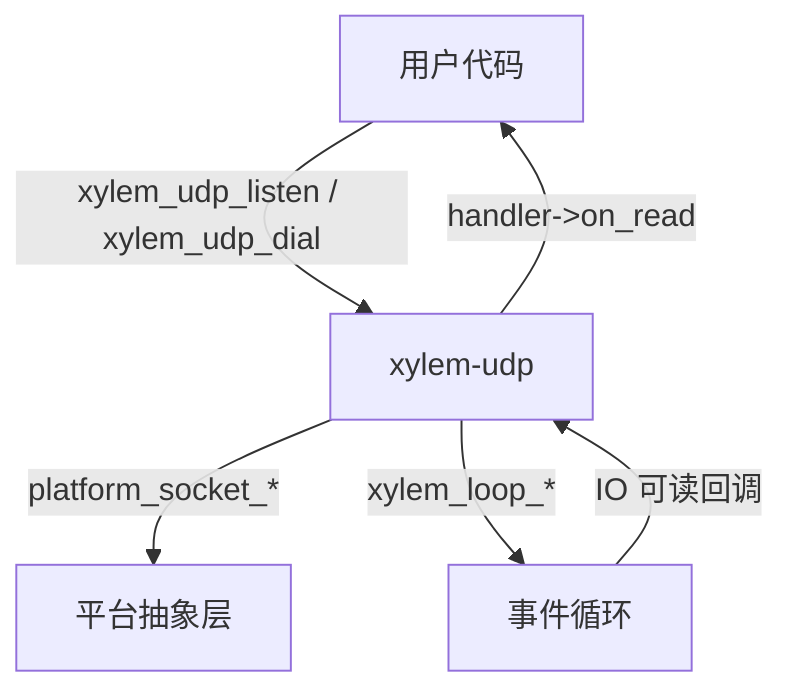
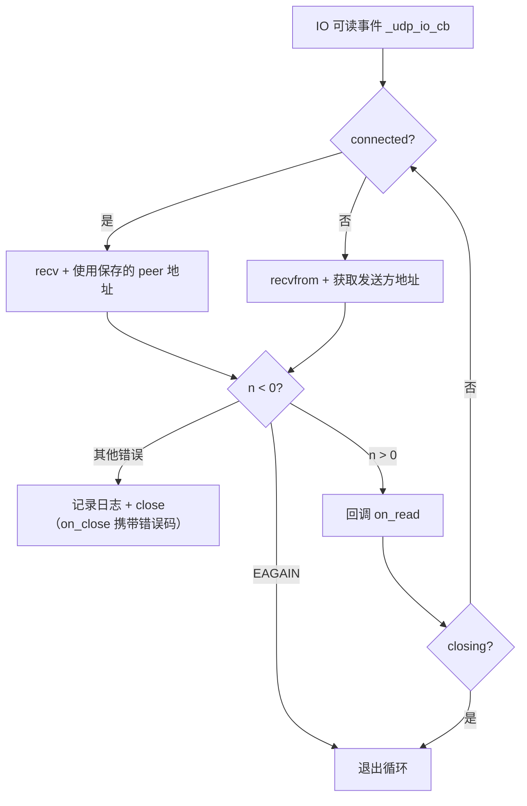

# UDP 模块设计文档

## 概述

`xylem-udp` 是基于事件循环的非阻塞 UDP 模块，提供监听（listen）和拨号（dial）两种模式。设计简洁，无帧解析、无写队列——UDP 数据报天然保留消息边界。

## 架构


```mermaid
graph TB
    User[用户代码] -->|xylem_udp_listen / xylem_udp_dial| UDP[xylem-udp]
    UDP -->|platform_socket_*| Platform[平台抽象层]
    UDP -->|xylem_loop_*| Loop[事件循环]
    Loop -->|IO 可读回调| UDP
    UDP -->|handler->on_read| User
```

## 公开类型

### 回调处理器

```c
typedef struct xylem_udp_handler_s {
    void (*on_read)(xylem_udp_chan_t* udp, void* data, size_t len,
                    xylem_addr_t* addr);
    void (*on_close)(xylem_udp_chan_t* udp, int err, const char* errmsg);
} xylem_udp_handler_t;
```

- `on_read`：收到数据报时触发，`addr` 为发送方地址
- `on_close`：句柄关闭时触发。正常关闭（用户调用 `xylem_udp_close`）时 `err=0`、`errmsg=NULL`。当关闭由内部 recv 错误触发时，`err` 为平台错误码，`errmsg` 为可读错误描述字符串

### 不透明类型

```c
typedef struct xylem_udp_chan_s xylem_udp_chan_t;
```

## 内部结构

```c
struct xylem_udp_chan_s {
    xylem_loop_t*         loop;
    xylem_loop_io_t*      io;
    platform_sock_t       fd;
    xylem_udp_handler_t*  handler;
    void*                 userdata;
    xylem_addr_t          peer;          /* 仅 dial 模式有效 */
    char                  recv_buf[65536]; /* 接收缓冲区 */
    bool                  connected;     /* true = dial 模式 */
    bool                  closing;       /* 幂等关闭标志 */
    _Atomic int32_t       refcount;      /* 引用计数，用于跨线程操作的生命周期管理 */
    int                   close_err;     /* recv 错误码，正常关闭为 0 */
    const char*           close_errmsg;  /* recv 错误描述，正常关闭为 NULL */
};
```

接收缓冲区固定 65536 字节，覆盖 UDP 数据报最大理论长度（65535 字节）。

### 发送路径

`xylem_udp_send` 必须在事件循环线程上调用，内部通过
`_udp_process_write` 立即执行 `sendto`。数据在系统调用内
被内核复制，调用者可在函数返回后立即释放缓冲区。

## 两种工作模式

### listen 模式（未连接）

```c
xylem_udp_chan_t* xylem_udp_listen(loop, addr, handler);
```

- 创建非阻塞 UDP socket 并 `bind` 到指定地址
- 注册到事件循环监听可读事件
- 收到数据报时使用 `recvfrom` 获取发送方地址
- 发送时必须通过 `xylem_udp_send(udp, dest, data, len)` 指定目标地址，内部使用 `sendto`

### dial 模式（已连接）

```c
xylem_udp_chan_t* xylem_udp_dial(loop, addr, handler);
```

- 创建非阻塞 UDP socket 并 `connect` 到目标地址
- `connected` 标志设为 `true`，保存 `peer` 地址
- 收到数据报时使用 `recv`（而非 `recvfrom`），因为 macOS 上 `recvfrom` 对已连接 UDP socket 可能不填充发送方地址
- 发送时使用 `send`（而非 `sendto`），因为 macOS/BSD 上对已连接 socket 调用 `sendto` 会返回 `EISCONN`

## 数据流

### 读取路径


```mermaid
flowchart TD
    A[IO 可读事件 _udp_io_cb] --> B{connected?}
    B -->|是| C[recv + 使用保存的 peer 地址]
    B -->|否| D[recvfrom + 获取发送方地址]
    C --> E{n < 0?}
    D --> E
    E -->|EAGAIN| F[退出循环]
    E -->|其他错误| G[记录日志 + close（on_close 携带错误码）]
    E -->|n > 0| H[回调 on_read]
    H --> I{closing?}
    I -->|是| F
    I -->|否| B
```

IO 回调内循环 `recv`/`recvfrom` 直到 `EAGAIN`，一次回调排空内核缓冲区，避免水平触发（LT）模式下重复唤醒。

### 发送路径

```c
int xylem_udp_send(xylem_udp_chan_t* udp, xylem_addr_t* dest,
                   const void* data, size_t len);
```

- 已连接 socket 或 `dest == NULL`：使用 `platform_socket_send`
- 未连接 socket 且 `dest != NULL`：使用 `platform_socket_sendto`，根据地址族计算 `addrlen`

发送是同步的，直接调用系统调用，返回发送字节数或 -1。

## 关闭流程

```mermaid
sequenceDiagram
    participant User as 用户
    participant UDP as xylem-udp
    participant Loop as 事件循环

    User->>UDP: xylem_udp_close()
    UDP->>UDP: 检查 closing 标志
    alt 已为 true
        UDP-->>User: 立即返回（幂等）
    end
    UDP->>UDP: closing = true
    UDP->>UDP: xylem_loop_destroy_io()
    UDP->>UDP: platform_socket_close(fd)
    UDP->>User: handler->on_close(udp, close_err, close_errmsg)
    UDP->>Loop: xylem_loop_post(_udp_free_cb)
    Loop->>UDP: 下一轮迭代释放内存
```

关闭是幂等的（`closing` 标志防止重入）。`xylem_udp_close` 仅可在事件循环线程上调用。入口处检查 `closing` 标志——若已为 `true` 则立即返回。通过检查后设置 `closing = true`，然后直接执行关闭逻辑：销毁 IO、关闭 fd、回调 `on_close`。

内存通过 `xylem_loop_post` 延迟到下一轮事件循环迭代释放，确保当前回调链中的指针仍然有效。

## 线程安全

`xylem_udp_send` 和 `xylem_udp_close` 仅可在事件循环线程上调用。

`xylem_udp_close` 入口处检查 `closing` 标志实现幂等性——若已为 `true` 则立即返回。通过检查后设置 `closing = true` 并直接执行关闭逻辑。

`xylem_udp_send` 入口处检查 `closing` 标志，已关闭则返回 -1。然后检查 `data` 和 `len` 参数，空数据则返回 0。通过检查后调用 `_udp_process_write` 执行实际发送。

## 公开 API

```c
/* 绑定地址并开始接收（未连接模式） */
xylem_udp_chan_t* xylem_udp_listen(xylem_loop_t* loop,
                              xylem_addr_t* addr,
                              xylem_udp_handler_t* handler);

/* 创建已连接 UDP socket */
xylem_udp_chan_t* xylem_udp_dial(xylem_loop_t* loop,
                            xylem_addr_t* addr,
                            xylem_udp_handler_t* handler);

/* 发送数据报，dest 为 NULL 时使用已连接地址。线程安全。 */
int xylem_udp_send(xylem_udp_chan_t* udp, xylem_addr_t* dest,
                   const void* data, size_t len);

/* 关闭 UDP 句柄。线程安全。 */
void xylem_udp_close(xylem_udp_chan_t* udp);

/* 递增引用计数，需在事件循环线程上调用。 */
void xylem_udp_acquire(xylem_udp_chan_t* udp);

/* 递减引用计数，归零时释放内存。可从任意线程调用。 */
void xylem_udp_release(xylem_udp_chan_t* udp);

/* 获取关联的事件循环 */
xylem_loop_t* xylem_udp_get_loop(xylem_udp_chan_t* udp);

void* xylem_udp_get_userdata(xylem_udp_chan_t* udp);
void  xylem_udp_set_userdata(xylem_udp_chan_t* udp, void* ud);
```
